# 【深蓝实验室】移动安全之少壮不努力老大搞 APP - FreeBuf 网络安全行业门户

## 前菜

Emmmmm 前一段时间接到一个红队检测项目，呦呵～ 这么久不打了准备展示一波，万万没想到直接去移动端坐牢，少壮不努力给大佬打点的机会都没有。

## 信息收集

移动端的几个需要看的点：

•APP•微信公众号•微信小程序•支付宝小程序

......本菜鸡就知道这么几个

## 痛苦之路

好在目标比较给力 APP、小程序、公众号都有，按照优 (tou) 先 (lan) 级先从公众号、小程序、APP 这个顺序看。

### 公众号

公众号看了一遍，都是用来发软文的没有利用点，公众号结束（这个水划的太快了）

### 小程序

好家伙小程序直接一波丑拒，让我看一看的机会都没有，一个下架一个丑拒。

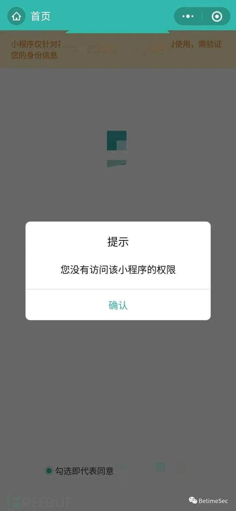

上祖传的 BurpSuite 看一下这个丑拒我的小程序。咳咳，草率了，Android 7.0 以上抓微信小程序会有证书的问题导致抓不到包，但是！这丝毫不影响继续操作，祭出 Fiddler，流量转发给 BurpSuite，证书装好，端口监听好再来一次

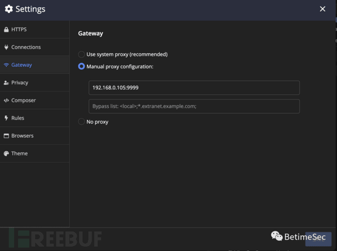

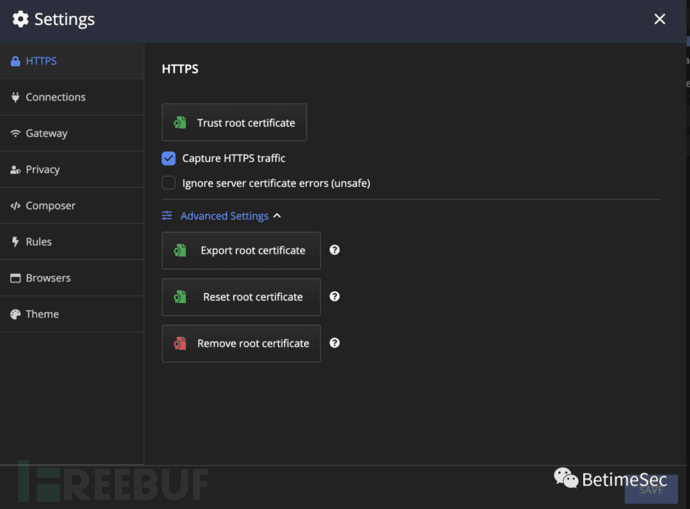

阿西吧，一堆没用的包，我依然没有等到我想要的”它“，回想一下，他会校验我的身份应该是有数据包去服务端交互的呀，Sangfor 的男人不能服输，继续！！

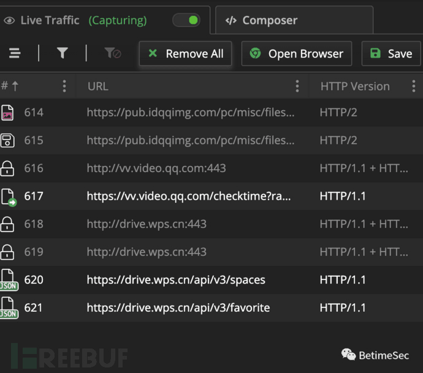

打开神器 SSLUnpinning，Lsposed 整起来，作用对象直接给到微信，见证奇迹的时刻，有了有了！！What？？！！竟然没有转发

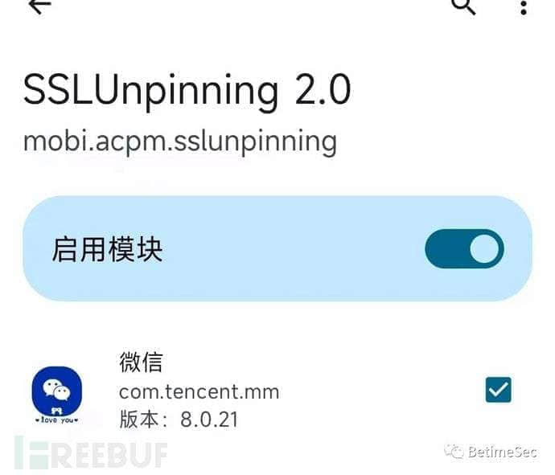

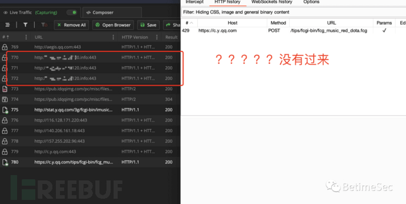

你们以为这就结束了？不可能，还有宝贝，JustTrustMe++ 掏出来继续冲它，哭了～终于等到你 - 我的数据包。(原版的 JustTrustMe 已失效)

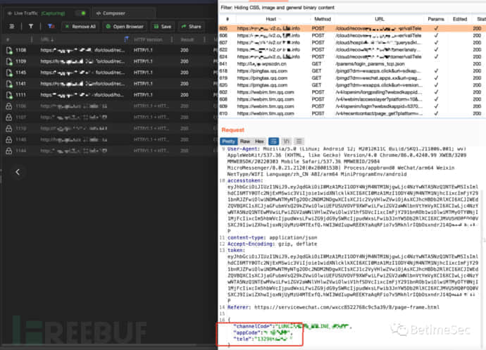

抓到包又如何还是么的利用点，小程序就这样伤害了我，不过上面抓包的过程还是记得记录学习一下滴。

### APP

APP 是我最后的倔强了，可不能真划水饭碗不保。

APP 有两个：一个大众端版本、另一个是客户内部人员使用的版本。拿到两个 APK 安装包，手机装上

  

本人是自用实体机 ROOT 之后刷的 LSposed 框架，不太喜欢模拟器，会有各种检测非常的不方便 (脚本的快乐你不懂--手动滑稽)，所以我直接装自己手机上了，代理整上开始干活

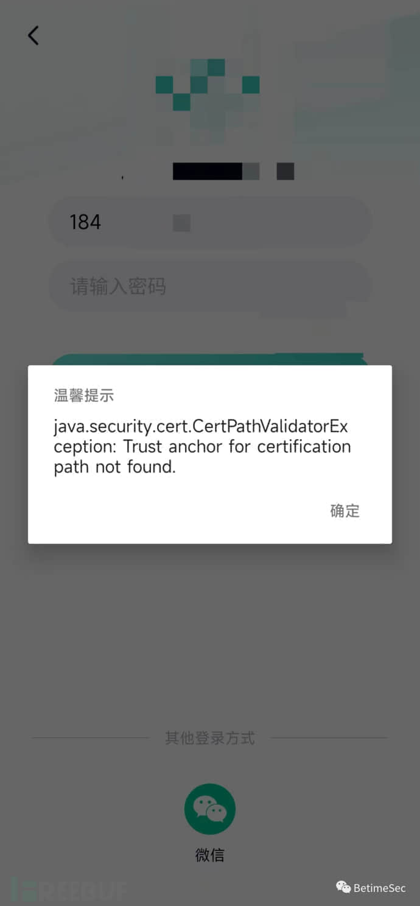

  

好家伙！当头一棒，直接检测我门都不让我进，老规矩 SSLUnpinning 先来溜溜缝

有检测我不慌你又不能封我号，继续冲

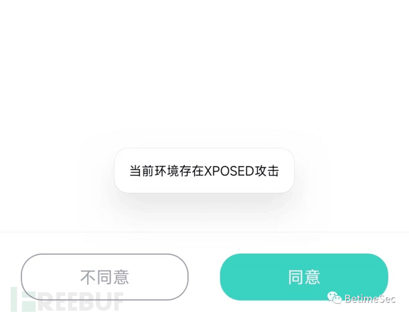

芜湖～～ 绕了绕了，进去的感觉真好，一顿操作猛如虎，部分连接直接报错，看来姜还是老的辣 SSLUnpinning 不行了。JustTrustMe++ 永遠的神，开整！！

  

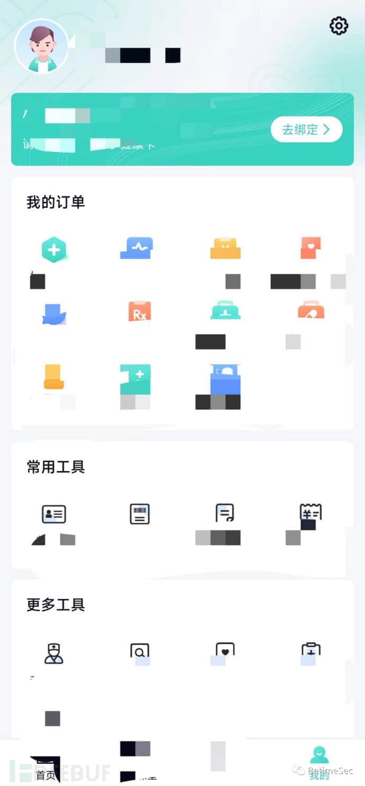

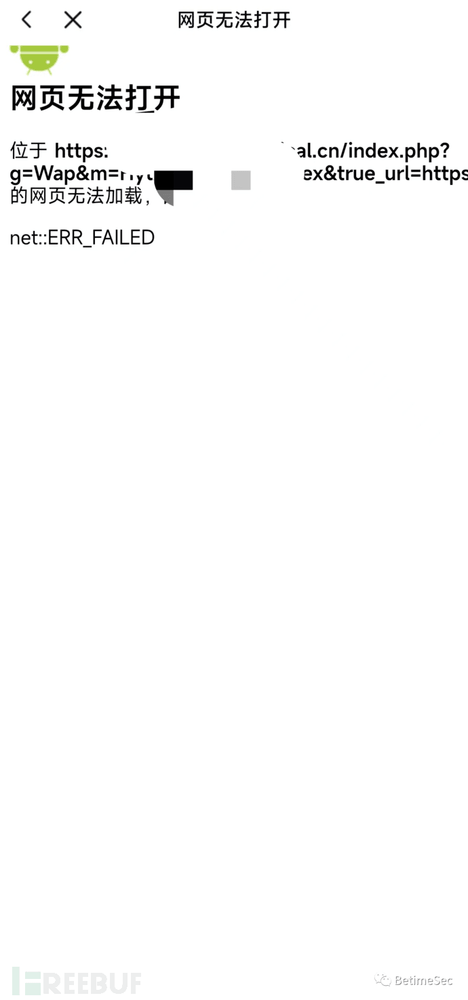

  

好家伙这加密做的，接口太多终于还是一个人扛下了所有，没那耐心直接上大锤。

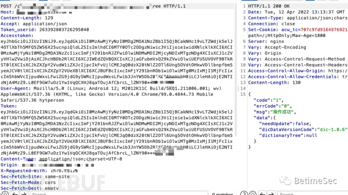

反编译看一下源码，emmm 有爱加密的壳，脱壳一把梭：反射大师、fdex2、dexdump 好吧都失败了，大佬都写 hook，小弟属实菜玩不来。还可以做一个脱壳机用谷歌 pixel 1 代，当前手里没有 pixel 的机器就没搞了。

换个思路我不信你的 APK 都是有壳的。老本行信息收集搞起来，目前新版本是 6+，找到一个 4+ 版本的，太老了 emmmm，凑合能用就行，后缀改一下 zip 解压出来的 dex 直接拖进 jadx，硬编码的敏感信息搜一下：username、password、key、oss 等，运气比较好直接找到了 OSS，果然是老版本 key 都过期了，别慌还有另一个版本 5+

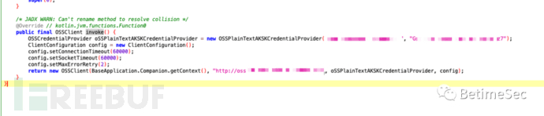

相同姿势反编译搜一下 OSS 直接 double。。。。两个 oss 测试连接成功。前端结束。

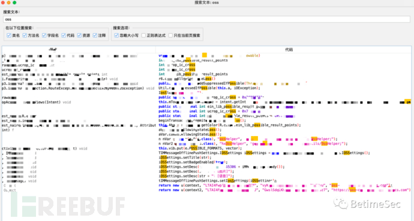

后面目标内部使用端 apk 没有加壳。。这是我万万没有想到的，反编译看了一下只有一个 oss，和之前两个其中一个是重复的 emmmmm。

## 最后

目标 app 加了壳，检测信任证书和运行环境，幸亏没有限制运行环境和代理要不然我又要想办法隐藏 Magisk 和 LSposed，个人一般很少用模拟器，APP 做的好一点的都会检测 ROOT 和模拟器，会很麻烦，直接买个实体机 ROOT 刷框架还是比较方便的，本次时间有限就没有去深入脱壳了，只是简单的利用现有的脱壳工具跑了一遍。日常渗透可能关注后端的比较多，但是前端硬编码在源码里的也有可能有惊喜，还有历史版本哦。
