# 漏洞挖掘中的组合拳攻击 - 先知社区

漏洞挖掘中的组合拳攻击

- - -

## 案例一

我们挖掘XSS的时候秘诀都说是见框就插，但是有时候我们插入payload之后呢，不知道内容跑哪去了，或者你以为它是没有xss的，但是有可能是触发的方式不对。然后呢，xss的话现在防护也做的很好了，可能挖了半天还是个self-xss，头皮发麻。那么有没有办法可以帮我们把self-xss提升危害呢，有的。那就是CSRF，组合拳套路。这个案例就是一个很好的体现。

### XSS

首先在这里有一个新建课件的功能点。  
[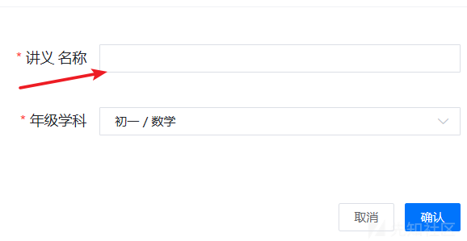](https://xzfile.aliyuncs.com/media/upload/picture/20240229201142-b314106a-d6fb-1.png)  
  
好的，看到有框，那我们就插一个试试。  
[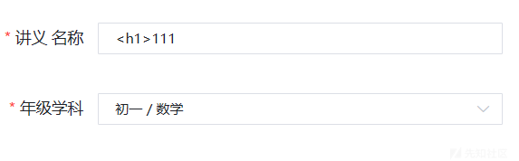](https://xzfile.aliyuncs.com/media/upload/picture/20240229201216-c71b7274-d6fb-1.png)  
首先使用h1标签探探路。  
[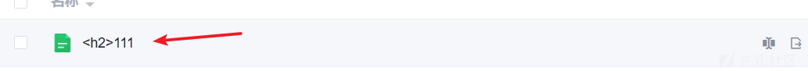](https://xzfile.aliyuncs.com/media/upload/picture/20240229201224-cc31db90-d6fb-1.png)  
创建之后在这里看平平无奇，并没有被解析。  
我们点进去看看  
[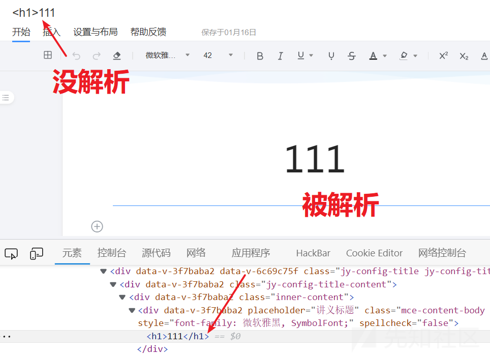](https://xzfile.aliyuncs.com/media/upload/picture/20240229201243-d77a01d0-d6fb-1.png)  
诶，可以发现内容这里被解析了。好像有戏。再试试其他的标签。  
我们打个img看看  
[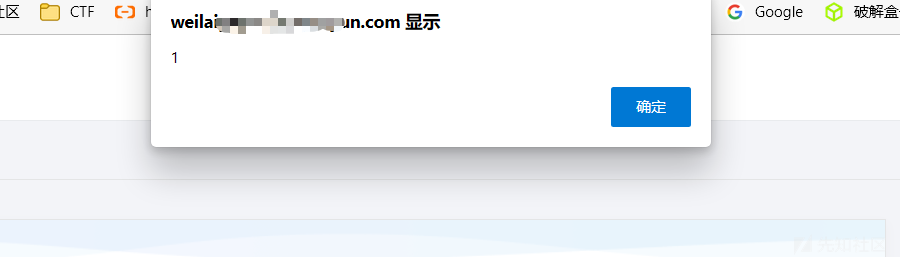](https://xzfile.aliyuncs.com/media/upload/picture/20240229201301-e23eae0e-d6fb-1.png)  
ok,成了！！！而且还是个存储xss！ 但是这个时候冷静下来想一下。这个功能点只能创建一个课件，虽然能弹。但是呢，我们不能给别人造成危害呀，顶多就是个ziwei洞，也就是个乐。 那么这时候我们就需要结合一下CSRF，那么如何使用的。首先我们需要抓取一下这个创建的课件的api

### CSRF

首先抓取一下这个添加内容的api  
[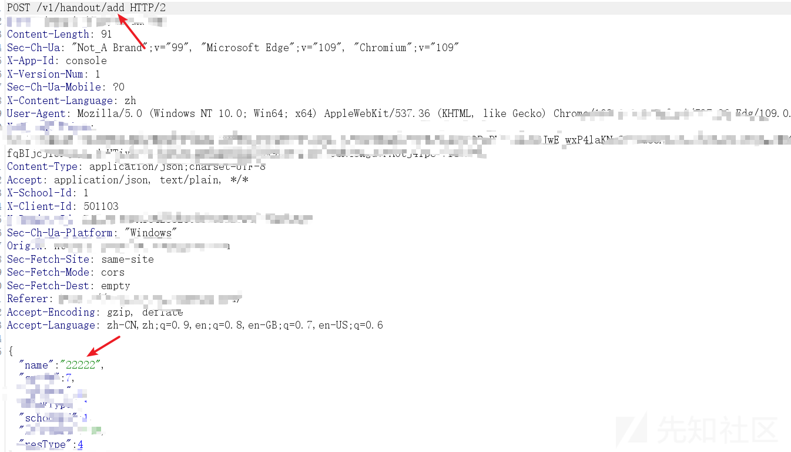](https://xzfile.aliyuncs.com/media/upload/picture/20240229201325-f0c3335a-d6fb-1.png)  
这里我们把name改成我们的payload  
[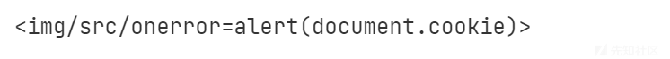](https://xzfile.aliyuncs.com/media/upload/picture/20240229201349-fe8f7d86-d6fb-1.png)  
[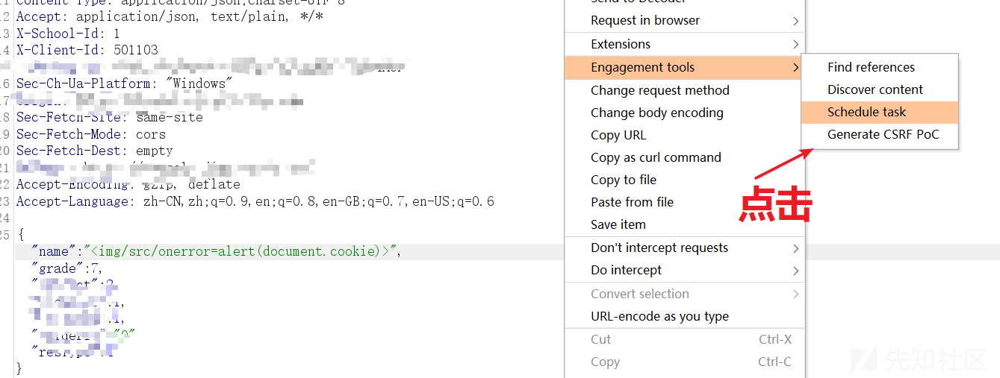](https://xzfile.aliyuncs.com/media/upload/picture/20240229201358-0443168e-d6fc-1.png)  
[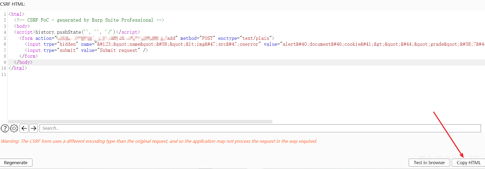](https://xzfile.aliyuncs.com/media/upload/picture/20240229201409-0a818e40-d6fc-1.png)  
copy一下这个html  
[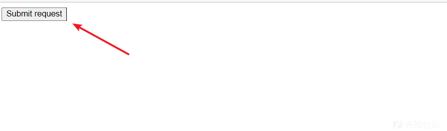](https://xzfile.aliyuncs.com/media/upload/picture/20240229201415-0e1b63c8-d6fc-1.png)  
这里还需要点击触发，我们修改一下代码让他自动点击触发。  
[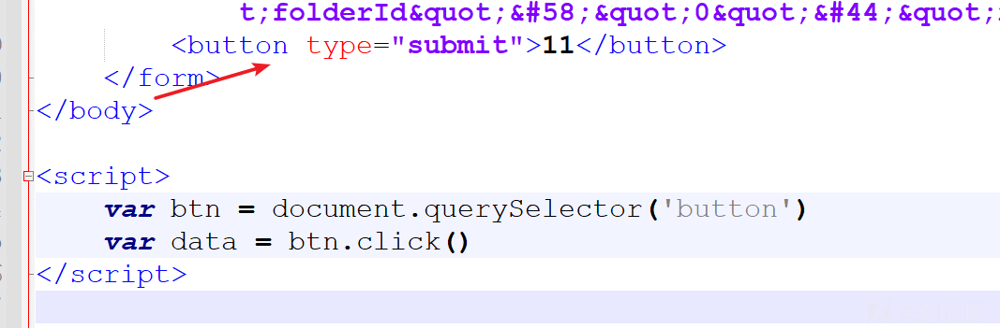](https://xzfile.aliyuncs.com/media/upload/picture/20240229201429-16bf3f22-d6fc-1.png)  
[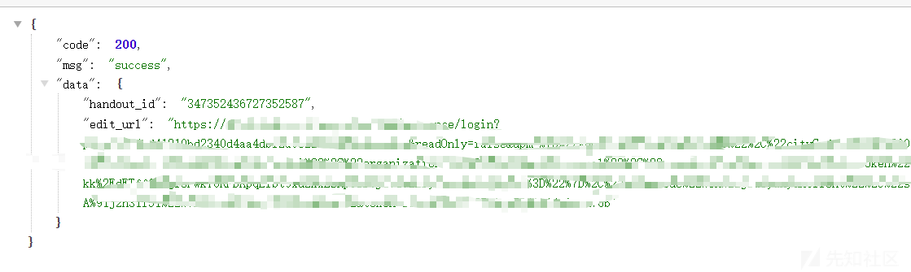](https://xzfile.aliyuncs.com/media/upload/picture/20240229201434-19656e5e-d6fc-1.png)  
再打开就会自动创建了。  
[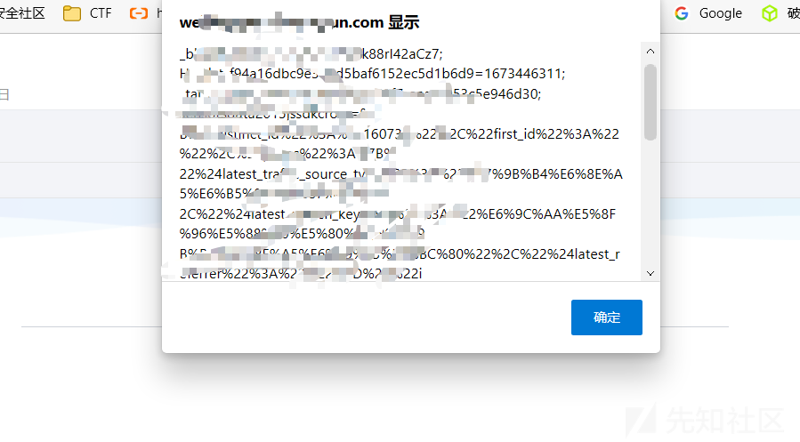](https://xzfile.aliyuncs.com/media/upload/picture/20240229201440-1d13869e-d6fc-1.png)  
这个例子一开始可以发现它对别人是不能造成危害的，因为别人访问不到我们这个文件。那么我们就使用组合拳攻击。这个文件我们可以把他挂载到VPS上，然后诱导别人点击我们这个文件的链接那么就可以上钩了。我们测试XSS的时候需要细心一点。一开始我测试的时候也是没啥反应，后面才发现这些触发点可能在其他地方。我们需要多注意多观察。然后发现漏洞之后我们尽量通过组合拳的方式去提升漏洞的危害。

## 案例二

可以看到这里是存在一个md格式的编辑器的，然后可以往里面插入html代码，经过测试，它是可以造成xss漏洞的，但是呢。这里的话简单看是不能给别人造成危害  
[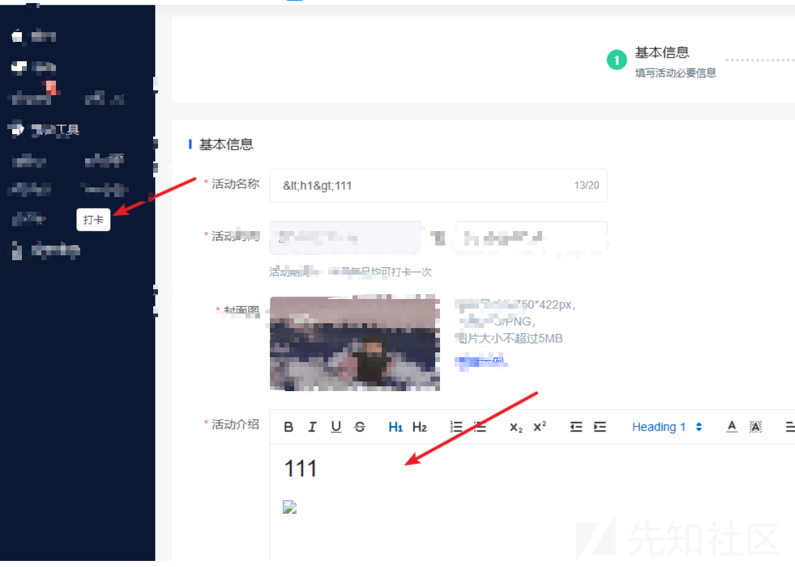](https://xzfile.aliyuncs.com/media/upload/picture/20240229201649-6a5d75b8-d6fc-1.png)  
这里可以看到我们插入的相关payload  
[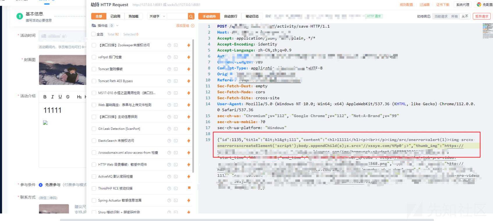](https://xzfile.aliyuncs.com/media/upload/picture/20240229201910-bde69d72-d6fc-1.png)  
成功弹窗了，说明这个接口的话防护没有做好，但是这个时候我们需要想到如何对别人造成一个危害呢。  

### 组合

这个时候刚好考虑到了这个功能点的作用。他可以给别人分享一个二维码，然后扫描之后就可以查看到我们编辑的信息，那么就好办了。  
[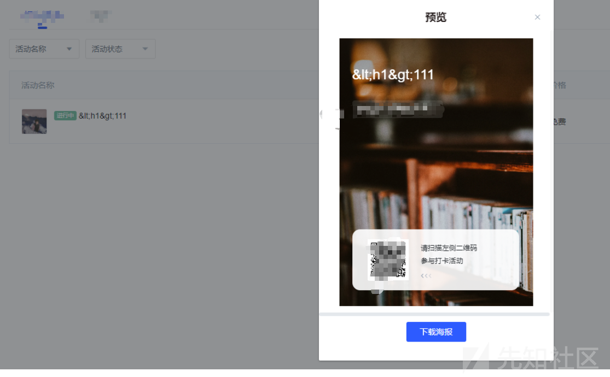](https://xzfile.aliyuncs.com/media/upload/picture/20240229202147-1b8a14ae-d6fd-1.png)  
扫描之后就可以弹窗了  
[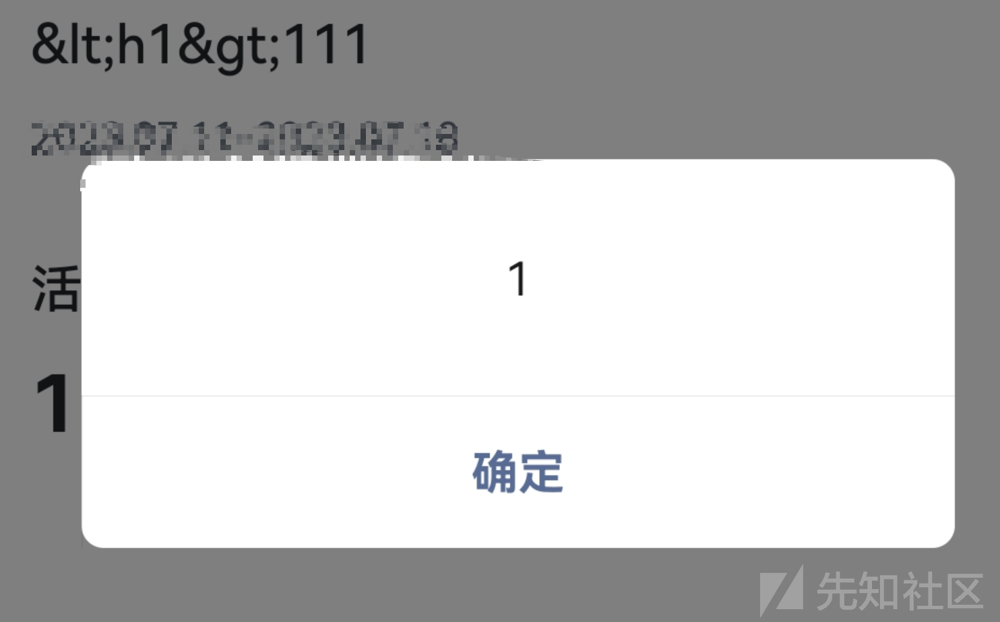](https://xzfile.aliyuncs.com/media/upload/picture/20240229202200-237d48c0-d6fd-1.png)
