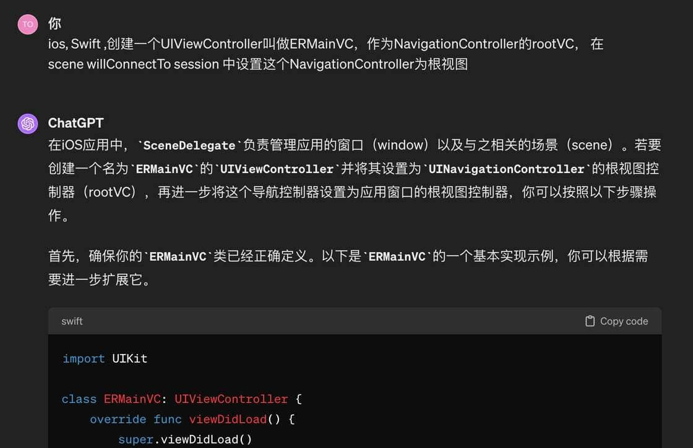
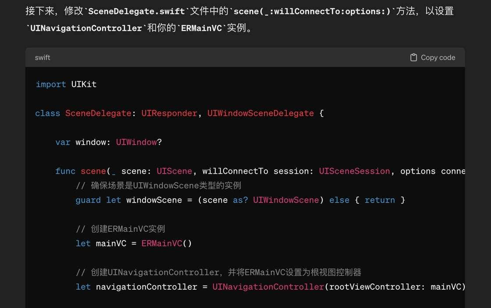
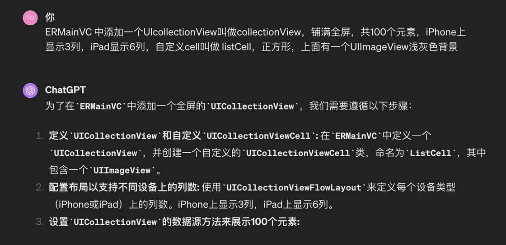
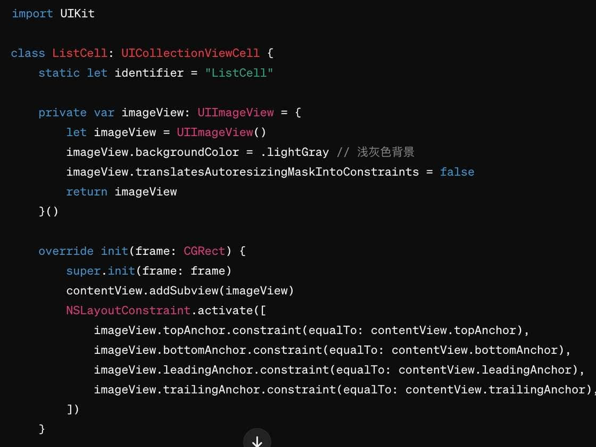
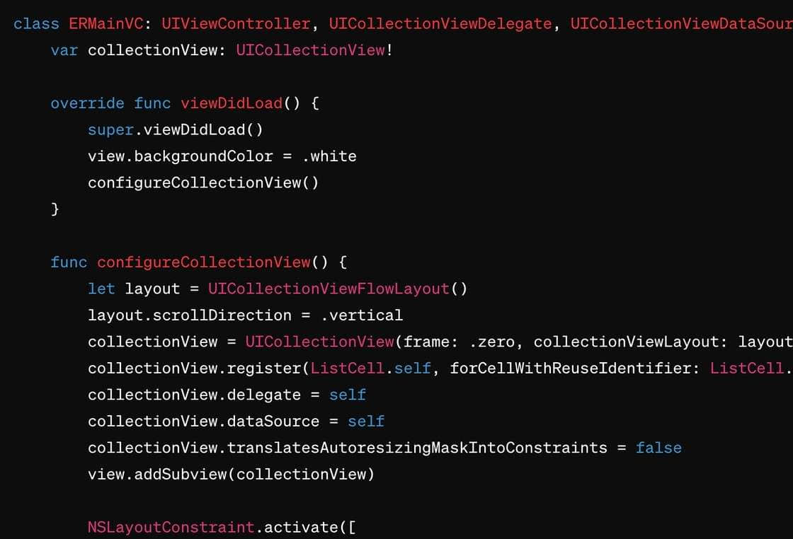
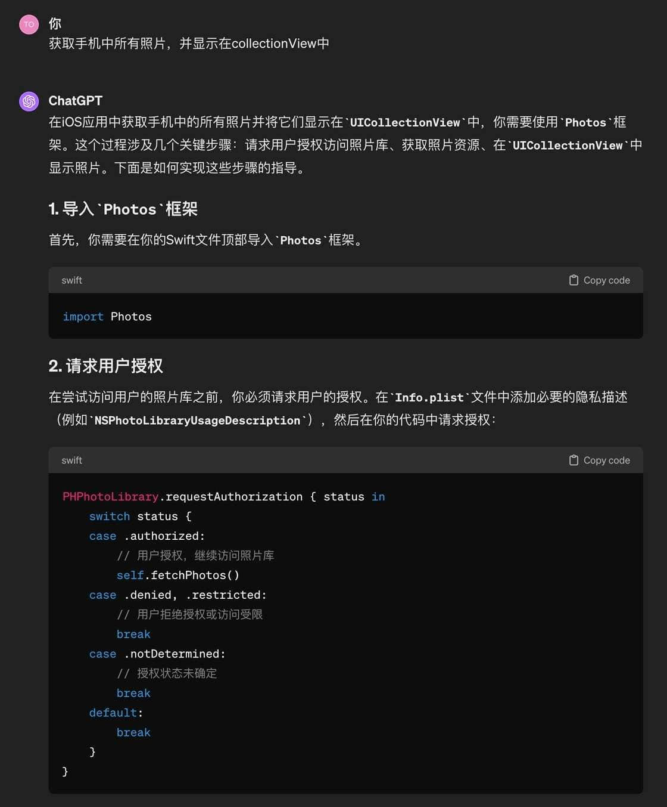
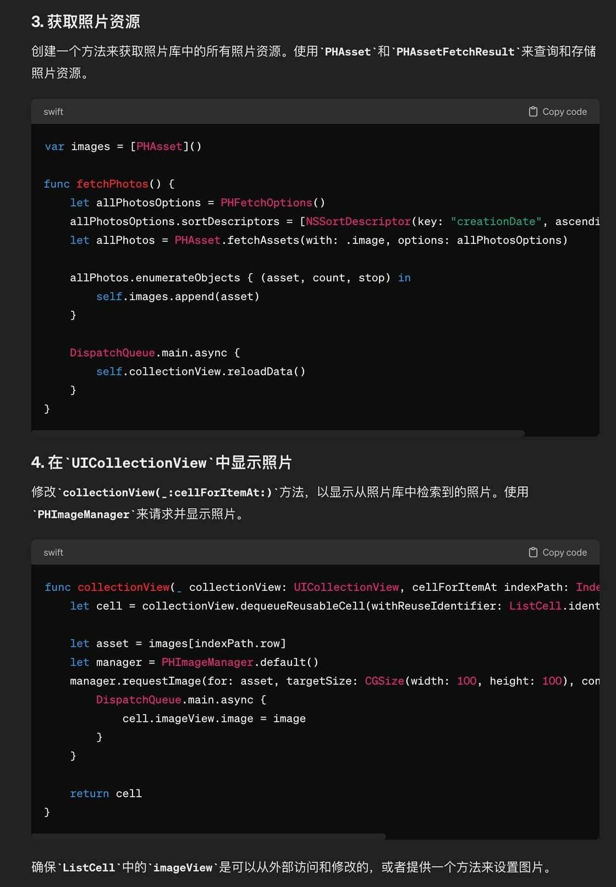
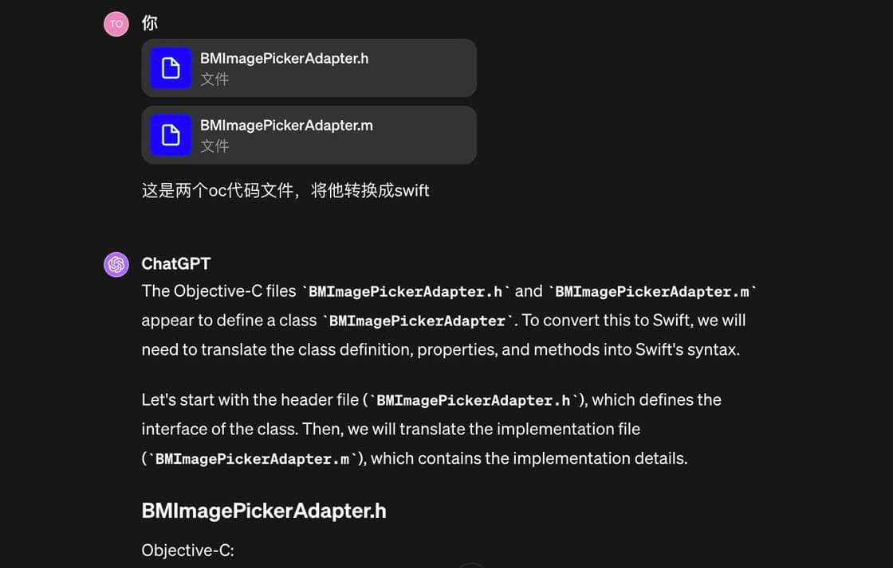
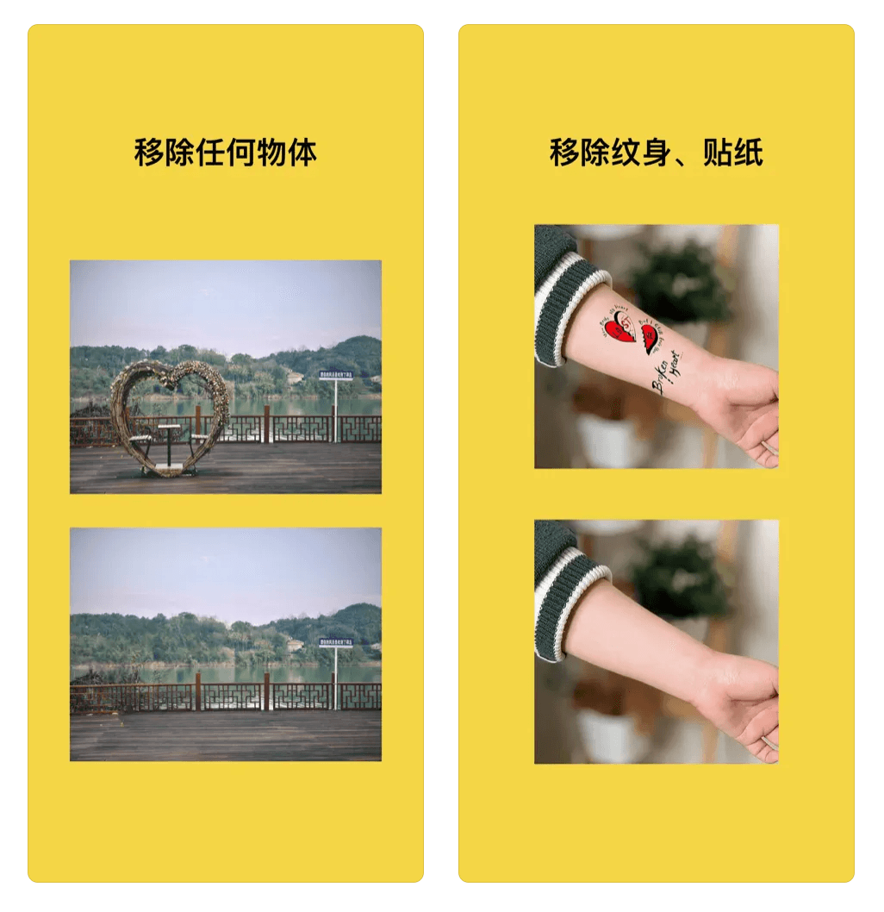
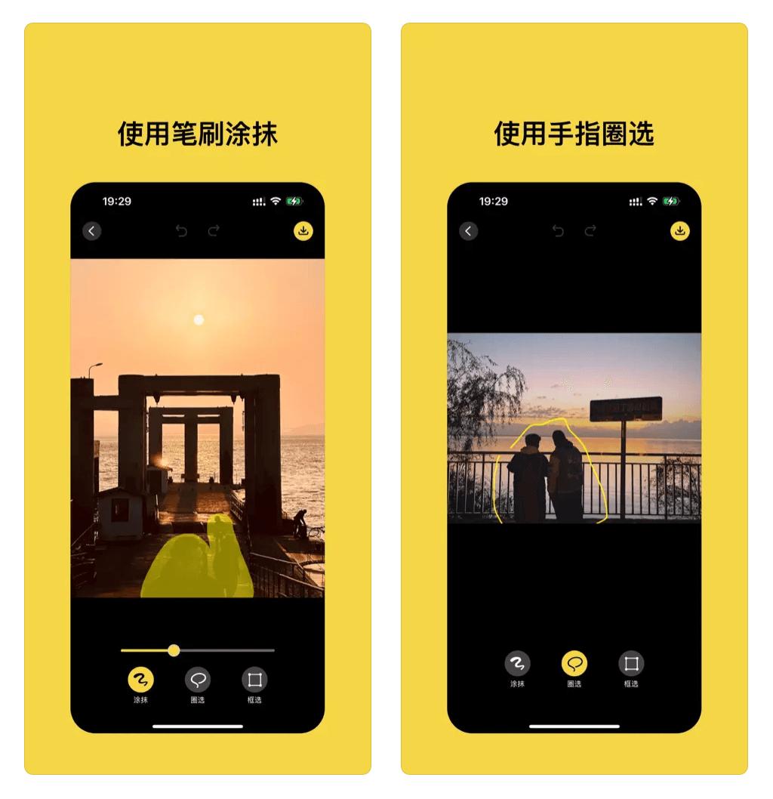

# 用 ChatGPT 开发一个完整的 App - 少数派

曾经被问到一个问题：用 ChatGPT 能不能写出一个完整的 App。当时的回答是“应该可以”，但是我对这个问题越来越感兴趣，于是后来决定要做一个尝试。梳理了一下手头掌握的技术和自己的需求，决定做一个图像消除类的应用，最近发布的 OPPO Find X7 也让大家了解了这个功能，可以消除图片中不需要的物体、线条、水印、人物等。

经过 2  周与 ChatGPT 的对话，这个 App 终于做完了，并用 ChatGPT 给它起了个名字，叫做 Smoothrase，Smoothly Erase 的合体单词，意为顺滑的擦除。主要功能，可以见下面的视频演示：

我第一个用 ChatGPT 开发的 App！一个图片擦除的 App，丝滑的擦除图片中的物体，线条，纹身，水印等，叫 Smoothrase

 Tolecen 的摄影笔记 关注

00:01 / 00:33

自动

倍速

进入哔哩哔哩，观看更高清

[h5player](https://greasyfork.org/scripts/381682)

[【免费 GPT-4】由字节跳动海外团队提供](https://u.anzz.top/h5precommend)[音视频一键合并工具，无需二次编码](https://github.com/xxxily/ffmpeg-script "将h5player下载到的音视频文件自动合并成一个文件，不经过二次编码，可快速合并")

下载 截图 倍速 菜单

已经实现的主要功能：手指涂抹擦除，圈选擦除，框选擦除。

目前效果还是很不错的，可以说所有的代码都是靠 ChatGPT 完成的，接下来可以简单看一些 ChatGPT 写代码的问题与答案。

App 开发写代码的第一步，是需要一个首页的视图，从这里我就开始让 ChatGPT 开始写了：

接下来，是想让 App 在首页显示所有图片，也可以一步步让 ChatGPT 来实现，首页得让它实现一个用来显示照片的列表

创建于显示一个列表，ChatGPT 也可以完成的很好，有了列表，就可以继续显示手机里的所有图片了

写的也没有什么问题，稍作修改就可以使用。这样，一个 App 首页显示左右照片的功能就可以完成，与纯手工写代码相比，非常高效。

除了上面演示的直接写代码，我还尝试用 ChatGPT 转换以前的 Objective-C 语言的文件到 Swift 语言，这样，以前写过的不同语言的功能也可以复用了。

总之，经过验证，让 ChatGPT 根据你的思路去写一个完整的 App，确实是可行的。

App 的擦除效果个人觉得非常不错，欢迎体验。
