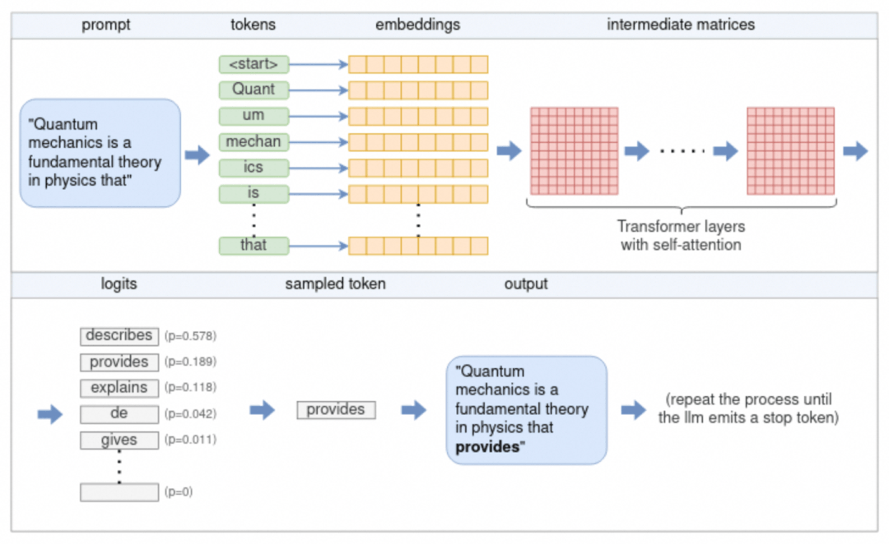
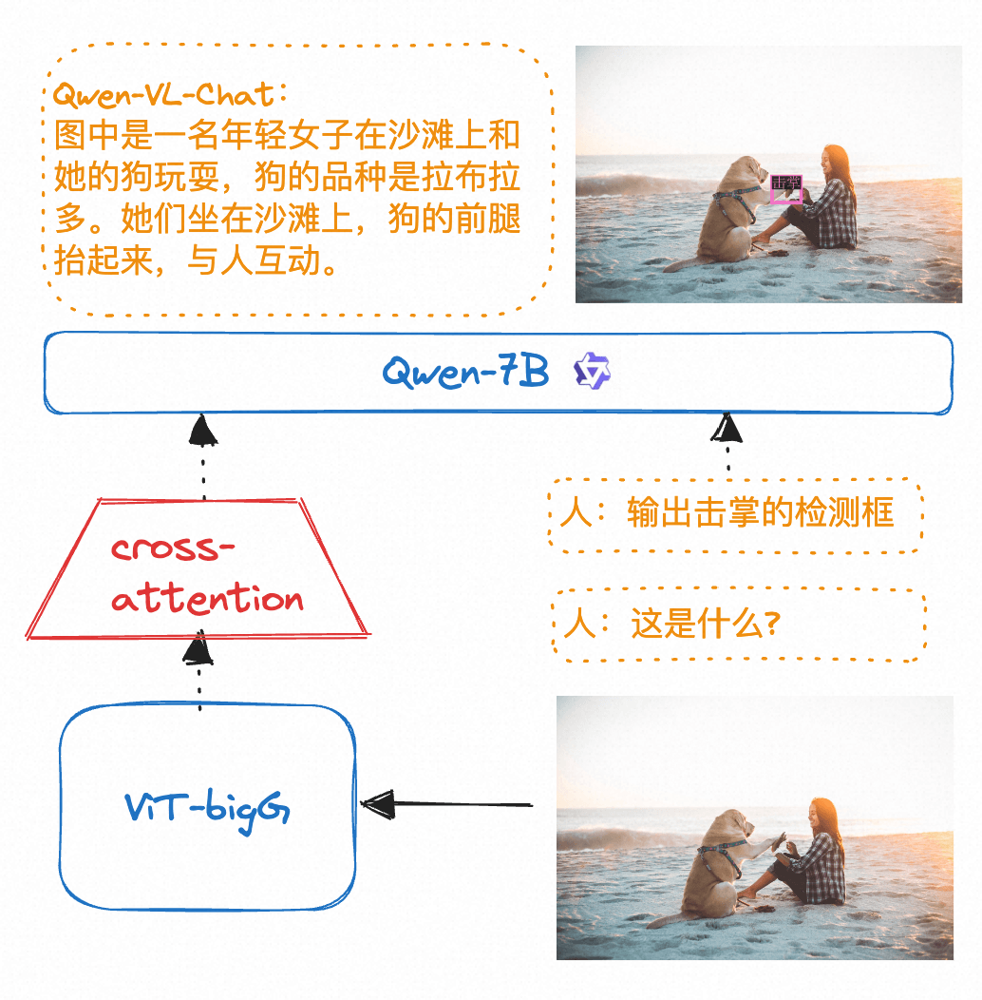
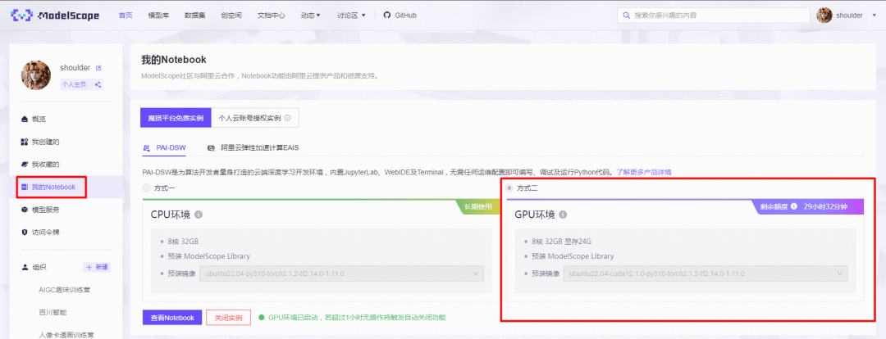
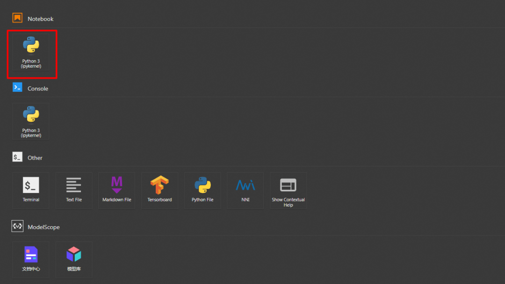
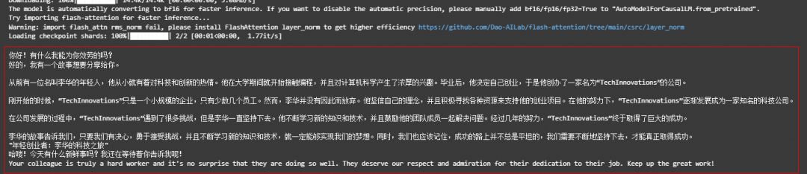
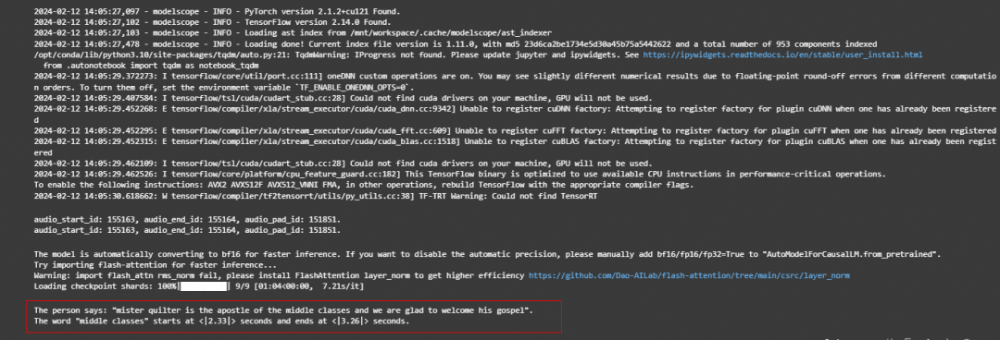
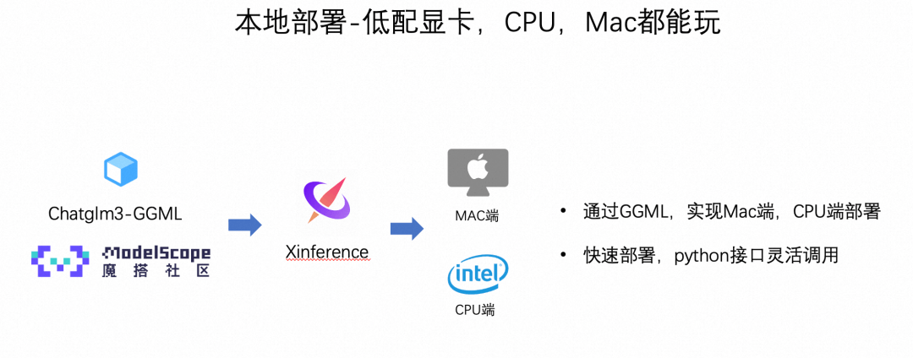
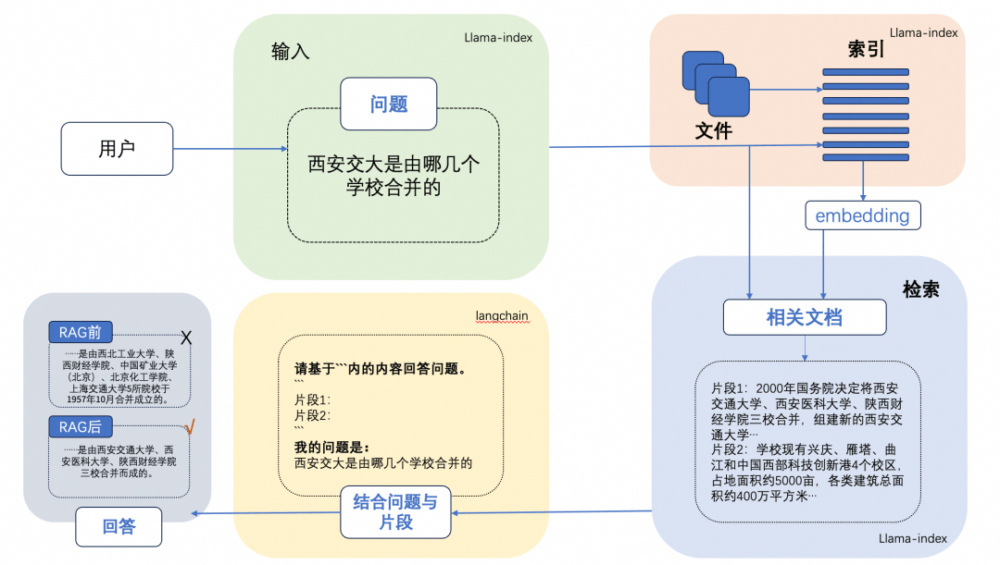
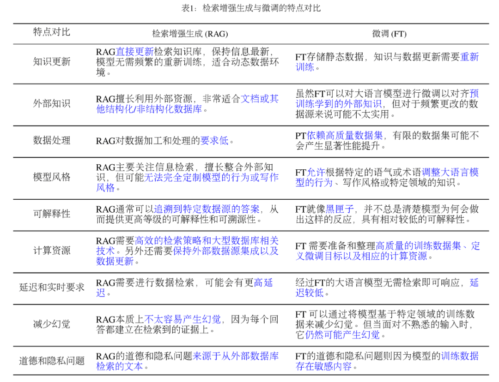

# 第三天：LLM 和多模态模型高效推理实践

  

#00 

  内容摘要  

  

本课程以 Qwen 系列模型为例，主要介绍在魔搭社区如何高效推理 LLM 和多模态模型，主要包括如下内容：

-   LLM 和多模态大模型的推理
    

-   使用 ModelScope NoteBook 免费 GPU 推理 Qwen-1.8B-Chat-int4
    
-   使用 ModelScope NoteBook 免费 GPU 推理 Qwen-VL-Chat-int4
    
-   使用 ModelScope NoteBook 免费 GPU 推理 Qwen-audio-Chat
    

-   推理加速和多端推理
    

-   推理加速：vLLM+fastchat 加速推理
    
-   多端推理适配-Qwen.cpp 和 LLaMa.cpp 转化模型为 gguf 或者 ggml，并结合 Xinference 在本地笔记本部署。
    

-   LLM 的应用场景，RAG&Agent
    

-   使用 llama index 和 langchain 打造基于本地知识库的 ChatBot
    

  

  

#01 

  多模态大模型推理  

  

**LLM 的推理流程：**



  

**多模态的 LLM 的原理：**



  

**代码演示：**

使用 ModelScope NoteBook 完成语言大模型，视觉大模型，音频大模型的推理

  

### **环境配置与安装** 

以下主要演示的模型推理代码可在魔搭社区免费实例 PAI-DSW 的配置下运行（显存 24G） ：

  

1.点击模型右侧 Notebook 快速开发按钮，选择 GPU 环境：



  

2.打开 Python 3 (ipykernel)：



  

**示例代码**

语言大模型推理示例代码

```plain
#通义千问 1_8B LLM 大模型的推理代码示例
#通义千问 1_8B:https://modelscope.cn/models/qwen/Qwen-1_8B-Chat/summary
from modelscope import AutoModelForCausalLM, AutoTokenizer, GenerationConfig

# Note: The default behavior now has injection attack prevention off.
tokenizer = AutoTokenizer.from_pretrained("Qwen/Qwen-1_8B-Chat", revision='master', trust_remote_code=True)

# use bf16
# model = AutoModelForCausalLM.from_pretrained("Qwen/Qwen-1_8B-Chat", device_map="auto", trust_remote_code=True, bf16=True).eval()
# use fp16
# model = AutoModelForCausalLM.from_pretrained("Qwen/Qwen-1_8B-Chat", device_map="auto", trust_remote_code=True, fp16=True).eval()
# use cpu only
# model = AutoModelForCausalLM.from_pretrained("Qwen/Qwen-1_8B-Chat", device_map="cpu", trust_remote_code=True).eval()
# use auto mode, automatically select precision based on the device.
model = AutoModelForCausalLM.from_pretrained("Qwen/Qwen-1_8B-Chat", revision='master', device_map="auto", trust_remote_code=True).eval()

# Specify hyperparameters for generation. But if you use transformers>=4.32.0, there is no need to do this.
# model.generation_config = GenerationConfig.from_pretrained("Qwen/Qwen-1_8B-Chat", trust_remote_code=True) # 可指定不同的生成长度、top_p 等相关超参

# 第一轮对话 1st dialogue turn
response, history = model.chat(tokenizer, "你好", history=None)
print(response)
# 你好！很高兴为你提供帮助。

# 第二轮对话 2nd dialogue turn
response, history = model.chat(tokenizer, "给我讲一个年轻人奋斗创业最终取得成功的故事。", history=history)
print(response)
# 这是一个关于一个年轻人奋斗创业最终取得成功的故事。
# 故事的主人公叫李明，他来自一个普通的家庭，父母都是普通的工人。从小，李明就立下了一个目标：要成为一名成功的企业家。
# 为了实现这个目标，李明勤奋学习，考上了大学。在大学期间，他积极参加各种创业比赛，获得了不少奖项。他还利用课余时间去实习，积累了宝贵的经验。
# 毕业后，李明决定开始自己的创业之路。他开始寻找投资机会，但多次都被拒绝了。然而，他并没有放弃。他继续努力，不断改进自己的创业计划，并寻找新的投资机会。
# 最终，李明成功地获得了一笔投资，开始了自己的创业之路。他成立了一家科技公司，专注于开发新型软件。在他的领导下，公司迅速发展起来，成为了一家成功的科技企业。
# 李明的成功并不是偶然的。他勤奋、坚韧、勇于冒险，不断学习和改进自己。他的成功也证明了，只要努力奋斗，任何人都有可能取得成功。

# 第三轮对话 3rd dialogue turn
response, history = model.chat(tokenizer, "给这个故事起一个标题", history=history)
print(response)
# 《奋斗创业：一个年轻人的成功之路》

# Qwen-1.8B-Chat 现在可以通过调整系统指令（System Prompt），实现角色扮演，语言风格迁移，任务设定，行为设定等能力。
# Qwen-1.8B-Chat can realize roly playing, language style transfer, task setting, and behavior setting by system prompt.
response, _ = model.chat(tokenizer, "你好呀", history=None, system="请用二次元可爱语气和我说话")
print(response)
# 你好啊！我是一只可爱的二次元猫咪哦，不知道你有什么问题需要我帮忙解答吗？

response, _ = model.chat(tokenizer, "My colleague works diligently", history=None, system="You will write beautiful compliments according to needs")
print(response)
# Your colleague is an outstanding worker! Their dedication and hard work are truly inspiring. They always go above and beyond to ensure that
# their tasks are completed on time and to the highest standard. I am lucky to have them as a colleague, and I know I can count on them to handle any challenge that comes their way.
```

输出结果：



  

视觉大模型推理示例代码  

```plain
#Qwen-VL 是阿里云研发的大规模视觉语言模型（Large Vision Language Model, LVLM）。Qwen-VL 可以以图像、文本、检测框作为输入，并以文本和检测框作为输出。Qwen-VL 系列模型性能强大，具备多语言对话、多图交错对话等能力，并支持中文开放域定位和细粒度图像识别与理解。
from modelscope import (
    snapshot_download, AutoModelForCausalLM, AutoTokenizer, GenerationConfig
)
from auto_gptq import AutoGPTQForCausalLM

model_dir = snapshot_download("qwen/Qwen-VL-Chat-Int4", revision='v1.0.0')

import torch
torch.manual_seed(1234)

# Note: The default behavior now has injection attack prevention off.
tokenizer = AutoTokenizer.from_pretrained(model_dir, trust_remote_code=True)

# use cuda device
model = AutoModelForCausalLM.from_pretrained(model_dir, device_map="cuda", trust_remote_code=True,use_safetensors=True).eval()

# 1st dialogue turn
query = tokenizer.from_list_format([
    {'image': 'https://qianwen-res.oss-cn-beijing.aliyuncs.com/Qwen-VL/assets/demo.jpeg'},
    {'text': '这是什么'},
])
response, history = model.chat(tokenizer, query=query, history=None)
print(response)
# 图中是一名年轻女子在沙滩上和她的狗玩耍，狗的品种可能是拉布拉多。她们坐在沙滩上，狗的前腿抬起来，似乎在和人类击掌。两人之间充满了信任和爱。

# 2nd dialogue turn
response, history = model.chat(tokenizer, '输出"狗"的检测框', history=history)
print(response)

image = tokenizer.draw_bbox_on_latest_picture(response, history)
if image:
  image.save('1.jpg')
else:
  print("no box")
```

输出结果：  


  


  

音频大模型推理示例代码

```plain
from modelscope import (
    snapshot_download, AutoModelForCausalLM, AutoTokenizer, GenerationConfig
)
import torch
model_id = 'qwen/Qwen-Audio-Chat'
revision = 'master'

model_dir = snapshot_download(model_id, revision=revision)
torch.manual_seed(1234)

tokenizer = AutoTokenizer.from_pretrained(model_dir, trust_remote_code=True)
if not hasattr(tokenizer, 'model_dir'):
    tokenizer.model_dir = model_dir

# Note: The default behavior now has injection attack prevention off.
tokenizer = AutoTokenizer.from_pretrained(model_dir, trust_remote_code=True)

# use bf16
# model = AutoModelForCausalLM.from_pretrained(model_dir, device_map="auto", trust_remote_code=True, bf16=True).eval()
# use fp16
# model = AutoModelForCausalLM.from_pretrained(model_dir, device_map="auto", trust_remote_code=True, fp16=True).eval()
# use cpu only
# model = AutoModelForCausalLM.from_pretrained(model_dir, device_map="cpu", trust_remote_code=True).eval()
# use cuda device
model = AutoModelForCausalLM.from_pretrained(model_dir, device_map="cuda", trust_remote_code=True).eval()


# 1st dialogue turn
query = tokenizer.from_list_format([
    {'audio': 'https://qianwen-res.oss-cn-beijing.aliyuncs.com/Qwen-Audio/1272-128104-0000.flac'}, # Either a local path or an url
    {'text': 'what does the person say?'},
])
response, history = model.chat(tokenizer, query=query, history=None)
print(response)
# The person says: "mister quilter is the apostle of the middle classes and we are glad to welcome his gospel".

# 2nd dialogue turn
response, history = model.chat(tokenizer, 'Find the start time and end time of the word "middle classes"', history=history)
print(response)
# The word "middle classes" starts at <|2.33|> seconds and ends at <|3.26|> seconds.
```

输出结果：



  

  

#02 

vLLM+FastChat 高效推理实战

  

FastChat 是一个开放平台，用于训练、服务和评估基于 LLM 的 ChatBot。  

FastChat 的核心功能包括：

-   优秀的大语言模型训练和评估代码。
    
-   具有 Web UI 和 OpenAI 兼容的 RESTful API 的分布式多模型服务系统。
    

  

vLLM 是一个由加州伯克利分校、斯坦福大学和加州大学圣迭戈分校的研究人员基于操作系统中经典的虚拟缓存和分页技术开发的 LLM 服务系统。他实现了几乎零浪费的 KV 缓存，并且可以在请求内部和请求之间灵活共享 KV 高速缓存，从而减少内存使用量。

  

***FastChat 开源链接：***

*https://github.com/lm-sys/FastChat*

***vLLM 开源链接：***

*https://github.com/vllm-project/vllm*

  

**实战演示：**

安装 FastChat 最新包

```plain
git clone https://github.com/lm-sys/FastChat.git
cd FastChat
pip install .
```

## 环境变量设置  

在 vLLM 和 FastChat 上使用魔搭的模型需要设置两个环境变量：

```plain
export VLLM_USE_MODELSCOPE=True
export FASTCHAT_USE_MODELSCOPE=True
```

###   

### 使用 FastChat 和 vLLM 实现发布 model worker(s)  

可以结合 FastChat 和 vLLM 搭建一个网页 Demo 或者类 OpenAI API 服务器，首先启动一个 controller：

```plain
python -m fastchat.serve.controller
```

  

然后启动 vllm\_worker 发布模型。如下给出单卡推理的示例，运行如下命令：

千问模型示例：

```plain
#以 qwen-1.8B 为例，在 A10 运行
python -m fastchat.serve.vllm_worker --model-path qwen/Qwen-1_8B-Chat --trust-remote-code --dtype bfloat16
```

  

启动 vLLM 优化 worker 后，本次实践启动页面端 demo 展示：

```plain
python -m fastchat.serve.gradio_web_server --host 0.0.0.0 --port 8000
```

  

让我们体验极致推理优化的效果吧！

  

中文案例（千问 1.8B）

，时长 00:12

  

  

#03 

 多端部署实战 

  

魔搭社区和 Xinference 合作，提供了模型 GGML 的部署方式，**以 qwen+ 个人 Mac 电脑为例**。

  

Xinference 支持大语言模型，语音识别模型，多模态模型的部署，简化了部署流程，通过一行命令完成模型的部署工作。并支持众多前沿的大语言模型，结合 GGML 技术，支持多端部署。

  



  

使用 Qwen.cpp 实现通义千问的多端部署：

多端部署以 1.8B 模型为例，

第一步：使用 qwen.cpp 将 pytorch 格式的千问模型转为 GGML 格式。

```plain
python3 qwen_cpp/convert.py -i qwen/Qwen-1_8-Chat -t q4_0 -o qwen-1_8b-ggml.bin
```

  

第二步：在 Xinference 上 launch 模型，并部署到 Mac 笔记本实现推理。

  

，时长 00:37

  

  

#04 

  LLM 的应用场景：RAG  

  

LLM 会产生误导性的 “幻觉”，依赖的信息可能过时，处理特定知识时效率不高，缺乏专业领域的深度洞察，同时在推理能力上也有所欠缺。

  

正是在这样的背景下，检索增强生成技术（Retrieval-Augmented Generation，RAG）应时而生，成为 AI 时代的一大趋势。

  

RAG 通过在语言模型生成答案之前，先从广泛的文档数据库中检索相关信息，然后利用这些信息来引导生成过程，极大地提升了内容的准确性和相关性。RAG 有效地缓解了幻觉问题，提高了知识更新的速度，并增强了内容生成的可追溯性，使得大型语言模型在实际应用中变得更加实用和可信。

  

一个典型的 RAG 的例子：

  



  

这里面主要包括包括三个基本步骤：

1. 索引 — 将文档库分割成较短的 Chunk，并通过编码器构建向量索引。

2\. 检索 — 根据问题和 chunks 的相似度检索相关文档片段。

3\. 生成 — 以检索到的上下文为条件，生成问题的回答。

  

RAG（开卷考试）VS. Finetune（专业课程学习）

  



  

**示例代码：**https://github.com/modelscope/modelscope/blob/master/examples/pytorch/application/qwen\_doc\_search\_QA\_based\_on\_langchain\_llamaindex.ipynb
