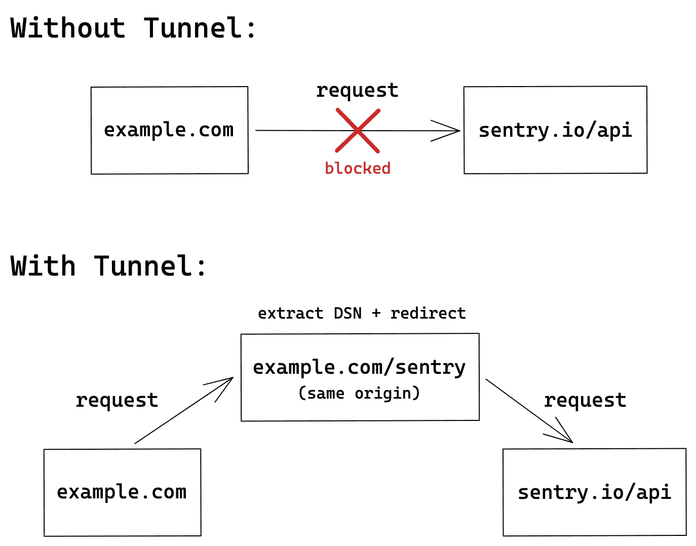

# 簡單分析 CVE-2023-46729：Sentry Next.js SDK 的 URL rewrite 漏洞 - Huli's blog

# 簡單分析 CVE-2023-46729：Sentry Next.js SDK 的 URL rewrite 漏洞

🔄  ❓

2023 年 11 月 13 日 [Security](https://blog.huli.tw/categories/Security/)

🔄  ❓

Sentry 在 2023 年 11 月 9 號時，在部落格上發布了這篇文章：[Next.js SDK Security Advisory - CVE-2023-46729](https://blog.sentry.io/next-js-sdk-security-advisory-cve-2023-46729/)，內容主要在講述 CVE-2023-46729 這個漏洞的一些細節，包含漏洞成因、發現時間以及修補時間等等。

🔄  ❓

雖然說是在 11/9 正式對外發布漏洞公告，但漏洞其實在 10/31 發佈的 7.77.0 版本已經修復了，有預留一些時間給開發者們來修補漏洞。

🔄  ❓

接著就來簡單講一下這個漏洞的成因以及攻擊方式。

🔄  ❓

## 漏洞分析

在 GitHub 上面也有一個比較偏技術的說明：[CVE-2023-46729: SSRF via Next.js SDK tunnel endpoint](https://github.com/getsentry/sentry-javascript/security/advisories/GHSA-2rmr-xw8m-22q9)

🔄  ❓

可以看到這一段：

🔄  ❓

> An unsanitized input of Next.js SDK tunnel endpoint allows sending HTTP requests to arbitrary URLs and reflecting the response back to the user.
> 
> 🔄  ❓

在 Sentry 裡面，有一個叫做 tunnel 的功能，這張來自於[官方文件](https://docs.sentry.io/platforms/javascript/troubleshooting/#dealing-with-ad-blockers)的圖完美地解釋了為什麼需要 tunnel：

🔄  ❓

[](https://blog.huli.tw/img/sentry-nextjs-sdk-cve-2023-46729/p1.png)

如果沒有 tunnel 的話，送給 Sentry 的請求會在前端直接透過瀏覽器發送，而這些直接發給 Sentry 的請求可能會被一些 ad blocker 擋住，Sentry 就沒辦法接收到數據。若是有開啟 tunnel，就會變成先將請求發送給自己的 server，再從自己的 server 轉發給 Sentry，這樣就變成了 same-origin 的請求，便不會被 ad blocker 擋住。

🔄  ❓

在專門提供給 Next.js 使用的 Sentry SDK 中，是用了一個叫做 [rewrite](https://nextjs.org/docs/app/api-reference/next-config-js/rewrites) 的功能，官方範例如下：

🔄  ❓

```javascript
module.exports = {
  async rewrites() {
    return [
      {
        source: '/blog',
        destination: 'https://example.com/blog',
      },
      {
        source: '/blog/:slug',
        destination: 'https://example.com/blog/:slug', // Matched parameters can be used in the destination
      },
    ]
  },
}
```

Next.js 的 rewrite 基本上可以分為兩種，internal 跟 external，後者的話其實更像是 proxy 的感覺，可以直接把請求導向到外部網站，然後顯示出 response。

🔄  ❓

Next.js Sentry SDK 的實作在 [sentry-javascript/packages/nextjs/src/config/withSentryConfig.ts](https://github.com/getsentry/sentry-javascript/blob/7.69.0/packages/nextjs/src/config/withSentryConfig.ts#L98)：

🔄  ❓

```javascript
/**
 * Injects rewrite rules into the Next.js config provided by the user to tunnel
 * requests from the `tunnelPath` to Sentry.
 *
 * See https://nextjs.org/docs/api-reference/next.config.js/rewrites.
 */
function setUpTunnelRewriteRules(userNextConfig: NextConfigObject, tunnelPath: string): void {
  const originalRewrites = userNextConfig.rewrites;

  // This function doesn't take any arguments at the time of writing but we future-proof
  // here in case Next.js ever decides to pass some
  userNextConfig.rewrites = async (...args: unknown[]) => {
    const injectedRewrite = {
      // Matched rewrite routes will look like the following: `[tunnelPath]?o=[orgid]&p=[projectid]`
      // Nextjs will automatically convert `source` into a regex for us
      source: `${tunnelPath}(/?)`,
      has: [
        {
          type: 'query',
          key: 'o', // short for orgId - we keep it short so matching is harder for ad-blockers
          value: '(?<orgid>.*)',
        },
        {
          type: 'query',
          key: 'p', // short for projectId - we keep it short so matching is harder for ad-blockers
          value: '(?<projectid>.*)',
        },
      ],
      destination: 'https://o:orgid.ingest.sentry.io/api/:projectid/envelope/?hsts=0',
    };

    if (typeof originalRewrites !== 'function') {
      return [injectedRewrite];
    }

    // @ts-expect-error Expected 0 arguments but got 1 - this is from the future-proofing mentioned above, so we don't care about it
    const originalRewritesResult = await originalRewrites(...args);

    if (Array.isArray(originalRewritesResult)) {
      return [injectedRewrite, ...originalRewritesResult];
    } else {
      return {
        ...originalRewritesResult,
        beforeFiles: [injectedRewrite, ...(originalRewritesResult.beforeFiles || [])],
      };
    }
  };
}
```

其中的重中之重就是這一段：

🔄  ❓

```javascript
const injectedRewrite = {
  // Matched rewrite routes will look like the following: `[tunnelPath]?o=[orgid]&p=[projectid]`
  // Nextjs will automatically convert `source` into a regex for us
  source: `${tunnelPath}(/?)`,
  has: [
    {
      type: 'query',
      key: 'o', // short for orgId - we keep it short so matching is harder for ad-blockers
      value: '(?<orgid>.*)',
    },
    {
      type: 'query',
      key: 'p', // short for projectId - we keep it short so matching is harder for ad-blockers
      value: '(?<projectid>.*)',
    },
  ],
  destination: 'https://o:orgid.ingest.sentry.io/api/:projectid/envelope/?hsts=0',
};
```

會根據 query string 中的 `o` 跟 `p`，決定最後要重新導向的 URL。

🔄  ❓

而這邊的問題是這兩個參數的 regexp 都用了 `.*`，也就是說會配對到任何字元，換句話說，底下這個網址：

🔄  ❓

```none
https://huli.tw/tunnel?o=abc&p=def
```

會 proxy 到：

🔄  ❓

```none
https://oabc.ingest.sentry.io/api/def/envelope/?hsts=0
```

看起來沒什麼問題，但如果是這樣呢？

🔄  ❓

```none
https://huli.tw/tunnel?o=example.com%23&p=def
```

`%23` 是 `#` URL encode 後的結果，最後就會 proxy 到：

🔄  ❓

```none
https://oexample.com#.ingest.sentry.io/api/def/envelope/?hsts=0
```

我們利用了 `#` 來把原本的 hostname 都當成 hash 的一部分，並且成功更改了 proxy 的目的地。但最前面那個 o 還是有點煩人，不如把它一起消除掉吧！只要在最前面加個 `@` 就行了：

🔄  ❓

```none
https://huli.tw/tunnel?o=@example.com%23&p=def
```

會變成：

🔄  ❓

```none
https://o@example.com#.ingest.sentry.io/api/def/envelope/?hsts=0
```

如此一來，攻擊者就可以利用 o 這個參數更改 proxy 的目的地，將 request 導向至任何地方。剛剛有說過這個 rewrite 功能會將 response 直接回傳，所以當使用者瀏覽：`https://huli.tw/tunnel?o=@example.com%23&p=def` 的時候，看到的 response 會是 `example.com` 的結果。

🔄  ❓

也就是說，如果攻擊者把請求導向至自己的網站，就可以輸出 `<script>alert(document.cookie)</script>`，就變成了一個 XSS 漏洞。

🔄  ❓

若是攻擊者不是導到自己的網站，而是導向到其他內部的網頁如 `https://localhost:3001` 之類的，就是一個 SSRF 的漏洞（但目標必須支援 HTTPS 就是了）。

🔄  ❓

至於修復方式的話也很簡單，只要對 regexp 做出一些限制即可，最後 Sentry 是調整成[只允許數字](https://github.com/getsentry/sentry-javascript/pull/9416/files)：

🔄  ❓

```javascript
{
  type: 'query',
  key: 'o', // short for orgId - we keep it short so matching is harder for ad-blockers
  value: '(?<orgid>\\d*)',
},
```

7.77.0 版本以及之後的版本都已經修復了這個問題。

🔄  ❓

## 總結

🔄  ❓

這個漏洞真的滿簡單而且滿好重現的，只需要找到修復的 commit，看兩眼程式碼大概就能知道怎麼攻擊。

🔄  ❓

總之呢，在做 URL rewrite 的時候真的必須謹慎一點，不然還滿容易出問題的（尤其是你不只是 rewrite path，而是 rewrite 整個 URL）。

🔄  ❓

[#Security](https://blog.huli.tw/tags/Security/)

[HITCON CTF 2023 與 SECCON CTF 2023 筆記](https://blog.huli.tw/2023/09/23/hitcon-seccon-ctf-2023-writeup/)

🔄  ❓
