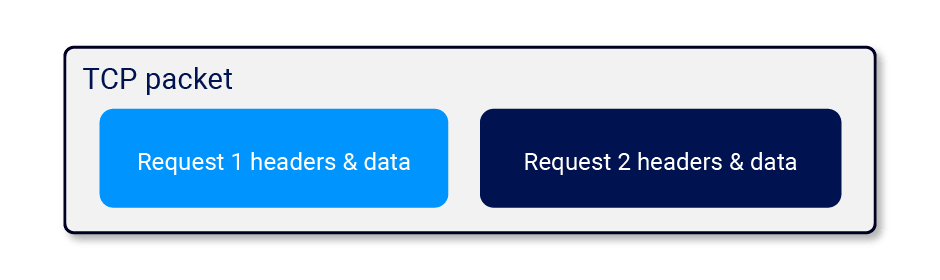
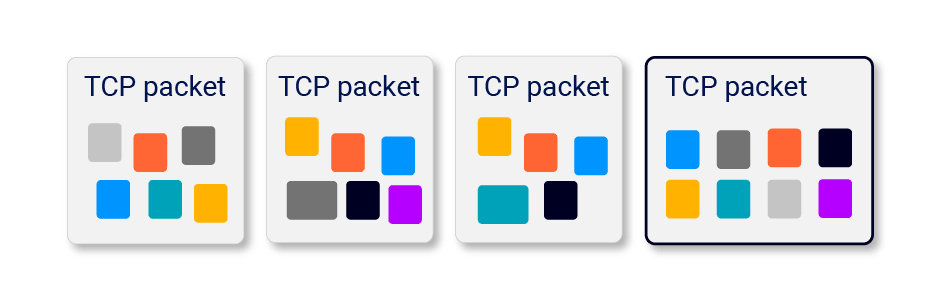
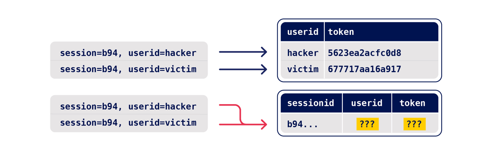

# 粉碎状态机：Web 竞争条件的真正潜力|PortSwigger 研究 --- Smashing the state machine: the true potential of web race conditions | PortSwigger Research

# Smashing the state machine: the true potential of web race conditions  
粉碎状态机：Web 竞争条件的真正潜力

-   [↓↓↓](https://twitter.com/share?url=https%3A%2F%2Fportswigger.net%2Fresearch%2Fsmashing-the-state-machine&text=Smashing+the+state+machine%3A+the+true+potential+of+web+race+conditions%20-%20%40PortSwiggerRes%0A)  
      
      
      
    [↑↑↑](https://twitter.com/share?url=https%3A%2F%2Fportswigger.net%2Fresearch%2Fsmashing-the-state-machine&text=Smashing+the+state+machine%3A+the+true+potential+of+web+race+conditions%20-%20%40PortSwiggerRes%0A)
    
-   [↓↓↓](https://api.whatsapp.com/send?text=https%3A%2F%2Fportswigger.net%2Fresearch%2Fsmashing-the-state-machine)  
      
      
      
    [↑↑↑](https://api.whatsapp.com/send?text=https%3A%2F%2Fportswigger.net%2Fresearch%2Fsmashing-the-state-machine)
    
-   [↓↓↓](https://reddit.com/submit?url=https%3A%2F%2Fportswigger.net%2Fresearch%2Fsmashing-the-state-machine)  
      
      
      
    [↑↑↑](https://reddit.com/submit?url=https%3A%2F%2Fportswigger.net%2Fresearch%2Fsmashing-the-state-machine)
    
-   [↓↓↓](https://www.linkedin.com/sharing/share-offsite?url=https%3A%2F%2Fportswigger.net%2Fresearch%2Fsmashing-the-state-machine)  
      
      
      
    [↑↑↑](https://www.linkedin.com/sharing/share-offsite?url=https%3A%2F%2Fportswigger.net%2Fresearch%2Fsmashing-the-state-machine)
    
-   [↓↓↓](mailto:?subject=Smashing+the+state+machine%3A+the+true+potential+of+web+race+conditions&body=Smashing+the+state+machine%3A+the+true+potential+of+web+race+conditions%0A%0AFor+too+long%2C+web+race+condition+attacks+have+focused+on+a+tiny+handful+of+scenarios.+Their+true+potential+has+been+masked+thanks+to+tricky+workflows%2C+missing+tooling%2C+and+simple+network+jitter+hiding%0A%0Ahttps://portswigger.net/research/smashing-the-state-machine)  
      
      
      
    [↑↑↑](mailto:?subject=Smashing+the+state+machine%3A+the+true+potential+of+web+race+conditions&body=Smashing+the+state+machine%3A+the+true+potential+of+web+race+conditions%0A%0AFor+too+long%2C+web+race+condition+attacks+have+focused+on+a+tiny+handful+of+scenarios.+Their+true+potential+has+been+masked+thanks+to+tricky+workflows%2C+missing+tooling%2C+and+simple+network+jitter+hiding%0A%0Ahttps://portswigger.net/research/smashing-the-state-machine)
    
-   [↓↓↓](https://portswigger.net/research/rss)  
      
      
      
    [↑↑↑](https://portswigger.net/research/rss)
    

### 

[↓↓↓](https://portswigger.net/research/james-kettle)  
  
James Kettle  詹姆斯·凯特尔  
  
[↑↑↑](https://portswigger.net/research/james-kettle)

Director of Research 研究主任

[@albinowax](https://twitter.com/albinowax)

-   **Published:** 09 August 2023 at 18:00 UTC  
    发布时间：2023 年 8 月 9 日 18:00 UTC
    
-   **Updated:** 18 September 2023 at 14:17 UTC  
    更新时间：2023 年 9 月 18 日 14:17 UTC
    

  

For too long, web race condition attacks have focused on a tiny handful of scenarios. Their true potential has been masked thanks to tricky workflows, missing tooling, and simple network jitter hiding all but the most trivial, obvious examples.  
长期以来，网络竞争条件攻击一直集中在极少数情况下。由于复杂的工作流程、缺少工具以及简单的网络抖动，它们的真正潜力被掩盖了，除了最琐碎、最明显的例子。

In this paper, I'll introduce new classes of race condition that go far beyond the limit-overrun exploits you're probably already familiar with. With these I'll exploit both multiple high-profile websites and Devise, a popular authentication framework for Rails.  
在本文中，我将介绍新的竞争条件类别，它们远远超出了您可能已经熟悉的超限利用。有了这些，我将利用多个知名网站和 Devise，一个流行的 Rails 身份验证框架。

I'll also introduce the single-packet attack; a jitter-dodging strategy that can squeeze 30 requests sent from Melbourne to Dublin into a sub-1ms execution window. This paper is accompanied by a full complement of free online labs, so you'll be able to try out your new skill set immediately.  
我还将介绍单包攻击;这是一种抖动规避策略，可以将从墨尔本发送到都柏林的 30 个请求压缩到不到 1 毫秒的执行窗口中。本文附有完整的免费在线实验室，因此您可以立即尝试您的新技能。

This research paper accompanies a presentation at [Black Hat USA](https://www.blackhat.com/us-23/briefings/schedule/index.html#smashing-the-state-machine-the-true-potential-of-web-race-conditions-31712), [DEF CON](https://defcon.org/html/defcon-31/dc-31-schedule.html#:~:text=Smashing%20the%20state%20machine%3A%20the%20true%20potential%20of%20web%20race%20conditions) & [Nullcon](https://nullcon.net/goa-2023/speaker-smashing-the-state-machine-the-true-potential-of-web-race-conditions):  
这篇研究论文伴随着 Black Hat USA，DEF CON 和 Nullcon 的演讲：

按钮

DEFCONConference

28.4 万位订阅者

[DEF CON 31 - Smashing the State Machine the True Potential of Web Race Conditions - James Kettle](https://www.youtube.com/watch?v=tKJzsaB1ZvI)

稍后观看

分享

[↓↓↓](https://www.youtube.com/watch?v=tKJzsaB1ZvI&embeds_referring_euri=https%3A%2F%2Fportswigger.net%2F&embeds_referring_origin=https%3A%2F%2Fportswigger.net&feature=emb_imp_woyt)  
  

前往平台观看：

  
  
[↑↑↑](https://www.youtube.com/watch?v=tKJzsaB1ZvI&embeds_referring_euri=https%3A%2F%2Fportswigger.net%2F&embeds_referring_origin=https%3A%2F%2Fportswigger.net&feature=emb_imp_woyt)

It is also available in a [print/download-friendly PDF](https://portswigger.net/kb/papers/rifmwla/racewhitepaper.pdf) format.  
它也可以打印/下载友好的 PDF 格式。

### Outline 纲要

-   [↓↓↓](#introduction)  
      
    The true potential  真正潜力  
      
    [↑↑↑](#introduction)
    

-   [↓↓↓](#beyond-limit-overrun)  
      
    Beyond limit-overrun  超限  
      
    [↑↑↑](#beyond-limit-overrun)
    
-   [↓↓↓](#single-packet-attack)  
      
    Single-packet attack  单包攻击  
      
    [↑↑↑](#single-packet-attack)
    
-   [↓↓↓](#methodology)  
      
    Methodology  方法  
      
    [↑↑↑](#methodology)
    

-   [↓↓↓](#case-studies)  
      
    Case studies  案例研究  
      
    [↑↑↑](#case-studies)
    

-   [↓↓↓](#object-masking)  
      
    Object masking  对象掩蔽  
      
    [↑↑↑](#object-masking)
    
-   [↓↓↓](#multi-endpoint)  
      
    Multi-endpoint  多端点  
      
    [↑↑↑](#multi-endpoint)
    
-   [↓↓↓](#single-endpoint)  
      
    Single-endpoint  单端点  
      
    [↑↑↑](#single-endpoint)
    
-   [↓↓↓](#deferred)  
      
    Deferred  递延  
      
    [↑↑↑](#deferred)
    

-   [↓↓↓](#further-research)  
      
    Further research  进一步研究  
      
    [↑↑↑](#further-research)
    
-   [↓↓↓](#defence)  
      
    Defence  国防  
      
    [↑↑↑](#defence)
    
-   [↓↓↓](#takeaways)  
      
    Takeaways  外卖  
      
    [↑↑↑](#takeaways)
    

### Background 背景

#### Race condition fundamentals  
竞赛条件基本原则

To begin, let's recap race condition fundamentals. I'll keep this brief - if you'd prefer an in-depth introduction, check out our new [Web Security Academy topic](https://portswigger.net/web-security/race-conditions).  
开始，让我们回顾一下竞争条件的基本原理。我会保持简短 - 如果你想要一个深入的介绍，看看我们的新的网络安全学院的主题。

Most websites handle concurrent requests using multiple threads, all reading and writing from a single, shared database. Application code is rarely crafted with concurrency risks in mind and as a result, [race conditions](https://portswigger.net/web-security/race-conditions) plague the web. Exploits are typically limit-overrun attacks - they use synchronized requests to overcome some kind of limit, for example:  
大多数网站使用多个线程处理并发请求，所有线程都从单个共享数据库进行阅读和写。应用程序代码很少考虑并发风险，因此，竞争条件困扰着 Web。漏洞利用通常是限制溢出攻击 - 它们使用同步请求来克服某种限制，例如：

-   Redeeming a gift card multiple times  
    多次兑换礼品卡
-   [↓↓↓](https://portswigger.net/web-security/race-conditions/lab-race-conditions-limit-overrun)  
      
    Repeatedly applying a single discount code  
    重复应用单个折扣代码  
      
    [↑↑↑](https://portswigger.net/web-security/race-conditions/lab-race-conditions-limit-overrun)
    
-   Rating a product multiple times  
    对产品进行多次评级
-   Withdrawing or transferring cash in excess of your account balance  
    提取或转移超过账户余额的现金
-   [↓↓↓](https://portswigger.net/research/cracking-recaptcha-turbo-intruder-style)  
      
    Reusing a single CAPTCHA solution  
    重复使用单个 CAPTCHA 解决方案  
      
    [↑↑↑](https://portswigger.net/research/cracking-recaptcha-turbo-intruder-style)
    
-   [↓↓↓](https://portswigger.net/web-security/race-conditions/lab-race-conditions-bypassing-rate-limits)  
      
    Bypassing an anti-bruteforce rate-limit  
    设置反暴力速率限制  
      
    [↑↑↑](https://portswigger.net/web-security/race-conditions/lab-race-conditions-bypassing-rate-limits)
    

The underlying cause of these is also similar - they all exploit the time-gap between the security check and the protected action. For example, two threads may simultaneously query a database and confirm that the TOP10 discount code hasn't been applied to the cart, then both attempt to apply the discount, resulting in it being applied twice. You'll often find these referred to as 'time of check, time of use' (TOCTOU) flaws for this reason.  
这些问题的根本原因也是相似的--它们都利用了安全检查和受保护操作之间的时间差。例如，两个线程可以同时查询数据库并确认 TOP10 折扣代码尚未应用于购物车，然后两者都尝试应用折扣，导致其被应用两次。因此，您经常会发现这些被称为“检查时间，使用时间”（TOCTORM）的缺陷。

Please note that race-conditions are not limited to a specific web-app architecture. It's easiest to reason about a multi-threaded single-database application, but more complex setups typically end up with state stored in even more places, and ORMs just hide the dangers under layers of abstraction. Single-threaded systems like NodeJS are slightly less exposed, but can still end up vulnerable.  
请注意，竞赛条件并不限于特定的 Web 应用程序架构。多线程单数据库应用程序最容易推理，但更复杂的设置通常会导致状态存储在更多的地方，而 ORM 只是将危险隐藏在抽象层之下。像 NodeJS 这样的单线程系统暴露得稍微少一点，但最终仍然容易受到攻击。

#### Beyond limit-overrun exploits  
超越限制 - 超限攻击

I used to think race conditions were a well-understood problem. I had discovered and exploited plenty, implemented the 'last-byte sync' technique in Turbo Intruder, and used that to exploit various targets [including Google reCAPTCHA](https://portswigger.net/research/cracking-recaptcha-turbo-intruder-style). Over time, Turbo Intruder has become the de-facto tool for hunting web race conditions.  
我曾经认为比赛条件是一个很好理解的问题。我已经发现并利用了很多，在 Turbo Intruder 中实现了“最后字节同步”技术，并使用它来利用包括 Google reCAPTCHA 在内的各种目标。随着时间的推移，Turbo Intruder 已经成为搜索网络竞争条件的事实上的工具。

However, there was one thing I didn't understand. A [blog post from 2016](https://www.josipfranjkovic.com/blog/race-conditions-on-web) by Josip Franjković detailed four vulnerabilities, and while three of them made perfect sense to me, one didn't. In the post, Josip explained how he "somehow succeeded to confirm a random email address" by accident, and neither he nor Facebook's security team were able to identify the cause until two months later. The bug? Changing your Facebook email address to two different addresses simultaneously could trigger an email containing two distinct confirmation codes, one for each address:  
不过，有一点我不明白。Josip Franjković在 2016 年的一篇博客文章中详细介绍了四个漏洞，虽然其中三个对我来说非常有意义，但其中一个没有。在帖子中，Josip 解释了他是如何意外地“以某种方式成功确认了一个随机的电子邮件地址”，而他和 Facebook 的安全团队直到两个月后才能够确定原因。窃听器？将您的 Facebook 电子邮件地址同时更改为两个不同的地址可能会触发包含两个不同确认代码的电子邮件，每个地址一个：

`/confirmemail.php?e=user@gmail.com&c=13475&code=84751`

I had never seen a finding like this before, and it confounded every attempt to visualize what might be happening server-side. One thing was for sure - this wasn't a limit-overrun.  
我以前从来没有见过这样的发现，它混淆了每一个试图可视化服务器端可能发生的事情的尝试。有一件事是肯定的 - 这不是一个限制超限。

Seven years later, I decided to try and figure out what happened.  
七年后，我决定试着弄清楚发生了什么。

#### The true potential of web race conditions  
网络竞争条件的真正潜力

The true potential of race conditions can be summed up in a single sentence. Every pentester knows that multi-step sequences are a hotbed for vulnerabilities, but with race conditions, everything is multi-step.  
竞争条件的真正潜力可以用一句话来概括。每个 pentester 都知道多步序列是漏洞的温床，但在竞争条件下，一切都是多步的。

To illustrate this, let's plot the state machine for a serious vulnerability that I discovered by accident a while back. When a user logged in, they were presented with a 'role selection' page containing a range of buttons that would assign a role, and redirect to a specific application. The request flow looked something like:  
为了说明这一点，让我们绘制一个我不久前偶然发现的严重漏洞的状态机。当用户登录时，他们会看到一个“角色选择”页面，其中包含一系列按钮，可以分配角色，并重定向到特定的应用程序。请求流看起来像这样：

|     |     |
| --- | --- |
| POST /login POST /登录 | 302 Found |
| GET /role | 200 Found 发现 200 个 |
| POST /role POST /角色 | 302 Found |
| GET /application  GET /应用程序 | 200 OK |

In my head, the state machine for the user's role looked like this:  
在我的脑海中，用户角色的状态机看起来像这样：

  

I attempted to elevate privileges by forcibly browsing directly from the role selection page to an application without selecting a role, but this didn't work and so I concluded that it was secure.  
我试图通过强制从角色选择页面直接浏览到应用程序而不选择角色来提升权限，但这不起作用，所以我得出结论，这是安全的。

However, this state machine had a mistake. I had incorrectly assumed that the GET /role request didn't change the application state. In actual fact, the application was initialising every session with administrator privileges, then overwriting them as soon as the browser fetched the role selection page. Here's an accurate state machine:  
然而，这个状态机有一个错误。我错误地认为 GET /role 请求不会改变应用程序的状态。实际上，应用程序使用管理员权限初始化每个会话，然后在浏览器获取角色选择页面时立即将其删除。下面是一个精确的状态机：

  

By refusing to follow the redirect to /role and skipping straight to an application, anyone could gain super-admin privileges.  
通过拒绝重定向到/role 并直接跳转到应用程序，任何人都可以获得超级管理员权限。

I only discovered this through extreme luck, and it took me hours of retrospective log digging to figure out the cause. This vulnerability pattern is frankly a weird one, but we can learn something valuable from the near-miss.  
我只是通过极端的运气才发现这一点，我花了几个小时的回顾日志挖掘来找出原因。坦率地说，这种脆弱性模式是一种奇怪的模式，但我们可以从近乎失败中学到一些有价值的东西。

My primary mistake was the assumption that the GET request wouldn't change the application state. However, there's a second assumption that's even more common - that "requests are atomic". If we ditch this assumption too, we realize this pattern could occur in the span of a single login request:  
我的主要错误是假设 GET 请求不会改变应用程序的状态。然而，还有第二个更常见的假设--“请求是原子的”。如果我们也抛弃这个假设，我们会意识到这种模式可能发生在单个登录请求的范围内：

  

This scenario captures the essence of 'with race conditions, everything is multi-step'. Every HTTP request may transition an application through multiple fleeting, hidden states, which I'll refer to as 'sub-states'. If you time it right, you can abuse these sub-states for unintended transitions, break business logic, and achieve high-impact exploits. Let's get started.  
这个场景抓住了“在竞争条件下，一切都是多步的”的本质。每个 HTTP 请求都可能使应用程序通过多个短暂的隐藏状态，我将其称为“子状态”。如果时间安排正确，您可以滥用这些子状态进行意外的转换，破坏业务逻辑，并实现高影响力的攻击。我们开始吧

### Single-packet attack 单包攻击

A sub-state is a short-lived state that an application transitions through while processing a single request, and exits before the request completes. Sub-states are only occupied for a brief time window - often around 1ms (0.001s). I'll refer to this time window as the 'race window'.  
子状态是一种短暂的状态，应用程序在处理单个请求时会过渡到该状态，并在请求完成之前退出。子状态仅在短暂的时间窗口内被占用 - 通常约为 1 ms（0.001s）。我将把这个时间窗口称为“竞赛窗口”。

To discover a sub-state, you need an initial HTTP request to trigger a transition through the sub-state, and a second request that interacts with the same resource during the race window. For example, to discover the vulnerability mentioned earlier you would send a request to log in, and a second request that attempted to access the admin panel. Vulnerabilities with small race windows have historically been extremely difficult to discover thanks to network jitter. Jitter erratically delays the arrival of TCP packets, making it tricky to get multiple requests to arrive close together, even when using techniques like last-byte sync:  
要发现子状态，需要一个初始 HTTP 请求来触发子状态的转换，以及在竞争窗口期间与同一资源交互的第二个请求。例如，要发现前面提到的漏洞，您可以发送一个登录请求，然后再发送一个试图访问管理面板的请求。由于网络抖动，具有小竞争窗口的漏洞历来非常难以发现。抖动会不规律地延迟 TCP 数据包的到达，使得多个请求紧密地同时到达变得很棘手，即使使用像最后字节同步这样的技术：

  

In search of a solution, I've developed the 'single-packet attack'. Using this technique, you can make 20-30 requests arrive at the server simultaneously - regardless of network jitter:  
为了寻找解决方案，我开发了“单包攻击”。使用这种技术，您可以使 20-30 个请求同时到达服务器 - 无论网络抖动如何：

  

I implemented the single-packet attack in the open-source Burp Suite extension [Turbo Intruder](https://github.com/PortSwigger/turbo-intruder). To benchmark it, I repeatedly sent a batch of 20 requests 17,000km from Melbourne to Dublin, and measured the gap between the start-of-execution timestamp of the first and last request in each batch. I've published the benchmark scripts in [the examples folder](https://github.com/PortSwigger/turbo-intruder/blob/master/resources/examples/) so you can try them for yourself if you like.  
我在开源 Burp Suite 扩展 Turbo Intruder 中实现了单包攻击。为了对其进行基准测试，我反复发送了一批 20 个请求，从墨尔本到都柏林，行程 17,000 公里，并测量了每批中第一个和最后一个请求的开始执行时间戳之间的差距。我已经在 examples 文件夹中发布了基准测试脚本，如果您愿意，可以自己尝试。

|     |     |     |
| --- | --- | --- |
| Technique 技术 | Median spread 中间点差 | Standard deviation 标准偏差 |
| --- | --- | --- |
| Last-byte sync 最后字节同步 | 4ms | 3ms |
| Single-packet attack 单包攻击 | 1ms | 0.3ms |

By these measures, the single-packet attack is 4 to 10 times more effective. When replicating one real-world vulnerability, the single-packet attack was successful after around 30 seconds, and last-byte sync took over two hours.  
通过这些措施，单包攻击的有效性提高了 4 到 10 倍。当复制一个真实世界的漏洞时，单包攻击在大约 30 秒后成功，最后一个字节同步需要两个多小时。

One great side effect of this is that we've been able to launch a Web Security Academy topic containing labs with realistic race windows, without alienating users who live far away from our servers or have high-jitter connections. You can try the single-packet attack out for yourself by tackling our [limit-overrun lab](https://portswigger.net/web-security/race-conditions/lab-race-conditions-limit-overrun) with the [single-packet-attack.py](https://github.com/PortSwigger/turbo-intruder/blob/master/resources/examples/race-single-packet-attack.py) Turbo Intruder template. The race-window on this lab ended up so small that exploitation is near-impossible using multiple packets. It's also available in Repeater via the new 'Send group in parallel' option in Burp Suite.  
这样做的一个很大的副作用是，我们已经能够启动一个 Web 安全学院主题，其中包含具有现实竞赛窗口的实验室，而不会疏远那些远离我们服务器或具有高抖动连接的用户。您可以通过使用 single-packet-attack.py Turbo Intruder 模板解决我们的超限实验室，亲自尝试单数据包攻击。这个实验室的竞争窗口非常小，以至于使用多个数据包几乎不可能利用它。它也可以在中继器通过新的'发送组并行'在打嗝套件选项。

Let's take a look under the hood.  
让我们看看引擎盖下。

#### Developing the single-packet attack  
开发单包攻击

The single-packet attack was inspired by the 2020 USENIX presentation [Timeless Timing Attacks](https://www.usenix.org/conference/usenixsecurity20/presentation/van-goethem). In that presentation, they place two entire HTTP/2 requests into a single TCP packet, then look at the response order to compare the server-side processing time of the two requests:  
单包攻击的灵感来自于 2020 年 USENIX 演示文稿 Timeless Timing Attacks。在该演示中，他们将两个完整的 HTTP/2 请求放入一个 TCP 数据包中，然后查看响应顺序以比较两个请求的服务器端处理时间：

This is a novel possibility with HTTP/2 because it allows HTTP requests to be sent over a single connection concurrently, whereas in HTTP/1.1 they have to be sequential.  
这是 HTTP/2 的一个新的可能性，因为它允许 HTTP 请求在单个连接上并发发送，而在 HTTP/1.1 中，它们必须是顺序的。

The use of a single TCP packet completely eliminates the effect of network jitter, so this clearly has potential for race condition attacks too. However, two requests isn't enough for a reliable race attack thanks to server-side jitter - variations in the application's request-processing time caused by uncontrollable variables like CPU contention.  
使用单个 TCP 数据包完全消除了网络抖动的影响，因此这显然也有可能造成竞争条件攻击。然而，由于服务器端抖动（jitter），两个请求对于可靠的竞争攻击来说是不够的，抖动是由 CPU 争用等不可控变量引起的应用程序请求处理时间的变化。

I spotted an opportunity to adapt a trick from the HTTP/1.1 'last-byte sync' technique. Since servers only process a request once they regard it as complete, maybe by withholding a tiny fragment from each request we could pre-send the bulk of the data, then 'complete' 20-30 requests with a single TCP packet:  
我发现了一个机会，可以从 HTTP/1.1“最后字节同步”技术中借鉴一个技巧。由于服务器只处理一个请求，一旦他们认为它是完整的，也许通过从每个请求中保留一个小片段，我们可以预先发送大部分数据，然后用一个 TCP 数据包“完成”20-30 个请求：

  

After a few weeks of experimenting, I'd built an implementation that worked on all tested HTTP/2 servers.  
经过几周的实验，我构建了一个在所有测试过的 HTTP/2 服务器上都能工作的实现。

#### Rolling your own implementation  
滚动您自己的实现

This concept is honestly pretty obvious, and after implementing it I discovered someone else had the same idea [back in 2020](https://aaltodoc.aalto.fi/bitstream/handle/123456789/47110/master_Papli_Kaspar_2020.pdf), but nobody noticed at the time and their algorithm & implementation didn't receive the polish, testing and integration essential to prove its true value. The reason I'm so excited about the single-packet attack is that it's powerful, universal, and trivial. Even after spending months refining it to work on all major webservers the algorithm is still so simple it fits on a single page, and so easy to implement that I expect it to end up in all major web testing tools.  
老实说，这个概念非常明显，在实现它之后，我发现其他人在 2020 年也有同样的想法，但当时没有人注意到，他们的算法和实现没有得到证明其真正价值所必需的抛光，测试和集成。我对单包攻击如此兴奋的原因是它的强大，通用和微不足道。即使花了几个月的时间来完善它，使其能够在所有主要的 Web 服务器上工作，该算法仍然非常简单，适合单个页面，并且易于实现，我希望它最终能够在所有主要的 Web 测试工具中使用。

The primary reason it's so easy to implement is that thanks to some creative abuse of [Nagle's algorithm](https://en.wikipedia.org/wiki/Nagle%27s_algorithm), it doesn't require a custom TCP or TLS stack. You can just pick an HTTP/2 library to hook into (trust me, coding your own is not much fun), and apply the following steps:  
它如此容易实现的主要原因是，由于 Nagle 算法的一些创造性滥用，它不需要自定义 TCP 或 TLS 堆栈。你可以选择一个 HTTP/2 库来挂接（相信我，编写自己的代码并不有趣），并应用以下步骤：

First, pre-send the bulk of each request:  
首先，预先发送每个请求的批量：

-   If the request has no body, send all the headers, but don't set the END\_STREAM flag. Withhold an empty data frame with END\_STREAM set.  
    如果请求没有主体，则发送所有头，但不设置 END\_STREAM 标志。保留设置了 END\_STREAM 的空数据帧。
-   If the request has a body, send the headers and all the body data except the final byte. Withhold a data frame containing the final byte.  
    如果请求有正文，则发送头和除最后一个字节以外的所有正文数据。保留包含最后一个字节的数据帧。

You might be tempted to send the full body and rely on not sending END\_STREAM, but this will break on certain HTTP/2 server implementations that use the content-length header to decide when a message is complete, as opposed to waiting for END\_STREAM.  
您可能会倾向于发送完整的消息体，并依赖于不发送 END\_STREAM，但这将在某些 HTTP/2 服务器实现上中断，这些实现使用内容长度头来决定消息何时完成，而不是等待 END\_STREAM。

Next, prepare to send the final frames:  
接下来，准备发送最终帧：

-   Wait for 100ms to ensure the initial frames have been sent.  
    等待 100 ms 以确保已发送初始帧。
-   Ensure TCP\_NODELAY is disabled - it's crucial that Nagle's algorithm batches the final frames.  
    确保 TCP\_NODELAY 被禁用-Nagle 的算法批处理最终帧是至关重要的。
-   Send a ping packet to warm the local connection. If you don't do this, the OS network stack will place the first final-frame in a separate packet.  
    发送一个 ping 包来预热本地连接。如果不这样做，操作系统网络堆栈将把第一个最终帧放在一个单独的数据包中。

Finally, send the withheld frames. You should be able to verify that they landed in a single packet using Wireshark.  
最后，发送保留的帧。您应该能够使用 Wireshark 验证它们是否在单个数据包中着陆。

This approach worked on all dynamic endpoints on all tested servers. It doesn't work for static files on certain servers but as static files aren't relevant to race condition attacks, I haven't attempted to find a workaround for this. In Turbo Intruder, the static-file quirk results in a negative timestamp as the response is received before the request is completed. This behavior can be used as a way of testing if a file is static or not.  
此方法适用于所有测试服务器上的所有动态端点。它不适用于某些服务器上的静态文件，但由于静态文件与竞争条件攻击无关，因此我没有尝试找到解决方法。在 TurboIntruder 中，静态文件的怪癖导致了一个负时间戳，因为在请求完成之前就收到了响应。这个行为可以用来测试一个文件是否是静态的。

If you're not sure which HTTP/2 stack to build on, I think Golang's might be a good choice - I've seen that successfully extended for advanced HTTP/2 attacks in the past. If you'd like to see a reference implementation in Kotlin, feel free to use Turbo Intruder. The relevant code can be found in [SpikeEngine](https://github.com/PortSwigger/turbo-intruder/blob/master/src/SpikeEngine.kt) and [SpikeConnection](https://github.com/PortSwigger/turbo-intruder/blob/master/src/SpikeConnection.kt).  
如果你不确定要在哪个 HTTP/2 堆栈上构建，我认为 Golang 的可能是一个不错的选择--我已经看到它在过去成功地扩展了高级 HTTP/2 攻击。如果你想在科特林中看到一个参考实现，请随意使用 Turbo Intruder。相关代码可以在 SpikeEngine 和 SpikeConnection 中找到。

#### Adapting to the target architecture  
适应目标体系结构

It's worth noting that many applications sit behind a front-end server, and these may decide to forward some requests over existing connections to the back-end, and to create fresh connections for others.  
值得注意的是，许多应用程序位于前端服务器之后，这些应用程序可能决定通过现有连接将一些请求转发到后端，并为其他应用程序创建新的连接。

As a result, it's important not to attribute inconsistent request timing to application behavior such as locking mechanisms that only allow a single thread to access a resource at once. Also, front-end request routing is often done on a per-connection basis, so you may be able to smooth request timing by performing server-side connection warming - sending a few inconsequential requests down your connection before performing the attack. You can try this technique out for yourself on our [multi-endpoint lab](https://portswigger.net/web-security/race-conditions/lab-race-conditions-multi-endpoint).  
因此，重要的是不要将不一致的请求时间归因于应用程序行为，例如只允许单个线程一次访问资源的锁定机制。此外，前端请求路由通常是在每个连接的基础上完成的，因此您可以通过执行服务器端连接预热来平滑请求时间 - 在执行攻击之前发送一些无关紧要的请求。您可以在我们的多端点实验室中亲自尝试这项技术。

### Methodology 方法

Now that we've established 'everything is multi-step', and developed a technique to allow accurate request synchronization and make race conditions reliable, it's time to start hunting vulnerabilities. Classic limit-overrun vulnerabilities can be discovered using a trivial methodology: identify a limit, and try to overrun it. Discovering exploitable sub-states for more advanced attacks is not quite so simple.  
既然我们已经建立了“一切都是多步骤的”，并开发了一种技术来允许准确的请求同步并使竞争条件可靠，那么是时候开始寻找漏洞了。经典的超限漏洞可以通过一种简单的方法来发现：确定一个极限，然后尝试超限。发现更高级攻击的可利用子状态并不那么简单。

Over months of testing, I've developed the following black-box methodology to help. I recommend using this approach even if you have source-code access; in my experience it's extremely challenging to identify race conditions through pure code analysis.  
经过几个月的测试，我开发了以下黑盒方法来帮助您。即使您可以访问源代码，我也建议您使用这种方法;根据我的经验，通过纯代码分析来识别竞态条件是非常具有挑战性的。

  

#### Predict potential collisions  
预测潜在碰撞

Prediction is about efficiency. Since everything is multi-step, ideally we'd test every possible combination of endpoints on the entire website. This is impractical - instead, we need to predict where vulnerabilities are likely to occur. One tempting approach is to simply try and find replicas of the vulnerabilities described in this paper later on - this is nice and easy, but you'll miss out on exciting, undiscovered variants.  
预测关乎效率。由于一切都是多步骤的，理想情况下，我们会在整个网站上测试每一个可能的端点组合。这是不切实际的 - 相反，我们需要预测哪里可能出现漏洞。一个诱人的方法是简单地尝试并找到本文稍后描述的漏洞的副本 - 这很好也很容易，但您会错过令人兴奋的未发现的变体。

To start, identify objects with security controls that you'd like to bypass. This will typically include users and sessions, plus some business-specific concepts like orders.  
首先，请确定具有要绕过的安全控制的对象。这通常包括用户和会话，以及一些特定于业务的概念，如订单。

For each object, we then need to identify all the endpoints that either write to it, or read data from it and then use that data for something important. For example, users might be stored in a database table that is modified by registration, profile-edits, password reset initiation, and password reset completion. Also, a website's login functionality might read critical data from the users table when creating sessions.  
对于每个对象，我们需要识别所有向其写入或从中读取数据的端点，然后将这些数据用于重要的事情。例如，用户可能存储在数据库表中，该表通过注册、配置文件编辑、密码重置启动和密码重置完成进行修改。此外，网站的登录功能可能会在创建会话时从用户表中读取关键数据。

A race condition vulnerability requires a 'collision' - two concurrent operations on a shared resource. We can use three key questions to rule out endpoints that are unlikely to cause collisions. For each object and the associated endpoints, ask:  
竞争条件漏洞需要“冲突”--共享资源上的两个并发操作。我们可以使用三个关键问题来排除不太可能导致冲突的端点。对于每个对象和关联的端点，询问：

##### 1) How is the state stored?  
1) 状态是如何存储的？

Data that's stored in a persistent server-side data structure is ideal for exploitation. Some endpoints store their state entirely client-side, such as password resets that work by emailing a JWT - these can be safely skipped.  
存储在持久服务器端数据结构中的数据是理想的攻击对象。一些端点完全在客户端存储它们的状态，例如通过电子邮件发送 JWT 来重置密码 - 这些可以安全地跳过。

Applications will often store some state in the user session. These are often somewhat protected against sub-states - more on that later.  
应用程序通常会在用户会话中存储一些状态。这些通常在某种程度上受到保护，不受子状态的影响 - 稍后会详细介绍。

##### 2) Are we editing or appending?  
2) 我们是在编辑还是追加？

Operations that edit existing data (such as changing an account's primary email address) have ample collision potential, whereas actions that simply append to existing data (such as adding an additional email address) are unlikely to be vulnerable to anything other than limit-overrun attacks.  
编辑现有数据的操作（例如更改帐户的主电子邮件地址）具有足够的冲突可能性，而简单地添加到现有数据的操作（例如添加额外的电子邮件地址）不太可能受到限制溢出攻击以外的任何攻击。

##### 3) What's the operation keyed on?  
3) 什么是操作键？

Most endpoints operate on a specific record, which is looked up using a 'key', such as a username, password reset token, or filename. For a successful attack, we need two operations that use the same key. For example, picture two plausible password reset implementations:  
大多数端点都对特定的记录进行操作，这些记录是使用“密钥”（如用户名、密码重置令牌或文件名）进行查找的。为了成功的攻击，我们需要使用相同密钥的两个操作。例如，想象两个看似合理的密码重置实现：

  

In the first implementation, the user's password reset token is stored in the users table in the database, and the supplied userid acts as the key. If an attacker uses two requests to trigger a reset for two different userids at the same time, two different database records will be altered so there's no potential for a collision. By identifying the key, you've identified that this attack is probably not worth attempting.  
在第一种实现中，用户的密码重置令牌存储在数据库的 users 表中，提供的 userid 充当密钥。如果攻击者同时使用两个请求来触发两个不同用户 ID 的重置，则两个不同的数据库记录将被更改，因此不会发生冲突。通过识别密钥，您已经确定此攻击可能不值得尝试。

In the second implementation, the state is stored in the user's session, and the token-storage operation is keyed on the user's sessionid. If an attacker uses two requests to trigger a reset for two different emails at the same time, both threads will attempt to alter the same session's token and userid attributes, and the session may end up containing one user's userid, and a token that was sent to the other user.  
在第二种实现中，状态存储在用户的会话中，令牌存储操作以用户的 sessionid 为键。如果攻击者使用两个请求同时触发两个不同电子邮件的重置，则两个线程都将尝试更改同一会话的令牌和用户 ID 属性，并且会话最终可能包含一个用户的用户 ID 和发送给另一个用户的令牌。

#### Probe for clues 探查线索

Now that we've selected some high-value endpoints, it's time to probe for clues - hints that hidden sub-states exist. We don't need to cause a meaningful exploit yet - our objective at this point is simply to evoke a clue. As such, you'll want to send a large number of requests to maximize the chance of visible side-effects, and mitigate server-side jitter. Think of this as a chaos-based strategy - if we see something interesting, we'll figure out what actually happened later.  
现在我们已经选择了一些高价值的端点，是时候探索线索了 - 隐藏子状态存在的线索。我们还不需要进行有意义的攻击 - 我们的目标只是唤起一条线索。因此，您可能希望发送大量请求，以最大限度地增加可见副作用的机会，并减轻服务器端的抖动。把这看作是一个基于混沌的策略--如果我们看到了有趣的东西，我们会在以后弄清楚到底发生了什么。

Prepare your blend of requests, targeting endpoints and parameters to trigger all relevant code paths. Where possible, use multiple requests to trigger each code path multiple times, with different input values.  
准备您的混合请求，目标端点和参数，以触发所有相关的代码路径。在可能的情况下，使用多个请求多次触发每个代码路径，并使用不同的输入值。

Next, benchmark how the endpoints behave under normal conditions by sending your request-blend with a few seconds between each request.  
接下来，通过在每个请求之间间隔几秒钟发送您的 request-blend，对端点在正常情况下的行为进行基准测试。

Finally, use the single-packet attack (or last-byte sync if HTTP/2 isn't supported) to issue all the requests at once. You can do this in Turbo Intruder using the single-packet-attack template, or in Repeater using the 'Send group in parallel' option.  
最后，使用单包攻击（如果不支持 HTTP/2，则使用最后字节同步）一次性发出所有请求。您可以在 Turbo Intruder 中使用单包攻击模板或在 Repeater 中使用“并行发送组”选项来执行此操作。

Analyze the results and look for clues in the form of any deviation from the benchmarked behavior. This could be a change in one or more responses, or a second-order effect like different email contents or a visible change in your session. Clues can be subtle and counterintuitive so if you skip the benchmark step, you'll miss vulnerabilities.  
分析结果并寻找任何偏离基准行为的线索。这可能是一个或多个响应的更改，也可能是二阶效应，如不同的电子邮件内容或会话中的可见更改。线索可能是微妙的和违反直觉的，所以如果你跳过基准测试步骤，你会错过漏洞。

Pretty much anything can be a clue, but pay close attention to the request processing time. If it's shorter than you'd expect, this can indicate that data is being passed to a separate thread, greatly increasing the chances of a vulnerability. If it's longer than you expect, that could indicate resource limits - or that the application is using locking to avoid concurrency issues. Note that PHP locks on the sessionid by default, so you need to use a separate session for every request in your batch or they'll get processed sequentially.  
几乎任何东西都可能是线索，但要密切注意请求处理时间。如果它比您预期的要短，这可能表明数据正在被传递到一个单独的线程，从而大大增加了漏洞的可能性。如果它比您预期的要长，这可能表明资源限制 - 或者应用程序正在使用锁定来避免并发问题。请注意，PHP 默认锁定 sessionid，因此您需要为批处理中的每个请求使用单独的会话，否则它们将按顺序处理。

#### Prove the concept  证明这一概念

If you spot a clue, the final step is to prove the concept and turn it into a viable attack. The exact steps here will depend on the attack you're attempting, but there are a few general pointers that may be useful:  
如果你发现了一个线索，最后一步是证明这个概念，并将其转化为可行的攻击。这里的具体步骤将取决于您尝试的攻击，但有一些通用的指针可能会有用：

When you send a batch of requests, you may find that an early request pair triggers a vulnerable end-state, but later requests overwrite/invalidate it and the final state is unexploitable. In this scenario, you'll want to eliminate all unnecessary requests - two should be sufficient for exploiting most vulnerabilities.  
当您发送一批请求时，您可能会发现早期的请求对触发了易受攻击的最终状态，但后来的请求会覆盖/无效它，最终状态不可利用。在这种情况下，您需要消除所有不必要的请求 - 两个请求就足以利用大多数漏洞。

Dropping to two requests will make the attack more timing-sensitive, so you may need to retry the attack multiple times or automate it. On a couple of targets I ended up writing a Turbo Intruder script to repeatedly trigger emails, retrieve them from Burp Collaborator, and extract and visit the links within. You can find an example in the [email-extraction template](https://github.com/PortSwigger/turbo-intruder/blob/master/resources/examples/email-link-extraction.py).  
减少到两个请求将使攻击对时间更加敏感，因此您可能需要多次重试攻击或将其自动化。在几个目标上，我最终编写了一个 Turbo Intruder 脚本来重复触发电子邮件，从 Burp Collaborator 中检索它们，并提取和访问其中的链接。您可以在电子邮件提取模板中找到一个示例。

Finally, don't forget to escalate! Think of each race condition as a structural weakness, rather than an isolated vulnerability. Advanced race conditions can cause unusual and unique primitives, so the path to maximum impact isn't always obvious. For example, in one case I ended up with different endpoints on a single website disagreeing about what my email address was. During this research I personally missed out on ~$5k due to overlooking one exploit avenue until after the vulnerability was patched.  
最后，别忘了升级！将每个竞争条件视为结构性弱点，而不是孤立的弱点。高级竞争条件可能会导致不寻常和独特的原语，因此最大影响的路径并不总是显而易见的。例如，在一种情况下，我最终在一个网站上的不同端点对我的电子邮件地址不一致。在这项研究中，我个人错过了约 5000 美元，因为我忽略了一个漏洞利用途径，直到漏洞被修补。

### Case studies 案例研究

Let's take a look at the methodology and tooling in action, with some real-life case studies. These vulnerabilities are focused on email-related functionality, as my primary objective was to understand the mysterious Facebook exploit.  
让我们通过一些真实的案例研究来看看实际使用的方法和工具。这些漏洞主要集中在与电子邮件相关的功能上，因为我的主要目标是了解神秘的 Facebook 漏洞。

First, a disclaimer. During research, I usually accrue a large number of case studies affecting high-profile companies by using automation to test tens of thousands of sites. Race conditions aren't suitable for this scale of automation, so every example that follows is brought to you by hours of mostly manual testing. On the bright side, this means I've tested only a tiny proportion of websites with bug bounty programs, and left a lot of money on the table for everyone else.  
首先是免责声明。在研究过程中，我通常通过使用自动化测试数万个网站来积累大量影响知名公司的案例研究。竞争条件不适合这种规模的自动化，因此下面的每个示例都是经过数小时的手动测试后才呈现给您的。从好的方面来说，这意味着我只测试了一小部分带有 bug 赏金计划的网站，并为其他人留下了很多钱。

#### Object masking via limit-overrun  
通过极限溢出进行对象掩蔽

We'll start with an object masking vulnerability in Gitlab. Gitlab lets you invite users to administer projects via their email address. I decided to try a probe with six identical requests:  
我们将从 Gitlab 中的对象掩蔽漏洞开始。Gitlab 允许您邀请用户通过他们的电子邮件地址管理项目。我决定用六个相同的请求尝试一个探测器：

`POST /api/…/invitations HTTP/2 ... {"email":"x@psres.net"}`

To build a baseline, I sent these requests sequentially with a small delay between each. This resulted in the response {"status":"success"} six times, and one invitation email.  
为了建立一个基线，我按顺序发送这些请求，每个请求之间有一个小的延迟。这导致了六次响应{“status”：“success”}和一封邀请电子邮件。

Next, I sent the requests simultaneously, using the single-packet attack. This resulted in one response containing {"status":"success"}, five responses saying {"message":"The member's email address has already been taken"}, and two emails.  
接下来，我使用单包攻击同时发送请求。这导致一个响应包含{“status”：“success”}，五个响应说{“message”：“The member's email address has already been taken”}，以及两封电子邮件。

Receiving two emails from six requests is a clear clue that I've hit a sub-state, and further testing is warranted. The difference in the responses is also a clue. Note that if I hadn't benchmarked Gitlab's baseline behavior, I wouldn't have regarded the five "The member's email address has already been taken" responses as suspicious. Finally, there was also a second-order clue: after an attack, any attempt to edit the resulting invitation triggered an error.  
收到来自六个请求的两封电子邮件是一个明确的线索，我已经击中了一个子状态，进一步的测试是必要的。答案的不同也是一个线索。请注意，如果我没有对 Gitlab 的基线行为进行基准测试，我就不会认为这五个“成员的电子邮件地址已经被占用”的响应是可疑的。最后，还有一个二级线索：在攻击之后，任何编辑结果邀请的尝试都会触发错误。

After some more digging, I was able to arrive at a low-severity exploit. The page that lists active invitations only displays one invitation for a given email address. Using the race condition, I was able to create a dummy low-privilege invitation which gets replaced by an admin-level invitation if it's revoked.  
经过进一步的挖掘，我能够到达一个低严重性的利用。列出活动邀请的页面仅显示给定电子邮件地址的一个邀请。使用竞争条件，我可以创建一个虚拟的低权限邀请，如果它被撤销，它将被管理员级别的邀请取代。

The impact here wasn't great, but it hinted at deeper problems to come.  
这里的影响并不大，但它暗示了更深层次的问题。

#### Multi-endpoint collisions  
多端点碰撞

Classic multi-step exploits can provide inspiration for race condition attacks. While testing an online shop a while ago, I discovered that I could start a purchase flow, pay for my order, and then add an extra item to my basket before I loaded the order confirmation page - effectively getting the extra item for free. We later made a [replica of this vulnerability](https://portswigger.net/web-security/logic-flaws/examples/lab-logic-flaws-insufficient-workflow-validation) for training purposes.  
经典的多步攻击可以为竞争条件攻击提供灵感。不久前，我在测试一家在线商店时发现，我可以启动一个购买流程，为我的订单付款，然后在加载订单确认页面之前向我的购物篮中添加一个额外的项目 - 有效地免费获得额外的项目。我们后来制作了一个此漏洞的副本用于培训目的。

There's a [documented](https://soroush.secproject.com/downloadable/common-security-issues-in-financially-orientated-web-applications.pdf) race condition variation of this attack that can occur when the payment and order confirmation are performed by a single request.  
当付款和订单确认由单个请求执行时，可能会发生这种攻击的记录竞争条件变体。

On Gitlab, emails are important. The ability to 'verify' an email address you don't own would let you gain administrator access to other projects by hijacking pending invitations. Furthermore, since Gitlab acts as an [OpenID](https://portswigger.net/web-security/oauth/openid) IDP, it could also be abused to hijack accounts on third-party websites that naively trust Gitlab's email verification.  
在 Gitlab 上，电子邮件很重要。“验证”一个你不拥有的电子邮件地址的能力会让你通过劫持未决的邀请来获得对其他项目的管理员访问权。此外，由于 Gitlab 充当 OpenID IDP，它也可能被滥用来劫持天真地信任 Gitlab 电子邮件验证的第三方网站上的帐户。

The basket attack might not sound relevant to exploiting Gitlab, but I realized that when visualized, Gitlab's email verification flow looks awfully similar:  
篮子攻击听起来可能与利用 Gitlab 无关，但我意识到，当可视化时，Gitlab 的电子邮件验证流程看起来非常相似：

  

Perhaps by verifying an email address and changing it at the same time, I could trick Gitlab into incorrectly marking the wrong address as verified?  
也许通过验证电子邮件地址并同时更改它，我可以欺骗 Gitlab 错误地将错误的地址标记为已验证？  

When I attempted this attack, I noticed that the confirmation operation was executing before the email-change every time. This suggested that the email-change endpoint was doing more processing than the email-confirmation endpoint before it hit the vulnerable sub-state, so sending the two requests in sync was missing the race window:  
当我尝试这种攻击时，我注意到确认操作每次都在电子邮件更改之前执行。这表明，在遇到易受攻击的子状态之前，电子邮件更改端点比电子邮件确认端点进行了更多的处理，因此同步发送两个请求会错过竞争窗口：

Delaying the confirmation request by 90ms fixed the issue, and achieved a 50/50 spread between the email-change landing first, and the email-confirmation landing first.  
将确认请求延迟 90 毫秒解决了这个问题，并在电子邮件更改首先登陆和电子邮件确认首先登陆之间实现了 50/50 的传播。

Note that adding a client-side delay means you can't use the single-packet attack, so on high-jitter targets it won't work reliably regardless of what delay you set:  
请注意，添加客户端延迟意味着您不能使用单包攻击，因此无论您设置什么延迟，对于高抖动目标，它都不会可靠地工作：

If you encounter this problem, you may be able to solve it by abusing a common security feature. Webservers often have 'leaky bucket' rate-limits which delay processing of requests if they're sent too quickly. You can abuse this by sending a large number of dummy requests to trigger the rate-limit and cause a server-side delay, making the single-packet attack viable even when delayed execution is required:  
如果您遇到此问题，可以通过滥用常见的安全功能来解决。Web 服务器通常有“漏桶”速率限制，如果请求发送得太快，就会延迟处理。您可以通过发送大量虚拟请求来触发速率限制并导致服务器端延迟，从而即使在需要延迟执行时也可以进行单包攻击：

Back on Gitlab, lining the race window up revealed two clues - the email confirmation request intermittently triggered a 500 Internal Server Error, and sometimes the confirmation token was sent to the wrong address! Unfortunately, the misdirected code was only valid for confirming the already-confirmed address, making it useless.  
回到 Gitlab，将比赛窗口排成一行显示了两个线索 - 电子邮件确认请求间歇性地触发了 500 内部服务器错误，有时确认令牌被发送到错误的地址！不幸的是，错误的代码只用于确认已经确认的地址，使其无用。

Still, thanks to the misdirected code we know there's at least one sub-state hidden inside Gitlab's email-change endpoint. Maybe we just need a different angle to exploit this?  
尽管如此，由于错误的代码，我们知道 Gitlab 的电子邮件更改端点中至少隐藏了一个子状态。也许我们需要换个角度来利用这一点

#### Single-endpoint collisions  
单端点碰撞

Race conditions thrive on complexity - they get progressively more likely the more data gets saved, written, read, altered, and handed off between classes, threads, and processes. When an endpoint is sufficiently complex, you don't even need any other endpoints to cause an exploitable collision.  
竞争条件在复杂性中蓬勃发展--在类、线程和进程之间保存、写入、读取、更改和传递的数据越多，竞争条件就越有可能出现。当一个端点足够复杂时，您甚至不需要任何其他端点来引起可利用的冲突。

On Gitlab, I noticed that when I tried to change my email address, the response time was 220ms - faster than I'd expect for an operation that sends an email. This hinted that the email might be sent by a different thread - exactly the kind of complexity we need.  
在 Gitlab 上，我注意到当我试图更改我的电子邮件地址时，响应时间是 220 毫秒 - 比我预期的发送电子邮件的操作要快。这暗示了电子邮件可能是由不同的线程发送的 - 正是我们需要的复杂性。

I decided to probe Gitlab by changing my account's email address to two different addresses at the same time:  
我决定通过同时将我的帐户的电子邮件地址更改为两个不同的地址来探测 Gitlab：

`POST /-/profile HTTP/2   Host: gitlab.com      user[email]=test1@psres.net` `POST /-/profile HTTP/2   Host: gitlab.com      user[email]=test2@psres.net`

This revealed a massive clue:  
这透露出一个巨大的线索：

`To: test2@psres.net Subject: Confirmation instructions test1@psres.net Click the link below to confirm your email address. Confirm your email address`

The address the message was sent to didn't always match the address in the body. Crucially, the confirmation token in the misrouted email was often valid. By submitting two requests, containing my own email address and albinowaxed@gitlab.com, I was able to obtain the latter as a validated address. You can still [view it on my profile](https://gitlab.com/albinowax1).  
邮件发送到的地址并不总是与正文中的地址匹配。至关重要的是，错误发送的电子邮件中的确认令牌通常是有效的。通过提交两个请求，包含我自己的电子邮件地址和 albinowaxed@gitlab.com，我能够获得后者作为验证地址。你仍然可以在我的个人资料中看到它。

More importantly, this unlocked the invitation-hijacking and OpenID attacks mentioned earlier.  
更重要的是，这解锁了之前提到的邀请劫持和 OpenID 攻击。

I've recorded a video demonstrating the full discovery process on a remote Gitlab installation:  
我已经录制了一段视频，演示了远程 Gitlab 安装的完整发现过程：

按钮

PortSwigger

2.5 万位订阅者

[Discovering a race condition vulnerability in Gitlab with the single-packet attack](https://www.youtube.com/watch?v=Y0NVIVucQNE)

稍后观看

分享

[↓↓↓](https://www.youtube.com/watch?v=Y0NVIVucQNE&embeds_referring_euri=https%3A%2F%2Fportswigger.net%2F&embeds_referring_origin=https%3A%2F%2Fportswigger.net&feature=emb_imp_woyt)  
  

前往平台观看：

  
  
[↑↑↑](https://www.youtube.com/watch?v=Y0NVIVucQNE&embeds_referring_euri=https%3A%2F%2Fportswigger.net%2F&embeds_referring_origin=https%3A%2F%2Fportswigger.net&feature=emb_imp_woyt)

  

##### Code analysis 代码分析

Although my exploit worked, I still had no idea what had actually happened.  
虽然我的攻击成功了，但我仍然不知道到底发生了什么。

The vulnerability seemed to originate from the way Gitlab had integrated [Devise](https://github.com/heartcombo/devise), a popular authentication framework for Ruby on Rails. I explored the Devise codebase via [Confirmable.rb](https://github.com/heartcombo/devise/blob/ec0674523e7909579a5a008f16fb9fe0c3a71712/lib/devise/models/confirmable.rb), and Gitlab via [their patch for my finding](https://gitlab.com/gitlab-org/gitlab/-/commit/e4d8d4f818275d42469d154b72fc6367b2b86bbb). Analyzing the race condition from a white-box perspective proved quite challenging, especially around the boundary between Devise and Gitlab, but here's my best shot at explaining the inner workings of this vulnerability.  
该漏洞似乎源于 Gitlab 集成 Devise 的方式，Devise 是 Ruby on Rails 的流行身份验证框架。我通过 Confirmable.rb 探索了 Devise 代码库，通过 Gitlab 的补丁探索了我的发现。从白盒的角度分析竞争条件被证明是相当具有挑战性的，特别是在 Devise 和 Gitlab 之间的边界附近，但这里是我解释这个漏洞的内部工作原理的最佳机会。

If you request an email change, Devise updates user.unconfirmed\_email, saves a security token in user.confirmation\_token, and emails a link containing the token to user.unconfirmed\_email:  
如果您请求更改电子邮件，Devise 会更新 user.unconfirmed\_email，在 user.confirmation\_token 中保存安全令牌，并将包含令牌的链接通过电子邮件发送给 user.unconfirmed\_email：

`self.unconfirmed_email = self.email // from 'email' parameter... self.confirmation_token = @raw_confirmation_token = Devise.friendly_token ... // this eventually gets handed off a different thread to render & send the emailsend_devise_notification(:confirmation_instructions, @raw_confirmation_token, { to: unconfirmed_email } )` `// an email is queued to the unconfirmed_email argument // but the body is generated via a template engine reads the variables back from the database- confirmation_link = confirmation_url(@resource, confirmation_token: @token) - if @resource.unconfirmed_email.present? || !@resource.created_recently? #content = email_default_heading(@resource.unconfirmed_email || @resource.email) %p= _('Click the link below to confirm your email address.') #cta = link_to _('Confirm your email address'), confirmation_link`

The vulnerability arises in an inconsistency between how Devise knows where to send the email, and how it knows what to put inside the email. The email is sent to a variable passed directly in an argument to send\_devise\_notification. However, the variables used to populate the email body, including the confirmation\_link, are retrieved from the database using a server-side template engine. This creates a race window between send\_devise\_notification being invoked, and the email body being generated, where another thread can update user.unconfirmed\_email in the database.  
该漏洞源于 Devise 如何知道将电子邮件发送到何处以及如何知道在电子邮件中放置什么之间的不一致性。电子邮件被发送到一个变量，该变量直接在 send\_devise\_notification 的参数中传递。但是，用于填充电子邮件正文的变量（包括 confirmation\_link）是使用服务器端模板引擎从数据库中检索的。这会在调用 send\_devise\_notification 和生成电子邮件正文之间创建一个竞争窗口，另一个线程可以在其中更新数据库中的 user.unconfirmed\_email。

While attempting to replicate this vulnerability on a local Gitlab installation, I noticed an important detail that I overlooked during the original discovery. Although it's easy to trigger an email that gets sent to the wrong address, the confirmation token within is only valid if the application is in the right starting state. For a successful exploit, you need to trigger Devise's 'resend existing token' code path. You can do this by hitting the resend\_confirmation\_token endpoint if it's exposed, or simply by requesting a change to the same email address twice.  
在尝试在本地 Gitlab 安装上复制此漏洞时，我注意到一个重要的细节，这是我在最初发现时忽略的。虽然很容易触发发送到错误地址的电子邮件，但其中的确认令牌仅在应用程序处于正确的启动状态时才有效。要成功利用漏洞，您需要触发 Devise 的“重新发送现有令牌”代码路径。您可以通过点击已暴露的 resend\_confirmation\_token 端点来完成此操作，或者只需两次请求更改同一电子邮件地址即可。

We've built a [replica of this vulnerability](https://portswigger.net/web-security/race-conditions/lab-race-conditions-single-endpoint) so you can practise your single-endpoint exploitation skills.  
我们已经构建了此漏洞的副本，因此您可以练习单端点攻击技能。

##### Testing other Devise sites  
测试其他设备站点

I reported this vulnerability to Gitlab, and they assigned it CVE-2022-4037 and patched it in release 15.7.2 on the 4th Jan 2023. Note that they classified it as medium severity, but I'd personally classify it as high due to the invitation hijacking exploit which I discovered later.  
我向 Gitlab 报告了这个漏洞，他们将其分配为 CVE-2022-4037，并在 2023 年 1 月 4 日的版本 15.7.2 中对其进行了修补。请注意，他们将其归类为中等严重性，但我个人将其归类为高，因为我后来发现了邀请劫持漏洞。

While reading about Devise, I noticed that [NCC described it as](https://research.nccgroup.com/wp-content/uploads/2020/07/going-auth-the-rails-whitepaper.pdf) "far and away the most popular authentication system for Rails". Over the following 200 days I made multiple attempts to report this issue via three different security-contact addresses without success, so I thought I'd share my experience hunting down other targets built on Devise. Devise can be easily detected using the unauthenticated endpoint /users/confirmation. Scanning for this quickly revealed a number of interesting sites including -temporarily redacted-. Unfortunately for me, -redacted- was wisely not putting much trust in email verification, so the only impact I could identify was the ability to bypass domain-based [access controls](https://portswigger.net/web-security/access-control), which only functioned as a defense-in-depth measure.  
在阅读关于 Devise 的文章时，我注意到 NCC 将其描述为“毫无疑问是 Rails 最流行的身份验证系统”。在接下来的 200 天里，我多次尝试通过三个不同的安全联系地址报告这个问题，但都没有成功，所以我想分享一下我在 Devise 上搜索其他目标的经验。可以使用未经身份验证的端点/用户/确认轻松检测设备。扫描这个很快就发现了一些有趣的网站，包括 - 暂时编辑-。不幸的是，对我来说，-编辑 - 是明智的不把太多的信任在电子邮件验证，所以唯一的影响，我可以确定的是能够绕过基于域的访问控制，这只是作为一个防御的深度措施。

On another target, the email confirmation text didn't tell you who the code was for, so you had to click every confirmation link and reload your profile to see if the confirmed email address matched your expectations. Since there was no visible clue and the exploit only worked intermittently, this would have been an easy vulnerability to overlook. I ended up writing a Turbo Intruder script to automate the detection of no-clue token misrouting findings like this, which you can find in the [email-extraction template](https://github.com/PortSwigger/turbo-intruder/blob/master/resources/examples/email-link-extraction.py).  
在另一个目标上，电子邮件确认文本没有告诉你代码是谁，所以你必须点击每个确认链接并重新加载你的个人资料，看看确认的电子邮件地址是否符合你的期望。由于没有明显的线索，而且漏洞只是间歇性地工作，这将是一个容易被忽视的漏洞。我最终编写了一个 Turbo Intruder 脚本来自动检测像这样的无线索令牌错误路由结果，您可以在电子邮件提取模板中找到。

#### Deferred collisions 延迟碰撞

So far, we've exploited endpoints where the collision occurs more or less straight away. It's a mistake to think that an immediate collision is guaranteed - websites may do critical data processing in batches periodically behind the scenes. In this scenario, you don't need careful request timing to trigger a race condition - the application will do that part for you. I'll refer to these as deferred collisions.  
到目前为止，我们已经利用了碰撞或多或少直接发生的端点。认为保证立即发生冲突是错误的 - 网站可能会在后台定期批量进行关键数据处理。在这种情况下，您不需要仔细的请求计时来触发争用条件 - 应用程序将为您完成这一部分。我将把这些称为延迟碰撞。

I discovered one of these while probing for code-misrouting races on a major website that really doesn't want me to name them. Confirmation emails took quite a while to arrive, and didn't state which address they were intended to confirm, but I noticed that trying to change my email to two different addresses simultaneously sometimes resulted in two emails to the same address.  
我在一个主要网站上搜索代码路由错误的比赛时发现了其中之一，这个网站真的不想让我说出它们的名字。确认电子邮件需要相当长的时间才能到达，并且没有说明他们打算确认哪个地址，但我注意到，试图同时将我的电子邮件更改为两个不同的地址有时会导致两封电子邮件发送到同一个地址。

It looked similar to the Devise vulnerability until I realized that the two conflicting email-change requests could be sent with a 20-minute delay between them. Deferred race conditions like this one are inherently difficult to identify, as they'll never trigger immediate clues like different responses. Instead, detection is reliant on second-order clues such as changed application behavior or inconsistent emails at a later date. Since the collisions aren't dependent on synchronized requests, clues may appear without any deliberate testing. Over time I've begun to regard spotting anomalies as the single most important skill for finding race conditions.  
它看起来类似于 Devise 漏洞，直到我意识到两个冲突的电子邮件更改请求可以在它们之间延迟 20 分钟发送。像这样的延迟竞争条件本质上很难识别，因为它们永远不会触发像不同响应这样的即时线索。相反，检测依赖于二阶线索，例如更改的应用程序行为或以后不一致的电子邮件。由于冲突并不依赖于同步请求，因此无需任何刻意测试就可能出现线索。随着时间的推移，我已经开始把发现异常视为发现竞争条件的最重要的技能。

  

I reported this finding, and the initial fix attempt made the misrouted token invalid most of the time, but not always. A different company's initial fix for their vulnerability was also incomplete, suggesting race condition patches definitely deserve scrutiny.  
我报告了这个发现，最初的修复尝试使错误路由的令牌在大多数情况下无效，但并不总是如此。另一家公司对其漏洞的初始修复也是不完整的，这表明竞争条件补丁绝对值得仔细审查。

### Future research 未来研究

In this paper, I've focused on a collection of closely related exploit scenarios and vulnerability patterns. Race conditions permeate every area of the web, so I suspect there are a range of other undocumented scenarios leading to high impact exploits. These will no doubt prove fruitful for whoever discovers them, and contribute a lot of value if they're shared with the wider security community.  
在本文中，我重点介绍了一系列密切相关的利用场景和漏洞模式。竞争条件渗透到网络的每一个领域，所以我怀疑还有一系列其他未记录的场景导致高影响的漏洞。毫无疑问，无论是谁发现了它们，这些都将证明是富有成效的，如果与更广泛的安全社区共享，它们将贡献很多价值。

#### Partial construction attacks  
部分构造攻击

One pattern that's just about visible is partial construction vulnerabilities. These occur when an object is created in multiple steps, creating an insecure middle state. For example, during account registration, the application may create the user in the database and set the user's password in two separate SQL statements, leaving a tiny window open where the password is null. This type of attack is most likely to work on applications where you can provide an input value that will match against the uninitialized database value - such as null in JSON, or an empty array in PHP. In the case of a password input, you'll want something that makes the password hash function return null. We've made [a lab](https://portswigger.net/web-security/race-conditions/lab-race-conditions-partial-construction) for this attack class but be warned it's quite tricky.  
一个模式是几乎可见的是部分建设漏洞。当一个对象在多个步骤中创建时，就会出现这种情况，从而产生一个不安全的中间状态。例如，在帐户注册期间，应用程序可能会在数据库中创建用户，并在两个单独的 SQL 语句中设置用户的密码，留下一个密码为空的小窗口。这种类型的攻击最有可能在这样的应用程序中起作用，即您可以提供一个输入值来匹配未初始化的数据库值 - 例如 JSON 中的 null 或 PHP 中的空数组。在输入密码的情况下，您需要使密码散列函数返回 null。我们已经为这个攻击类做了一个实验室，但要注意这是相当棘手的。

If you're interested in this attack class I'd highly recommend reading [Natalie Silvanovich's WebRTC research](https://googleprojectzero.blogspot.com/2021/01/the-state-of-state-machines.html)  
如果你对这个攻击类感兴趣，我强烈推荐你阅读 Natalie Silvanovich 的 WebRTC 研究

#### Unsafe data structures  不安全的数据结构

Another angle for further research is exploring the root cause of race conditions - unsafe combinations of data structures and locking strategies. I've encountered three main strategies:  
进一步研究的另一个角度是探索竞争条件的根本原因 - 数据结构和锁定策略的不安全组合。我遇到了三种主要的策略：

##### Locking 锁定

Some data structures aggressively tackle concurrency issues by using locking to only allow a single worker to access them at a time. One example of this is PHP's native session handler - if you send PHP two requests in the same session at the same time, they get processed sequentially! This approach is secure against session-based race conditions but it's terrible for performance, and quite rare as a result.  
一些数据结构通过使用锁定来解决并发问题，每次只允许一个工作者访问它们。其中一个例子是 PHP 的本地会话处理程序 - 如果您同时在同一个会话中向 PHP 发送两个请求，它们将被顺序处理！这种方法对于基于会话的竞争条件是安全的，但它的性能很糟糕，因此非常罕见。

It's extremely important to spot this strategy when you're testing because it can mask exploitable vulnerabilities. For example, if you try to use two requests in the same session to probe for a database-layer race you'll miss it every time, but the vulnerability will be trivially exploitable using two separate sessions.  
在测试时发现这种策略非常重要，因为它可以掩盖可利用的漏洞。例如，如果您尝试在同一个会话中使用两个请求来探测数据库层竞争，您每次都会错过它，但是使用两个单独的会话可以轻松利用该漏洞。

##### Batching 配料

Most session handlers and ORMs batch updates to a given session. When they start to process a request they read in an entire record (for example, all the variables in a particular session), and subsequent read/write operations are applied to a local in-memory copy of this record, then when the request processing completes the entire record is serialized back to the database.  
大多数会话处理程序和 ORM 会对给定会话进行批量更新。当它们开始处理请求时，它们读入整个记录（例如，特定会话中的所有变量），随后的读/写操作应用于该记录的本地内存副本，然后当请求处理完成时，整个记录被序列化回数据库。

This use of a separate in-memory copy per request makes them internally consistent during the request lifecycle and avoids the creation of sub-states. However, if two requests operate on the same record simultaneously, one will end up overwriting the database changes from the other. This means they can't be used to defend against attacks affecting other storage layers.  
这种对每个请求使用单独的内存中副本的方式使它们在请求生命周期中保持内部一致，并避免创建子状态。但是，如果两个请求同时对同一条记录进行操作，则其中一个请求最终将从另一个请求中删除数据库更改。这意味着它们不能用于防御影响其他存储层的攻击。

##### No defense 没有防守

Finally, some data structures update shared resources in real time with no batching, locking, or synchronization. You'll see this most often with custom, application-specific data structures, and anything stored in databases without consistent use of transactions.  
最后，某些数据结构真实的更新共享资源，而不需要同步、锁定或同步。在定制的、特定于应用程序的数据结构和存储在数据库中的任何东西中，您将经常看到这种情况，而没有一致地使用事务。

You might also encounter it with custom session handlers, especially those built on low-latency storage like redis or a local database. I have personally encountered a vulnerable session handler, but it doesn't make for a good case study because I obliviously coded it myself!  
你也可能在自定义会话处理程序中遇到它，特别是那些建立在低延迟存储上的，如 redis 或本地数据库。我个人遇到过一个易受攻击的会话处理程序，但它并不是一个很好的案例研究，因为我自己忘记了编码！

If you spot a custom session handler, heavy testing is advised as a vulnerable implementation can undermine critical functionality such as login. Here are three snippets of code that are highly exploitable when combined with the session-handler that has no defenses:  
如果您发现了自定义会话处理程序，建议进行大量测试，因为易受攻击的实现可能会破坏登录等关键功能。下面是三个代码片段，当与没有防御措施的会话处理程序结合时，它们是高度可利用的：

`# Bypass code-based password reset session['reset_username'] = username session['reset_code'] = randomCode() Exploit: Simultaneous reset for $your-username and $victim-username` `# Bypass 2FA session['user'] = username if 2fa_enabled: session['require2fa'] = true Exploit: Simultaneous login and sensitive page fetch` `# Session-swap session['user'] = username set_auth_cookies_for(session['user']) Detect: Simultaneous login to two separate accounts from same session Exploit: Force anon session cookie on victim, then log in simultaneously`

Hopefully we'll quickly arrive at a consensus that for a core data-structure like a session handler or ORM, failure to be atomic is a vulnerability.  
希望我们能很快达成共识，对于像会话处理程序或 ORM 这样的核心数据结构，原子性失败是一个漏洞。

#### Single-packet attack enhancements  
单包攻击增强

There are three key areas where the single-packet attack could be developed further.  
单包攻击可以在三个关键领域进一步发展。

My implementation lets you complete up to 20-30 HTTP requests with a single packet. It's probably possible to improve this number further using TCP/TLS-layer techniques such as forcing the maximum segment size up, or deliberately issuing TCP packets out of order.  
我的实现允许你用一个数据包完成多达 20-30 个 HTTP 请求。也许可以使用 TCP/TLS 层技术进一步提高这个数字，例如强制最大段大小，或者故意乱序发送 TCP 数据包。

As we saw earlier, multi-endpoint attacks often require requests to start processing at different times. Abusing server rate-limits can solve this, but only on some systems. A more generic, reliable way to delay the processing of specific requests in a single packet would be valuable.  
如前所述，多端点攻击通常需要在不同的时间开始处理请求。滥用服务器速率限制可以解决这个问题，但仅限于某些系统。一种更通用、更可靠的方法来延迟单个数据包中特定请求的处理将是有价值的。

Finally, my implementation opts to batch requests at the TCP layer, rather than TLS. This is probably the easiest approach, but if you could instead squeeze the requests into a single TLS record, this would make the single-packet attack work through any proxy that doesn't break TLS - including SOCKS.  
最后，我的实现选择在 TCP 层而不是 TLS 层批处理请求。这可能是最简单的方法，但是如果你可以将请求压缩到一个 TLS 记录中，这将使单包攻击通过任何不破坏 TLS 的代理 - 包括 SOCKS。

### Defence 国防

When a single request can push an application through invisible sub-states, understanding and predicting its behavior is extremely difficult, and makes defense impractical. To secure an application, I recommend eliminating sub-states from all sensitive endpoints by applying the following strategies:  
当单个请求可以推动应用程序通过不可见的子状态时，理解和预测其行为是非常困难的，并且使防御变得不切实际。为了保护应用程序，我建议通过应用以下策略来消除所有敏感端点的子状态：

-   Avoid mixing data from different sources. The Devise library read a token from the database, then emailed it to an address held in an instance variable. If it had read both the token and the email address from the database, or passed them both in instance variables, it would not have been vulnerable.  
    避免混合来自不同来源的数据。Devise 库从数据库中读取一个令牌，然后通过电子邮件将其发送到实例变量中保存的地址。如果它从数据库中读取了令牌和电子邮件地址，或者在实例变量中传递了它们，那么它就不会受到攻击。
-   Ensure sensitive endpoints make state-changes atomic by using the datastore's concurrency features. For example, use a single database transaction to check the payment matches the cart value and confirm the order.  
    确保敏感端点通过使用 EJB 的并发特性进行原子状态更改。例如，使用单个数据库事务来检查付款是否与购物车值匹配并确认订单。
-   As a defence in depth measure, take advantage of datastore integrity/consistency features like uniqueness constraints.  
    作为深度度量的防御措施，可以利用 XML 的完整性/一致性特性，如唯一性约束。
-   Don't attempt to use one data storage layer to secure another. For example, sessions aren't suitable for preventing limit-overrun attacks on databases.  
    不要试图使用一个数据存储层来保护另一个数据存储层。例如，会话不适合防止对数据库的超限攻击。
-   Ensure your session handling framework keeps sessions internally consistent. Updating session variables individually instead of in a batch might be a tempting optimization, but it's extremely dangerous. This goes for ORMs too - by hiding away concepts like transactions, they're taking on full responsibility for them.  
    确保会话处理框架保持会话内部一致。单独更新会话变量而不是批量更新会话变量可能是一种诱人的优化，但这是极其危险的。这也适用于 ORM--通过隐藏事务等概念，它们承担了全部责任。
-   In some architectures, it may be appropriate to avoid server-side state entirely, instead using encryption to push the state client-side such as JWT.  
    在某些架构中，完全避免服务器端状态可能是合适的，而是使用加密来将状态推送到客户端，如 JWT。

### Takeaways 外卖

HTTP request processing isn't atomic - any endpoint might be sending an application through invisible sub-states. This means that with race conditions, everything is multi-step.  
HTTP 请求处理不是原子的 - 任何端点都可能通过不可见的子状态发送应用程序。这意味着在竞争条件下，一切都是多步的。

The single-packet attack solves network jitter, making it as though every attack is on a local system. This exposes vulnerabilities that were previously near-impossible to detect or exploit.  
单包攻击解决了网络抖动问题，使得每次攻击都像是在本地系统上一样。这暴露了以前几乎不可能检测或利用的漏洞。

Spotting anomalies is the single most important skill for finding race conditions.  
发现异常是发现竞争条件的最重要的技能。

Good luck! 祝你好运！

\- [albinowax](https://jameskettle.com/)  - 白蜡

[↓↓↓](https://portswigger.net/research/black-hat)  
  
Black Hat   黑帽  
  
[↑↑↑](https://portswigger.net/research/black-hat)

[↓↓↓](https://portswigger.net/research/race-condition)  
  
race condition   竞争条件  
  
[↑↑↑](https://portswigger.net/research/race-condition)

[↓↓↓](https://portswigger.net/research/james-kettle)  
  
James Favourites   詹姆斯·法夫里特斯  
  
[↑↑↑](https://portswigger.net/research/james-kettle)

[↓↓↓](https://portswigger.net/research/articles)  
  
Back to all articles  
返回所有文章  
  
[↑↑↑](https://portswigger.net/research/articles)
