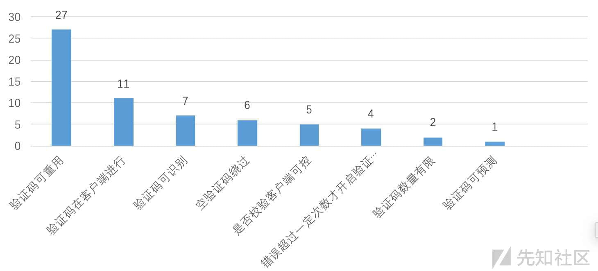
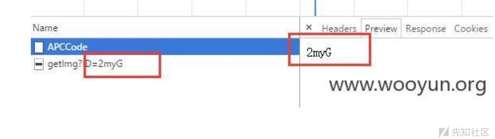
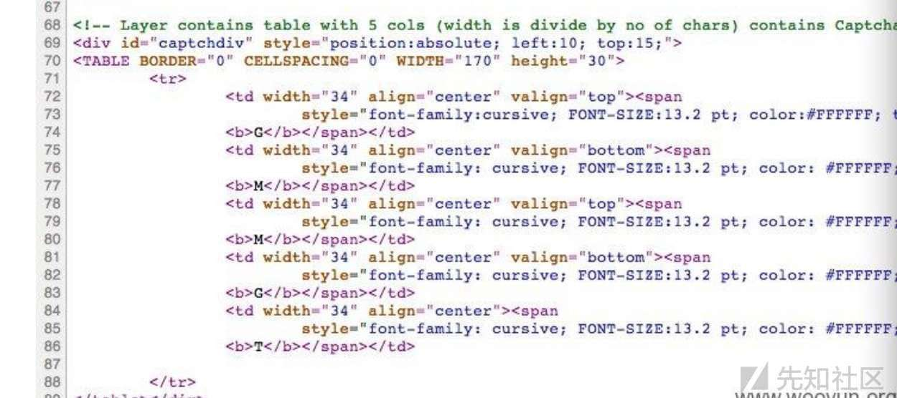
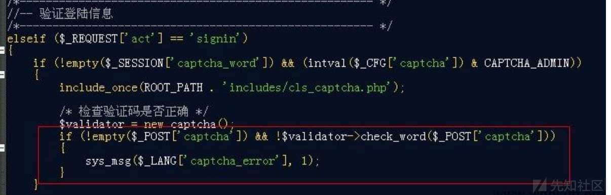
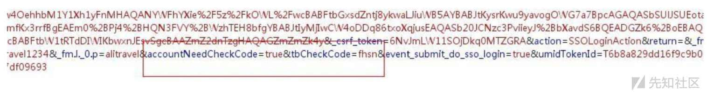
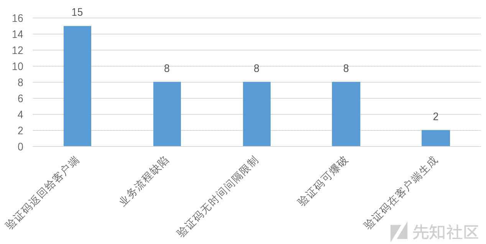
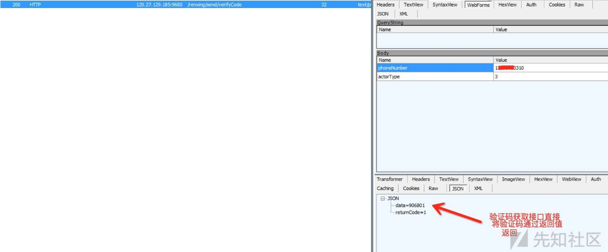

细说验证码安全 —— 测试思路大梳理

- - -

## 细说验证码安全 —— 测试思路大梳理

### 1 前言

在安全领域，验证码主要分为两大类：操作验证码 和 身份验证码

虽然都是验证码，但是这两者所承担的职责却完全不同。

操作验证码，比如登录验证码，主要用来 区分人与机器，在某种程度上属于图灵测试

身份验证码，主要用来判断账号归属人，解决信任问题，所以更恰当的叫法是 认证码

由于两者的分工和定位不同，所衍生出的安全问题、所关注的安全点也有所不同。

本文将乌云中所有验证码相关案例提炼、分析并汇总，得出一些可重用的方法和经验。

希望本文能给读者带来一些微小的帮助，当你遇到验证码相关业务时，能有一个比较完整的测试和审计思路。

PS：在这一过程中，我居然发现，乌云中的验证码的主要案例类型，与我平时所遇到的案例类型，基本是大致相同的（8 大类和 5 大类）

原来各地的程序员犯的错都是类似的呀 :)

### 2 操作验证码安全

操作验证码，主要是为了解决三个问题：

1、账户暴力破解

2、高频次的接口访问

3、敏感操作二次确认 (CSRF)

实际上这三个问题，都属于 人机区分问题，即 这个操作、请求到底是不是人为地、自愿地发出的？

验证码安全，围绕下面几点展开：

1、验证码可重用（特定账户暴力破解、CSRF）

2、验证码可识别（特定账户暴力破解）

3、验证码在客户端生成、显示、校验（特定账户暴力破解、CSRF）

4、空验证码绕过（特定账户暴力破解、CSRF）

5、验证码数量有限（特定账户暴力破解）

6、是否校验客户端可控（特定账户暴力破解、CSRF）

7、验证码可预测（特定账户暴力破解）

8、错误超过一定次数才开启验证码（撞库）

我将乌云上所有的验证码案例汇总分析，共有 63 个相关案例，得到如下统计结果：

[](https://xzfile.aliyuncs.com/media/upload/picture/20190815234732-feb4601e-bf73-1.jpeg)

#### 0x01 验证码可重用

这是验证码安全里最常见的一类安全问题，也是最容易遗漏的一类

一般来说，验证码是与 Session 绑定的，Session 生成时，往往也伴随着验证码的生成和绑定。

在访问页面时，接口的请求和验证码的生成通常是异步进行的，这使得两个功能变得相对独立。也就意味着我们如果仅请求接口，而不触发验证码的生成，那么验证码就不会变化。

并且在考虑安全时，开发人员的关注点往往在 验证码校验 是否通过，通过则进入业务流程，不通过则重新填写，而忽视了 这个用户是否按照既定的业务流程在走（接口访问与验证码生成是否同时进行），验证码是否被多次使用了。

理论上来讲，任何验证码只能使用一次或几次，否则就可能导致安全问题

-   案例 1（验证码输入正确时，未销毁重置）

当用户输入正确的验证码时，程序认为其通过了校验，直接进入了业务流程，忽视了验证码销毁重置的问题。

我们可以在输入了正确验证码后，不断重用这一验证码，这导致了 特定账户暴力破解的问题

WooYun 这方面的案例有 27 个

```plain
http://www.anquan.us/static/bugs/wooyun-2015-0116594.html 验证正确，未销毁
http://www.anquan.us/static/bugs/wooyun-2016-0169672.html 正确，未销毁
http://www.anquan.us/static/bugs/wooyun-2015-0164315.html 正确，未销毁
http://www.anquan.us/static/bugs/wooyun-2015-0111128.html 正确，未销毁
http://www.anquan.us/static/bugs/wooyun-2015-0110497.html 校验正确后，未销毁
http://www.anquan.us/static/bugs/wooyun-2015-0102697.html 校验正确后，未销毁
http://www.anquan.us/static/bugs/wooyun-2015-099708.html  校验正确后，未销毁
http://www.anquan.us/static/bugs/wooyun-2015-093065.html  校验正确后，未销毁
http://www.anquan.us/static/bugs/wooyun-2014-087890.html  错误，未销毁，可爆破
http://www.anquan.us/static/bugs/wooyun-2014-085942.html  校验正确后，未销毁
http://www.anquan.us/static/bugs/wooyun-2014-084180.html  同上
http://www.anquan.us/static/bugs/wooyun-2014-083092.html  同上
http://www.anquan.us/static/bugs/wooyun-2014-083274.html  同上
http://www.anquan.us/static/bugs/wooyun-2014-082783.html  同上
http://www.anquan.us/static/bugs/wooyun-2014-074661.html
http://www.anquan.us/static/bugs/wooyun-2014-070959.html
http://www.anquan.us/static/bugs/wooyun-2014-056990.html  输入错误时销毁，正确时不销毁
http://www.anquan.us/static/bugs/wooyun-2014-050862.html
http://www.anquan.us/static/bugs/wooyun-2014-049064.html
http://www.anquan.us/static/bugs/wooyun-2013-046547.html  异步机制请求验证码，未销毁
http://www.anquan.us/static/bugs/wooyun-2013-028024.html  同上
http://www.anquan.us/static/bugs/wooyun-2013-025053.html  未销毁
http://www.anquan.us/static/bugs/wooyun-2013-020460.html
http://www.anquan.us/static/bugs/wooyun-2012-013915.html  未销毁
http://www.anquan.us/static/bugs/wooyun-2012-06226.html
http://www.anquan.us/static/bugs/wooyun-2011-03450.html
```

-   案例 2（验证码输入错误时，未销毁）

当用户输入错误的验证码，而程序没有将验证码重置时，也会存在安全隐患

不过验证码的爆破，有什么意义呢？我们本来就可以看到呀

当一个敏感操作的 CSRF 存在验证码防御，且验证码比较弱时，我们就可以用 js 写脚本来爆破，绕过防御

#### 0x02 验证码可识别

-   案例 1（验证码过于简单）

这个属于最简单的验证码，过于简单、清晰、可识别性高，可以编写程序进行识别，导致验证码防御体系失效

WooYun 中共有 7 个类似案例：

```plain
http://www.anquan.us/static/bugs/wooyun-2016-0204186.html
http://www.anquan.us/static/bugs/wooyun-2016-0194576.html
http://www.anquan.us/static/bugs/wooyun-2016-0176919.html
http://www.anquan.us/static/bugs/wooyun-2015-0120388.html
http://www.anquan.us/static/bugs/wooyun-2012-012722.html
http://www.anquan.us/static/bugs/wooyun-2012-011765.html
http://www.anquan.us/static/bugs/wooyun-2012-010851.html
```

实际上，比这个更难识别，更复杂的验证码，也有一些准确率较高的识别方法，我们在测试时把握好效果与成本的平衡即可

#### 0x03 客户端生成/显示/校验

-   案例 1（客户端生成验证码文本，然后在服务端请求对应的 img）

程序在客户端生成验证码文本，然后向服务端请求该文本对应的 img，导致我们在客户端直接拿到验证码

[](https://xzfile.aliyuncs.com/media/upload/picture/20190815234800-0f021132-bf74-1.jpeg)

程序在客户端生成验证码文本，然后加图层生成 img

[](https://xzfile.aliyuncs.com/media/upload/picture/20190815234821-1b855cca-bf74-1.jpeg)

-   案例 2（客户端生成验证码，并且输出到 HTML 标签中）

程序在客户端生成验证码，并且输出到 form 表单里的 html 标签中，可能是为了方便校验？

WooYun 中共有 5 个类似案例：

```plain
http://www.anquan.us/static/bugs/wooyun-2015-0161823.html
http://www.anquan.us/static/bugs/wooyun-2015-0146767.html
http://www.anquan.us/static/bugs/wooyun-2015-099909.html
http://www.anquan.us/static/bugs/wooyun-2012-06634.html
http://www.anquan.us/static/bugs/wooyun-2012-012829.html
https://xz.aliyun.com/t/4487
```

-   案例 3（服务端生成验证码，但将明文文本返回给了客户端）

验证码生成之后，向客户端返回了验证码文本（Cookie、body）

WooYun 中共有 6 个类似案例：

```plain
http://www.anquan.us/static/bugs/wooyun-2013-023090.html
http://www.anquan.us/static/bugs/wooyun-2012-010524.html
http://www.anquan.us/static/bugs/wooyun-2012-05151.html
http://www.anquan.us/static/bugs/wooyun-2012-03967.html
http://www.anquan.us/static/bugs/wooyun-2014-075186.html
http://www.anquan.us/static/bugs/wooyun-2014-073811.html
https://xz.aliyun.com/t/4533
```

#### 0x04 空验证码绕过

如果你的代码是这样写的，那就会存在安全问题

```plain
if isset($_POST['captcha'])
{
    ....
}

login();
```

当验证码为空时，不进入验证码判断流程，直接进入业务逻辑

[](https://xzfile.aliyuncs.com/media/upload/picture/20190815234851-2d7fb0ce-bf74-1.jpeg)

WooYun 中有 6 个类似案例：

```plain
http://www.anquan.us/static/bugs/wooyun-2015-0150406.html
http://www.anquan.us/static/bugs/wooyun-2013-028061.html
http://www.anquan.us/static/bugs/wooyun-2013-025065.html
http://www.anquan.us/static/bugs/wooyun-2012-014224.html
http://www.anquan.us/static/bugs/wooyun-2012-08287.html
http://www.anquan.us/static/bugs/wooyun-2014-049531.html
```

#### 0x05 验证码数量有限

当程序使用静态的图片，而不是动态生成验证码时，图片的数量将是有限的。

我们可以将其全部取回并计算 md5，以此绕过验证码机制。

WooYun 中有 2 个类似案例，之前的 12306 也属于这种情况

```plain
http://www.anquan.us/static/bugs/wooyun-2015-0102178.html
http://www.anquan.us/static/bugs/wooyun-2012-07413.html
```

#### 0x06 是否校验可控

天才才能写出来的验证码校验机制，请求中存在一个字段，来决定是否进行校验，修改为 false(0) 即可

[](https://xzfile.aliyuncs.com/media/upload/picture/20190815234904-35459b02-bf74-1.jpeg)

WooYun 中有 5 个类似案例

```plain
http://www.anquan.us/static/bugs/wooyun-2014-071289.html
http://www.anquan.us/static/bugs/wooyun-2013-034367.html
http://www.anquan.us/static/bugs/wooyun-2013-026219.html
http://www.anquan.us/static/bugs/wooyun-2012-014563.html
http://www.anquan.us/static/bugs/wooyun-2014-082981.html
```

#### 0x07 超过次数才开启验证码

接口在登录错误超过一定次数后才会开启验证码，这种机制要么是基于 ip 判断，要么就是基于 session 判断，要么是基于账号判断

-   案例 1（基于 session）

如果是基于 Session 判断，我们清空 session 即可绕过。

WooYun 中有 1 个类似案例

```plain
http://www.anquan.us/static/bugs/wooyun-2015-0114450.html
```

-   案例 2（基于 ip）

如果是基于 ip 判断，我们可以尝试 ip 是否可以伪造，或者使用代理池

WooYun 中有 1 个类似案例

```plain
http://www.anquan.us/static/bugs/wooyun-2014-080327.html
```

-   案例 3（基于账号）

服务端的限制仅针对于特定账号，比如某账户错误 5 次以上开启验证码。

这种情况下虽然无法暴力破解特定账户，但是仍然可以实施撞库攻击

WooYun 中有 2 个类似案例

```plain
http://www.anquan.us/static/bugs/wooyun-2015-0149748.html
http://www.anquan.us/static/bugs/wooyun-2016-0193985.html
```

#### 0x08 验证码可预测

当验证码与时间戳等因素强相关时，就不再具有随机性的属性，导致验证码形同虚设。

WooYun 中有 1 个类似案例

```plain
http://www.anquan.us/static/bugs/wooyun-2015-0115041.html
```

### 3 身份验证码安全

身份验证码主要是为了验证操作人身份，然后进行 密码修改、账户变更、重要操作等功能。

而这类验证码主要牵扯到 5 类安全问题：

1、验证码返回给客户端

2、业务流程缺陷

3、验证码无时间间隔限制

4、验证码可爆破

5、验证码在客户端生成

将乌云中的案例去重、去无关案例后，有 41 个身份验证码的案例，分布如下：

[](https://xzfile.aliyuncs.com/media/upload/picture/20190815234926-426d5edc-bf74-1.jpeg)

#### 0x01 验证码返回客户端

服务器将验证码明文返回给客户端，本来觉得这种错误比较低级，没想到这样的案例还挺多。

大致有三种可能，一种是验证码校验在客户端进行，这种错误太低级了，可能性不大。

另一种情况：

1、客户点击获取验证码

2、程序生成一个随机验证码，将参数拼接之后，提交给短信 API

3、客户端需要判断是否发送成功，所以程序将短信 API 返回的内容交给了客户端

作为一个短信 API，很有可能会在 response 中包含了发送的短信内容，导致验证码的泄露

最后一种情况，开发写 API 的时候，为了方便调试，返回了这些信息，后来忘删了...

-   案例

[](https://xzfile.aliyuncs.com/media/upload/picture/20190815234949-50522776-bf74-1.jpeg)

WooYun 中有 15 个类似案例

```plain
http://www.anquan.us/static/bugs/wooyun-2016-0179467.html
http://www.anquan.us/static/bugs/wooyun-2016-0172266.html
http://www.anquan.us/static/bugs/wooyun-2015-0139468.html
http://www.anquan.us/static/bugs/wooyun-2014-085124.html
http://www.anquan.us/static/bugs/wooyun-2014-082114.html
http://www.anquan.us/static/bugs/wooyun-2014-078687.html
http://www.anquan.us/static/bugs/wooyun-2014-066510.html
http://www.anquan.us/static/bugs/wooyun-2014-049813.html
http://www.anquan.us/static/bugs/wooyun-2014-049547.html
http://www.anquan.us/static/bugs/wooyun-2013-042464.html
http://www.anquan.us/static/bugs/wooyun-2013-024195.html
http://www.anquan.us/static/bugs/wooyun-2013-022009.html
http://www.anquan.us/static/bugs/wooyun-2013-019668.html
http://www.anquan.us/static/bugs/wooyun-2014-085124.html
http://www.anquan.us/static/bugs/wooyun-2014-082114.html
```

#### 0x02 业务流程缺陷

涉及到验证码的业务，通常都分为多步进行，比如 修改手机号功能：认证原手机号 -> 填写新手机号

当下一步的业务，没有校验上一步的认证是否成功时，就会存在逻辑缺陷绕过。

-   案例 1（修改 response 绕过）

填写手机验证码时填任意值，然后修改请求的 response 包中的标识字段，将其修改为 true，即可绕过

实际上这种问题，本质上也是业务流程的逻辑缺陷问题。

虽然验证码的校验在服务端进行，但是下一步的业务，并没有校验上一步的认证是否成功，两者之间是独立的

这就导致我们可以修改 response，让客户端直接跳入下一次逻辑，我们也可以审计源码，直接找出下一步的 url

WooYun 中有 5 个类似案例

```plain
http://www.anquan.us/static/bugs/wooyun-2015-0151201.html
http://www.anquan.us/static/bugs/wooyun-2015-0120951.html
http://www.anquan.us/static/bugs/wooyun-2015-0119252.html
http://www.anquan.us/static/bugs/wooyun-2015-0104509.html
http://www.anquan.us/static/bugs/wooyun-2015-090379.html
```

-   案例 2（手机号合法性）

在验证码校验过程中，程序应严格检查对应关系，即 接收验证码的手机号，是否是该账户对应的手机号

如果不存在这处对应关系校验，则会衍生出各种逻辑问题，比如用自己的手机通过验证，然后修改其它人的信息

其实这种情况下，也是存在业务流程缺陷的问题。下一步的业务，并没有校验上一步业务中，手机号是否是属于该账户的

```plain
http://www.anquan.us/static/bugs/wooyun-2015-0102205.html
http://www.anquan.us/static/bugs/wooyun-2011-03099.html
http://www.anquan.us/static/bugs/wooyun-2014-080315.html
```

#### 0x03 验证码无时间间隔限制

服务端对用户请求短信的频次没有时间间隔限制，或者是在客户端限制，可导致短信资源滥用

没有基于 session、ip、账户的限制，属于完全无限制的情况

```plain
http://www.anquan.us/static/bugs/wooyun-2012-010102.html
http://www.anquan.us/static/bugs/wooyun-2012-010556.html
http://www.anquan.us/static/bugs/wooyun-2012-04876.html
http://www.anquan.us/static/bugs/wooyun-2012-04771.html
http://www.anquan.us/static/bugs/wooyun-2012-04166.html
http://www.anquan.us/static/bugs/wooyun-2012-04022.html
http://www.anquan.us/static/bugs/wooyun-2011-01188.html
http://www.anquan.us/static/bugs/wooyun-2011-03485.html
```

#### 0x04 验证码可爆破

-   案例 1（完全无限制）

当验证码太弱（4-6 位数字），且服务器没有错误次数限制时，则会存在可爆破的问题

WooYun 中有 7 个类似案例

```plain
http://www.anquan.us/static/bugs/wooyun-2015-0155994.html
http://www.anquan.us/static/bugs/wooyun-2013-017242.html
http://www.anquan.us/static/bugs/wooyun-2013-016896.html
http://www.anquan.us/static/bugs/wooyun-2012-016179.html
http://www.anquan.us/static/bugs/wooyun-2013-031605.html
http://www.anquan.us/static/bugs/wooyun-2013-040908.html
http://www.anquan.us/static/bugs/wooyun-2012-012377.html
```

-   案例 2（限制覆盖不全）

以重置密码业务为例：用户输入手机验证码 -> 用户提交新密码

为了解决业务流程绑定的问题，通常两个步骤的参数中都会带有验证码。

开发人员往往只注意到第一个接口，而忽视了第二个接口。此时，在第一个页面中使用自己的手机号通过验证，第二个页面中修改为他人手机号并爆破

WooYun 中有 1 个类似案例：

```plain
http://www.anquan.us/static/bugs/wooyun-2015-0133289.html
```

#### 0x05 验证码在客户端生成

这种情况下，客户端生成一个验证码发送给服务端，服务端将这个验证码拼接，然后请求短信 API 发送短信

天才才能想出来的办法

WooYun 中有 2 个类似案例

```plain
http://www.anquan.us/static/bugs/wooyun-2014-086716.html
http://www.anquan.us/static/bugs/wooyun-2013-022378.html
```

### 4 参考

几乎所有漏洞案例都来自乌云、个别案例来自先知 :)

细说验证码安全.pdf (1.048 MB) [下载附件](https://xzfile.aliyuncs.com/upload/affix/20190815235348-def019d4-bf74-1.pdf)
