# [翻译]-用调用堆栈揭开攻击的帷幕 - 先知社区

\[翻译\]-用调用堆栈揭开攻击的帷幕

- - -

原文地址：[https://www.elastic.co/security-labs/peeling-back-the-curtain-with-call-stacks](https://www.elastic.co/security-labs/peeling-back-the-curtain-with-call-stacks)

## 介绍

Elastic Defend 提供超过 [550 条规则](https://github.com/elastic/protections-artifacts/tree/main/behavior/rules)（并且还在不断增加），用于实时检测和阻止终端上的恶意行为。我们最近[添加了内核调用堆栈扩充](https://www.elastic.co/security-labs/upping-the-ante-detecting-in-memory-threats-with-kernel-call-stacks)检测，以便为事件和警报提供额外的检测内容。堆栈调用在行为保护方面是三赢的，同时改善了误报、漏报和警报的可解释性。在本文中，我们将向你展示如何实现这三个目标，以及如何利用堆栈调用来更好地了解你的环境中遇到的任何警报。

## 什么是调用堆栈？

当运行函数 A 的线程调用函数 B 时，CPU 会自然地将当前指令的地址（在 函数A 里面的指令）保存到称为堆栈的线程特定内存区域。这个被保存的指针称为返回地址 - 一旦 函数B 运行完，这段被占用的内存将在执行中恢复。如果 B 调用第三个函数 C，则 B 中的返回地址也将保存到堆栈中。这些返回地址可以通过称为[堆栈遍历](https://learn.microsoft.com/en-us/windows/win32/debug/capturestackbacktrace)的过程进行回收，该过程会重建导致当前线程状态的函数调用序列。堆栈遍历按时间倒序列出返回地址，因此最新的函数始终位于顶部。

例如，在 Windows 中，当我们双击 **notepad.exe** 时，会调用以下一系列函数：

-   绿色部分与操作系统执行的基本线程初始化有关，通常在所有操作（文件、注册表、进程、库等）中都是相同的。
-   红色部分是用户代码;它通常由多个模块组成，并提供如何实现流程创建操作的大致详细信息
-   蓝色部分是 Win32 和本机 API 层;这是特定于操作的，包括转发操作详细信息以在内核模式下有效执行之前的最后 2 到 3 个中间 Windows 模块

以下屏幕截图描述了此执行链的调用堆栈：  
[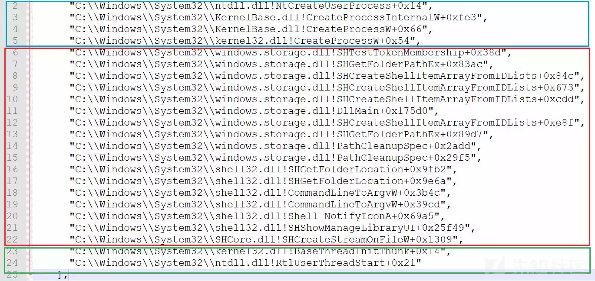](https://xzfile.aliyuncs.com/media/upload/picture/20240301162356-0bf060ea-d7a5-1.webp)

以下是使用 **notepad.exe** 创建文件的示例，我们可以看到类似的模式：

-   蓝色部分列出了在将创建文件操作转发到内核模式驱动程序以进行有效执行之前的最后一个用户模式中间 Windows API
-   红色部分包括 **user32.dll** 和 **notepad.exe** 中的函数，这些函数表明此文件操作可能是通过 GUI 启动的
-   绿色部分表示初始线程初始化

[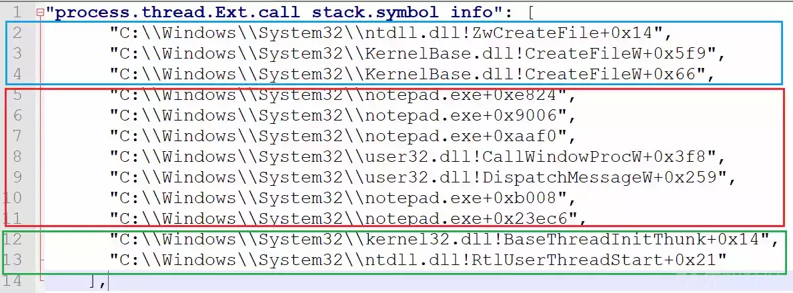](https://xzfile.aliyuncs.com/media/upload/picture/20240301162410-146fa6a4-d7a5-1.webp)

## 事件的可解释性

除了使用堆栈调用来查找已知的错误之外，例如具有 RWX 权限的无支持内存区域，这可能是先前代码注入的剩余。堆栈调用提供非常低级别的可见性，通常比日志可以提供更深入的见解。

例如，在通过 WMI 寻找由 WmiPrvSe.exe 启动的可疑进程执行时，您会发现 notepad.exe 的以下实例：

[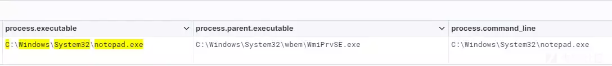](https://xzfile.aliyuncs.com/media/upload/picture/20240301162420-1a4fbfbe-d7a5-1.webp)

查看标准事件日志字段，您可能觉得它是使用 Win32\_Process 类用 wmic.exe 进程调用 create notepad.exe 命令启动的。但是，事件详细信息描述了一系列模块和功能：

[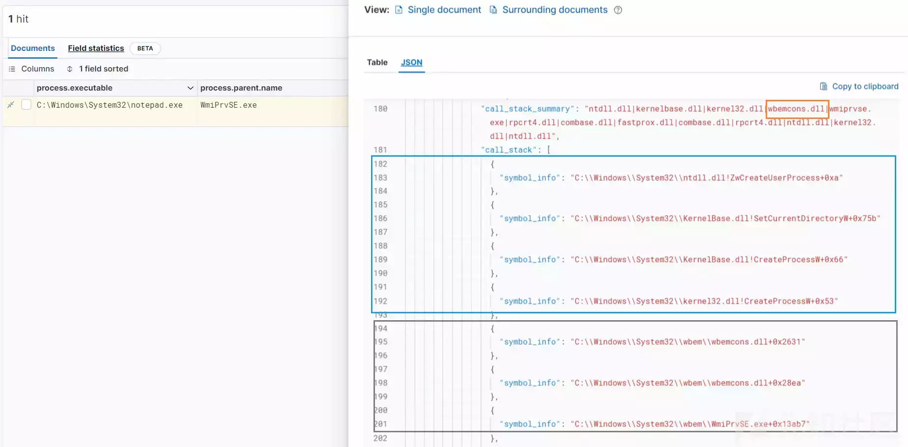](https://xzfile.aliyuncs.com/media/upload/picture/20240301162432-216eb160-d7a5-1.webp)

蓝色部分描述了标准的接口 CreateProcess Windows API，而红色部分突出显示了更好的信息，因为我们可以看到在第一次调用 CreateProcessW 之前的 DLL 是wbemcons.dll的，并且在检查其属性时，我们可以看到它与 WMI 事件使用者相关。我们可以得出结论，此notepad.exe实例可能与 WMI 事件订阅有关。这将需要具体的事件响应步骤来缓解 WMI 持久性机制。

[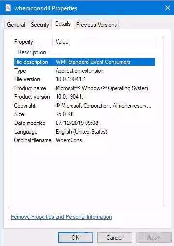](https://xzfile.aliyuncs.com/media/upload/picture/20240301162443-28372180-d7a5-1.webp)

另一个很好的例子是 Windows 计划任务。执行时，它们将作为 Schedule 服务的子级生成，该服务在svchost.exe主机进程中运行。现代 Windows 11 计算机可能运行了 50 个或更多svchost.exe进程。幸运的是，Schedule 服务有一个特定的进程参数 -s Schedule，用于区分它：

[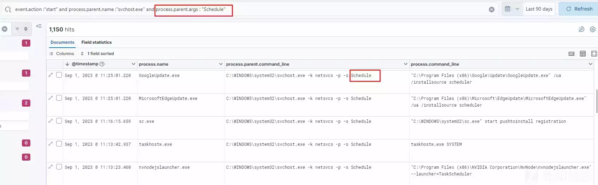](https://xzfile.aliyuncs.com/media/upload/picture/20240301162454-2e7c0dd0-d7a5-1.webp)

在较旧的 Windows 版本中，计划任务服务是网络服务组的成员，并作为共享svchost.exe实例的 netsvcs 的组件执行。在这些旧版本中，此进程的所有子项不是都必须是计划任务：

[](https://xzfile.aliyuncs.com/media/upload/picture/20240301162507-363b5c1a-d7a5-1.webp)

检查两个版本上的调用堆栈，我们可以看到与 CreateProcess 调用相邻的模块是相同ubpm.dll（Unified Background Process Manager DLL），执行的导出函数是ubpm.dll!UbpmOpenTriggerConsumer。

[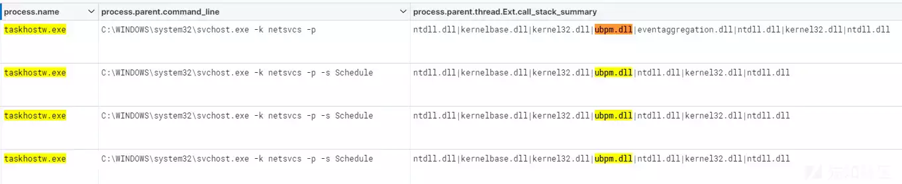](https://xzfile.aliyuncs.com/media/upload/picture/20240301162520-3e451b76-d7a5-1.webp)

使用以下 KQL 查询，我们可以在两个版本上搜寻任务执行：

```plain
event.action :"start" and 
process.parent.name :"svchost.exe" and process.parent.args : netsvcs and 
process.parent.thread.Ext.call_stack_summary : *ubpm.dll*
```

[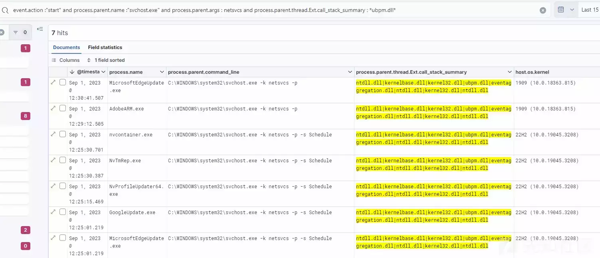](https://xzfile.aliyuncs.com/media/upload/picture/20240301162538-48eef56a-d7a5-1.webp)

另一个有趣的例子是，当用户双击使用 Windows 资源管理器打开的 ZIP 文档中的脚本文件时。查看进程树，您将看到 explorer.exe 是父进程，子进程是脚本解释器进程，如 wscript.exe 或 cmd.exe。

此进程树可能会与用户从文件系统上的任何位置双击脚本文件相混淆，这并不是很可疑。但是，如果我们检查调用堆栈，我们可以看到父堆栈指向 zipfld.dll（Zipped Folders Shell Extension）：

[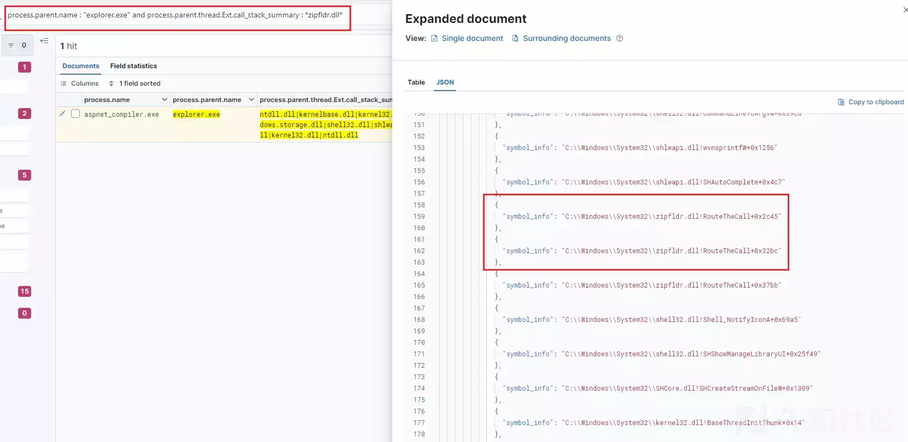](https://xzfile.aliyuncs.com/media/upload/picture/20240301205604-107739b0-d7cb-1.webp)

## 检测实例

现在，我们已经更好地了解了如何使用调用堆栈来更好地解读事件，让我们探讨每个事件类型的一些高级检测示例。

### 进程

#### 通过反射创建可疑进程

[Dirty Vanity](https://www.deepinstinct.com/blog/dirty-vanity-a-new-approach-to-code-injection-edr-bypass) 是最近的一种代码注入技术，它滥用process forking在现有进程的副本中执行 shellcode。当process forking时，OS 会复制现有进程，包括其地址空间和其中的任何[可继承](https://learn.microsoft.com/en-us/windows/win32/sysinfo/handle-inheritance)句柄。

执行时，Dirty Vanity 将fork目标进程的实例（已经运行或牺牲进程），然后注入其中。使用进程创建通知[回调](https://learn.microsoft.com/en-us/windows-hardware/drivers/ddi/ntddk/nc-ntddk-pcreate_process_notify_routine_ex)函数不会记录被fork的进程，因为不会执行fork进程的初始线程。但是在这种注入技术的情况下，被fork的进程会被注入并开启一个线程，这将触发具有以下调用堆栈的进程开启事件日志：

[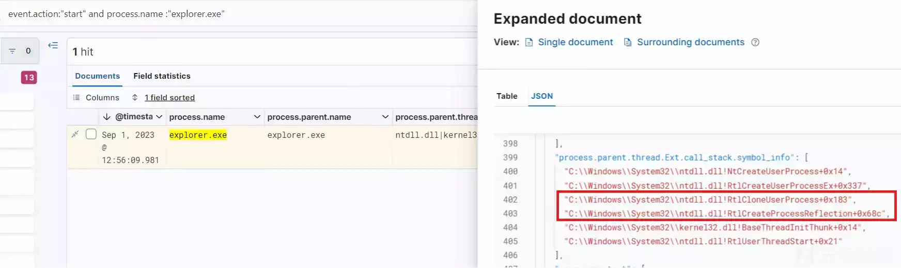](https://xzfile.aliyuncs.com/media/upload/picture/20240301205615-167eeea2-d7cb-1.webp)

我们可以看到对 **RtlCreateProcessReflection** 和 **RtlCloneUserProcess** 的调用来fork进程。现在我们知道这是一个fork的过程，下一个问题是“这在正常情况下很常见吗？虽然从诊断上看，这种行为的出现是常见且独立的，这并不是恶意行为的强烈信号。进一步检查被fork的进程是否执行任何网络连接、加载 DLL 或生成不太常见且用于良好检测的子进程：

```plain
// EQL detecting a forked process spawning a child process - very suspicious

process where event.action == "start" and

descendant of 
   [process where event.action == "start" and 
   _arraysearch(process.parent.thread.Ext.call_stack, $entry, 
   $entry.symbol_info: 
    ("*ntdll.dll!RtlCreateProcessReflection*", 
    "*ntdll.dll!RtlCloneUserProcess*"))] and

not (process.executable : 
      ("?:\\WINDOWS\\SysWOW64\\WerFault.exe", 
      "?:\\WINDOWS\\system32\\WerFault.exe") and
     process.parent.thread.Ext.call_stack_summary : 
      "*faultrep.dll|wersvc.dl*")
// EQL detecting a forked process loading a network DLL 
//  or performs a network connection - very suspicious

sequence by process.entity_id with maxspan=1m
 [process where event.action == "start" and
  _arraysearch(process.parent.thread.Ext.call_stack, 
  $entry, $entry.symbol_info: 
    ("*ntdll.dll!RtlCreateProcessReflection*", 
    "*ntdll.dll!RtlCloneUserProcess*"))]
 [any where
  (
   event.category : ("network", "dns") or 
   (event.category == "library" and 
    dll.name : ("ws2_32.dll", "winhttp.dll", "wininet.dll"))
  )]
```

下面是一个fork的explore.exe并从fork的 explorer.exe 实例生成cmd.exe执行shellcode 的示例：

[](https://xzfile.aliyuncs.com/media/upload/picture/20240301205720-3d42bc30-d7cb-1.webp)

[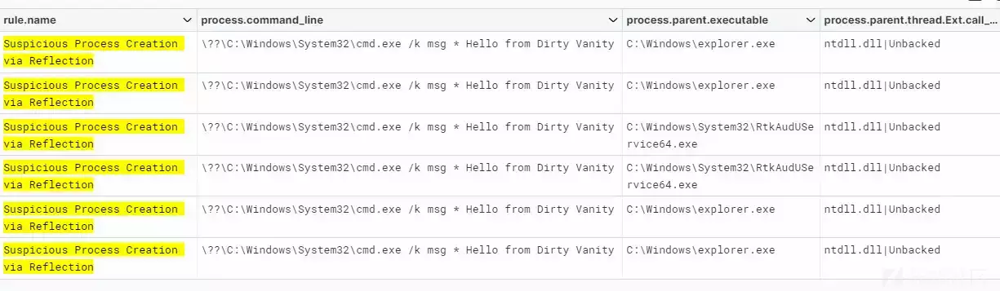](https://xzfile.aliyuncs.com/media/upload/picture/20240301205737-47bf7e82-d7cb-1.webp)

### 使用汇编字节码进行直接系统调用

进程事件的第二个也是最后一个示例是通过直接系统调用创建进程。这直接使用 syscall 指令，而不是调用 NtCreateProcess API。攻击者可以使用此方法来避免依赖用户层 API 挂钩的安全产品（Elastic Defend 没法Bypass）：

```plain
process where event.action : "start" and 

// EQL detecting a call stack not ending with ntdll.dll 
not process.parent.thread.Ext.call_stack_summary : "ntdll.dll*" and 

/* last call in the call stack contains bytes that execute a syscall
 manually using assembly <mov r10,rcx, mov eax,ssn, syscall> */

_arraysearch(process.parent.thread.Ext.call_stack, $entry,
 ($entry.callsite_leading_bytes : ("*4c8bd1b8??????000f05", 
 "*4989cab8??????000f05", "*4c8bd10f05", "*4989ca0f05")))
```

当调用堆栈中的最后的内存区域无法被正常访问并包含以 syscall 指令 （0F05） 结尾的汇编字节时，此示例将匹配：

[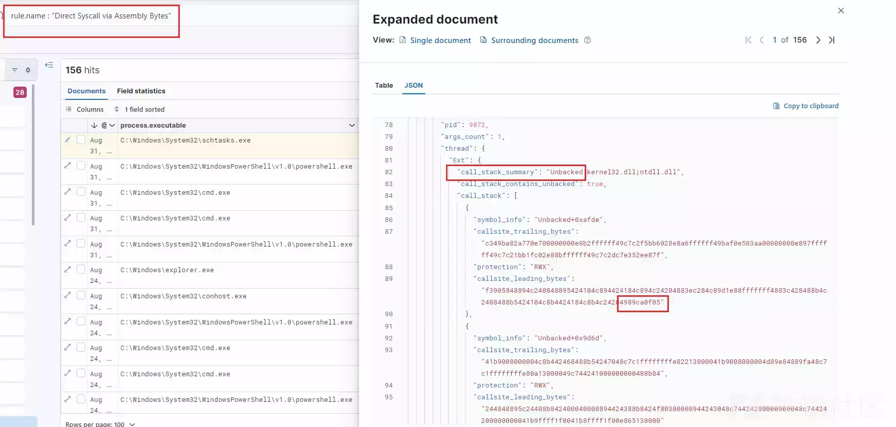](https://xzfile.aliyuncs.com/media/upload/picture/20240301205756-5304dac6-d7cb-1.webp)

## 结合文件结构进行利用

### 可疑的 Microsoft Office 嵌入式对象

下面的匹配规则是鉴别 Microsoft Office 进程从嵌入式 OLE 流编写的可疑文件扩展名，恶意文档经常使用这些文件扩展名来删除初始访问的有效负载。

[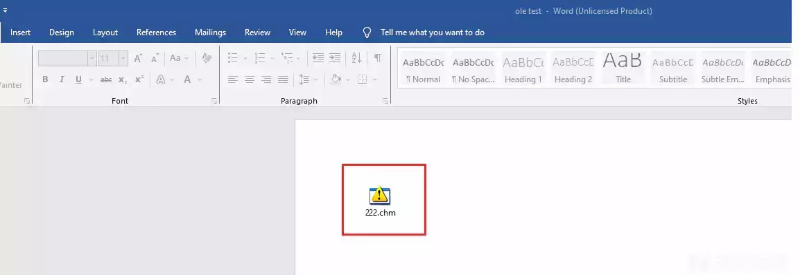](https://xzfile.aliyuncs.com/media/upload/picture/20240301205810-5b8ad2d6-d7cb-1.webp)

```plain
// EQL detecting file creation event with call stack indicating 
// OleSaveToStream call to save or load the embedded OLE object

file where event.action != "deletion" and 

process.name : ("winword.exe", "excel.exe", "powerpnt.exe") and

_arraysearch(process.thread.Ext.call_stack, $entry, $entry.symbol_info:
 ("*!OleSaveToStream*", "*!OleLoad*")) and
(
 file.extension : ("exe", "dll", "js", "vbs", "vbe", "jse", "url", 
 "chm", "bat", "mht", "hta", "htm", "search-ms") or

 /* PE & HelpFile */
 file.Ext.header_bytes : ("4d5a*", "49545346*")
 )
```

匹配示例：

[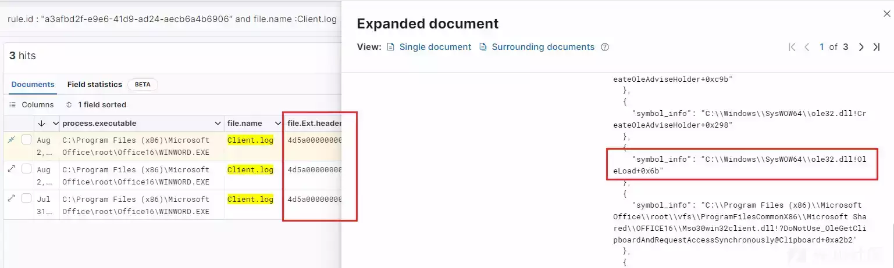](https://xzfile.aliyuncs.com/media/upload/picture/20240301205828-65c99e08-d7cb-1.webp)

### 从未被支持的内存中进行可疑的重命名文件行为

某些勒索软件可能会在开始其加密进程之前注入到已签名的进程中。文件重命名和修改事件似乎源自受信任的进程，可能会绕过一些将签名进程排除为假定误报的启发式检测。以下 KQL 查询从已签名的二进制文件和可疑调用堆栈中查找文档的文件重命名：

```plain
file where event.action : "rename" and 

process.code_signature.status : "trusted" and file.extension != null and 

file.Ext.original.name : ("*.jpg", "*.bmp", "*.png", "*.pdf", "*.doc", 
"*.docx", "*.xls", "*.xlsx", "*.ppt", "*.pptx") and

not file.extension : ("tmp", "~tmp", "diff", "gz", "download", "bak", 
"bck", "lnk", "part", "save", "url", "jpg",  "bmp", "png", "pdf", "doc", 
"docx", "xls", "xlsx", "ppt", "pptx") and 

process.thread.Ext.call_stack_summary :
("ntdll.dll|kernelbase.dll|Unbacked",
 "ntdll.dll|kernelbase.dll|kernel32.dll|Unbacked", 
 "ntdll.dll|kernelbase.dll|Unknown|kernel32.dll|ntdll.dll", 
 "ntdll.dll|kernelbase.dll|Unknown|kernel32.dll|ntdll.dll", 
 "ntdll.dll|kernelbase.dll|kernel32.dll|Unknown|kernel32.dll|ntdll.dll", 
 "ntdll.dll|kernelbase.dll|kernel32.dll|mscorlib.ni.dll|Unbacked", 
 "ntdll.dll|wow64.dll|wow64cpu.dll|wow64.dll|ntdll.dll|kernelbase.dll|
 Unbacked", "ntdll.dll|wow64.dll|wow64cpu.dll|wow64.dll|ntdll.dll|
 kernelbase.dll|Unbacked|kernel32.dll|ntdll.dll", 
 "ntdll.dll|Unbacked", "Unbacked", "Unknown")
```

以下是 [KNIGHT/CYCLOPS](https://www.bleepingcomputer.com/news/security/knight-ransomware-distributed-in-fake-tripadvisor-complaint-emails/) 勒索软件注入 **explorer.exe**（Windows 资源管理器）的一些匹配示例：

[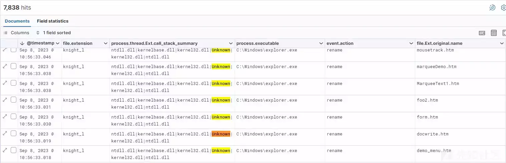](https://xzfile.aliyuncs.com/media/upload/picture/20240301205850-72f0ea00-d7cb-1.webp)

### 通过未签名的服务 DLL 落地的可执行文件

某些类型的恶意软件通过伪装成 Windows 服务 DLL 来保持其不被删除。若要由服务控制管理器识别和管理，服务 DLL 必须导出名为 **ServiceMain** 的函数。下面的 KQL 查询有助于识别创建可执行文件的实例，并且调用堆栈包括 **ServiceMain** 函数。

```plain
event.category : file and 
 file.Ext.header_bytes :4d5a* and process.name : svchost.exe and 
 process.thread.Ext.call_stack.symbol_info :*!ServiceMain*
```

[](https://xzfile.aliyuncs.com/media/upload/picture/20240301205905-7c2e5472-d7cb-1.webp)

## Library

### 已加载未签名的打印监视器驱动程序

以下 EQL 查询标志为打印后台处理程序服务对未签名库的加载，其中调用堆栈指示加载来自 **SplAddMonitor**。攻击者可以使用port monitors在系统启动期间运行攻击者提供的 DLL，以实现持久性或权限提升。

```plain
library where
process.executable : ("?:\\Windows\\System32\\spoolsv.exe", 
"?:\\Windows\\SysWOW64\\spoolsv.exe") and not dll.code_signature.status : 
"trusted" and _arraysearch(process.thread.Ext.call_stack, $entry, 
$entry.symbol_info: "*localspl.dll!SplAddMonitor*")
```

匹配示例：

[](https://xzfile.aliyuncs.com/media/upload/picture/20240301205920-8513763a-d7cb-1.webp)

### 通过 ROP Gadgets的潜在DLL加载

此 EQL 规则鉴定从异常的 **win32u** 或 **ntdll** 偏移量加载DLL。这可能表示有人试图使用面向返回的编程 （ROP） 程序集小工具绕过 API 监视，以从受信任的模块执行系统调用指令。

```plain
library where
// adversaries try to use ROP gadgets from ntdll.dll or win32u.dll 
// to construct a normal-looking call stack

process.thread.Ext.call_stack_summary : ("ntdll.dll|*", "win32u.dll|*") and 

// excluding normal Library Load APIs - LdrLoadDll and NtMapViewOfSection
not _arraysearch(process.thread.Ext.call_stack, $entry, 
 $entry.symbol_info: ("*ntdll.dll!Ldr*", 
 "*KernelBase.dll!LoadLibrary*", "*ntdll.dll!*MapViewOfSection*"))
```

当 [AtomLdr](https://www.kitploit.com/2023/06/atomldr-dll-loader-with-advanced.html) 使用 ROP gadgets从 win32u.dll 加载 DLL 而不是使用 ntdll 的加载库 API（LdrLoadDll 和 NtMapViewOfSection）加载 DLL 时，此示例匹配。

[](https://xzfile.aliyuncs.com/media/upload/picture/20240301205945-93c8e930-d7cb-1.webp)

### 通过 LdrpKernel32 覆盖规避

\[LdrpKernel32（[https://github.com/rbmm/LdrpKernel32DllName）](https://github.com/rbmm/LdrpKernel32DllName%EF%BC%89) 规避是一种有趣的技术，它通过覆盖内存中引用的引导DLL 名称来劫持进程ntdll.dll引导阶段的早期执行，从而强制进程加载恶意 DLL。

```plain
library where 

// BaseThreadInitThunk must be exported by the rogue bootstrap DLL
 _arraysearch(process.thread.Ext.call_stack, $entry, $entry.symbol_info :
  "*!BaseThreadInitThunk*") and

// excluding kernel32 that exports normally exports BasethreadInitThunk
not _arraysearch(process.thread.Ext.call_stack, $entry, $entry.symbol_info
 ("?:\\Windows\\System32\\kernel32.dll!BaseThreadInitThunk*", 
 "?:\\Windows\\SysWOW64\\kernel32.dll!BaseThreadInitThunk*", 
 "?:\\Windows\\WinSxS\\*\\kernel32.dll!BaseThreadInitThunk*", 
 "?:\\Windows\\WinSxS\\Temp\\PendingDeletes\\*!BaseThreadInitThunk*", 
 "\\Device\\*\\Windows\\*\\kernel32.dll!BaseThreadInitThunk*"))
```

匹配示例：  
[](https://xzfile.aliyuncs.com/media/upload/picture/20240301210000-9cbc82d6-d7cb-1.webp)

## 可疑的远程注册表修改

与计划任务示例类似，远程注册表服务托管在 **svchost.exe** 中。我们可以使用调用堆栈通过监视远程注册表服务何时指向可执行文件或脚本文件来检测注册表修改。这可能表示攻击者尝试通过远程配置更改横向移动。

```plain
registry where 

event.action == "modification" and 

user.id : ("S-1-5-21*", "S-1-12-*") and 

 process.name : "svchost.exe" and 

// The regsvc.dll in call stack indicate that this is indeed the 
// svchost.exe instance hosting the Remote registry service

process.thread.Ext.call_stack_summary : "*regsvc.dll|rpcrt4.dll*" and

 (
  // suspicious registry values
  registry.data.strings : ("*:\\*\\*", "*.exe*", "*.dll*", "*rundll32*", 
  "*powershell*", "*http*", "* /c *", "*COMSPEC*", "\\\\*.*") or

  // suspicious keys like Services, Run key and COM
  registry.path :
         ("HKLM\\SYSTEM\\ControlSet*\\Services\\*\\ServiceDLL",
          "HKLM\\SYSTEM\\ControlSet*\\Services\\*\\ImagePath",
          "HKEY_USERS\\*Classes\\*\\InprocServer32\\",
          "HKEY_USERS\\*Classes\\*\\LocalServer32\\",
          "H*\\Software\\Microsoft\\Windows\\CurrentVersion\\Run\\*") or

  // potential attempt to remotely disable a service 
  (registry.value : "Start" and registry.data.strings : "4")
  )
```

此示例在通过远程注册表服务远程修改 Run key 注册表值时匹配：

[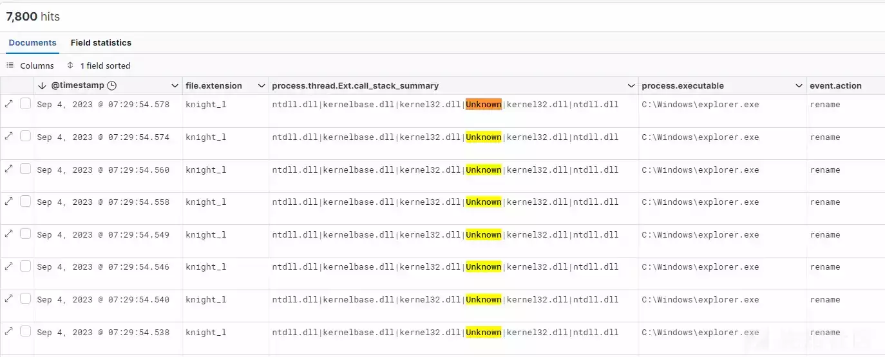](https://xzfile.aliyuncs.com/media/upload/picture/20240301210019-a7f0d6ac-d7cb-1.webp)

## 结论

正如我们所演示的，调用堆栈不仅可用于查找已知的不良行为，还可用于减少标准 EDR 事件中的误报，并简化行为解释。我们在这里提供的示例仅代表了通过对同一数据集应用增强丰富可实现的潜在检测可能性的一小部分。
