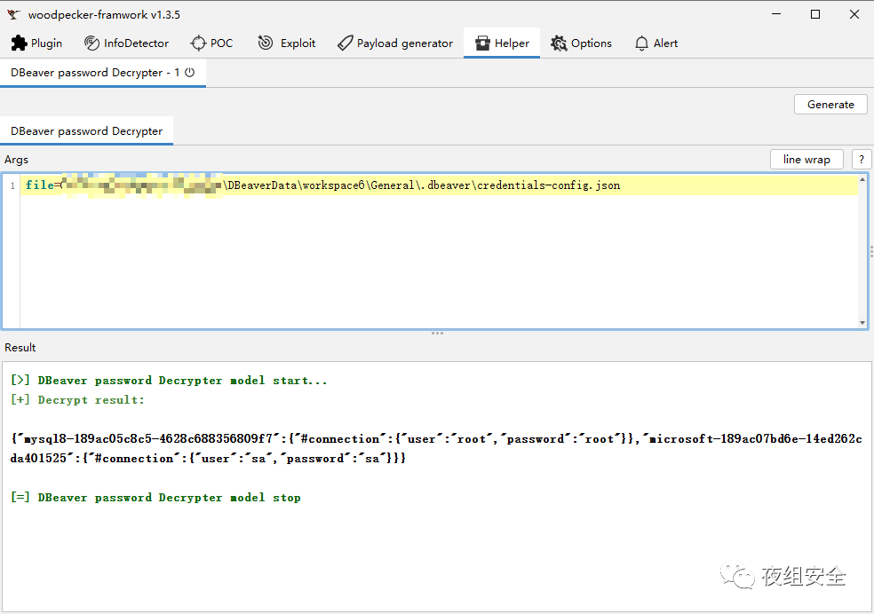

# 解密 DBeaver 数据库软件保存的密码

**01**

**工具介绍**

DBeaver-decrypter 是一款用于解密 DBeaver 数据库软件保存的密码的 woodpecker 插件。

**02**

**工具使用**

**Windows 默认配置**

```plain
 密码文件：
 C:\Users\Administrator\AppData\Roaming\DBeaverData\workspace6\General.dbeaver\credentials-config.json

 连接信息：
 C:\Users\Administrator\AppData\Roaming\DBeaverData\workspace6\General.dbeaver\data-sources.json
```

  

**MacOS 默认配置**

```plain
/Users/<hostname>/Library/DBeaverData/workspace6/General/.dbeaver/credentials-config.json
/Users/<hostname>/Library/DBeaverData/workspace6/General/.dbeaver/data-sources.json
```

**Linux 默认配置**

```plain
/home/<hostname>/.local/share/DBeaverData/workspace6/General/.dbeaver/credentials-config.json
/home/<hostname>/.local/share/DBeaverData/workspace6/General/.dbeaver/data-sources.json
```

  



**03**

**工具下载**

**点击关注下方名片****进入公众号**

**回复关键字【230802****】获取****下载链接**

[↓↓↓](http://mp.weixin.qq.com/s?__biz=Mzk0ODM0NDIxNQ==&mid=2247487536&idx=1&sn=8dbd66e90009f259d645814709f7e96d&chksm=c36854c8f41fdddea6c7a91f5800a25170c6ec85d0fc4e08716fcec88f4759c5f9cd066fb59f&scene=21#wechat_redirect)  
  
  
  
[↑↑↑](http://mp.weixin.qq.com/s?__biz=Mzk0ODM0NDIxNQ==&mid=2247487536&idx=1&sn=8dbd66e90009f259d645814709f7e96d&chksm=c36854c8f41fdddea6c7a91f5800a25170c6ec85d0fc4e08716fcec88f4759c5f9cd066fb59f&scene=21#wechat_redirect)

[↓↓↓](http://mp.weixin.qq.com/s?__biz=Mzk0ODM0NDIxNQ==&mid=2247487534&idx=1&sn=9ec9a1f0ec874bec6f8b781f5651f09e&chksm=c36854d6f41fddc04461252ddd207f250c1bed33536f9a91b315a372248b6a70a7ea1b4040c1&scene=21#wechat_redirect)  
  
  
  
[↑↑↑](http://mp.weixin.qq.com/s?__biz=Mzk0ODM0NDIxNQ==&mid=2247487534&idx=1&sn=9ec9a1f0ec874bec6f8b781f5651f09e&chksm=c36854d6f41fddc04461252ddd207f250c1bed33536f9a91b315a372248b6a70a7ea1b4040c1&scene=21#wechat_redirect)

  

[↓↓↓](http://mp.weixin.qq.com/s?__biz=Mzk0ODM0NDIxNQ==&mid=2247487524&idx=1&sn=2a7be207fe3c2fc121a8b7395aa02a97&chksm=c36854dcf41fddcaff08e17b569e3ab2042e42fc9e26ed1e7c8d6fc34bf065408531edaa5883&scene=21#wechat_redirect)  
  
  
  
[↑↑↑](http://mp.weixin.qq.com/s?__biz=Mzk0ODM0NDIxNQ==&mid=2247487524&idx=1&sn=2a7be207fe3c2fc121a8b7395aa02a97&chksm=c36854dcf41fddcaff08e17b569e3ab2042e42fc9e26ed1e7c8d6fc34bf065408531edaa5883&scene=21#wechat_redirect)
