# 记一次黑名单后缀 + 文件头双重效验的文件上传和 getshell 命令执行绕过 - 先知社区

记一次黑名单后缀 + 文件头双重效验的文件上传和 getshell 命令执行绕过

- - -

开局一个后台签名上传点，通过 fofa 输入 ip 查询，网站架构为 apache+php，操作系统为 window server。f12 全局搜索 png 看了下没有前端效验的 js 的代码，是服务端效验。

[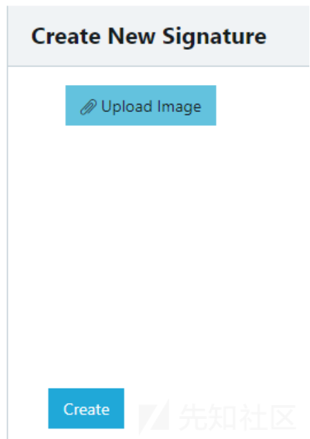](https://xzfile.aliyuncs.com/media/upload/picture/20240302223316-ce9caf84-d8a1-1.png)

首先上传正常 jpg 图片观察一下

[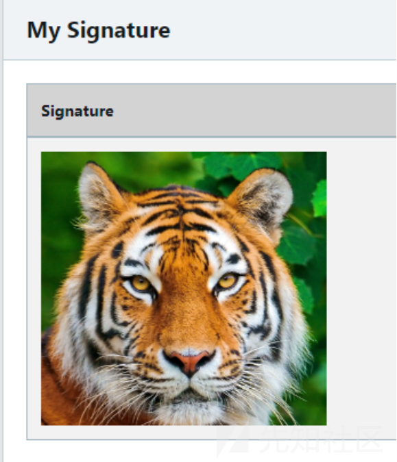](https://xzfile.aliyuncs.com/media/upload/picture/20240302223345-dfe6d742-d8a1-1.png)

右键新链接打开：

[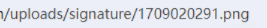](https://xzfile.aliyuncs.com/media/upload/picture/20240302223330-d6fff4b0-d8a1-1.png)

有暴露上传路径。  
然后看一下正常 phpinfo.php 上传是个什么情况

[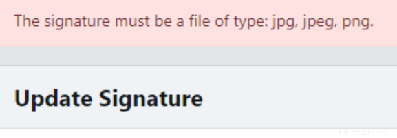](https://xzfile.aliyuncs.com/media/upload/picture/20240302223425-f7df74e4-d8a1-1.png)

显示只能上传 jpg 等图片格式，非常正常，开始准备绕过。  
0x01 判断白黑名单及校验字段  
将 png 格式文件后缀更改为 phpabcde

[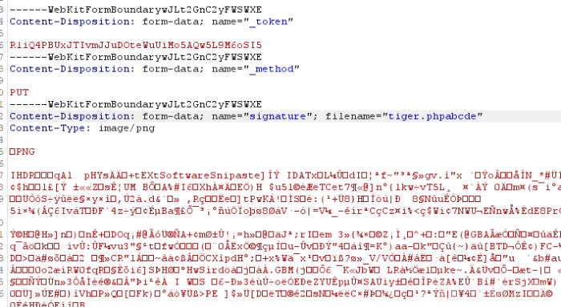](https://xzfile.aliyuncs.com/media/upload/picture/20240302223530-1e7cf09a-d8a2-1.png)

还是可以正常显示，那应该是黑名单，并且后缀错误也能正常显示，那么可能文件头也进行了校验。  
接下来试一下正常的 php 文件改后缀看一下是否能上传成功：

[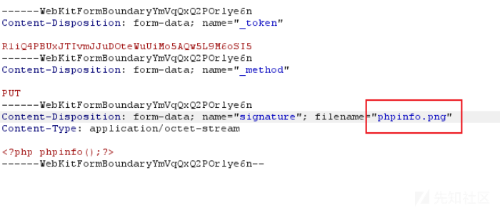](https://xzfile.aliyuncs.com/media/upload/picture/20240302223548-296ef6f6-d8a2-1.png)

回显如下：

[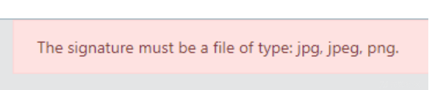](https://xzfile.aliyuncs.com/media/upload/picture/20240302223556-2dd3afa2-d8a2-1.png)

证明校验了文件头。  
继续测一下在文件头是 png 情况下测试 php 文件是否能上传：

[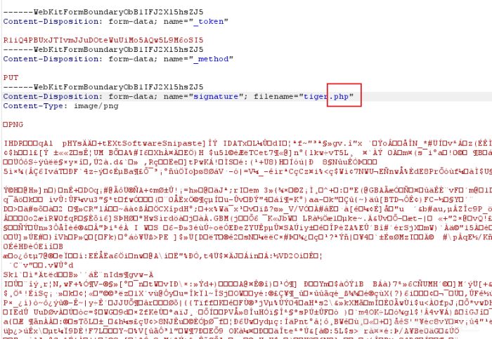](https://xzfile.aliyuncs.com/media/upload/picture/20240302223606-341f583e-d8a2-1.png)

显示也是只能上传图片文件，证明也后缀名也进行了校验

[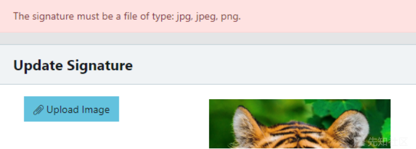](https://xzfile.aliyuncs.com/media/upload/picture/20240302223615-3982245a-d8a2-1.png)

通过上面 php 和 png 文件的文件头和文件后缀两两组合发包测试，可以判断出是文件名后缀黑名单 + 文件头的校验方式。  
那么绕过思路如下：  
利用制作图片马的方式在图片中插入 php 代码绕过文件头效验，同时在寻找在黑名单之外的后缀名看是否能解析成 php，如果实在没有那就只能再挖个文件包含漏洞包含图片马了。

0x02 黑名单绕过  
制作图片马：  
copy small.jpg /b +phpinfo.php /a phpinfo.jpg  
这里提醒一下，这里的 jpg 越小越好，不然有时候在解析 php 代码时，图片有一些脏字符会导致 php 代码解析失败。  
这里我随便截了一个很小的图进行图片马制作，大小只有 700 字节

[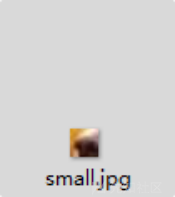](https://xzfile.aliyuncs.com/media/upload/picture/20240302223625-3f416f54-d8a2-1.png)

在本地测试，后缀改为 php 可以解析：

[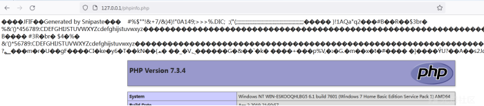](https://xzfile.aliyuncs.com/media/upload/picture/20240302223630-42a36a9e-d8a2-1.png)

先把常用的黑名单绕过方式拉出来：  
1.大小写 ----->.Php 等，上传失败  
2.前后加空格，后面加点-----> 空格.php、.php 空格、.php.，上传失败  
3.代替扩展名-----> .php, .php2, .php3, .php4, .php5, .php6, .php7, .phps, .phps, .pht, .phtm, .phtml, .shtml, .htaccess, .phar。  
测到 phps 的时候有变化，可以上传，但解析如下：

[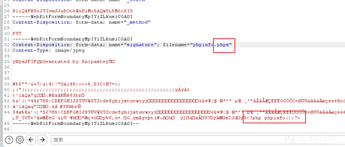](https://xzfile.aliyuncs.com/media/upload/picture/20240302223641-48bc922a-d8a2-1.png)

[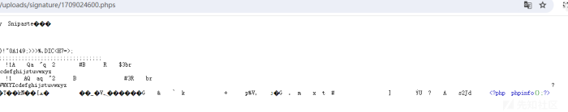](https://xzfile.aliyuncs.com/media/upload/picture/20240302223646-4bfcbb36-d8a2-1.png)

没有解析成功。  
其他的均上传失败  
4.后缀加上::$data（适用于 windows 系统）

[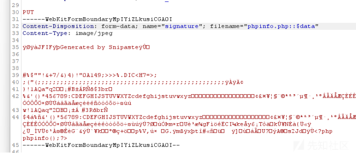](https://xzfile.aliyuncs.com/media/upload/picture/20240302223655-51700834-d8a2-1.png)

直接访问会 403

[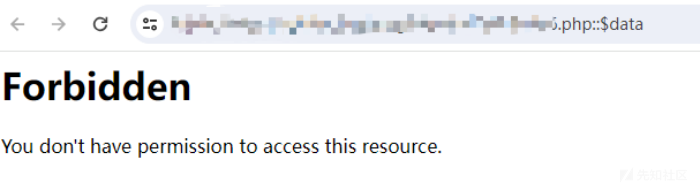](https://xzfile.aliyuncs.com/media/upload/picture/20240302223706-57d44dac-d8a2-1.png)

删掉后缀，解析成功：

[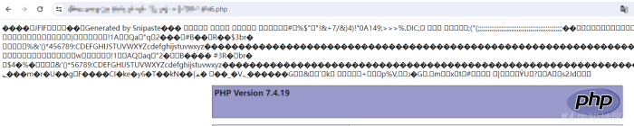](https://xzfile.aliyuncs.com/media/upload/picture/20240302223711-5ac1b3ec-d8a2-1.png)

说实话知道系统是 windows 应该先尝试后缀加::$data 的，浪费了很多时间。

0x03 绕过 defender 进程链查杀 getshell  
目标为 window server2016，大概率是有 defender 的，defender 会对 webshell 的进程链进行检查，webshell 在 windows 下一半是在 w3wp.exe 下起的属于灰进程，在灰进程下 webshell 执行 cmd 命令可能会被杀，例如蚁剑的混淆过的一句话木马，静态就算过了但是执行命令时会被查杀：

[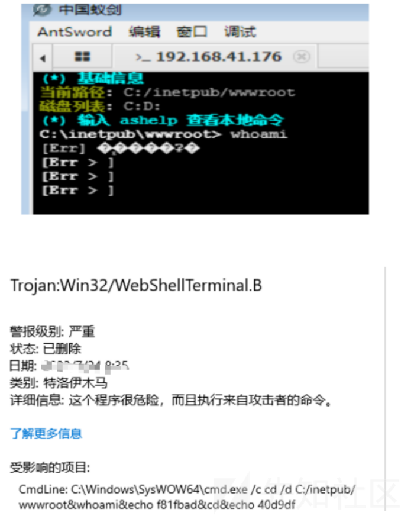](https://xzfile.aliyuncs.com/media/upload/picture/20240302223730-6628f0f6-d8a2-1.png)

准备一个冰蝎的免杀马子，在本地 VMware 的 window server 2016 环境下测试下测试通过之后静态动态测试免杀测试后（这里有坑，后续再说），制作成图片马上传至目标：

[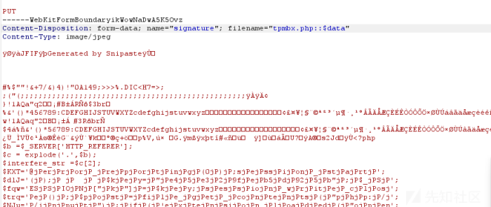](https://xzfile.aliyuncs.com/media/upload/picture/20240302223737-6a767cf0-d8a2-1.png)

连接上之后发现文件上传下载删除可用，但是命令执行无回显。

[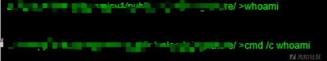](https://xzfile.aliyuncs.com/media/upload/picture/20240302223742-6d4472fc-d8a2-1.png)

这里猜测原因：  
1.因为权限不够，默认的 cmd 拉不起来  
尝试自己上传 cmd.exe 用自己的 exe 执行

[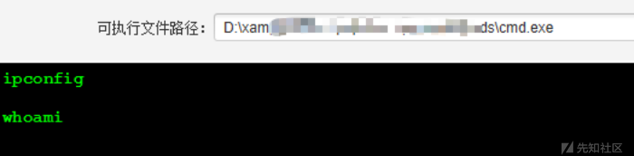](https://xzfile.aliyuncs.com/media/upload/picture/20240302223748-7098acf2-d8a2-1.png)

依然不行。

2.怀疑 eval 函数被禁用

[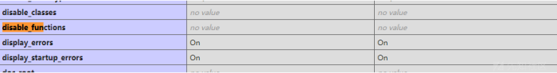](https://xzfile.aliyuncs.com/media/upload/picture/20240302223754-74aaed32-d8a2-1.png)

看了下 phpinfo 的 disable\_fuction，没有被禁用。

3.webshell 工具有问题  
换了个哥斯拉的免杀马，一样只能文件上传下载，不可以命令执行。

[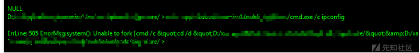](https://xzfile.aliyuncs.com/media/upload/picture/20240302223804-7a9de2bc-d8a2-1.png)

但是报了个错，505 system unable to fork，大概意思是 system 函数没被拉起来。

4.更换系统命令执行函数  
利用哥斯拉的 php 代码执行模块，把 php 常用的命令执行函数都试一遍

[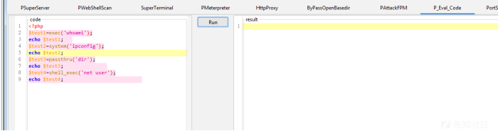](https://xzfile.aliyuncs.com/media/upload/picture/20240302223810-7dca9098-d8a2-1.png)

还是没有回显。

5.进程链查杀绕过  
由于之前本地测试环境冰蝎和哥斯拉的马执行命令都没问题，所以没往这方面想，但是上面的测试特征都说明很可能是 webshell 工具进程链被杀了。  
尝试使用大马在 web 层面执行命令：

[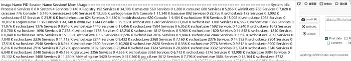](https://xzfile.aliyuncs.com/media/upload/picture/20240302223817-82082b98-d8a2-1.png)

执行 tasklist 成功。  
这里也有坑，要通过 webshell 管理工具直接上传大马，而不是从上传点制作图片马上传大马，后者执行命令会失败，原因未知，可能跟图片马解析有关系。  
之后咨询其他师傅，称真实环境中服务器的 defender 可能会比你本地虚拟机里搭建的 defender 要强，所以你本地的 webshell 过了查杀不代表你在真实环境免杀。  
最后查询杀软：

[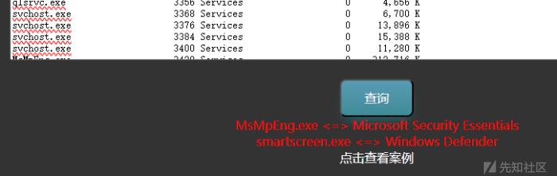](https://xzfile.aliyuncs.com/media/upload/picture/20240302223840-8fc41116-d8a2-1.png)

确实只有 defender，应该就是进程链查杀了，整个过程还是挺曲折的。
