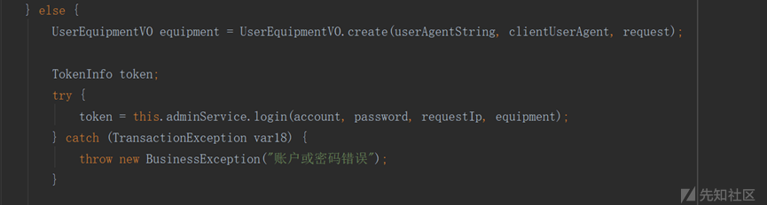
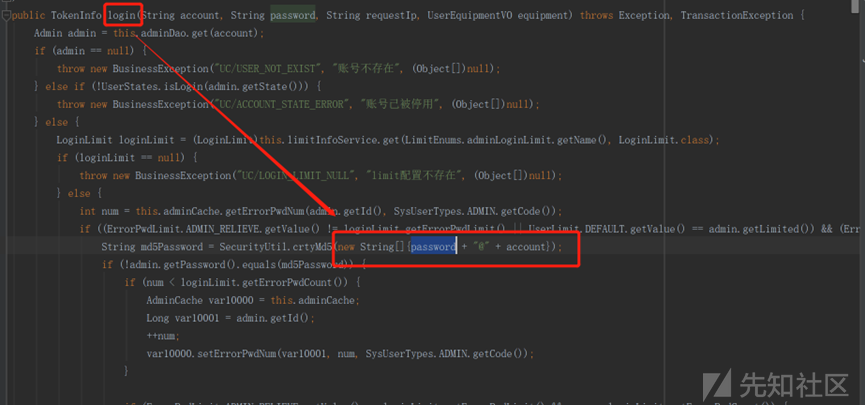
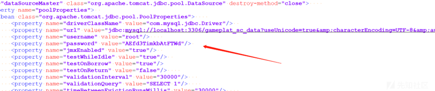
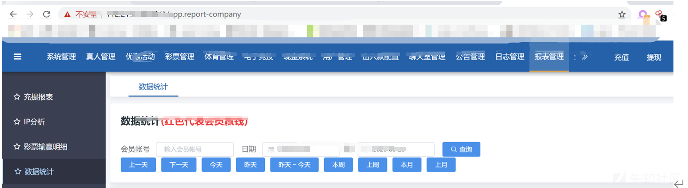
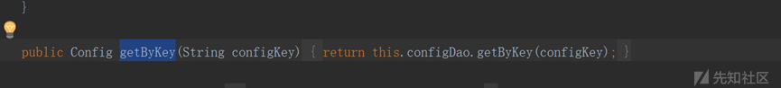
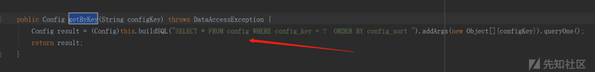

# 记某模版菠菜管理后台登录思路 - 先知社区

记某模版菠菜管理后台登录思路

- - -

## 前情提要

测试发现该菠菜模版系统存在未授权任意文件上传，在进行下述操作分析前已上马并获取到系统源码信息。因为后台数据展示比较直观，故想登录后台直接查看相应信息，具体过程详见下文。

## 登入后台

使用资产测绘工具发现该模版的菠菜站点登入后台共有两种情况：一种是输入账号密码验证后直接登录，还有一种是输入账号密码和google验证码验证后登录。  
首先先来对不带google验证码的进行登录操作，查看源码发现数据库存储的password形式为md5(md5(password明文)@用户名)，因此这个基本查不到爆破比较困难。源码信息如下所示：  
[](https://xzfile.aliyuncs.com/media/upload/picture/20240301111708-301f3d9a-d77a-1.png)  
跟入login函数  
[](https://xzfile.aliyuncs.com/media/upload/picture/20240301111802-4fe4f692-d77a-1.png)  
想到构造一个已知的的密码更新该字段，构造密码为123456的password值为dd95a7354329cf3c2586446076f4ca3d。根据前情提要翻看系统文件后得知数据库账号密码存放在`/www/server/webapps/xxxxxxx/webapps/ROOT/WEB/WEB-INF/classes/spring/datasource-master.xml`文件中，如下所示：  
[](https://xzfile.aliyuncs.com/media/upload/picture/20240301112055-b77a6878-d77a-1.png)  
后台管理员密码存储该模板网站统一存储在gameplat\_sc\_data数据库的admin表。操作时记录下原先hash值，在用update更新，冰蝎自带的数据库管理工具不支持update、insert等操作可使用虚拟终端进入在连接数据库操作(操作前先输入set +o history history -d 1防止操作历史命令被记录)。登录数据库后运行如下更新密码命令

```plain
update gameplat_sc_data.admin set password=’dd95a7354329cf3c2586446076f4ca3d’ where account=’admin’
```

之后即可用123456，登录后台  
[](https://xzfile.aliyuncs.com/media/upload/picture/20240301112350-1f60831e-d77b-1.png)  
查看完后更新admin数据表为原密码hash。

```plain
update gameplat_sc_data.admin set password=”原hash” where account=’admin’
```

```plain
接着再来分析带google验证码的后台登录，根据源码分析得知登录代码逻辑首先会在数据库查询是否开启google验证码配置，若为1表示开启进入相应验证过程，否则不进入。
```

[](https://xzfile.aliyuncs.com/media/upload/picture/20240301112910-de8bf016-d77b-1.png)  
跟进函数boundGoogleAuth.getConfigValue()，查看是操作那张数据表  
[](https://xzfile.aliyuncs.com/media/upload/picture/20240301112954-f8930634-d77b-1.png)  
再到dao层，如下所示：  
[](https://xzfile.aliyuncs.com/media/upload/picture/20240301113027-0bee7588-d77c-1.png)  
找到具体的表和字段后运行如下sql命令，无需google验证

```plain
update gameplat_sc_data.config set config_value='0' where  config_key = 'is_bound_google_auth'
```

后续改密码和无google验证一样，登录看完之后再将google验证配置参数更新为1。

```plain
update gameplat_sc_data.config set config_value='1' where  config_key = 'is_bound_google_auth'
```
