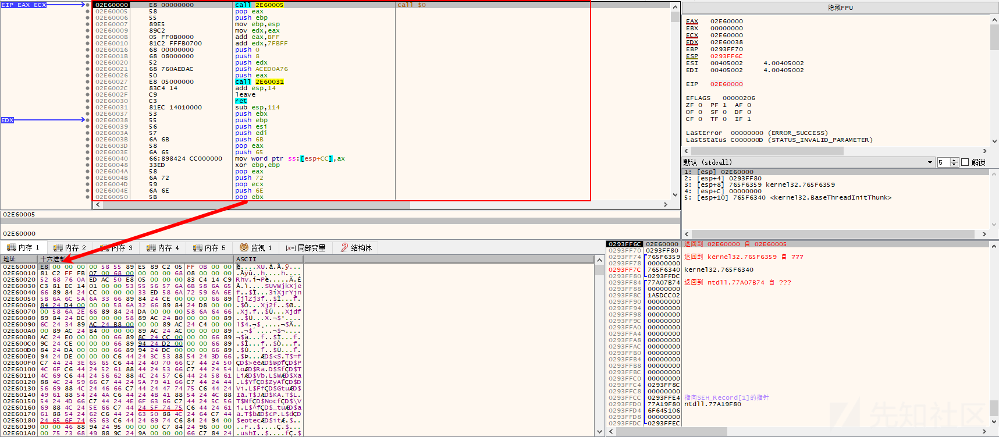
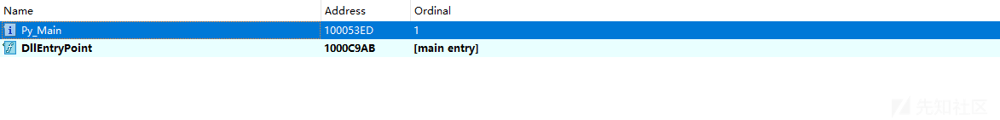

# 谷堕大盗黑产组织最新攻击样本详细分析 - 先知社区

谷堕大盗黑产组织最新攻击样本详细分析

- - -

# 前言概述

笔者最近跟踪到一例谷堕大盗黑产组织最新的攻击样本，该攻击样本中使用了多种对抗技术，对该样本进行详细分析。

# 详细分析

1.样本的编译时间为2024年3月4日，如下所示：  
  
2.发起URL连接请求，获取黑客远程服务器shellcode代码，如下所示：  
  
3.从远程服务器读取到shellcode代码，如下所示：  
  
4.通过VirtualAlloc分配内存空间，如下所示：  
  
5.将获取的shellcode代码拷贝到该内存空间当中，如下所示：  
  
6.跳转到shellcode代码，如下所示：  
  
7.shellcode代码调用VirtualAlloc分配内存空间，如下所示：  
  
8.然后将shellcode代码中包含的恶意模块代码拷贝到该内存空间中，如下所示：  
  
9.恶意模块导出函数，如下所示：  
  
10.shellcode代码调用执行恶意模块的SCTakes\_L导出函数，如下所示：  
  
11.恶意模块使用了多种对抗技术，包含反调试和反虚拟机技术，通过BeingDebugged、NtGlobalFlag、ZwQueryInformationProcess等技术反调试，如下所示：  
  
12.获取系统CPU温度，如下所示：  
  
13.获取系统风扇转速，如下所示：  
  
14.获取主机硬件信息，如下所示：  
  
15.获取系统电源状态，如下所示：  
  
16.进程提权操作，如下所示：  
  
17.读取模块资源数据，在相应的目录下生成EXE和DLL恶意文件，如下所示：  
  
18.恶意模块资源数据，如下所示：  
  
19.生成EXE和DLL恶意文件，如下所示：  
  
20.生成的文件，如下所示：  
  
21.从黑客服务器下载对应的恶意模块数据，如下所示：  
  
22.读取服务器上对应的exehook2.dll模块数据，如下所示：  
  
23.将模块数据写入到生成的sqm.dat文件，并创建相应的计划任务，调用执行EXE程序，如下所示：  
  
24.生成的sqm.dat文件，如下所示：  
  
25.sqm.dat文件内容，如下所示：  
  
26.EXE恶意程序，调用DLL模块的导出函数，如下所示：  
  
27.DLL恶意模块的导出函数，如下所示：  
  
28.读取目录下的sqm.dat数据到内存当中，如下所示：  
  
29.将读取的内存拷贝到分配的内存空间并解密，解密之后为去掉了MZ标志的恶意payload模块，如下所示：  
  
30.然后跳转到解密后恶意模块执行，如下所示：  
  
31.解密后的恶意模块为谷堕大盗黑产组织的上线模块，如下所示：  
  
该上线模块版本信息为2024年2月，如下所示：  
  
远程服务器IP地址为154.12.84.33，如下所示：  
  
通过分析可以确认该攻击样本应该为谷堕大盗黑产组织的最新攻击样本。

# 威胁情报

# 总结结尾

此次发现的谷堕大盗黑产组织最新的攻击样本，增加了大量的反虚拟机，反调试技术，安全对抗会一直持续存在，并不断升级，有攻必有防，攻与防就是矛与盾的关系，安全研究人员需要持续不断的提升自己的安全能力。
