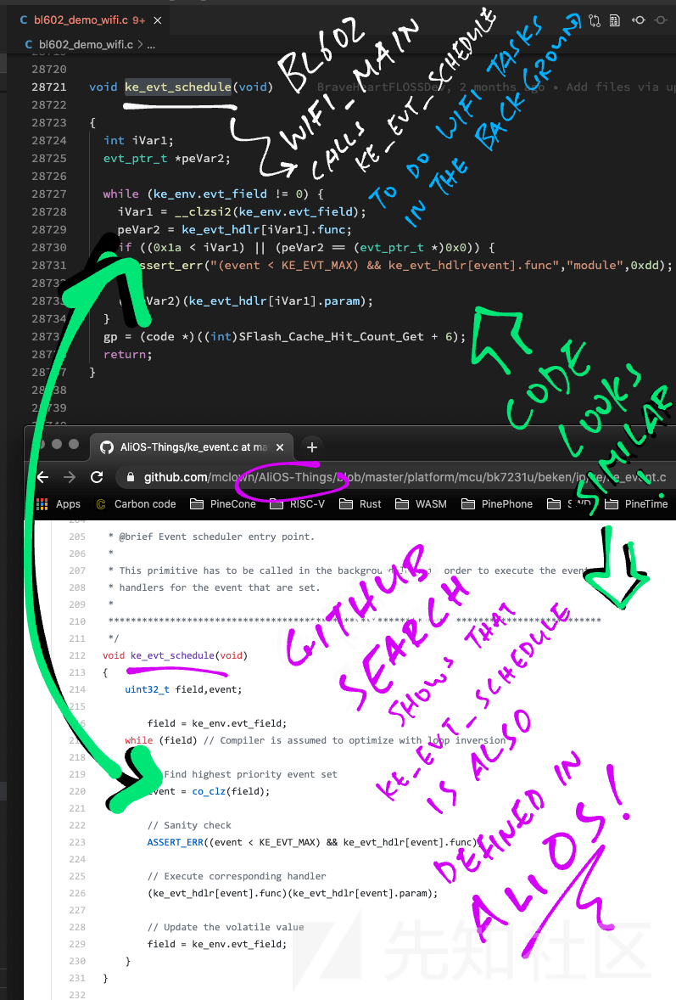
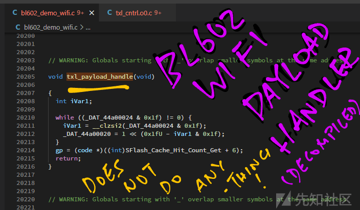

逆向 WiFi 驱动板 RISC-V BL602

- - -

翻译原文链接：[https://lupyuen.github.io/articles/wifi](https://lupyuen.github.io/articles/wifi)

文章翻译总结：文章分析了 BL602 的 WiFi 演示固件源码，涵盖了 WiFi 事件处理、启动 WiFi 固件任务、连接 WiFi 热点等过程，通过 GitHub 代码搜索，找到了与 BL602 WiFi 驱动匹配的开源代码，包括 RivieraWaves UMAC 和 LMAC 代码、WiFi 认证代码以及部分物理层代码，深入分析了 BL602 的 WiFi 驱动工作流程，并找到了大量可参考的开源代码。

文章相关标签：#RivieraWaves、#FreeRTOS、#物理层、#GitHub Search、#UMAC&LMAC

# 逆向 WiFi 驱动板 RISC-V BL602

\[TOC\]

今天，我们对 **[BL602 RISC-V](https://lupyuen.github.io/articles/pinecone)** 系统芯片上的 WiFi 驱动程序进行逆向工程，并了解内部发生的情况……在找到的（不完整）驱动程序源代码的指导下进行。

为什么要对 BL602 W(See this non-BL602 example)iFi 驱动程序进行逆向工程？

1.  **教育**：掌握在 BL602（一种芯片型号）上 WiFi 数据包的传输和接收过程。
2.  **故障排除**：当 WiFi 驱动程序出现问题时，我们应该能够定位并解决问题。（或许还能进行修复！）
3.  **审计**：确保 WiFi 数据包的传输和接收既正确又安全。（可参考非 BL602 的相关例子）
4.  **替换**：未来，我们可能用开源驱动程序（如 Openwifi）替换现有的闭源 WiFi 驱动程序

> [https://twitter.com/Yu\_Wei\_Wu/status/1406940637773979655?s=19](https://twitter.com/Yu_Wei_Wu/status/1406940637773979655?s=19)
> 
> [https://github.com/open-sdr/openwifi](https://github.com/open-sdr/openwifi)

接下来开始一起阅读并开始学习逆向工程吧。

[](https://xzfile.aliyuncs.com/media/upload/picture/20240229193158-25ee0a6a-d6f6-1.png)

## 一、BL602 WiFi 固件演示 demo

让我们一起来研究 BL602 物联网软件开发套件中的 BL602 WiFi 演示固件源代码：bl602\_demo\_wifi

在演示固件中，我们将执行以下操作：

1.  注册处理 WiFi 事件的**事件处理程序**
2.  启动控制 BL602 **WiFi 固件的任务**
3.  启动管理**WiFi 连接状态的任务**
4.  连接到**WiFi\*\***接入点\*\*
5.  发送**HTTP 请求**

### 1.1 注册 WiFi 事件处理

固件启动时，我们将注册一个处理 WiFi 事件的回调函数：main.c

> [https://github.com/lupyuen/bl\_iot\_sdk/blob/master/customer\_app/bl602\_demo\_wifi/bl602\_demo\_wifi/main.c#L819-L866](https://github.com/lupyuen/bl_iot_sdk/blob/master/customer_app/bl602_demo_wifi/bl602_demo_wifi/main.c#L819-L866)

```plain
//  启动时调用以初始化驱动程序并运行事件循环
static void aos_loop_proc(void *pvParameters) {
  //  省略部分：初始化驱动程序
  ...
  //  为 WiFi 事件注册回调函数
  aos_register_event_filter(
    EV_WIFI,              //  Event Type
    event_cb_wifi_event,  //  Event Callback Function
    NULL);                //  Event Callback Argument

  //  启动 WiFi 网络堆栈
  cmd_stack_wifi(NULL, 0, 0, NULL);

  //  运行事件循环
  aos_loop_run();
}
```

（我们稍后会讨论 event\_cb\_wifi\_event 变量）启动代码中，通过调用 cmd\_stack\_wifi 来启动 WiFi 网络堆栈。现在，让我们深入了解其内部实现…

### 1.2 启动 WiFi 固件管理

在 cmd\_stack\_wifi 函数中，我们按照如下方式启动**WiFi 固件任务**：main.c

> [https://github.com/lupyuen/bl\_iot\_sdk/blob/master/customer\_app/bl602\_demo\_wifi/bl602\_demo\_wifi/main.c#L729-L747](https://github.com/lupyuen/bl_iot_sdk/blob/master/customer_app/bl602_demo_wifi/bl602_demo_wifi/main.c#L729-L747)

```plain
//  启动 WiFi 网络堆栈
static void cmd_stack_wifi(char *buf, int len, int argc, char **argv) {
  //  Check whether WiFi Networking is already started
  static uint8_t stack_wifi_init  = 0;
  if (1 == stack_wifi_init) { return; }  //  Already started
  stack_wifi_init = 1;

  //  启动 WiFi 固件任务 (FreeRTOS)
  hal_wifi_start_firmware_task();

  //  发布 WiFi 事件以启动 WiFi 管理器任务
  aos_post_event(
    EV_WIFI,                 //  Event Type
    CODE_WIFI_ON_INIT_DONE,  //  Event Code
    0);                      //  Event Argument
}
```

（本文稍后将讨论 hal\_wifi\_start\_firmware\_task 函数）任务启动后，我们触发 WiFi 事件 CODE\_WIFI\_ON\_INIT\_DONE，以便**启动 WiFi 管理任务**。现在，让我们探究 WiFi 事件处理程序的内部工作原理…

### 1.3 启动 WiFi 管理任务

这里是处理 WiFi 事件的方法：main.c

> [https://github.com/lupyuen/bl\_iot\_sdk/blob/master/customer\_app/bl602\_demo\_wifi/bl602\_demo\_wifi/main.c#L374-L512](https://github.com/lupyuen/bl_iot_sdk/blob/master/customer_app/bl602_demo_wifi/bl602_demo_wifi/main.c#L374-L512)

```plain
//  WiFi 事件的回调功能
static void event_cb_wifi_event(input_event_t *event, void *private_data) {

  //  处理 WiFi 事件
  switch (event->code) {

  //  由 cmd_stack_wifi 发布以启动 Wi-Fi 管理器任务
    case CODE_WIFI_ON_INIT_DONE:

    //  启动WiFi管理器任务 (FreeRTOS)
      wifi_mgmr_start_background(&conf);
      break;

    //  省略部分: 处理其他WiFi事件
```

当接收到 WiFi 事件 CODE\_WIFI\_ON\_INIT\_DONE 时，我们会调用 wifi\_mgmr\_start\_background**启动 WiFi 管理任务**（在 FreeRTOS 中）。wifi\_mgmr\_start\_background 函数是由 BL602 WiFi 驱动程序提供的。（请参考源代码）

> [https://github.com/lupyuen/bl\_iot\_sdk/blob/master/components/bl602/bl602\_wifidrv/bl60x\_wifi\_driver/wifi\_mgmr.c#L1406-L1415](https://github.com/lupyuen/bl_iot_sdk/blob/master/components/bl602/bl602_wifidrv/bl60x_wifi_driver/wifi_mgmr.c#L1406-L1415)

### 1.4 连接到 WiFi 网络

既然我们已经启动了 WiFi 固件任务和 WiFi 管理任务这两个后台任务，接下来让我们连接到一个 WiFi 网络！通过演示固件，我们可以输入特定的命令来连接到**WiFi\*\***接入点\*\*…

```plain
wifi_sta_connect YOUR_WIFI_SSID YOUR_WIFI_PASSWORD
```

这里是**wifi\_sta\_connect**命令的实现方法：main.c

> [https://github.com/lupyuen/bl\_iot\_sdk/blob/master/customer\_app/bl602\_demo\_wifi/bl602\_demo\_wifi/main.c#L366-L372](https://github.com/lupyuen/bl_iot_sdk/blob/master/customer_app/bl602_demo_wifi/bl602_demo_wifi/main.c#L366-L372)

```plain
//  连接到 WiFi 接入点
static void wifi_sta_connect(char *ssid, char *password) {

  //  启用 WiFi 客户端
  wifi_interface_t wifi_interface
    = wifi_mgmr_sta_enable();

  //  连接到 WiFi 接入点
  wifi_mgmr_sta_connect(
    wifi_interface,  //  WiFi Interface
    ssid,            //  SSID
    password,        //  Password
    NULL,            //  PMK
    NULL,            //  MAC Address
    0,               //  Band
    0);              //  Frequency
}
```

我们通过调用 BL602 WiFi 驱动程序提供的 wifi\_mgmr\_sta\_enable 函数来**激活 WiFi 客户端功能**。

（“STA”代表“WiFi 站点”，也就是 WiFi 客户端）

接着，我们通过调用 BL602 WiFi 驱动程序中的 wifi\_mgmr\_sta\_connect 函数来**连接到 WiFi\*\***接入点\*\*。

（下一章我们将深入探讨 wifi\_mgmr\_sta\_connect 函数的内部机制）

> [https://github.com/lupyuen/bl\_iot\_sdk/blob/master/components/bl602/bl602\_wifidrv/bl60x\_wifi\_driver/wifi\_mgmr\_ext.c#L202-L217](https://github.com/lupyuen/bl_iot_sdk/blob/master/components/bl602/bl602_wifidrv/bl60x_wifi_driver/wifi_mgmr_ext.c#L202-L217)
> 
> [https://github.com/lupyuen/bl\_iot\_sdk/blob/master/components/bl602/bl602\_wifidrv/bl60x\_wifi\_driver/wifi\_mgmr\_ext.c#L302-L307](https://github.com/lupyuen/bl_iot_sdk/blob/master/components/bl602/bl602_wifidrv/bl60x_wifi_driver/wifi_mgmr_ext.c#L302-L307)

### 1.5 发送 HTTP 请求

现在，我们可以输入特定的命令来通过 WiFi**发送\*\***HTTP 请求\*\*…

```plain
httpc
```

这里是 httpc 命令的实现代码：main.c

> [https://github.com/lupyuen/bl\_iot\_sdk/blob/master/customer\_app/bl602\_demo\_wifi/bl602\_demo\_wifi/main.c#L704-L727](https://github.com/lupyuen/bl_iot_sdk/blob/master/customer_app/bl602_demo_wifi/bl602_demo_wifi/main.c#L704-L727)

```plain
//  使用 LWIP 发送 HTTP GET 请求
static void cmd_httpc_test(char *buf, int len, int argc, char **argv) {
  //  检查 HTTP 请求是否已在运行
  static httpc_connection_t settings;
  static httpc_state_t *req;
  if (req) { return; }  //  请求已在运行

  //  初始化 LWIP HTTP 设置
  memset(&settings, 0, sizeof(settings));
  settings.use_proxy = 0;
  settings.result_fn = cb_httpc_result;
  settings.headers_done_fn = cb_httpc_headers_done_fn;

  //  使用 LWIP 发送 HTTP GET 请求
  httpc_get_file_dns(
    "nf.cr.dandanman.com",  //  Host
    80,                     //  Port
    "/ddm/ContentResource/music/204.mp3",  //  URI
    &settings,              //  Settings
    cb_altcp_recv_fn,       //  Callback Function
    &req,                   //  Callback Argument
    &req);                  //  Request
}
```

在 BL602 上，我们采用 LWIP（轻量级 IP 堆栈）来实现 IP、UDP、TCP 和 HTTP 网络功能。httpc\_get\_file\_dns 的详细文档可以在此查阅。想要获取更多关于 BL602 WiFi 演示固件的信息，请参阅相关文档…

-   BL602 WiFi 演示固件文档

让我们一起逆向分析 BL602 WiFi 演示固件… 探索其内部的工作原理！

> [https://www.nongnu.org/lwip/2\_1\_x/index.html](https://www.nongnu.org/lwip/2_1_x/index.html)
> 
> [https://pine64.github.io/bl602-docs/Examples/demo\_wifi/wifi.html](https://pine64.github.io/bl602-docs/Examples/demo_wifi/wifi.html)

[](https://xzfile.aliyuncs.com/media/upload/picture/20240229193301-4bf05ff6-d6f6-1.png)

## 二、连接到 WiFi 接入点

*BL602 连接到 WiFi**接入点**时，实际发生了什么过程？*

为了深入了解 BL602 如何连接 WiFi 接入点，我们将研读**BL602 WiFi 驱动程序的\*\***源代码\*\*。

让我们观察在连接过程中会发生哪些变化…

1.  向 WiFi 管理任务发起连接请求
2.  通过 WiFi 管理器的状态机来处理该连接请求
3.  将连接请求传递给 WiFi 硬件（LMAC）
4.  激发**LMAC 中断**以执行连接操作

### 2.1 向 WiFi 管理任务发送请求

我们之前使用**wifi\_mgmr\_sta\_connect**函数来连接到 WiFi 接入点。这里是该函数内部的工作原理：wifi\_mgmr\_ext.c

> [https://github.com/lupyuen/bl\_iot\_sdk/blob/master/components/bl602/bl602\_wifidrv/bl60x\_wifi\_driver/wifi\_mgmr\_ext.c#L302-L307](https://github.com/lupyuen/bl_iot_sdk/blob/master/components/bl602/bl602_wifidrv/bl60x_wifi_driver/wifi_mgmr_ext.c#L302-L307)

```plain
//  连接到 WiFi 接入点
int wifi_mgmr_sta_connect(wifi_interface_t *wifi_interface, char *ssid, char *psk, char *pmk, uint8_t *mac, uint8_t band, uint16_t freq) {
  //  设置 WiFi SSID 和 PSK
  wifi_mgmr_sta_ssid_set(ssid);
  wifi_mgmr_sta_psk_set(psk);

  //  连接到 WiFi 接入点
  return wifi_mgmr_api_connect(ssid, psk, pmk, mac, band, freq);
}
```

我们首先设定了 WiFi 的 SSID 和 PSK。接着，我们通过调用 wifi\_mgmr\_api\_connect 函数来连接到 WiFi 接入点。

**wifi\_mgmr\_api\_connect**函数的具体实现如下所示：wifi\_mgmr\_api.c

> [https://github.com/lupyuen/bl\_iot\_sdk/blob/master/components/bl602/bl602\_wifidrv/bl60x\_wifi\_driver/wifi\_mgmr\_api.c#L40-L84](https://github.com/lupyuen/bl_iot_sdk/blob/master/components/bl602/bl602_wifidrv/bl60x_wifi_driver/wifi_mgmr_api.c#L40-L84)

```plain
//  连接到 WiFi 接入点
int wifi_mgmr_api_connect(char *ssid, char *psk, char *pmk, uint8_t *mac, uint8_t band, uint16_t freq) {
  //  省略部分：复制 PSK、PMK、MAC 地址、频带和频率
  ...
  //  向 WiFi 管理器任务发送连接请求
  wifi_mgmr_event_notify(msg);
  return 0;
}
```

[](https://xzfile.aliyuncs.com/media/upload/picture/20240229193315-5431d3ac-d6f6-1.png)

在此，我们通过调用 wifi\_mgmr\_event\_notify 函数，将**连接\*\***请求发送\*\*给 WiFi 管理任务。

**wifi\_mgmr\_event\_notify**函数的定义位于 wifi\_mgmr.c 文件中…

> [https://github.com/lupyuen/bl\_iot\_sdk/blob/master/components/bl602/bl602\_wifidrv/bl60x\_wifi\_driver/wifi\_mgmr.c#L1332-L1343](https://github.com/lupyuen/bl_iot_sdk/blob/master/components/bl602/bl602_wifidrv/bl60x_wifi_driver/wifi_mgmr.c#L1332-L1343)

```plain
//  向 WiFi 管理器任务发送请求
int wifi_mgmr_event_notify(wifi_mgmr_msg_t *msg) {
  //  省略部分：等待 WiFi 管理器启动
  ...
  //  通过消息队列向 WiFi 管理器发送请求
  if (os_mq_send(
    &(wifiMgmr.mq),  //  Message Queue
    msg,             //  Request Message
    msg->len)) {     //  Message Length
    //  发送请求失败
    return -1;
  }
  return 0;
}
```

os\_mq\_send 函数是如何将请求发送给 WiFi 管理任务的？os\_mq\_send 函数通过调用 FreeRTOS，将请求消息发送到**WiFi 管理器的\*\***消息队列\*\*中：os\_hal.h

> [https://github.com/lupyuen/bl\_iot\_sdk/blob/master/components/bl602/bl602\_wifidrv/bl60x\_wifi\_driver/os\_hal.h#L174](https://github.com/lupyuen/bl_iot_sdk/blob/master/components/bl602/bl602_wifidrv/bl60x_wifi_driver/os_hal.h#L174)

```plain
#define os_mq_send(mq, msg, len) \
    (xMessageBufferSend(mq, msg, len, portMAX_DELAY) > 0 ? 0 : 1)
```

[](https://xzfile.aliyuncs.com/media/upload/picture/20240229193331-5dd387b6-d6f6-1.png)

### 2.2 WiFi 管理状态机

WiFi 管理器在其后台任务（FreeRTOS）中运行着一个**状态机**，用来管理每个 WiFi 连接的状态。当 WiFi 管理器接收到我们发出的连接到 WiFi 接入点的请求时，会发生什么？让我们深入 wifi\_mgmr.c 文件来一探究竟…

> [https://github.com/lupyuen/bl\_iot\_sdk/blob/master/components/bl602/bl602\_wifidrv/bl60x\_wifi\_driver/wifi\_mgmr.c#L702-L745](https://github.com/lupyuen/bl_iot_sdk/blob/master/components/bl602/bl602_wifidrv/bl60x_wifi_driver/wifi_mgmr.c#L702-L745)

```plain
//  当 WiFi 管理器接收到连接请求时调用
static void stateIdleAction_connect( void *oldStateData, struct event *event, void *newStateData) {
  //  为连接请求设置 WiFi 配置文件
  wifi_mgmr_msg_t *msg = event->data;
  wifi_mgmr_profile_msg_t *profile_msg = (wifi_mgmr_profile_msg_t*) msg->data;
  profile_msg->ssid_tail[0] = '\0';
  profile_msg->psk_tail[0]  = '\0';

  //  记住 WiFi 管理器中的 WiFi 配置文件
  wifi_mgmr_profile_add(&wifiMgmr, profile_msg, -1);

  //  连接到 WiFi 配置文件。TODO:其他安全支持
  bl_main_connect(
    (const uint8_t *) profile_msg->ssid, profile_msg->ssid_len,
    (const uint8_t *) profile_msg->psk, profile_msg->psk_len,
    (const uint8_t *) profile_msg->pmk, profile_msg->pmk_len,
    (const uint8_t *) profile_msg->mac, (const uint8_t) profile_msg->band, (const uint16_t) profile_msg->freq);
}
```

[](https://xzfile.aliyuncs.com/media/upload/picture/20240229193340-62c9bc9a-d6f6-1.png)

在此，我们配置了**WiFi 配置文件**，并通过调用 bl\_main\_connect 函数来连接到该配置文件。在**bl\_main\_connect**函数中，我们为**802.11 WiFi 协议**设定了连接参数：bl\_main.c

> [https://github.com/lupyuen/bl\_iot\_sdk/blob/master/components/bl602/bl602\_wifidrv/bl60x\_wifi\_driver/bl\_main.c#L189-L216](https://github.com/lupyuen/bl_iot_sdk/blob/master/components/bl602/bl602_wifidrv/bl60x_wifi_driver/bl_main.c#L189-L216)

```plain
//  连接到 WiFi 配置文件
int bl_main_connect(const uint8_t* ssid, int ssid_len, const uint8_t *psk, int psk_len, const uint8_t *pmk, int pmk_len, const uint8_t *mac, const uint8_t band, const uint16_t freq) {

  //  802.11 WiFi 协议的连接参数
  struct cfg80211_connect_params sme;    

  //  省略部分：设置 802.11 连接参数
  ...
  //  使用 802.11 连接参数连接到 WiFi 网络
  bl_cfg80211_connect(&wifi_hw, &sme);
  return 0;
}
```

连接参数随后被传递给在 bl\_main.c 中定义的**bl\_cfg80211\_connect**函数…

> [https://github.com/lupyuen/bl\_iot\_sdk/blob/master/components/bl602/bl602\_wifidrv/bl60x\_wifi\_driver/bl\_main.c#L539-L571](https://github.com/lupyuen/bl_iot_sdk/blob/master/components/bl602/bl602_wifidrv/bl60x_wifi_driver/bl_main.c#L539-L571)

```plain
//  使用 802.11 连接参数连接到 WiFi 网络
int bl_cfg80211_connect(struct bl_hw *bl_hw, struct cfg80211_connect_params *sme) {

  //  将填充连接结果
  struct sm_connect_cfm sm_connect_cfm;

  //  将连接参数转发到 LMAC
  int error = bl_send_sm_connect_req(bl_hw, sme, &sm_connect_cfm);

  //  省略部分：检查连接结果
```

该函数通过调用**bl\_send\_sm\_connect\_req**，将连接参数发送至**WiFi 硬件**（**LMAC**）。

接下来，让我们进一步探究其具体实现方式…

[](https://xzfile.aliyuncs.com/media/upload/picture/20240229193404-71704a5c-d6f6-1.png)

### 2.3 发送请求到 LMAC

*LMAC 是什么？*

**LMAC（Lower Medium Access Control 低媒体访问控制）**是 BL602 WiFi 无线电硬件内部运行的固件，负责执行 WiFi 无线电的相关功能。

为了连接到 WiFi 接入点，我们会通过调用**bl\_send\_sm\_connect\_req**（定义在 bl\_msg\_tx.c 文件中）来将连接**参数传递给 LMAC**…

> [https://github.com/lupyuen/bl\_iot\_sdk/blob/master/components/bl602/bl602\_wifidrv/bl60x\_wifi\_driver/bl\_msg\_tx.c#L722-L804](https://github.com/lupyuen/bl_iot_sdk/blob/master/components/bl602/bl602_wifidrv/bl60x_wifi_driver/bl_msg_tx.c#L722-L804)

```plain
//  将连接参数转发到 LMAC
int bl_send_sm_connect_req(struct bl_hw *bl_hw, struct cfg80211_connect_params *sme, struct sm_connect_cfm *cfm) {

  //  生成 SM_CONNECT_REQ 消息
  struct sm_connect_req *req = bl_msg_zalloc(SM_CONNECT_REQ, TASK_SM, DRV_TASK_ID, sizeof(struct sm_connect_req));

  //  省略部分：设置 SM_CONNECT_REQ 消息的参数
  ...
  //  向 LMAC 固件发送 SM_CONNECT_REQ 消息
  return bl_send_msg(bl_hw, req, 1, SM_CONNECT_CFM, cfm);
}
```

在这里，我们构建了一个包含连接参数的**SM\_CONNECT\_REQ**消息。

（“SM”指的是 RivieraWaves 的 LMAC 状态机）

接着，我们通过调用**bl\_send\_msg**函数将该消息**发送给 LMAC**：bl\_msg\_tx.c

> [https://github.com/lupyuen/bl\_iot\_sdk/blob/master/components/bl602/bl602\_wifidrv/bl60x\_wifi\_driver/bl\_msg\_tx.c#L315-L371](https://github.com/lupyuen/bl_iot_sdk/blob/master/components/bl602/bl602_wifidrv/bl60x_wifi_driver/bl_msg_tx.c#L315-L371)

```plain
//  向 LMAC 固件发送消息的函数，静态定义
static int bl_send_msg(struct bl_hw *bl_hw, const void *msg_params, int reqcfm, lmac_msg_id_t reqid, void *cfm) {
  //  省略：为消息分配缓冲区
  ...
  //  省略：将消息复制到缓冲区 
  ...
  //  将消息添加到 LMAC 消息队列
  int ret = bl_hw->cmd_mgr.queue(&bl_hw->cmd_mgr, cmd);
```

[](https://xzfile.aliyuncs.com/media/upload/picture/20240229193438-8580e826-d6f6-1.png)

上述代码使用 ipc\_host\_msg\_push 函数**将消息加入 LMAC\*\***消息队列\*\*：ipc\_host.c

> [https://github.com/lupyuen/bl\_iot\_sdk/blob/master/components/bl602/bl602\_wifidrv/bl60x\_wifi\_driver/ipc\_host.c#L139-L171](https://github.com/lupyuen/bl_iot_sdk/blob/master/components/bl602/bl602_wifidrv/bl60x_wifi_driver/ipc_host.c#L139-L171)

```plain
//  将消息添加到 LMAC 消息队列。
//  IPC = Interprocess Communication 进程间通信
int ipc_host_msg_push(struct ipc_host_env_tag *env, void *msg_buf, uint16_t len) {
    //  Get the address of the IPC message buffer in Shared RAM
    uint32_t *src = (uint32_t*) ((struct bl_cmd *) msg_buf)->a2e_msg;
    uint32_t *dst = (uint32_t*) &(env->shared->msg_a2e_buf.msg);

    //  将消息复制到仪表板消息缓冲区
    for (int i = 0; i < len; i += 4) { *dst++ = *src++; }
    env->msga2e_hostid = msg_buf;

    //  触发LMAC中断以将消息发送到EMB
    //  IPC_IRQ_A2E_MSG is 2
    ipc_app2emb_trigger_set(IPC_IRQ_A2E_MSG);
```

[](https://xzfile.aliyuncs.com/media/upload/picture/20240229193448-8b52a820-d6f6-1.png)

在将消息复制到 LMAC 消息队列（位于共享 RAM 中）之后，我们调用 ipc\_app2emb\_trigger\_set 来**触发 LMAC 中断**。

随后，LMAC（以及 BL602 无线电硬件）将发送适当的中继 WiFi 数据包，用以建立与**WiFi\*\***接入点**\*\*的网络连接**。

这样，BL602 就完成了与 WiFi 接入点的连接过程！

[](https://xzfile.aliyuncs.com/media/upload/picture/20240229193456-904ec624-d6f6-1.png)

### 2.4 触发 LMAC 中断

*我们是如何触发 LMAC 中断的呢？*

```plain
//  触发 LMAC 中断以将消息发送到 EMB
//  IPC_IRQ_A2E_MSG is 2
ipc_app2emb_trigger_set(IPC_IRQ_A2E_MSG);
```

我们来探究一下**ipc\_app2emb\_trigger\_set**函数的内部工作原理，了解它是如何激活**LMAC 中断**的：reg\_ipc\_app.h

> [https://github.com/lupyuen/bl\_iot\_sdk/blob/master/components/bl602/bl602\_wifidrv/bl60x\_wifi\_driver/reg\_ipc\_app.h#L41-L69](https://github.com/lupyuen/bl_iot_sdk/blob/master/components/bl602/bl602_wifidrv/bl60x_wifi_driver/reg_ipc_app.h#L41-L69)

```plain
//  WiFi 硬件寄存器基本地址
#define REG_WIFI_REG_BASE          0x44000000

//  IPC 硬件寄存器基址
#define IPC_REG_BASE_ADDR          0x00800000

//  APP2EMB_TRIGGER 寄存器定义
//  Bits    Field Name           Reset Value
//  -----   ------------------   -----------
//  31:00   APP2EMB_TRIGGER      0x0
#define IPC_APP2EMB_TRIGGER_ADDR   0x12000000
#define IPC_APP2EMB_TRIGGER_OFFSET 0x00000000
#define IPC_APP2EMB_TRIGGER_INDEX  0x00000000
#define IPC_APP2EMB_TRIGGER_RESET  0x00000000

//  Write to IPC 寄存器
#define REG_IPC_APP_WR(env, INDEX, value) \
  (*(volatile u32 *) ((u8 *) env + IPC_REG_BASE_ADDR + 4*(INDEX)) \
    = value)

//  触发 LMAC 中断
static inline void ipc_app2emb_trigger_set(u32 value) {
  //  写入地址为 0x4480 0000 的 WiFi IPC 寄存器
  REG_IPC_APP_WR(
    REG_WIFI_REG_BASE, 
    IPC_APP2EMB_TRIGGER_INDEX, 
    value);
}
```

这段代码通过向**WiFi 硬件寄存器**（用于进程间通信）写入，触发了 LMAC 中断。

```plain
REG_WIFI_REG_BASE + IPC_REG_BASE_ADDR + 4 * IPC_APP2EMB_TRIGGER_INDEX
```

这个地址对应的是 0x4480 0000。

等等……事实上 0x4480 0000 这个地址在官方文档中有记录吗？

然而，这个地址并没有在 BL602 的参考手册中公开文档化的记录。

> [https://github.com/bouffalolab/bl\_docs/blob/main/BL602\_RM/en/BL602\_BL604\_RM\_1.2\_en.pdf](https://github.com/bouffalolab/bl_docs/blob/main/BL602_RM/en/BL602_BL604_RM_1.2_en.pdf)

[](https://xzfile.aliyuncs.com/media/upload/picture/20240229193534-a6ccde04-d6f6-1.png)

实际上，整个位于**0x4400 0000**的**WiFi 硬件寄存器区域**都没有在官方文档中提及。

我们刚刚揭开了一个 BL602 WiFi 的神秘面纱！

## 三、反编译 WiFi 固件演示 demo

*我们真的在逆向 BL602 WiFi 驱动程序吗？*

还没有。到目前为止，我们一直在阅读 BL602 WiFi 驱动程序的**公开\*\***源代码**\*\*。**

*我们现在可以进行一些真正的**逆向工程**吗？*

当然可以！BL602 WiFi 驱动程序的**大部分并没有附带\*\***源代码\*\*。 （比如 WiFi WPA 认证的函数）

但是，BraveHeartFLOSSDev 使用 Ghidra 将 BL602 WiFi 演示固件成功地反编译成了 C 语言代码……

-   BraveHeartFLOSSDev/bl602nutcracker1

（我们将使用这个分支）

接下来，我们将研究这个反编译的 C 代码…… 并深入进行 BL602 WiFi 驱动程序的逆向工程！

-   更多关于 Ghidra 的信息
-   Ghidra 针对 BL602 的配置

> [https://github.com/BraveHeartFLOSSDev](https://github.com/BraveHeartFLOSSDev)
> 
> [https://github.com/BraveHeartFLOSSDev/bl602nutcracker1](https://github.com/BraveHeartFLOSSDev/bl602nutcracker1)
> 
> [https://github.com/lupyuen/bl602nutcracker1](https://github.com/lupyuen/bl602nutcracker1)
> 
> [https://ghidra-sre.org/](https://ghidra-sre.org/)
> 
> [https://github.com/BraveHeartFLOSSDev/GhidWork](https://github.com/BraveHeartFLOSSDev/GhidWork)

### 3.1 链接到反编译代码

遗憾的是，GitHub 无法在网页浏览器中展示我们那些庞大的反编译 C 文件。这意味着直接链接到代码的特定行会比较困难。

不过，你可以通过下载反编译后的 C 文件仓库来解决这个问题。

1.  下载反编译后的 C 文件仓库
2.  当我们看到这样的链接时… 反编译后的代码在这里：bl602\_demo\_wifi.c

> [https://github.com/lupyuen/bl602nutcracker1/blob/main/bl602\_demo\_wifi.c#L38512-L38609](https://github.com/lupyuen/bl602nutcracker1/blob/main/bl602_demo_wifi.c#L38512-L38609)

点击链接右侧（或长按），然后选择“复制链接地址”。

1.  将复制的地址粘贴到文本编辑器中。

然后可以看到如下

```plain
https://github.com/lupyuen/bl602nutcracker1/blob/main/bl602_demo_wifi.c#L38512-L38609
```

1.  记住链接尾部部分

```plain
bl602_demo_wifi.c#L38512-L38609
```

1.  这意味着：

我们需要在代码编辑器（比如 VSCode）中打开下载的源文件 bl602\_demo\_wifi.c，然后使用 Ctrl-G 快捷键跳转到第 38512 行。

1.  我们可以看到所提及的反编译 C 代码。

[](https://xzfile.aliyuncs.com/media/upload/picture/20240229193552-b173f3b0-d6f6-1.png)

## 四、WiFi 固件任务

BL602 WiFi 驱动程序运行在两个后台任务（FreeRTOS）上…

-   **WiFi 管理任务**：负责管理 WiFi 连接状态
-   **WiFi 固件任务**：负责控制 WiFi 固件

我们已经了解了 WiFi 管理任务（还记得状态机吗？）。

现在，我们将深入研究 WiFi 固件任务，看看当我们启动并调度内核事件来处理 WiFi 数据包，以及处理 WiFi 数据包传输时会发生什么

1.  启动**WiFi 固件任务**
2.  **调度内核事件**以处理 WiFi 数据包
3.  处理**WiFi 数据包的传输**

[](https://xzfile.aliyuncs.com/media/upload/picture/20240229193625-c569ce9e-d6f6-1.png)

### 4.1 启动固件任务

我们之前看到了 cmd\_stack\_wifi 调用了 hal\_wifi\_start\_firmware\_task 来启动固件任务。

现在，让我们深入探究 hal\_wifi\_start\_firmware\_task 的内部工作原理：hal\_wifi.c

> [https://github.com/lupyuen/bl\_iot\_sdk/blob/master/components/hal\_drv/bl602\_hal/hal\_wifi.c#L41-L49](https://github.com/lupyuen/bl_iot_sdk/blob/master/components/hal_drv/bl602_hal/hal_wifi.c#L41-L49)

```plain
//  启动 WiFi 固件任务 (FreeRTOS)
int hal_wifi_start_firmware_task(void) {
  //  WiFi 固件任务的堆栈空间
  static StackType_t wifi_fw_stack[WIFI_STACK_SIZE];

  //  WiFi 固件任务的任务句柄
  static StaticTask_t wifi_fw_task;

  //  创建 FreeRTOS 后台任务
  xTaskCreateStatic(
    wifi_main,         //  即将运行的任务函数
    (char *) "fw",     //  任务名 
    WIFI_STACK_SIZE,   //  任务堆栈大小
    NULL,              //  任务参数
    TASK_PRIORITY_FW,  //  任务优先级
    wifi_fw_stack,     //  任务堆栈
    &wifi_fw_task);    //  任务句柄
  return 0;
}
```

这创建了一个**FreeRTOS\*\***后台任务**，它会一直运行**wifi\_main\*\*函数。

*那么，wifi\_main 里面是什么呢？*

我们没有 wifi\_main 的源代码。但是，得益于 BraveHeartFLOSSDev，我们从 BL602 WiFi 固件中成功反编译得到了 C 代码。

下面是从反编译的 C 代码中提取的**wifi\_main**函数：bl602\_demo\_wifi.c

> [https://github.com/BraveHeartFLOSSDev](https://github.com/BraveHeartFLOSSDev)
> 
> [https://github.com/lupyuen/bl602nutcracker1/blob/main/bl602\_demo\_wifi.c#L32959-L33006](https://github.com/lupyuen/bl602nutcracker1/blob/main/bl602_demo_wifi.c#L32959-L33006)

```plain
//  WiFi 固件任务将永远运行
void wifi_main(void *param) {
  ...
  //  初始化 LMAC 和 UMAC
  rfc_init(40000000);
  mpif_clk_init();
  sysctrl_init();
  intc_init();
  ipc_emb_init();
  bl_init();
  ...
  //  循环永远处理 WiFi 内核事件
  do {
    ...
    //  等等 
    if (ke_env.evt_field == 0) { ipc_emb_wait(); }
    ...
    //  安排 WiFi 内核事件并进行处理
    ke_evt_schedule();

    //  休息一下
    iVar1 = bl_sleep();

    coex_wifi_pta_forece_enable((uint) (iVar1 == 0));
  } while( true );
}
```

wifi\_main 函数的实际反编译 C 代码要复杂得多……

[](https://xzfile.aliyuncs.com/media/upload/picture/20240229193655-d73a1a70-d6f6-1.png)

因此，我们为逆向工程筛选出了关键部分。（同时我们也添加了一些注释）

**wifi\_main**函数会不断循环，处理**WiFi 内核事件**，以实现 WiFi 数据包的传输和接收。

（“ke”代表 WiFi 内核，它是 WiFi 驱动程序的心脏）

wifi\_main 通过调用**ke\_evt\_schedule**函数来处理 WiFi 内核事件。

现在，让我们在我们的反编译 C 代码中查找 ke\_evt\_schedule：bl602\_demo\_wifi.c

> [https://github.com/lupyuen/bl602nutcracker1/blob/main/bl602\_demo\_wifi.c#L28721-L28737](https://github.com/lupyuen/bl602nutcracker1/blob/main/bl602_demo_wifi.c#L28721-L28737)

```plain
//  安排 WiFi 内核事件并进行处理
void ke_evt_schedule(void) {
  int iVar1;
  evt_ptr_t *peVar2;

  while (ke_env.evt_field != 0) {
    iVar1 = __clzsi2(ke_env.evt_field);
    peVar2 = ke_evt_hdlr[iVar1].func;
    if ((0x1a < iVar1) || (peVar2 == (evt_ptr_t *)0x0)) {
      assert_err("(event < KE_EVT_MAX) && ke_evt_hdlr[event].func","module",0xdd);
    }
    (*peVar2)(ke_evt_hdlr[iVar1].param);
  }
  //  这一行可能被错误地反编译了
  gp = (code *)((int)SFlash_Cache_Hit_Count_Get + 6);
  return;
}
```

这段反编译代码执行了某些操作，但具体内容并不清晰。

幸运的是，一个特别的技巧能帮助我们解读这段晦涩的反编译代码——那就是 GitHub 搜索！

> [https://en.wikipedia.org/wiki/One\_weird\_trick\_advertisements](https://en.wikipedia.org/wiki/One_weird_trick_advertisements)

[](https://xzfile.aliyuncs.com/media/upload/picture/20240229193709-df712e5e-d6f6-1.png)

### 4.2 调度内核事件

*可能 ke\_evt\_schedule 并不是为 BL602 特别设计的？*

也许它最初是为其他目的而开发的？

说对了！让我们在**GitHub\*\***上搜索\*\*ke\_evt\_schedule！

-   在 GitHub 上对 ke\_evt\_schedule 进行代码搜索

（搜索结果按最近索引排序）

我们会发现，**ke\_evt\_schedule**的代码来自于**AliOS Things**（一个嵌入式操作系统）和**RivieraWaves**（下一章会解释），具体在 ke\_event.c 文件中。

> [https://github.com/search?o=desc&q=ke\_evt\_schedule&s=indexed&type=Code](https://github.com/search?o=desc&q=ke_evt_schedule&s=indexed&type=Code)
> 
> [https://github.com/lupyuen/AliOS-Things/blob/master/platform/mcu/bk7231u/beken/ip/ke/ke\_event.c#L203-L231](https://github.com/lupyuen/AliOS-Things/blob/master/platform/mcu/bk7231u/beken/ip/ke/ke_event.c#L203-L231)

```plain
//  事件调度程序入口点。必须在后台循环中调用此原语，才能执行所设置事件的事件处理程序。
void ke_evt_schedule(void) {
  uint32_t field, event;
  field = ke_env.evt_field;
  while (field) { // 假定编译器使用循环反转进行优化

    // 查找优先级最高的事件集
    event = co_clz(field);

    // 过滤检查
    ASSERT_ERR((event < KE_EVT_MAX) && ke_evt_hdlr[event].func);

    // 执行相应的处理程序
    (ke_evt_hdlr[event].func)(ke_evt_hdlr[event].param);

    // 更新volatile值
    field = ke_env.evt_field;
  }
}
```

这个版本与我们反编译的 ke\_evt\_schedule 版本进行对比…… **完全一致**！

甚至包括**断言检查**的部分！

```plain
(event < KE_EVT_MAX) && ke_evt_hdlr[event].func
```

既然这两个版本的 ke\_evt\_schedule 在功能上是完全相同的，那么我们来阅读**AliOS/RivieraWaves**版本的**ke\_evt\_schedule**代码。

> [https://github.com/lupyuen/bl602nutcracker1/blob/main/bl602\_demo\_wifi.c#L28721-L28737](https://github.com/lupyuen/bl602nutcracker1/blob/main/bl602_demo_wifi.c#L28721-L28737)

[](https://xzfile.aliyuncs.com/media/upload/picture/20240229193824-0c4717ea-d6f7-1.png)

我们注意到，**ke\_evt\_schedule**通过调用**ke\_evt\_hdlr**中的**事件处理程序**来处理 WiFi 内核事件。

以下是来自 AliOS / RivieraWaves 代码的**ke\_evt\_hdlr**事件处理程序：ke\_event.c

> [https://github.com/lupyuen/AliOS-Things/blob/master/platform/mcu/bk7231u/beken/ip/ke/ke\_event.c#L78-L138](https://github.com/lupyuen/AliOS-Things/blob/master/platform/mcu/bk7231u/beken/ip/ke/ke_event.c#L78-L138)

```plain
//  ke_evt_schedule 调用的事件处理程序
static const struct ke_evt_tag ke_evt_hdlr[32] = {
  {&rwnxl_reset_evt,    0},      // [KE_EVT_RESET]        
  {&ke_timer_schedule,  0},      // [KE_EVT_KE_TIMER]   
  {&txl_payload_handle, AC_VO},  // [KE_EVT_IPC_EMB_TXDESC_AC3]

  //  此事件处理程序看起来很有意思                                                   
  {&txl_payload_handle, AC_VI},  // [KE_EVT_IPC_EMB_TXDESC_AC2]
  {&txl_payload_handle, AC_BE},  // [KE_EVT_IPC_EMB_TXDESC_AC1]
  {&txl_payload_handle, AC_BK},  // [KE_EVT_IPC_EMB_TXDESC_AC0]        

  {&ke_task_schedule,   0},      // [KE_EVT_KE_MESSAGE]
  {&mm_hw_idle_evt,     0},      // [KE_EVT_HW_IDLE]
  ...
```

[](https://xzfile.aliyuncs.com/media/upload/picture/20240229193756-fb6474b8-d6f6-1.png)

**txl\_payload\_handle**是一个专门处理**WiFi 有效负载传输**的事件处理程序。

接下来，我们将深入研究它的内部工作原理，了解它是如何发送 WiFi 数据包的。

[](https://xzfile.aliyuncs.com/media/upload/picture/20240229193801-fe414e5e-d6f6-1.png)

### 4.3 处理传输负载

*txl\_payload\_handle 是什么？*

得益于 AliOS / RivieraWaves 的源代码，我们得到了对 txl\_payload\_handle 函数的详细描述：位于 txl\_cntrl.h 文件中。

> [https://github.com/lupyuen/AliOS-Things/blob/master/platform/mcu/bk7231u/beken/ip/lmac/src/tx/txl/txl\_cntrl.h#L377-L386](https://github.com/lupyuen/AliOS-Things/blob/master/platform/mcu/bk7231u/beken/ip/lmac/src/tx/txl/txl_cntrl.h#L377-L386)

```plain
//  对已从主机内存传输的有效负载执行操作。该原语由中断控制器 ISR 调用。如果需要，它执行 LLC 翻译和 MIC 计算。
//  LLC = 逻辑链路控制，MIC = Message Integrity Code 消息完整性代码
void txl_payload_handle(int access_category);
```

这表明 txl\_payload\_handle 函数被调用来**发送 WiFi 数据包**……这发生在从 BL602 复制数据包有效负载到无线电硬件之后。（通过**共享\*\***RAM**\*\*缓冲区**）在我们的反编译代码中搜索 txl\_payload\_handle，发现了如下内容：bl602\_demo\_wifi.c

> [https://github.com/lupyuen/bl602nutcracker1/blob/main/bl602\_demo\_wifi.c#L20205-L20216](https://github.com/lupyuen/bl602nutcracker1/blob/main/bl602_demo_wifi.c#L20205-L20216)

```plain
//  处理传输有效载荷
void txl_payload_handle(void) {
  while ((_DAT_44a00024 & 0x1f) != 0) {
    int iVar1 = __clzsi2(_DAT_44a00024 & 0x1f);

    //  写入0x44A0 0020的WiFi寄存器
    _DAT_44a00020 = 1 << (0x1fU - iVar1 & 0x1f);
  }
}
```

看起来它并没有进行太多有效负载的处理。但它向一个未在文档中提及的**WiFi 寄存器 0x44A0 0020**写入数据。

这可能触发了**LMAC 固件传输**WiFi 数据包吗？

但在此之前，我们发现了一些可能解释 txl\_payload\_handle 内部工作原理的信息……

[](https://xzfile.aliyuncs.com/media/upload/picture/20240229193909-272f908c-d6f7-1.png)

### 4.4 第二个传输负载 payload

在反编译代码中 txl\_payload\_handle 函数之后，有一个名为**txl\_payload\_handle\_backup**的函数。

根据其名称，txl\_payload\_handle\_backup 可能是一个处理有效负载传输的辅助函数。

以下是 txl\_payload\_handle\_backup 函数的反编译要点：bl602\_demo\_wifi.c

> [https://github.com/lupyuen/bl602nutcracker1/blob/main/bl602\_demo\_wifi.c#L20222-L20398](https://github.com/lupyuen/bl602nutcracker1/blob/main/bl602_demo_wifi.c#L20222-L20398)

```plain
//  另一个传输有效负载处理程序。
//可能与 txl_payload_handle 的工作方式相同
//在 BL602 而不是 LMAC 固件上运行。
void txl_payload_handle_backup(void) {
  ...
  //  Iterate through a list of packet buffers (?)
  while (ptVar4 = ptVar10->list[0].first, ptVar4 == (txl_buffer_tag *)0x0) {
LAB_230059f6:
    uVar3 = uVar3 + 1;
    ptVar10 = (txl_buffer_env_tag *)&ptVar10->buf_idx[0].free_size;
    ptVar11 = (txl_cntrl_env_tag *)(ptVar11->txlist + 1);
  }
```

**txl\_payload\_handle\_backup**开始时会遍历一个待传输的数据包缓冲区列表。

然后它调用一些来自 RivieraWaves 的**RXU、TXL 和 TXU 相关的函数**。

```plain
//  循环 (until when?)
  do {
    //  调用一些 RXU、TXL 和 TXU 函数
    rxu_cntrl_monitor_pm((mac_addr *)&ptVar4[1].lenheader);
    ...
    txl_machdr_format((uint32_t)(ptVar4 + 1));
    ...
    txu_cntrl_tkip_mic_append(txdesc,(uint8_t)uVar2);
```

（关于 RivieraWaves 的更多内容，请参阅下一章）

接下来，我们将向一些尚未在文档中公开的**WiFi 寄存器**写入数据：**0x44B0 8180、0x44B0 8198、0x44B0 81A4 和 0x44B0 81A8**……

```plain
//  写入 WiFi 寄存器
    _DAT_44b08180 = 0x800;
    _DAT_44b081a4 = ptVar9;
    ...
    _DAT_44b08180 = 0x1000;
    _DAT_44b081a8 = ptVar9;
    ...
    _DAT_44b08180 = 0x100;
    _DAT_44b08198 = ptVar9;
```

（这些寄存器也不在上述列表中）

该函数执行了一些**断言检查**。

这些断言失败的消息可能有助于我们理解和解读反编译后的代码……

> [https://github.com/lupyuen/bl\_iot\_sdk/blob/master/components/bl602/bl602\_wifidrv/bl60x\_wifi\_driver/reg\_access.h](https://github.com/lupyuen/bl_iot_sdk/blob/master/components/bl602/bl602_wifidrv/bl60x_wifi_driver/reg_access.h)

```plain
//  断言检查
    line = 0x23c;
    condition = "blmac_tx_ac_2_state_getf() != 2";
    ...
    line = 0x236;
    condition = "blmac_tx_ac_3_state_getf() != 2";
    ...
    line = 0x22f;
    condition = "blmac_tx_bcn_state_getf() != 2";
    ...
    line = 0x242;
    condition = "blmac_tx_ac_1_state_getf() != 2";
    ...
    line = 0x248;
    condition = "blmac_tx_ac_0_state_getf() != 2";
    ...
    assert_rec(condition, "module", line);
```

该函数的执行以设置一个定时器作为结束。

```plain
//  设置计时器
    blmac_abs_timer_set(uVar6, (uint32_t)(puVar8 + _DAT_44b00120));

    //  继续循环
  } while( true );
}
```

txl\_payload\_handle\_backup 的原始源代码真的有这么长吗？

很可能不是。C 编译器可能会通过内联一些函数来优化固件代码。

当我们对固件进行反编译时，原本内联的代码现在出现在调用它们的函数内部。

（这就是为什么反编译代码中会出现大量重复内容的原因）

接下来，让我们来探讨一下 RivieraWaves 的相关内容……

[](https://xzfile.aliyuncs.com/media/upload/picture/20240229193931-340eed66-d6f7-1.png)

## 五、专题 CEVA RivieraWaves

在 GitHub 上搜索 WiFi 事件调度程序 ke\_evt\_schedule 时，我们找到了这个源代码：

-   mclown/AliOS-Things

（我们将使用这个分支）

这似乎是 AliOS Things 嵌入式操作系统的源代码，它被移植到了 Beken BK7231U WiFi SoC。

但在源文件的顶部，我们注意到……

```plain
Copyright (C) RivieraWaves 2011-2016
```

这意味着 WiFi 固件的部分源代码实际上来自于 CEVA RivieraWaves，而不是 AliOS！

> [https://github.com/mclown/AliOS-Things/tree/master/platform/mcu/bk7231u/beken/ip](https://github.com/mclown/AliOS-Things/tree/master/platform/mcu/bk7231u/beken/ip)
> 
> [https://github.com/lupyuen/AliOS-Things/tree/master/platform/mcu/bk7231u/beken/ip](https://github.com/lupyuen/AliOS-Things/tree/master/platform/mcu/bk7231u/beken/ip)
> 
> [http://www.bekencorp.com/en/goods/detail/cid/13.html](http://www.bekencorp.com/en/goods/detail/cid/13.html)
> 
> [https://github.com/lupyuen/AliOS-Things/blob/master/platform/mcu/bk7231u/beken/ip/ke/ke\_event.c](https://github.com/lupyuen/AliOS-Things/blob/master/platform/mcu/bk7231u/beken/ip/ke/ke_event.c)

[](https://xzfile.aliyuncs.com/media/upload/picture/20240229193952-40f0236a-d6f7-1.png)

*CEVA RivieraWaves 是什么？*

RivieraWaves 是**运行在 WiFi SoCs（比如 BL602）上实现 802.11 无线协议的软件/固件**。

在 BL602 上有两层 RivieraWaves 固件：

-   **上层媒体访问控制（Upper Medium Access Control，UMAC）**：在**BL602 RISC-V** **CPU**上运行。我们之前看到的一些代码，比如内核事件调度器，就来自 UMAC。
-   **下层媒体访问控制（Lower Medium Access Control，LMAC）**：运行在**BL602 无线电硬件**内部。

我们还可以了解更多关于 WiFi 媒体访问控制的信息。

以及更多关于 RivieraWaves 的内容。

RivieraWaves 是否在其他地方使用？

是的，RivieraWaves 被广泛应用于许多流行的 WiFi SoCs。

> [https://www.ceva-dsp.com/product/rivierawaves-wi-fi-platforms/](https://www.ceva-dsp.com/product/rivierawaves-wi-fi-platforms/)
> 
> [https://www.controleng.com/articles/wi-fi-and-the-osi-model/](https://www.controleng.com/articles/wi-fi-and-the-osi-model/)
> 
> [https://www.ceva-dsp.com/product/rivierawaves-wi-fi-platforms/](https://www.ceva-dsp.com/product/rivierawaves-wi-fi-platforms/)
> 
> [https://csimarket.com/stocks/markets\_glance.php?code=CEVA#:~:text=Included%20among%20our%20licensees%20are,%2C%20RDA%2C%20Renesas%2C%20Rockchip%2C](https://csimarket.com/stocks/markets_glance.php?code=CEVA#:~:text=Included%20among%20our%20licensees%20are,%2C%20RDA%2C%20Renesas%2C%20Rockchip%2C)

[](https://xzfile.aliyuncs.com/media/upload/picture/20240229194023-5301f68c-d6f7-1.png)

### 5.1 上层媒体访问控制

回想一下，**UMAC（上层媒体访问控制）**是运行在**BL602 RISC-V** **CPU**上的 RivieraWaves 代码。

当我们比较 BL602 WiFi 固件的反编译结果与 AliOS / RivieraWaves 代码时，我们发现了**BL602 中使用的 UMAC 模块（和通用模块）**的源代码……

1.  CO 模块（通用）
2.  KE 模块（内核）
3.  ME 模块（消息？）
4.  RC 模块（速率控制）
5.  RXU 模块（接收 UMAC）
6.  SCANU 模块（扫描 SSID UMAC）
7.  SM 模块（状态机）
8.  TXU 模块（传输 UMAC）

这些模块在**BL602 和 AliOS / RivieraWaves 之间大多是相同的**，除了 RXU 模块看起来有所不同。

（更多关于 UMAC 模块的匹配将在我们讨论定量分析时介绍）

[](https://xzfile.aliyuncs.com/media/upload/picture/20240229194234-a122ad5c-d6f7-1.png)

> [https://github.com/lupyuen/AliOS-Things/blob/master/platform/mcu/bk7231u/beken/ip/common](https://github.com/lupyuen/AliOS-Things/blob/master/platform/mcu/bk7231u/beken/ip/common)
> 
> [https://github.com/lupyuen/AliOS-Things/blob/master/platform/mcu/bk7231u/beken/ip/ke](https://github.com/lupyuen/AliOS-Things/blob/master/platform/mcu/bk7231u/beken/ip/ke)
> 
> [https://github.com/lupyuen/AliOS-Things/blob/master/platform/mcu/bk7231u/beken/ip/umac/src/me](https://github.com/lupyuen/AliOS-Things/blob/master/platform/mcu/bk7231u/beken/ip/umac/src/me)
> 
> [https://github.com/lupyuen/AliOS-Things/blob/master/platform/mcu/bk7231u/beken/ip/umac/src/rc](https://github.com/lupyuen/AliOS-Things/blob/master/platform/mcu/bk7231u/beken/ip/umac/src/rc)
> 
> [https://github.com/lupyuen/AliOS-Things/blob/master/platform/mcu/bk7231u/beken/ip/umac/src/rxu](https://github.com/lupyuen/AliOS-Things/blob/master/platform/mcu/bk7231u/beken/ip/umac/src/rxu)
> 
> [https://github.com/lupyuen/AliOS-Things/blob/master/platform/mcu/bk7231u/beken/ip/umac/src/scanu](https://github.com/lupyuen/AliOS-Things/blob/master/platform/mcu/bk7231u/beken/ip/umac/src/scanu)
> 
> [https://github.com/lupyuen/AliOS-Things/blob/master/platform/mcu/bk7231u/beken/ip/umac/src/sm](https://github.com/lupyuen/AliOS-Things/blob/master/platform/mcu/bk7231u/beken/ip/umac/src/sm)
> 
> [https://github.com/lupyuen/AliOS-Things/blob/master/platform/mcu/bk7231u/beken/ip/umac/src/txu](https://github.com/lupyuen/AliOS-Things/blob/master/platform/mcu/bk7231u/beken/ip/umac/src/txu)

### 5.2 下层媒体访问控制

请记住，**LMAC（下层媒体访问控制）**是运行在**BL602 无线电硬件**内部的 RivieraWaves 代码。

通过将 BL602 WiFi 固件的反编译结果与 AliOS / RivieraWaves 代码进行匹配，我们识别出了**BL602 无线电硬件所暴露的 LMAC 接口…**…

1.  APM 接口（AliOS 中未提供）
2.  CFG 接口（AliOS 中未提供）
3.  CHAN 接口（负责 MAC 频道管理）
4.  HAL 接口（提供硬件抽象层）
5.  MM 接口（负责 MAC 管理）
6.  RXL 接口（负责接收 LMAC 数据）
7.  STA 接口（负责站点管理）
8.  TXL 接口（负责传输 LMAC 数据）

> [https://github.com/lupyuen/AliOS-Things/blob/master/platform/mcu/bk7231u/beken/ip/lmac/src/chan](https://github.com/lupyuen/AliOS-Things/blob/master/platform/mcu/bk7231u/beken/ip/lmac/src/chan)
> 
> [https://github.com/lupyuen/AliOS-Things/blob/master/platform/mcu/bk7231u/beken/ip/lmac/src/hal](https://github.com/lupyuen/AliOS-Things/blob/master/platform/mcu/bk7231u/beken/ip/lmac/src/hal)
> 
> [https://github.com/lupyuen/AliOS-Things/blob/master/platform/mcu/bk7231u/beken/ip/lmac/src/mm](https://github.com/lupyuen/AliOS-Things/blob/master/platform/mcu/bk7231u/beken/ip/lmac/src/mm)
> 
> [https://github.com/lupyuen/AliOS-Things/blob/master/platform/mcu/bk7231u/beken/ip/lmac/src/rx/rxl](https://github.com/lupyuen/AliOS-Things/blob/master/platform/mcu/bk7231u/beken/ip/lmac/src/rx/rxl)
> 
> [https://github.com/lupyuen/AliOS-Things/blob/master/platform/mcu/bk7231u/beken/ip/lmac/src/sta](https://github.com/lupyuen/AliOS-Things/blob/master/platform/mcu/bk7231u/beken/ip/lmac/src/sta)
> 
> [https://github.com/lupyuen/AliOS-Things/blob/master/platform/mcu/bk7231u/beken/ip/lmac/src/tx/txl](https://github.com/lupyuen/AliOS-Things/blob/master/platform/mcu/bk7231u/beken/ip/lmac/src/tx/txl)

上述链接的 LMAC 接口仅供参考，因为 BL602 实现的 LMAC 与上面提到的**Beken BK7231U 实现有很大不同**。

这些 LMAC 模块在**BL602 和 AliOS / RivieraWaves 之间似乎是基本相同的**……

-   PS 模块（省电）
-   SCAN 模块（扫描 SSID）
-   TD 模块（流量检测）
-   VIF 模块（虚拟接口）

（更多关于 LMAC 模块匹配的细节将在我们讨论定量分析时提供）

> [https://github.com/lupyuen/AliOS-Things/blob/master/platform/mcu/bk7231u/beken/ip/lmac/src/ps](https://github.com/lupyuen/AliOS-Things/blob/master/platform/mcu/bk7231u/beken/ip/lmac/src/ps)
> 
> [https://github.com/lupyuen/AliOS-Things/blob/master/platform/mcu/bk7231u/beken/ip/lmac/src/scan](https://github.com/lupyuen/AliOS-Things/blob/master/platform/mcu/bk7231u/beken/ip/lmac/src/scan)
> 
> [https://github.com/lupyuen/AliOS-Things/blob/master/platform/mcu/bk7231u/beken/ip/lmac/src/td](https://github.com/lupyuen/AliOS-Things/blob/master/platform/mcu/bk7231u/beken/ip/lmac/src/td)
> 
> [https://github.com/lupyuen/AliOS-Things/blob/master/platform/mcu/bk7231u/beken/ip/lmac/src/vif](https://github.com/lupyuen/AliOS-Things/blob/master/platform/mcu/bk7231u/beken/ip/lmac/src/vif)

[](https://xzfile.aliyuncs.com/media/upload/picture/20240229194431-e6df8e6e-d6f7-1.png)

## 六、专题 WiFi Supplicant

WiFi Supplicant 是负责处理 WiFi 认证的代码。

（比如 WPA 和 WPA2）

那么，WiFi Supplicant 代码是从 RivieraWaves 来的吗？

不是的。根据反编译的代码，BL602 实现了自己的 WiFi Supplicant，包含诸如 supplicantInit、allocSupplicantData 和 keyMgmtGetKeySize 等函数。（请查看相关部分）

也许 WiFi Supplicant 的代码来自另一个项目？

当我们搜索 GitHub 上的这些函数名称时，我们找到了与此相匹配的源代码……

-   **[karthirockz/rk3399-kernel](https://github.com/karthirockz/rk3399-kernel/tree/main/drivers/net/wireless/rockchip_wlan/mvl88w8977/mlan/esa)**

（我们将使用这个分支）

实际上，那是基于 Linux 的 Rockchip RK3399 的 WiFi Supplicant 代码。

它们的代码真的完全一样吗？

我们对比了反编译的 BL602 WiFi Supplicant 代码和 Rockchip RK3399 的源代码……它们几乎是一模一样的！（请查看相关部分）

这真是太棒了，因为我们刚刚揭开了 BL602 固件中（大约）2,500 行代码的神秘起源！

（这些数据来自定量分析，我们稍后会详细讨论）

[](https://xzfile.aliyuncs.com/media/upload/picture/20240229194617-25d58dd0-d6f8-1.png)

> [https://en.wikipedia.org/wiki/Wireless\_supplicant](https://en.wikipedia.org/wiki/Wireless_supplicant)
> 
> [https://en.wikipedia.org/wiki/Wpa\_supplicant](https://en.wikipedia.org/wiki/Wpa_supplicant)
> 
> [https://lupyuen.github.io/images/wifi-supplicant.png](https://lupyuen.github.io/images/wifi-supplicant.png)
> 
> [https://github.com/search?o=desc&q=supplicantInit+allocSupplicantData+keyMgmtGetKeySize&s=indexed&type=Code](https://github.com/search?o=desc&q=supplicantInit+allocSupplicantData+keyMgmtGetKeySize&s=indexed&type=Code)
> 
> [https://github.com/karthirockz/rk3399-kernel/tree/main/drivers/net/wireless/rockchip\_wlan/mvl88w8977/mlan/esa](https://github.com/karthirockz/rk3399-kernel/tree/main/drivers/net/wireless/rockchip_wlan/mvl88w8977/mlan/esa)
> 
> [https://github.com/lupyuen/rk3399-kernel/tree/main/drivers/net/wireless/rockchip\_wlan/mvl88w8977/mlan/esa](https://github.com/lupyuen/rk3399-kernel/tree/main/drivers/net/wireless/rockchip_wlan/mvl88w8977/mlan/esa)
> 
> [https://lupyuen.github.io/images/wifi-supplicant2.png](https://lupyuen.github.io/images/wifi-supplicant2.png)

## 七、WiFi 物理层

*WiFi 物理层是什么？*

**WiFi 物理层**是控制无线频率的协议，它决定了 WiFi 数据包应该如何发送和接收。

（它位于媒体访问控制层之下）

更多关于 WiFi 物理层的信息

难道是 BL602 的物理层没有使用 RivieraWaves 吧？

不，我们怀疑 BL602 的物理层并不是来自 RivieraWaves。

**BL602 物理层的起源有些模糊**……

这里是从反编译代码中提取的**BL602 物理层**的一部分：bl602\_demo\_wifi.c

> [https://www.controleng.com/articles/wi-fi-and-the-osi-model/](https://www.controleng.com/articles/wi-fi-and-the-osi-model/)
> 
> [https://github.com/lupyuen/bl602nutcracker1/blob/main/bl602\_demo\_wifi.c#L33527-L33614](https://github.com/lupyuen/bl602nutcracker1/blob/main/bl602_demo_wifi.c#L33527-L33614)

```plain
//  来自 BL602 反编译代码：初始化物理层
void phy_init(phy_cfg_tag *config) {
  mdm_reset();
  ...
  mdm_txcbwmax_setf((byte)(_DAT_44c00000 >> 0x18) & 3);
  _Var2 = phy_vht_supported();
  agc_config();
  ...
  // 初始发射机速率功率控制
  trpc_init();

  // 初始物理自适应功能
  pa_init();

  phy_tcal_reset();
  phy_tcal_start();
}
```

在 GitHub 上搜索 phy\_init 和 phy\_hw\_set\_channel（BL602 的另一个函数）时，我们找到了一个有用的结果……

-   jixinintelligence/bl602-604

（我们将使用这个分支）

它实现了 phy\_init 函数，具体如下：phy\_bl602.c……

> [https://github.com/search?q=phy\_init+phy\_hw\_set\_channel&type=code](https://github.com/search?q=phy_init+phy_hw_set_channel&type=code)
> 
> [https://github.com/jixinintelligence/bl602-604](https://github.com/jixinintelligence/bl602-604)
> 
> [https://github.com/lupyuen/bl602-604](https://github.com/lupyuen/bl602-604)
> 
> [https://github.com/lupyuen/bl602-604/blob/master/components/bl602/bl602\_wifi/plf/refip/src/driver/phy/bl602\_phy\_rf/phy\_bl602.c#L474-L492](https://github.com/lupyuen/bl602-604/blob/master/components/bl602/bl602_wifi/plf/refip/src/driver/phy/bl602_phy_rf/phy_bl602.c#L474-L492)

```plain
//  从 GitHub 搜索：Init Physical Layer //初始化物理层：
void phy_init(const struct phy_cfg_tag *config) {
  const struct phy_bl602_cfg_tag *cfg = (const struct phy_bl602_cfg_tag *)&config->parameters;
  phy_hw_init(cfg);
  phy_env->cfg               = *cfg;
  phy_env->band              = PHY_BAND_2G4;
  phy_env->chnl_type         = PHY_CHNL_BW_OTHER;
  phy_env->chnl_prim20_freq  = PHY_UNUSED;
  phy_env->chnl_center1_freq = PHY_UNUSED;
  phy_env->chnl_center2_freq = PHY_UNUSED;

  // 初始化传输速率控制
  trpc_init();

  // 初始物理自适应功能
  pa_init();
}
```

[](https://xzfile.aliyuncs.com/media/upload/picture/20240229194808-68908666-d6f8-1.png)

将 BL602 的反编译代码与 GitHub 上的搜索结果进行对比……**BL602 的代码似乎执行了更多的操作**？

（tdm\_reset、phy\_tcal\_reset 和 phy\_tcal\_start 的调用在哪里？）

因此，我们并没有找到 BL602 物理层的**100% 完全匹配**。（可能只有 50%）

尽管如此，这对于我们的逆向工程来说是一个非常有价值的发现！

[](https://xzfile.aliyuncs.com/media/upload/picture/20240229194840-7b3714c4-d6f8-1.png)

## 八、定量分析

我们实际上需要解码多少行反编译代码呢？

BL602 WiFi 源代码中已经可以在其他地方找到多少部分？

要回答这些问题，我们需要对 BL602 固件的反编译代码进行定量分析。

（这是对电子表格进行数据处理的术语）

我们需要执行以下步骤：

1.  从 BL602 WiFi 演示固件的反编译版本中**提取所有函数名称**。
2.  将这些**函数名称导入**电子表格进行进一步分析。
3.  根据模块对这些**函数名称进行分类**。
4.  将反编译的函数代码与通过 GitHub 搜索找到的**源代码\*\***进行匹配\*\*。
5.  **统计**没有找到匹配源代码的反编译代码行数。

### 8.1 提取反编译函数

**BL602 WiFi 演示固件**bl602\_demo\_wifi 已经被反编译成一个庞大的 C 文件。

-   反编译的 WiFi 演示固件 bl602\_demo\_wifi.c

我们运行这个命令来提取所有函数名称及其行号，以便于后续的代码行数统计。

> [https://github.com/lupyuen/bl\_iot\_sdk/blob/master/customer\_app/bl602\_demo\_wifi](https://github.com/lupyuen/bl_iot_sdk/blob/master/customer_app/bl602_demo_wifi)
> 
> [https://github.com/lupyuen/bl602nutcracker1/blob/main/bl602\_demo\_wifi.c](https://github.com/lupyuen/bl602nutcracker1/blob/main/bl602_demo_wifi.c)

```plain
# Extract the function names (and line numbers)
# from the decompiled firmware. The line must
# begin with an underscore or a letter,
# without indentation.
grep --line-number \
    "^[_a-zA-Z]" \
    bl602_demo_wifi.c \
    | grep -v LAB_ \
    >bl602_demo_wifi.txt
```

这将生成**bl602\_demo\_wifi.txt**，一个包含反编译函数名称及其行号的长列表。（这里是一个示例）

（还包括函数参数和类型定义……我们很快就会处理掉这些内容）

但这个列表包含了所有内容……包括非 WiFi 函数，对吧？

是的。但是，查看**反编译固件中的每一个函数**（总共 128,000 行代码）也很有趣，只是为了看看它是如何运作的。

为什么不直接反编译并分析 BL602 WiFi 库：libbl602\_wifi.a？

BL602 WiFi 库 libbl602\_wifi.a 可能包含一些不会链接到 WiFi 固件的额外 WiFi 函数。

因此，我们反编译并分析的是**实际由 WiFi 固件调用的 WiFi 函数**。

（顺便说一下：我们计算代码行数时会包括空行和注释行）

> [https://github.com/lupyuen/bl602nutcracker1/blob/main/bl602\_demo\_wifi.txt](https://github.com/lupyuen/bl602nutcracker1/blob/main/bl602_demo_wifi.txt)
> 
> [https://lupyuen.github.io/images/wifi-quantify.png](https://lupyuen.github.io/images/wifi-quantify.png)
> 
> [https://github.com/pine64/bl602-re/tree/master/blobs](https://github.com/pine64/bl602-re/tree/master/blobs)

[](https://xzfile.aliyuncs.com/media/upload/picture/20240229194909-8ce30980-d6f8-1.png)

### 8.2 整理函数到电子表格

我们将 bl602\_demo\_wifi.txt（包含反编译函数名称和行号的列表）导入到一个电子表格中，用于进一步分析。（见上图）

这是我们进行**定量分析\*\***的电子表格\*\*，采用了不同的格式……

-   [Google Sheets](https://docs.google.com/spreadsheets/d/1C_XmkH-ZSXz9-V2HsYBv7K1KRx3RF3-zsoJRLh1GwxI/edit?usp=sharing)
-   [LibreOffice / OpenOffice Format](https://github.com/lupyuen/bl602nutcracker1/blob/main/bl602_demo_wifi.ods)
-   [Excel Format](https://github.com/lupyuen/bl602nutcracker1/blob/main/bl602_demo_wifi.xlsx)
-   [CSV Format (raw data only)](https://github.com/lupyuen/bl602nutcracker1/blob/main/bl602_demo_wifi.csv)

我们清理数据，移除了类型定义、函数返回类型和函数参数。

根据行号，我们计算了每个函数的**代码行数**（包括空行和注释行）。

然后应用**条件格式化**，以突出显示**代码行数最多**的反编译函数。（这些函数通常也是最复杂的

在分析过程中，这些函数值得我们更多的关注。

> [https://github.com/lupyuen/bl602nutcracker1/blob/main/bl602\_demo\_wifi.txt](https://github.com/lupyuen/bl602nutcracker1/blob/main/bl602_demo_wifi.txt)

[](https://xzfile.aliyuncs.com/media/upload/picture/20240229194921-93b25b9e-d6f8-1.png)

### 8.3 反编译函数分类

接下来，我们将每个**反编译函数根据所属模块进行分类**。

上面的图片显示我们已经将“rxl\_”函数分类为“???RivieraWaves RXL”（RXL 代表接收 LMAC）。

我们使用“???”来标记那些我们找不到任何源代码的模块。

对所有 3,000 个反编译函数进行分类听起来很繁琐……吗？

幸运的是，属于同一个模块的反编译函数通常是**聚集**在一起的。因此，复制并填写一批函数的模块名称是相对简单的。

还记得我们对复杂函数的红色突出显示吗？如果对如何分类不太复杂的函数不确定，**跳过分类**是可以的。

在我们的电子表格中，我们已经对超过**97,000 行反编译代码进行了分类**，这占所有反编译代码行数的 86%。这对于我们的分析来说已经足够好了！

[](https://xzfile.aliyuncs.com/media/upload/picture/20240229194934-9b52deaa-d6f8-1.png)

### 8.4 匹配反编译函数

还记得我们之前通过**GitHub\*\***搜索\*\*找到的源代码吗？

*（用于 RivieraWaves、WiFi Supplicant 和物理层）*

现在我们深入研究那些源代码，看看它们**与反编译函数的匹配程度有多高**。

*我们如何记录我们的发现？*

在我们的电子表格中，有一个列记录了与我们反编译函数匹配的**源代码\*\***URL\*\*（来自 GitHub 搜索）。（见上图）

我们还添加了一条评论，说明它们**匹配得有多近**。例如：“BL602 版本有所不同”

如果发现的原代码与反编译函数不匹配，我们会用**“???”标记模块名称**。

*我们需要匹配每一个反编译函数吗？*

为了简化匹配过程，我们从每个模块中选取了**一个或两个最复杂的函数进行匹配**。

*（是的，红色突出显示真的很有帮助！）*

因此，我们的匹配并不是 100% 彻底和准确的……但它相当准确。

[](https://xzfile.aliyuncs.com/media/upload/picture/20240229194944-a1b27134-d6f8-1.png)

### 8.5 代码行数计算

最后，我们在电子表格中加入了一个**数据透视表**，用于计算与 GitHub 搜索结果匹配或不匹配的代码行数。

在我们的电子表格第二页，我们可以看到一个数据透视表，它汇总了我们**定量分析\*\***的结果\*\*……

1.  需要进行逆向工程的代码行数：10,500 行

在 GitHub 搜索中未找到的代码包括**LMAC 接口**和 WiFi Supplicant 的一部分。

[](https://xzfile.aliyuncs.com/media/upload/picture/20240229194954-a7442034-d6f8-1.png)

1.  部分需要逆向工程的代码行数：3,500 行

我们在 GitHub 搜索中找到了物理层的部分匹配代码。

[](https://xzfile.aliyuncs.com/media/upload/picture/20240229195016-b45e3b38-d6f8-1.png)

（关于 BL602 HAL 和标准驱动程序的讨论将在下一章进行）

1.  在其他地方已经找到的**代码行数：11,300 行**（真是惊人！）

在 GitHub 搜索中找到了**UMAC 和 WiFi Supplicant**的大部分代码。

[](https://xzfile.aliyuncs.com/media/upload/picture/20240229195024-b981bfb8-d6f8-1.png)

1.  我们还拥有来自 BL602 WiFi 驱动程序的**7,500**行代码，这部分代码的源代码可以在**BL602\*\***物联网**软件开发套件（**BL602 IoT SDK\*\*）中找到。（请查看相关部分）

这其中包括我们之前已经了解的**WiFi 管理器**。

[](https://xzfile.aliyuncs.com/media/upload/picture/20240229195031-bdc94e60-d6f8-1.png)

总结：我们有**大量的\*\***源代码**可以用来指导**BL602 WiFi 的**\*\*逆向工程**工作！

## 九、其他模块

WiFi 相关函数占据了反编译 WiFi 固件总代码行数的**29%**。

那么，剩下的 71% 的反编译代码中包含了什么呢？

接下来，让我们查看**反编译固件中的非 WiFi 函数部分**……

（复杂模块已用红色突出显示）

[](https://xzfile.aliyuncs.com/media/upload/picture/20240229195044-c5327e92-d6f8-1.png)

-   **[AliOS](https://github.com/lupyuen/bl_iot_sdk/tree/master/components/fs)**: 用于多任务和设备驱动的嵌入式系统框架
-   **[AWS IoT, AWS MQTT](https://github.com/lupyuen/bl_iot_sdk/tree/master/components/3rdparty/aws-iot)**: 演示固件与 AWS 云进行物联网和 MQTT（消息队列）服务的通信
-   **[BL602 Hardware Abstraction Layer (HAL)](https://github.com/lupyuen/bl_iot_sdk/tree/master/components/hal_drv/bl602_hal)**: 硬件抽象层包含引导加载程序、DMA、GPIO、闪存内存、中断、实时时钟、安全（加密）、UART 等功能
-   **[BL602 Standard Driver](https://github.com/lupyuen/bl_iot_sdk/tree/master/components/bl602/bl602_std/bl602_std/StdDriver)**: 标准驱动程序由 BL602 硬件抽象层调用，用于访问 BL602 的硬件寄存器
-   **[C Standard Library](https://github.com/lupyuen/bl_iot_sdk/tree/master/toolchain/riscv/Linux/lib/gcc/riscv64-unknown-elf/8.3.0/rv32imf/ilp32f)**: C 标准库，因为我们的固件是使用 GCC 编译器编译的
-   **[EasyFlash](https://github.com/lupyuen/bl_iot_sdk/blob/master/components/stage/easyflash4/inc/easyflash.h)**: 一个嵌入式数据库
-   **[FreeRTOS](https://github.com/lupyuen/bl_iot_sdk/tree/master/components/bl602/freertos_riscv)**: 一个运行在 AliOS 下面的嵌入式操作系统
-   **[Lightweight IP (LWIP)](https://github.com/lupyuen/bl_iot_sdk/tree/master/components/network)**: 轻量级 IP，提供 IP、UDP、TCP 和 HTTP 网络通信功能
-   **[Mbed TLS](https://github.com/lupyuen/bl_iot_sdk/tree/master/components/security/mbedtls)**: 实现传输层安全，AWS IoT 和 MQTT 服务需要这个安全机制

大多数非 WiFi 函数的源代码都可以找到。

（只需点击上方的链接即可）

[](https://xzfile.aliyuncs.com/media/upload/picture/20240229195054-cb65bd9c-d6f8-1.png)

## 十、GitHub 搜索：最好的伙伴

我们得到了一个宝贵的启示……GitHub 搜索是我们进行逆向工程的最好帮手！

通过 GitHub 搜索，我们发现了以下信息：

1.  UMAC 和 LMAC 的源代码
    1.  [GitHub Code Search for ke\_evt\_schedule](https://github.com/search?o=desc&q=ke_evt_schedule&s=indexed&type=Code)
2.  WiFi Supplicant 的源代码
    1.  [GitHub Code Search for supplicantInit, allocSupplicantData and keyMgmtGetKeySize](https://github.com/search?o=desc&q=supplicantInit+allocSupplicantData+keyMgmtGetKeySize&s=indexed&type=Code)
3.  物理层的源代码
    1.  [GitHub Code Search for phy\_init and phy\_hw\_set\_channel](https://github.com/search?q=phy_init+phy_hw_set_channel&type=code)

因此下次在进行任何逆向工程时，别忘了使用 GitHub 搜索！

## 十一、下一步内容

这是一次激动人心的逆向旅程……感谢 **[Pine64 BL602 Reverse Engineering Project](https://github.com/pine64/bl602-re)** 工程项目的贡献者激发了我撰写这篇文章的灵感！

今天，我们为了**教育**目的进行了一些逆向工程……只是为了弄明白 BL602 是如何发送和接收 WiFi 数据包的。

现在我们知道了如何探测反编译的 WiFi 固件，以**揭开每一个 WiFi 硬件寄存器**的秘密。

我希望有人能继续这项逆向工程工作……也许能为 BL602 开发一个开源的 WiFi 驱动程序！

（也许我们应该重启 Pine64 BL602 Nutcracker 项目）

在下一篇文章中，我们将探讨 BL706 音频视频板……

-   **[“RISC-V BL706 Audio Video Board”](https://lupyuen.github.io/articles/bl706)**

所以请继续关注关于 BL602、BL604 和 BL706 的更多精彩内容吧！

-   [赞助一杯咖啡](https://github.com/sponsors/lupyuen)
-   [在 Reddit 上评论](https://www.reddit.com/r/RISCV/comments/ofj34x/reverse_engineering_wifi_on_riscv_bl602/?utm_source=share&utm_medium=web2x&context=3)
-   [阅读“The RISC-V BL602 Book”](https://lupyuen.github.io/articles/book)
-   [C 查看文章 heck o](https://lupyuen.github.io/)
-   [RSS 订阅](https://lupyuen.github.io/rss.xml)

如果您有任何问题、评论或建议，请在这里创建一个 Issue 或提交一个 Pull Request……

```plain
lupyuen.github.io/src/wifi.md
```

BL706 音视频开发板

[](https://xzfile.aliyuncs.com/media/upload/picture/20240229195112-d5dd6450-d6f8-1.png)

## 十二、附录与笔记

1.  本篇文章属于该推文的完整版本 [this Twitter Thread](https://twitter.com/MisterTechBlog/status/1407971263088193540)
2.  根据推文信息 [madushan1000](https://twitter.com/madushan1000/status/1409392882612637696), **BL602 WiFi** **RTL** 也许能在这里找到…
    1.  [fengmaoqiao/my\_logic\_code](https://github.com/fengmaoqiao/my_logic_code)
    2.  [fengmaoqiao/workplace](https://github.com/fengmaoqiao/workplace)
    3.  [More tips on BL602 WiFi and Bluetooth LE](https://twitter.com/madushan1000/status/1412694106816585728?s=19)
3.  更多有关 **BL602 RF** **IP** **and 硬件寄存器信息**:
    1.  [硬件信息：RF IP](https://github.com/pine64/bl602-docs/tree/main/hardware_notes#rf-ip)
    2.  [硬件信息：MDM 寄存器](https://github.com/pine64/bl602-docs/blob/main/hardware_notes/registers/phy/mdm.md)
    3.  [硬件信息：AGC 寄存器](https://github.com/pine64/bl602-docs/blob/main/hardware_notes/registers/phy/agc.md)
4.  有一个有趣的讨论涉及到**WiFi Supplicant 的许可问题**，这个讨论的版本看起来与 Rockchip RK3399 上的 Linux 版本完全一样。

[](https://xzfile.aliyuncs.com/media/upload/picture/20240229195125-dd9e772e-d6f8-1.png)

[(出处链接)](https://news.ycombinator.com/item?id=27763031)

5 根据 Twitter 上的用户[SpritesMods](https://twitter.com/SpritesMods/status/1412308410226286598?s=19)，ESP32 使用了 CEVA 的蓝牙 IP，但没有使用 CEVA 的 WiFi IP
