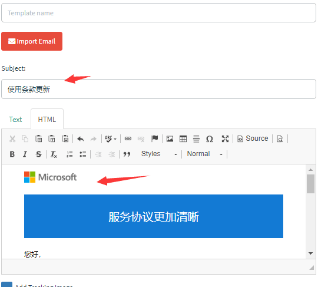
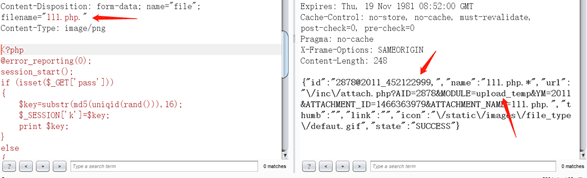

# 邮件钓鱼平台搭建以及基础使用场景

[酒仙桥六号部队](https://www.secpulse.com/newpage/author?author_id=33870)

2020-11-23

这是 **酒仙桥六号部队** 的第 **111** 篇文章。

全文共计 5999 个字，预计阅读时长 16 分钟。

**前言**

一个风和日丽的下午，和平常一样，审审漏洞，然后逛逛其他相关的安全论坛，翻看其他大佬们的漏洞挖掘思路，一天就这样过去了，当准备要下班的时候，发现微信一直响个不停，心里想完了（下班无望），看来又有新项目要开始了，于是打开微信，果不其然，自己猜对了。


邮件钓鱼演练，听到这几个词语，一脸懵逼，what？？？由于之前的工作一直都是以 web 挖洞为主，突然让搞一个邮件钓鱼，可把我难住了，既然领导派下来的活，硬着头皮也得干，那就这样吧，说做就做。


心里想，既然要搞邮件钓鱼，那就先了解一下什么是邮件钓鱼，怎么在项目中快速搭建邮件钓鱼环境以及完成钓鱼邮件工作。

**背景：**

目前越来越多的红蓝对抗中，钓鱼邮件攻击使用的越来越频繁，也是比较高效打点的一种 方式，常见的钓鱼邮件攻击一种是直接通过二维码，内嵌链接、直接索要敏感信息等方式钓运维人员、内部人员相关的管理账号密码，另一种通过携带 exe、execl、word 等附件（附件中要么包含恶意宏代码、要么是远控 exe）的方式，诱导运维人员、内部员工点击相关的附件，以达到控制运维人员或者内部员工电脑的权限。但是一般项目中实施周期较短，并且需要进行数据统计等，因此本次主要介绍如何通过 Gophish 和 EwoMail 快速搭建邮件钓鱼平台并介绍一次实战钓鱼邮件场景。

概念性的内容介绍完了，那就开始着手准备相关邮件钓鱼需要的环境吧。

  

**准备的环境和工具**

-   购买相近的域名（比如你需要针对某某公司进行钓鱼，公司邮箱使用的是 aaa@yeesd.com，则可购买相类似的域名，如：yeeesd.com，多了一个小写的 e，如果不仔细去看的话，一般员工会认为该钓鱼网站即是公司的官网地址）
    
-   2 台 vps（1 台搭建邮件服务器、1 台搭建 Gophish）
    
-   Gophish 的版本 v0.9.0
    
-   EwoMai 的版本 v1.06
    

  

**具体搭建过程**

## Gophish 搭建

建议在 centos7（windows 中搭建 gophish，虽然比较方便，但是如果买的 vps 不是高配版，建议不要在 windows 中搭建 gophish，经测试，太卡了）在 github 上根据不同操作系统下载对应版本即可，本次下载如下版本。

```plain
gophish-v0.9.0-linux-64bit.zip

https://github.com/gophish/gophish/releases
```


解压并启动。

```plain
mkdir -p /app/gophish

unzip gophish-v0.9.0-linux-64bit.zip -d /app/gophish/ &&

cd /app/gophish/
```


此时需要修改 config.json,（如下是本次已经修改完成的，之前的配置是 127.0.0.1:3333）。

80 端口代表钓鱼网站开放的端口；后台管理页面开放的端口是 3333，默认的账号和密码是 admin/gophish。


后台直接运行，目前环境即搭建完成。

```plain
./gophish &
```


进行测试 首先访问钓鱼页面端口是否正常，直接访问如下地址 http://x.x.x.x


后台管理系统如下：

```plain
https://x.x.x.x:3333/
```


Gophish 搭建完成。

## EwoMail 搭建

官网直接下载开源的项目。

```plain
https://gitee.com/laowu5/EwoMail
```


此处直接按照官方文档进行一步步搭建以及配置域名即可（前期是先买好相关的相类似域名）。

```plain
http://doc.ewomail.com/docs/ewomail/install
```


碰到的坑如下：购买域名以及搭建 EwoMail 的 vps 建议选择国外厂商，国内由于种种的限制，会导致出现莫名奇妙的问题，最终搭建的效果如下所示：

```plain
http://域名:8010
```


新建相关的发件邮件地址即可。


至此目前已经搭建完毕，发现搭建成功后的 Gophish 是英文平台，本人英文属于比较菜的那种，因此花费了不少时间，才熟悉了 Gophish 的基本使用，那就先简单介绍一下具体的使用吧，一方面为了自己巩固，另一方面，也方便后续其他与我碰到相同项目的同事，能够快上手搭建钓鱼邮件平台以及展开钓鱼邮件测试。

  

**实战钓鱼攻击**

进行实战钓鱼测试时，需要提前配置好 Gophish 该系统具有如下几个功能，均需要进行配置。

| 功能  | 简述  |
| --- | --- |
| Dashboard | 仪表板，查看整体测试情况 |
| Campaigns | 每次攻击前需要配置一次 |
| Users & Groups | 用户和用户组（添加需要进行钓鱼的邮箱和相关基础信息） |
| Email Templates | 电子邮件模板 |
| Landing Pages | 需要伪造的钓鱼页面 |
| Sending Profiles | 钓鱼邮箱发送配置 |

## Sending Profiles-邮箱配置

填写刚才新建的发送邮箱地址和用户名。


配置完成后，需要测试一下是否可正常发送邮件，使用如下自带的测试功能（Send Test Email）。


如下是我的 QQ 邮箱收到的测试邮件。


**注意点：** 此处需要注意的是 Host 处，不能采用 smtp 默认端口：25 端口，因为大部分的云厂商因为 监管要求，为防止邮件泛滥，都将 25 端口禁用了，因此可采用带有 SSL 的 SMTP 服务的端 口：465 端口。

## Users& Groups-邮件用户和组

此时就可以进行下一步的配置，设置要进行钓鱼攻击的邮箱地址，“Users& Groups”。


一般项目中或者真实测试中需要批量发送邮件，因此可通过上传 CVS 文件，进行批量添加。


## Email Templates-钓鱼邮件模板

创建相应的钓鱼邮件模板 此处钓鱼模板可直接进行编辑，也可导入其他邮箱的模板。

方式一：自己编辑。


为了后续记录邮件是否打开，可勾选上 AddTrackingImage，它将会在发送的每份邮件源码上插入一个唯一特定的隐藏图片，当邮件被打开时，此隐藏图片则也会被请求，以此来检测该邮件是否被打开，AddFiles 则是给邮件添加附件。如下是官方提供的其他可以使用的参数。

| ariable | Description |
| --- | --- |
| {{.RId}} | The target's unique ID |
| {{.FirstName}} | The target's first  name |
| {{.LastName}} | The target's last name |
| {{.Position}} | The target's position |
| {{.Email}} | The target's email  address |
| {{.From}} | The spoofed sender |
| {{.TrackingURL}} | The URL to the  tracking handler |
| {{.Tracker}} | An alias for |
| {{.URL}} | The phishing URL |
| {{.BaseURL}} | The base URL with the  path and rid parameter stripped. Useful for making links to static files. |

针对如上提供的参数进行测试。


如下是收到的邮件结果。


可根据实际的钓鱼场景使用合适的参数，增加钓鱼邮件内容的真实性。

方式二：导入其他邮箱已有模板 首先将原有的邮件导出为 eml 格式。


然后通过 notepad++ 打开，复制所有的内容。


默认会选择 Change Links to Point to Landing Page，将图中链接替换成钓鱼页面链接，点击 import，即可成功导入。




**注意点：**

1、如果需要去统计哪些人点开了钓鱼邮件，哪些人打开了钓鱼页面，需要在钓鱼邮件模板 中的 html 进行更改和添加，在 Text 中进行操作，后续是无法正常进行记录的。

2、AddTrackingImage 功能记录不是很准确，仅作参考，因为部分邮件软件会将邮件中插 入的隐藏图片识别为恶意代码，不允许显示该图片，经实际测试，大部分的邮件软件不会 进行拦截的。


## Landing Pages-伪造钓鱼页面

配置好钓鱼邮件后，就可以通过 LandingPages 模块来新建钓鱼网站页面，此处支持手写 html 文件，也可通过导入网站功能，针对目标网页进行克隆，克隆如下登陆页面。


点击 Import Site。


效果如下所示。


将这两个功能均选上 CaptureSubmitted Data 和 CapturePasswords，记录受害者输入的账号和密码。

Redirect to 填写该页面真实的地址，方便受害者点击完提交按钮后，自动跳转至真正的网站。


## Campaigns-钓鱼测试

配置 Campaigns，填写 Name、选择钓鱼邮件模板、选择钓鱼网站模板、填写钓鱼网站 URL、填写发件邮箱、选择受害者邮件组。

**注意点：** 其中钓鱼网站 URL 根据实际钓鱼邮件测试情况，填写对应的地址，本次由于使用的是 Gophish 默认的钓鱼页面，因此填写的是本服务器的地址，（其中 URL 处为了真实的进行钓鱼，也可绑定类似的域名地址，建议使用国外的域名和云 vps，由于本次搭建环境时，使用的阿里云的服务器和域名，并且域名未进行备案，导致绑定该钓鱼页面后，阿里云直接识别，并提示需要备案后，钓鱼网站才可正常使用，因此本次使用的是 IP 直接进行访问）。


点击 Launch Campaign 即可成功发起一次钓鱼邮件攻击测试。

## Dashboard-仪表板

通过如下查看钓鱼邮件测试的实际情况。


当点开邮件后，查看 gophish 平台，此时已经有相关的打开记录，Email Opened。


当点击如下地址时，则会直接跳转至钓鱼的页面。


类似于这样的地址：

  

```plain
http://x.x.x.x/?rid=tSdIyGl
```


此时查看 gophish 平台，已经有相关的记录。Clicked Link。


当输入完相关的账号和密码，则会跳转至设置好的跳转真实地址（以便受害者更加相信此地址是真实的地址），如下所示：


此时查看 gophish 平台，已经记录了相关的账号和密码。


可通过 Export CSV 功能将目前的钓鱼情况结果导出来。


导出的钓鱼测试结果如下所示：


至此已经完成相关简单钓鱼邮件测试的需求。

小记：一些简单的钓鱼邮件场景均可通过此平台完成，也可与其他平台进行结合使用。

可能 gophish 的伪造钓鱼页面功能无法满足需要，也可自己搞个钓鱼页面服务器，然后将 Campaigns 功能中的 URL 处填写自己构造的钓鱼页面地址即可。

  

**常见基础钓鱼使用场景**

  

## 场景一

通过模仿领导邮件，去钓运维人员、内部人员相关的个人账号或者\*\*\*等敏感信息。


## 场景二

以最近某段时间的最新时事展开钓鱼，比如：前段时间新冠肺炎疫情，可以以它为一个钓鱼点，发送相关的钓鱼邮件，获取员工相关账号和密码，或者员工的个人敏感信息，如姓名、\*\*\*号、家庭住址、家庭情况等敏感信息。

例 1：


例 2：

其中附件也可为 word，word 中携带包含恶意宏代码，诱导用户点击，达到控制个人 PC 机的目的。


## 场景三

根据最新爆发的漏洞，然后以伪造公司安全运维管理部门的钓鱼邮箱给全体员工发送为防范最 新漏洞，现已将最新漏洞补丁通过邮件附件形式发放，需要大家下载附件中最新漏洞补丁（exe 为免杀的远控木马等）如：


## 场景四

伪造公司服务器被攻击等理由进行邮件钓鱼攻击。

如：


此处提前构造相类似的邮件平台。


## 场景五

构造钓鱼二维码，诱导员工扫描钓鱼二维码，钓员工相关的账号和密码。


扫描完之后，跳转至钓鱼页面（本次仅嵌入 baidu.com 搜索页面做验证）。


  

**邮件钓鱼演练实战**

既然介绍了这么多基础知识，那就开始进行实战钓鱼邮件演练呗，首先通过上述的钓鱼场景，构造了一个模仿领导邮件，去钓运维人员、内部人员相关的个人账号或者\*\*\*等敏感信息。


通过 Gophish 发送成功后，那就静静的等鱼儿上钩呗。


等呀等，一直等了快 1 个小时，发现没有任何反应，看来员工的安全意识还是不错呀，第一份邮件，以失败告终。

既然这种类型的邮件，发送不过去，那就换种类型呗，于是乎，就又搞了一个附件邮件的形式，本次采用 exe 后缀的木马，为了方便，直接通过 CS 生成一个 exe 的木马，过程如下：

首先进行反弹 shell 监听。


然后生成相应的 exe。


利用钓鱼场景三进行邮件钓鱼，最终的钓鱼邮件形式如下所示：


然后通过 gophish 平台去进行批量发送，这次总该可以了吧，如下是发送成功的截图，但是一直都没有一个用户邮箱去打开邮件，最终问了企业内部的管理员才知道，原来是反垃圾邮件安全网关将所有携带 exe 附件的邮件均进行拦截，才导致邮件根本就没有发送到用户的邮箱。


那既然不能携带附件，那我直接在邮件内容中嵌入一个下载链接，不就可以了，那就再继续制作相应的钓鱼邮件样本。


然后再制作一个钓鱼页面，作用是：当用户访问该地址时，则会直接下载该木马。


然后再次批量发送一次，等了一会，发现有不少用户收到了该钓鱼邮件，并且打开了钓鱼邮件，说明该反垃圾邮件安全网关仅拦截了带附件的 exe，但是并未拦截邮件正文中嵌入链接的钓鱼邮件。


那再继续等等看，应该会有不少员工会点击此钓鱼链接，下载木马，果不其然，有几个安全意识薄弱的员工下载了该 exe 木马。


对于真实环境下的邮件钓鱼，只要能钓到一个内部员工的相关信息或者控制该员工的终端，危害都是不可控制的。

那既然有员工都点击了，那肯定会有员工点击下载的 exe 木马的，果不其然，查看 CS，发现有两台主机已上线。


由于客户未允许进行内网渗透，因此未进一步深入利用，至此第一个邮件钓鱼顺利完成。

想着这下可以休息了，但是当时任务要求是发送 2 到 3 个钓鱼邮件模板，那就继续再制作新类型的模板继续进行测试。

接下来这个钓鱼模板就不再沿用携带附件木马了，通过前期的信息收集，知道他们内部使用的是某个 OA 系统，那就伪造一个他们内部的 OA 系统页面，钓一下内部员工的 OA 账号。

使用携带链接的钓鱼模板，估计他们内部也识别出来了，那就伪造一个钓鱼二维码去钓内部员工的 OA 账号，邮件模板如下所示。


然后直接批量发送，大概等了半个多小时，发现终于有员工点击，打开钓鱼邮件的人数不在少数。


然后再等待一会，终于有员工中招了，输入了自己的 OA 账号和密码。


既然已经得到了 OA 的账号和密码，那就直接通过账号密码登录呗，如下所示，登录成功。


既然已经登到了后台，那肯定要拿 shell，已经知道该 OA 的类型，直接通过已有的 exp 打就完事了，此处的后台处存在任意文件上传，可直接上传 webshell，测试过程如下：

首先选择电子邮箱。


写邮件处，添加图片，如下所示。


首先上传一个正常的图片，抓取到如下的 POST 请求包。


正常情况下，直接将 png 后缀修改为 php 无法进行上传，此处可将 png 改为 php. 绕过限制，真实存储到服务器的文件名不符合 windows 命名规范，系统将自动去掉最后的点号。



Webshell 的地址为：http://x.x.x.x/upload\_temp/2011/452122999.111.php，冰蝎成功连接。

最高权限：


至此，钓鱼工作顺利完成了。

  

**结尾**

本文主要介绍邮件钓鱼平台的搭建（Gophish 和 EwoMail，也可使用其他平台）和具体的实战演练、最后简单介绍常规的钓鱼邮件场景以及真实的一次钓鱼实战。

  


**本文作者：[酒仙桥六号部队](https://www.secpulse.com/archives/newpage/author?author_id=33870)**

**本文为安全脉搏专栏作者发布，转载请注明：**[**https://www.secpulse.com/archives/147030.html**](https://www.secpulse.com/archives/147030.html)

Tags: [25 端口](https://www.secpulse.com/archives/tag/25%e7%ab%af%e5%8f%a3)、[465 端口](https://www.secpulse.com/archives/tag/465%e7%ab%af%e5%8f%a3)、[Campaigns](https://www.secpulse.com/archives/tag/campaigns)、[dashboard](https://www.secpulse.com/archives/tag/dashboard)、[Email Template](https://www.secpulse.com/archives/tag/email-template)、[EwoMail](https://www.secpulse.com/archives/tag/ewomail)、[Gophish](https://www.secpulse.com/archives/tag/gophish)、[Groups](https://www.secpulse.com/archives/tag/groups)、[Landing Pages](https://www.secpulse.com/archives/tag/landing-pages)、[Sending Profiles](https://www.secpulse.com/archives/tag/sending-profiles)、[Users](https://www.secpulse.com/archives/tag/users)、[web 挖洞](https://www.secpulse.com/archives/tag/web%e6%8c%96%e6%b4%9e)、[恶意宏代码](https://www.secpulse.com/archives/tag/%e6%81%b6%e6%84%8f%e5%ae%8f%e4%bb%a3%e7%a0%81)、[邮件钓鱼](https://www.secpulse.com/archives/tag/%e9%82%ae%e4%bb%b6%e9%92%93%e9%b1%bc)、[钓鱼攻击](https://www.secpulse.com/archives/tag/%e9%92%93%e9%b1%bc%e6%94%bb%e5%87%bb)、[钓鱼测试](https://www.secpulse.com/archives/tag/%e9%92%93%e9%b1%bc%e6%b5%8b%e8%af%95)
