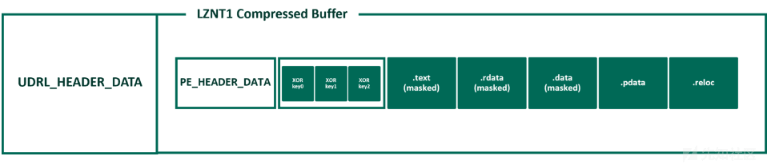

重新审视用户定义的反射加载器第 2 部分：混淆和屏蔽（翻译）

- - -

# 重新审视用户定义的反射加载器第 2 部分：混淆和屏蔽

翻译

原文地址：[https://www.cobaltstrike.com/blog/revisiting-the-udrl-part-2-obfuscation-masking](https://www.cobaltstrike.com/blog/revisiting-the-udrl-part-2-obfuscation-masking)

这是重新审视用户定义反射加载器 (UDRL) 系列的第二部分。在[第一部分](https://www.cobaltstrike.com/blog/revisiting-the-udrl-part-1-simplifying-development)中，我们旨在简化自定义加载程序的开发和调试，并介绍了用户定义的反射加载程序 Visual Studio (UDRL-VS) 模板。

在本期中，我们将在原始 UDRL-VS 加载程序的基础上构建，并探索如何将我们自己的自定义混淆和屏蔽应用到具有 UDRL 的信标。这篇文章的主要目的是向 UDRL 开发人员展示 Cobalt Strike 中的巨大灵活性，并为用户提供代码示例以应用于内部项目。

为了配合这篇文章，我们在 UDRL-VS 套件中添加了一个“混淆加载器”，并对解决方案本身进行了一些更改。UDRL-VS 最初是一个简单的示例加载器，您可以在 Visual Studio 中调试它。它现在是一个加载器函数库，并将随着时间的推移而增长。目前，我们有一个“default-loader”（原始的 UDRL-VS loader）和一个“obfuscation-loader”（本文中描述的示例）。迁移到库会简化套件的维护，同样也改善开发自定义加载程序时的用户体验。

此外，我们最近还发布了[《Cobalt Strike》和《YARA：能给我你的签名吗？》](https://www.cobaltstrike.com/blog/cobalt-strike-and-yara-can-i-have-your-signature/)我们讨论了内存中 YARA 扫描的概念以及屏蔽、混淆和定制对于逃避静态检测的重要性。作为该帖子的一部分，我们展示了 Beacon 在默认状态下对 YARA 等防御工具的敏感性，因此强烈建议阅读它以了解一些额外的背景和上下文。

## UDRL 与 Malleable C2

Cobalt Strike 允许用户通过其可延展的 C2 配置文件来混淆 Beacon。例如， `stage{}` 块可用于修改 RAW Beacon 有效负载并定义如何将其加载到内存中。虽然这提供了灵活性，但它确实有一些局限性，可能会使 Beacon 暴露在通过 YARA 扫描进行检测的情况下（如 Cobalt Strike 和 YARA 帖子中所示）。最值得注意的是， `stage.obfuscate` 它屏蔽了 RAW Beacon 有效负载的几个方面，但不屏蔽默认反射加载程序、DOS 存根或 Sleep Mask。

作为将 UDRL 应用到 Beacon 的一部分， `stage{}` 块中定义的 PE 修改将被故意忽略。这是因为它们与默认反射加载器的操作紧密耦合。例如，如果某些内容以某种方式被屏蔽，则加载程序将需要知道如何取消屏蔽它。因此，默认的 Beacon 被传递到 `BEACON_RDLL_GENERATE*` 挂钩，以便用户可以自定义它。这使得 UDRL 开发人员能够超越仅使用 `stage{}` 块所能实现的范围，并创建自定义混淆和屏蔽例程来转换 Beacon。

仍然可以使用 Aggressor 脚本来[查询可延展的 C2 配置文件](https://github.com/boku7/BokuLoader/blob/88bbfda41e3f01899b838395addfb831177614fe/dist/BokuLoader.cna#L905)并将其配置应用于 Beacon。然而，在这篇文章中，我们将专门使用 Aggressor 脚本来应用我们的转换。这有助于保持逻辑分离，同时也确保无论可塑性 C2 配置文件如何，我们的修改都能正确应用。

注意：本文章主要介绍 Beacon 在加载到内存之前的混淆和屏蔽。但是，作为加载过程的一部分，我们会取消这些操作以实现执行。因此，在本系列的第 3 部分中，我们将使用 Sleep Mask 对 Beacon 应用运行时掩码，以完成 Cobalt Strike 和 YARA 帖子中概述的覆盖。还需要强调的是，混淆和屏蔽只是 "深度规避 "方法的一个方面。这些文章（第 2 部分/第 3 部分）的内容和 UDRL-VS 工具包中提供的示例仅侧重于解决静态签名和 YARA 等工具的问题。它无助于规避 PE 恶意软件模型的所有功能、不同类型的行为分析或其他更高级的检测技术，如查找线程创建蹦床或检查内核调用堆栈等。

## 设置 Stage{}

在以下部分中，我们将详细介绍 `stage{}` 块中的可用内容，并将其用作转换 Beacon 的起点。

### stage.magic\_mz

`stage{}` 块中有几个选项允许用户修改 Beacon 标头中明显的 PE 文件标记。然而，虽然这些选项提供了定制 Beacon 的灵活性，但它们仅限于其标头的特定方面。例如， `stage.magic_mz_x**` 允许用户覆盖 RAW Beacon 有效负载（MZ 标头）的前 4 个字节。

作为 UDRL 开发的一部分，我们不限于修改特定位置的特定字节。相反，我们可以在任何位置修改任何值。这意味着我们可以扩展 `stage.magic_mz` 等选项背后的想法，并使用 Aggressor Script 来完全转换 Beacon 的 PE 标头。

为了演示这个想法，我们用如下所示的自定义 `PE_HEADER_DATA` 和 `SECTION_INFORMATION` 结构替换了 Beacon 的原始 PE 标头。这些结构仅包含 PE 标头中可用信息的子集，但仍然包含我们的反射加载器加载 DLL 所需的一切。有关自定义可执行格式的更多信息，请参阅 [Hasherezade](https://twitter.com/hasherezade) 的优秀著作[《从 Hidden Bee 到 Rhadamanthys - 定制可执行格式的演进》](https://research.checkpoint.com/2023/from-hidden-bee-to-rhadamanthys-the-evolution-of-custom-executable-formats/)。

*注意：由于大量签名针对反射加载程序的 DOS 存根。我们选择对混淆加载器使用“Double Pulsar”方法。此处描述的相同技术可以扩展到与“Stephen Fewer”样式加载器一起使用，但这可以留给读者作为练习。*

```plain
typedef struct _SECTION_INFORMATION {
    DWORD VirtualAddress;
    DWORD PointerToRawData;
    DWORD SizeOfRawData;
} SECTION_INFORMATION, *PSECTION_INFORMATION;

typedef struct _PE_HEADER_DATA {
    DWORD SizeOfImage;
    DWORD SizeOfHeaders;
    DWORD entryPoint;
    QWORD ImageBase;
    SECTION_INFORMATION Text;
    SECTION_INFORMATION Rdata;
    SECTION_INFORMATION Data;
    SECTION_INFORMATION Pdata;
    SECTION_INFORMATION Reloc;
    DWORD ExportDirectoryRVA;
    DWORD DataDirectoryRVA;
    DWORD RelocDirectoryRVA;
    DWORD RelocDirectorySize;
} PE_HEADER_DATA, *PPE_HEADER_DATA;
```

为了创建上述标头结构，我们使用 Aggressor Script 的 `pedump()` 函数生成 Beacon 的 PE 标头 ( `%pe_header_map` ) 的映射。然后，我们使用 Sleep 的 `pack()` 函数将所需的信息“打包”到字节序列中。在下面的代码示例中，从 `%pe_header_map` 查询 `PE_HEADER_DATA` 结构的前三个值并将其“打包”到名为 `$pe_header_data` 的字节序列中。格式字符串“I-I-I-”以小端字节顺序指定三个 4 字节无符号整数值 (DWORD)。

*注意：Sleep 使用“标量”的概念，“[标量](http://sleep.dashnine.org/manual/fundamentals.html#1)”是通用数据容器。Sleep 中的变量是由 `$` 指示的标量，可以保存字符串、数字甚至对 Java 对象的引用。 `%pe_header_map` 是由 `%` 符号指示的“哈希缩放器”。这是一种可以保存与一个键关联的多个值的数据类型。*

```plain
$pe_header_data = pack(
    "I-I-I-", 
    %pe_header_map["SizeOfImage.<value>"],
    %pe_header_map ["SizeOfHeaders.<value>"],
    %pe_header_map ["AddressOfEntryPoint.<value>"]
);
```

为了替换 Beacon 的原始 PE 头，我们使用 Sleep 的 `substr("string", start, [end])` 函数来提取仅包含 Beacon 的 PE 部分的字节序列。然后就可以将其附加到我们新创建的 `$pe_header_data` 结构中。

```plain
# create custom header structure
$pe_header_data  = create_header_content(%pe_header_map);

# determine size of Beacon’s Pe header
$size_of_pe_headers = %pe_header_map["SizeOfHeaders.<value>"];

# remove Beacon's original PE header
$beacon_pe_sections = substr($beacon, $size_of_pe_headers);

# append PE sections to newly created header structure
$modified_beacon = $pe_header_data . $beacon_pe_sections;
```

为了清楚起见，以上内容已在下图中进行了说明：

[](https://xzfile.aliyuncs.com/media/upload/picture/20240126005630-afccc2fe-bba2-1.png)

图 1. 原始 Beacon 与修改后的 Beacon。

为了支持上述更改，我们必须对加载器进行一些修改。最重要的是，我们必须删除对原始 PE 标头的引用并更新它以解析 `PE_HEADER_DATA` 结构。此外，当我们从 Beacon 中删除大量数据时，我们必须确保加载器仍然可以正确复制它。

前面显示的 `SECTION_INFORMATION` 结构中的 `PointerToRawData` 值是“文件指针”。文件指针是存储在磁盘上的给定 PE 文件中的一个位置（在加载之前）。因此，删除 Beacon 的 PE 标头后， `PointerToRawData` 值不正确，因为 `SizeOfHeaders` ( `0x400` ) 太大。简单来说，在 Beacon 的原始 PE header 中， `.text`部分的 `PointerToRawData` 值为 `0x400` 。但是，删除标头后， `.text` 部分从 `0x0` 开始。因此，加载器必须从原始值中减去 `0x400` （PE 标头的大小）才能正确识别该部分。可以对每个 `PointerToRawData` 值执行减法，但更简单的方法是偏移 RAW Beacon 本身的基地址。例如，如果基地址偏移到 `-0x400` ，那么当我们可以使用原始 `PointerToRawData` 值（ `0x400` ）来查找 `.text` 部分位于 `0x0` 。这个偏移量可以在下面的代码示例中看到。

```plain
// Identify the start address of Beacon
PPE_HEADER_DATA peHeaderData = (PPE_HEADER_DATA)bufferBaseAddress;
char* rawDllBaseAddress = bufferBaseAddress + sizeof(PE_HEADER_DATA);

// Offset the start address by SizeOfHeaders
rawDllBaseAddress -= peHeaderData->SizeOfHeaders;
```

上述修改确保加载器能够成功识别每个部分并将它们加载到内存中。但是，加载的图像在其起始地址和 `.text` 部分之间仍然包含大量空间。这是因为我们的加载程序将 RAW Beacon DLL 复制到新分配的内存中，位于 `SECTION_INFORMATION` 结构中的 `VirtualAddress` 指定的位置。 `VirtualAddress` 是相对虚拟地址（RVA），表示项目加载到内存后的地址。该值与映像的基地址“相关”，这意味着它占 PE 标头。同样，我们也可以从每个值中减去 PE 头的虚拟大小 ( `0x1000` )，但更简单的选择是偏移加载映像的基地址。这确保了包含加载的 Beacon 映像的内存区域以 .text 部分开始，而不是 PE 标头或任何空白区域。

[](https://xzfile.aliyuncs.com/media/upload/picture/20240126005625-acc2c7b6-bba2-1.png)

图 2. 加载的 Beacon 图像在内存中的布局。

注意： `stage.obfuscate` 可延展的 C2 选项指示默认加载器在将 Beacon 复制到内存时使用类似的方法。

### stage.transform

默认情况下，Beacon 包含一些众所周知的字符串，这些字符串被认为是静态检测中容易实现的目标。可延展的 C2 配置文件使得使用其 `transform-x**{}` 块修改它们变得微不足道，甚至允许用户使用其 `string` / `stringw` 命令添加新字符串。

可以使用 Aggressor Script 中的 `strrep` `()` 函数来替换字符串。然而，它是 Sleep 原生的，这意味着它的运行方式与可延展的 C2 配置文件中的略有不同。例如，Sleep 的 `func_strrep()` 使用 Java 的 `replace()` 方法，这意味着它用新字符串完全替换了原始字符串。这可以在下面的屏幕截图中看到。

[](https://xzfile.aliyuncs.com/media/upload/picture/20240126005620-aa2d3e82-bba2-1.png)

图 3.Java 的 `replace()` 方法

修改 PE 文件时，这种类型的修改会出现问题，因为它可能会更改受影响部分的大小，并导致加载程序或 PE 文件在执行期间崩溃。为了克服这个问题，我们围绕 Sleep 的 `strrep()` 创建了一个简单的包装器，称为 `strrep_pad()` 。该函数用于在替换之前用 NULL 字节填充输入字符串（与可延展 C2 的 `strrep` 命令类似）。然后，我们将“beacon.x64.dll”和“ReflectiveLoader”替换为“udrl.x64.dll”和“customLoader”，如下面的 CFF Explorer 所示。

[](https://xzfile.aliyuncs.com/media/upload/picture/20240126005614-a67f3100-bba2-1.png)

图 4.修改后的信标字符串。

注意：可以通过 [setup\_transformations()](https://hstechdocs.helpsystems.com/manuals/cobaltstrike/current/userguide/content/topics_aggressor-scripts/as-resources_functions.htm?_gl=1*7lcxnj*_ga*MzQ1NTI5MTYuMTcwMjM4MTQ4Mg..*_ga_HNS2ZVG55R*MTcwNjE5NzQ4Mi4yNS4xLjE3MDYxOTgxMTMuNjAuMC4w#setup_transformations) 在 Aggressor 脚本中应用可延展 C2 配置文件的 `transform-x**` 块的内容。此外，可延展 C2 配置文件中定义的字符串可以与 [setup\_strings()](https://hstechdocs.helpsystems.com/manuals/cobaltstrike/current/userguide/content/topics_aggressor-scripts/as-resources_functions.htm?_gl=1*1esot2p*_ga*MzQ1NTI5MTYuMTcwMjM4MTQ4Mg..*_ga_HNS2ZVG55R*MTcwNjE5NzQ4Mi4yNS4xLjE3MDYxOTgxMTMuNjAuMC4w#setup_strings) 一起使用。然而，正如本文开头所述，我们选择仅在 Aggressor 脚本中应用我们的转换

### stage.obfuscate

作为 Cobalt Strike 和 YARA 帖子的一部分，我们讨论了 `stage.obfuscate` 可延展的 C2 选项，并强调尽管掩盖了 Beacon 的某些方面，但它仍然暴露了很多东西。在前面的部分中，我们实现了 `stage.obfuscate` 的一些功能，因为我们在将 Beacon 的 PE 标头加载到内存中时删除了它。但是，它还掩盖了 Beacon 的 `.text` 部分及其导入地址表 (IAT)，这很重要，因为有大量 YARA 规则针对它们。

有一个名为 [pe\_mask\_section()](https://hstechdocs.helpsystems.com/manuals/cobaltstrike/current/userguide/content/topics_aggressor-scripts/as-resources_functions.htm?_gl=1*19g7e9q*_ga*MzQ1NTI5MTYuMTcwMjM4MTQ4Mg..*_ga_HNS2ZVG55R*MTcwNjE5NzQ4Mi4yNS4xLjE3MDYxOTgxMTMuNjAuMC4w#pe_mask_section) 的现有 Aggressor 脚本函数，可以轻松地使用单字节键屏蔽某个部分。此外，[Bobby Cooke](https://twitter.com/0xBoku) 在 [BokuLoader](https://github.com/boku7/BokuLoader) 中演示了可以使用 Aggressor Script 来[屏蔽 IAT 中的每个字符串](https://github.com/boku7/BokuLoader/blob/88bbfda41e3f01899b838395addfb831177614fe/dist/BokuLoader.cna#L1017C4-L1017C4)。

虽然屏蔽 Beacon 的 `.text` 部分及其 IAT 将提供与可延展的 C2 配置文件相同的功能，但我们从 Cobalt Strike 和 YARA 得知，这仍然会使 Beacon 的部分内容暴露。因此，我们希望创建一个更通用的功能，可以使用随机生成的可变长度密钥来掩盖这些易受攻击的部分（ `.text` 、 `.rdata` `.data` ）。

在高次层上，我们的方法是将 XOR 密钥的缓冲区附加到 `PE_HEADER_DATA` 结构并在运行时动态检索它们。这使我们能够为每个导出的工件添加变化，而无需重新编译加载程序。下图说明了这种方法。

[](https://xzfile.aliyuncs.com/media/upload/picture/20240126005604-a020e466-bba2-1.png)

图 5. 修改后的制品的高层次概述。

为了确保我们可以从此缓冲区检索 XOR 密钥，我们更新了 `PE_HEADER_DATA` 结构以包含每个 XOR 密钥的长度。

```plain
typedef struct _PE_HEADER_DATA {
   […SNIP…]
  DWORD TextSectionXORKeyLength;
  DWORD RdataSectionXORKeyLength;
  DWORD DataSectionXORKeyLength;
} PE_HEADER_DATA, *PPE_HEADER_DATA;
```

然后可以使用这些值来索引缓冲区并确定每个密钥的起始地址。这也意味着每个导出的有效负载之间的密钥长度可能会发生巨大变化，并且加载器仍然能够检索它们。

为了简化运行时加载器中 XOR 密钥的使用，我们创建了一个 `KEY_INFO` 结构来提供每个键及其长度的抽象表示。然后，我们添加 `XOR_KEYS` 对每个 `KEY_INFO` 结构执行相同的操作。

```plain
typedef struct _KEY_INFO {
    size_t KeyLength;
    char* Key;
} KEY_INFO, *PKEY_INFO;

typedef struct _XOR_KEYS {
    KEY_INFO TextSection;
    KEY_INFO RdataSection;
    KEY_INFO DataSection;
} XOR_KEYS, *PXOR_KEYS;
```

以下代码示例演示了上述方法。最初，`PE_HEADER_DATA` 的大小用于查找第一个 XOR 密钥的起始地址。然后，使用 `peHeaderData` 中的 XOR 密钥长度来标识每个后续密钥的起始地址。

```plain
PPE_HEADER_DATA peHeaderData = (PPE_HEADER_DATA)rawDllBaseAddress;
XOR_KEYS xorKeys;
xorKeys.TextSection.key = rawDllBaseAddress + sizeof(PE_HEADER_DATA);
xorKeys.TextSection.keyLength = peHeaderData->TextSectionXORKeyLength;
xorKeys.RdataSection.key = xorKeys.TextSection.key + peHeaderData->TextSectionXORKeyLength;
xorKeys.RdataSection.keyLength = peHeaderData->RdataSectionXORKeyLength;
xorKeys.DataSection.key = xorKeys.RdataSection.key + peHeaderData->RdataSectionXORKeyLength;
xorKeys.DataSection.keyLength = peHeaderData->DataSectionXORKeyLength;
```

## 混淆与 YARA

在前面的部分中，我们描述了混淆和屏蔽 Beacon 的方法。现在，我们可以根据 [Elastic 的 Cobalt Strike 开源 YARA 规则集合](https://github.com/elastic/protections-artifacts/blob/main/yara/rules/Windows_Trojan_CobaltStrike.yar)（如之前在 Cobalt Strike 和 YARA 文章中使用的那样）测试修改后的工件。

我们再次感谢 Elastic 的全面规则集。此外，我们还想重申，这并不是为了逃避特定供应商的指导。我们专注于公开的静态检测，这无疑只是现代 EDR 所采用的纵深防御方法的一方面。在下面的屏幕截图中，我们扫描了默认的 RAW Beacon 有效负载，然后扫描了我们修改后的工件。我们可以看到默认的有效负载很容易检测，但混淆的 Beacon 没有触发任何 YARA 规则。

[](https://xzfile.aliyuncs.com/media/upload/picture/20240126005553-99ce0332-bba2-1.png)

图 6.YARA 对 RAW Beacon 有效负载和修改后的工件进行扫描。

## 多走一英里

在前面的部分中，我们基于 Cobalt Strike 中现有的可延展 C2 选项来创建对静态检测具有 robust 的信标有效负载。虽然上面详述的转换被证明是有效的，但有许多现代恶意软件利用多层混淆和屏蔽作为其防御规避策略的一部分的例子。例如，[Roshtyak 恶意软件变种](https://decoded.avast.io/janvojtesek/raspberry-robins-roshtyak-a-little-lesson-in-trickery/)使用 14 层混淆。

可以理解的是，应用 14 层混淆的过程超出了本文的范围。然而，Elastic 的安全实验室最近发布了 [Blister loader](https://www.elastic.co/security-labs/blister-loader)的精彩演练，它使用压缩和加密来添加混淆层。对于我们的示例加载器来说，应用这两个感觉是一个更现实的目标。

在以下部分中，我们将采用 Blister 加载器的方法并演示如何将这些混淆层构建到 UDRL 本身中。因此，我们将通过 Aggressor Script 对修改后的 Beacon 进行压缩和加密。这有助于简化将 Beacon 嵌入不同 stage0 shellcode 运行程序的过程，而且也非常适合 Cobalt Strike 工作流程。例如，当生成或注入信标时。此外，在 Cobalt Strike 4.9 中，我们使用户能够将 UDRL 应用到 postex DLL，这意味着他们也可以从混淆和屏蔽中受益。

注意：这种分层混淆方法还可以提供应用[防御规避](https://attack.mitre.org/tactics/TA0005/)技术的绝佳机会。例如，[执行防护栏](https://attack.mitre.org/techniques/T1480/)或[虚拟化/沙箱规避](https://attack.mitre.org/techniques/T1497/)。

## 运用压缩

压缩的完整描述超出了本博客文章的范围。但从根本上来说，压缩是使用比原始信息更少的位数对信息进行编码的过程。

为了演示如何使用压缩作为反射加载器的一部分，我们在 Aggressor Script 中实现了 Microsoft 的 LZNT1 压缩算法。我们主要选择 LZNT1 因为它受 `RtlDecompressBuffer` `()` 支持。这简化了加载器，因为我们能够使用它来解压缩缓冲区，而不是自己实现解压缩逻辑。此外，Nakatsuru You 已经将 Jeffrey Bush 的 LZNT1 C 实现移植到了 Python，这使得再次将其移植到 Aggressor Script 变得很简单。

注意：本来可以直接从 Aggressor Script [执行 Python](http://sleep.dashnine.org/manual/exec.html) 实现，但为了简单起见，并且我们可以提供一个没有任何其他依赖项的示例，我们花了一些时间在 Sleep 中重写它。作为一些（非常）有限的测试的一部分，LZNT1 压缩算法将默认的 Beacon shellcode (CS 4.8) 从大约 ~296kb 压缩到 ~178kb。由于上一节中描述的转换，压缩算法对混淆的信标不太有效。

下面提供了 `RtlDecompressBuffer()` 的函数原型。

```plain
NT_RTL_COMPRESS_API NTSTATUS RtlDecompressBuffer(
  [in]  USHORT CompressionFormat,
  [out] PUCHAR UncompressedBuffer,
  [in]  ULONG  UncompressedBufferSize,
  [in]  PUCHAR CompressedBuffer,
  [in]  ULONG  CompressedBufferSize,
  [out] PULONG FinalUncompressedSize
);
```

如上所述，可以通过调用一次 `RtlDecompressBuffer()` 来解压缩压缩缓冲区。然而，如其函数原型所示，它需要压缩和解压缩缓冲区的大小。无法从现有的 `PE_HEADER_DATA` 结构中检索这些大小，因为我们已经对其进行了压缩。因此，为了将此信息传递给加载器，我们使用了本文开头描述的相同方法，并创建了一个新的自定义标头结构来保存此信息，称为 `UDRL_HEADER_DATA` 。

```plain
typedef struct _UDRL_HEADER_DATA {
                DWORD CompressedSize;  //the size of the compressed artefact
                DWORD RawFileSize;        //the size of the RAW DLL
                DWORD LoadedImageSize; // the size of the loaded image
} UDRL_HEADER_DATA, * PUDRL_HEADER_DATA;
```

下图说明了此阶段的高级布局。

[](https://xzfile.aliyuncs.com/media/upload/picture/20240126005542-935c9eb4-bba2-1.png)

图 7. 压缩后修改后的制品的高级概述。

在最初的 UDRL-VS 示例中，我们分配了一块内存，并在加载过程中将 Beacon 复制到其中。然而，为了支持压缩，我们需要在加载解压后的 Beacon DLL 之前分配另一块临时内存来存储它。

解压工作流程如下图所示。术语“加载程序内存”是指 UDRL 的原始内存分配。为了简单起见，我们没有在此图中包含加载程序本身。

[](https://xzfile.aliyuncs.com/media/upload/picture/20240126005539-9179e692-bba2-1.png)

图 10. 解密/解压缩工作流程。

在前面的部分中，我们严重混淆了 Beacon。然而，在这样做的过程中，我们显着增加了它的熵，这在尝试逃避 PE 恶意软件模型时可能会出现问题。PE 恶意软件模型中的各种功能的完整描述超出了本文的范围。然而，我们经历过现代 EDR，如果它们包含太多随机性，即使是良性文件也会被强调为可疑。因此，我们认为（非常）简要地演示上述混淆对熵的影响会很有帮助，因为在创建 stage0 shellcode 运行程序时可能需要考虑这一点。

网上有一些关于[使用文件熵进行威胁搜寻](https://redcanary.com/blog/threat-hunting-entropy/)和[在威胁搜寻中使用熵](https://practicalsecurityanalytics.com/file-entropy/)的优秀资源。此外，[Sektor7 的 Windows Evasion](https://institute.sektor7.net/rto-win-evasion) 课程中有一个关于二进制文件熵的部分。因此，这篇文章不会对其进行深入探讨。但从根本上来说，当人们谈论二进制文件熵时，他们通常指的是随机性的度量。

在下面的示例中，我们计算了默认原始信标、模糊信标以及最后压缩/加密版本的熵。我们可以看到这些变换显着增加了熵。因此，任何将高熵视为可疑特征的 PE 恶意软件模型都可能会触发它。

```plain
C:\Tools>sigcheck.exe -a beacon.x64.bin | findstr /I entropy
        Entropy:        6.188
C:\Tools>sigcheck.exe -a beacon.x64.obfuscated.bin | findstr /I entropy
        Entropy:        7.535
C:\Tools>sigcheck.exe -a beacon.x64.obfuscated.lznt1.rc4.bin | findstr /I entropy
        Entropy:        7.999
```

[0xPat](https://twitter.com/0xPat) 发表了一系列有关[恶意软件开发](https://0xpat.github.io/Malware_development_part_1/)的优秀帖子。我们建议阅读全部内容，但作为关于[反静态分析](https://0xpat.github.io/Malware_development_part_4/)的第四篇文章的一部分，他们建议使用 Base64 编码来减少熵，因为其 64 个字符字母表减少了随机性。

Aggressor Script 提供了一个内置的 `base64_encode()` 函数，可以很容易地测试这个假设。我们可以看到 Base64 编码大大降低了熵。

```plain
C:\Tools>sigcheck.exe -a beacon.x64.obfuscated.lznt1.rc4.b64.bin | findstr /I entropy

        Entropy:        6.001
```

[](https://xzfile.aliyuncs.com/media/upload/picture/20240126005516-838c2004-bba2-1.png)

图 11. 压缩、加密和编码后修改后的制品的高级概述。

为了在示例加载器中处理此转换，我们将 `Base64Decode()` 添加到 Obfuscation.cpp。然后可以使用现有的解压缩/解密方法，但只需将缓冲区进行 Base64 解码作为复制操作的一部分。更新后的工作流程如下图所示。

[](https://xzfile.aliyuncs.com/media/upload/picture/20240126005511-80ccdb10-bba2-1.png)

图 12. 解码/解密/解压缩工作流程。

注意：值得注意的是，我们创建的工件最终将位于某种 stage0 shellcode 运行器内。因此，我们需要考虑 shellcode 运行器的熵以及工件本身的熵。默认的 Cobalt Strike 可执行文件具有相对较高的熵，当与我们的混淆示例结合使用时，熵会更大。这是因为 Cobalt Strike 客户端在将 shellcode 踩入默认可执行文件之前，使用一个随机生成的 4 字节密钥对其进行掩码。这实际上消除了 Base64 编码的效果。为了克服这一点，可以导出原始的 shellcode 并创建一个自定义的 shellcode 运行器，或者使用工件工具包修改默认的可执行文件。Cobalt Strike 客户端不会对自定义工件应用此掩码。我们强烈建议开发自定义的 shellcode 运行器，因为默认的 Cobalt Strike 可执行文件已经广泛签名，可能会抵消你对 Beacon 应用的任何混淆。

## 结束语

作为本文的一部分，我们对 Beacon 进行了混淆、压缩、加密和编码，以逃避一组开源静态检测。虽然我们已经演示了一种方法，但我们希望这篇文章已经表明，在 UDRL 中开发您自己的自定义混淆和屏蔽例程时，可能性是无限的。

再次需要注意的是，尽管上面应用了所有混淆和屏蔽。对于 YARA 扫描，除非采取规避操作，否则在默认状态下，Beacon 在内存中检测起来可能很简单。在运行时屏蔽 Beacon 的最简单方法是通过 Sleep Mask 套件。Sleep Mask 的完整描述超出了本文的范围，但是，在本系列的第 3 部分中，我们将演示如何完成上面概述的覆盖范围并在运行时屏蔽混淆加载器。

该代码现在可以在 Arsenal 套件的 udrl-vs 套件中找到。要尝试一下，只需打开解决方案并编译混淆加载器发布版本即可。然后，您可以将 `./bin/examples/obfuscation-loader/prepend-udrl.cna`脚本加载到 Cobalt Strike 控制台并导出工件。

或者，您可以开始在自己的自定义 UDRL 中使用此功能。要创建自定义加载程序，向 UDRL-VS 解决方案添加一个项目，应用 `loader.prop` 属性文件并添加 UDRL-VS 库的引用。然后，您可以创建自己的加载器，可以使用我们的示例加载器函数，也可以编写自己的加载器函数。有关上述所有内容的更多信息，请参阅工具包的 README。
