# 静态程序分析系列 (一)

# [](#%E9%9D%99%E6%80%81%E7%A8%8B%E5%BA%8F%E5%88%86%E6%9E%90%E4%B8%80)静态程序分析 (一)

## [](#1-%E5%89%8D%E8%A8%80)1 前言

### [](#11-%E9%9D%99%E6%80%81%E7%A8%8B%E5%BA%8F%E7%9A%84%E5%AE%9A%E4%BD%8D)1.1 静态程序的定位

**静态程序分析**是**编程语言**中**应用**层面下的一个细分领域，它是一个非常重要的核心内容。

在理论部分，考虑的是如何设计一个语言的语法和语义，如何设计语言的类型系统等等问题；有了语言的语法、语义和类型系统之后，我们需要支撑语言的运行。因此，在环境部分，需要考虑如何为运行中的程序提供运行时环境——如何设计编译器，在运行时需要怎样的支持（如内存的分配管理）等等；应用部分则关注如何保证语言所写出程序的效率、安全性和可靠性，主要考虑如何对程序进行分析，验证和合成（如何自动合成一个程序）。

一句话概括静态分析：在保证正确性的前提下，在精度和速度上做平衡。

### [](#12-%E9%9D%99%E6%80%81%E7%A8%8B%E5%BA%8F%E5%88%86%E6%9E%90%E7%9A%84%E5%BA%94%E7%94%A8)1.2 静态程序分析的应用

1.  提高程序可靠性
    1.  空指针引用与内存泄漏等
2.  提高程序安全性
    1.  [隐私信息泄漏](https://www.ieee-security.org/TC/SP2012/posters/ScanDal.pdf)：多存在于移动应用安全中
    2.  注入攻击
3.  编译优化
    1.  [死代码消除](https://en.wikipedia.org/wiki/Dead_code_elimination)：在编译器的机器无关优化环节，将不会对程序执行结果产生影响的代码（即死代码）删除。
    2.  [循环不变量的代码移动](https://en.wikipedia.org/wiki/Loop-invariant_code_motion)：在编译器的机器无关优化环节，在保证不影响程序执行结果的情况下，将循环中的特定语句移动到循环外，使得程序运行时执行的语句数减少。
4.  有助于程序理解
    1.  为集成开发环境的功能提供帮助：当你使用 VS/Idea/Clion/Eclipse/Android Studio 等等 IDE 时，将鼠标悬停在代码上，IDE 能够动态地分析并提示你所悬停对象的相关信息，背后使用的技术就是静态程序分析。

### [](#13-sound--complete)1.3 Sound & Complete

以上就是静态程序分析所希望做的一些事情，但是实际上静态分析发展至今，依旧不能完美地解决以上的问题。

> Any non-trivial property of the behavior of programs in a r.e. language is undecidable.
> 
> 在一个即**递归可枚举**(recursively enumerable) 语言中，任何程序行为的 **non-trivial** 属性都是不可解释的。**non-trivial property** 指的是那些与程序运行行为有关的属性。
> 
> —— **Rice’s Theorem**

也就是说，Rice 理论告诉我们，世界上并不存在一种**完美的静态分析**，可以完美地解决上文提到的那些问题。

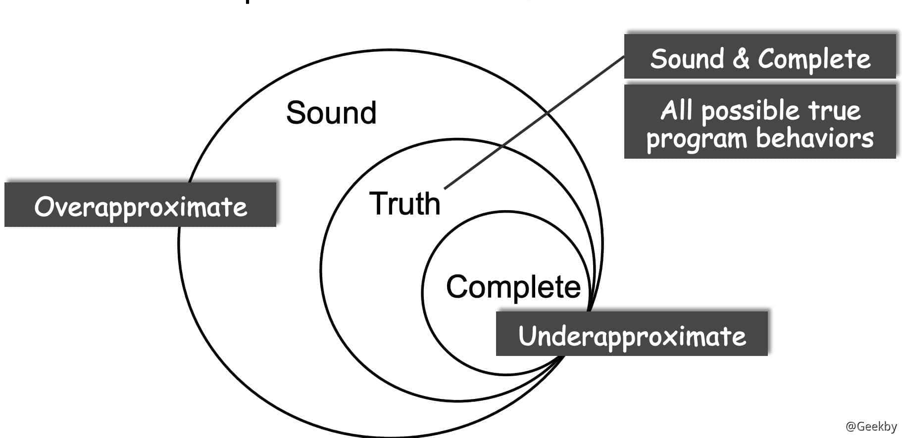

由上图可以直观地看出，三者成包含关系，而完美的程序分析就是中间的 Truth，一个既 Sound 又 Complete 的状况，而我们正常的程序分析只能获得要么 sound 要么 complete 的结果，一种 useful 的结果。

简单来说，sound 是一种过多的输出，输出的是全部的真实报错和部分的虚假报错；而 complete 与之相反，输出的是全是真是报错，但是比 truth 少了一部分的报错。

由上可知，我们在实际使用场景中，自然是希望输出是 sound 的，也就是说可以有误报但不要有漏报。

### [](#14-%E9%9D%99%E6%80%81%E7%A8%8B%E5%BA%8F%E5%88%86%E6%9E%90%E7%9A%84%E6%A0%B8%E5%BF%83)1.4 静态程序分析的核心

#### [](#141-%E6%8A%BD%E8%B1%A1abstract)1.4.1 抽象：Abstract

以符号分析为例，将待分析的具体的变量取值抽象为：正、负、零、未知和错误。

unknown 指的是，如果当前数值会因为变量改变而呈现为不同的状态，则全部定义为 unknown。

undefined 指的是经过判断肯定不符合 int 定义的，例如一个除以 0 的数或者字符等。

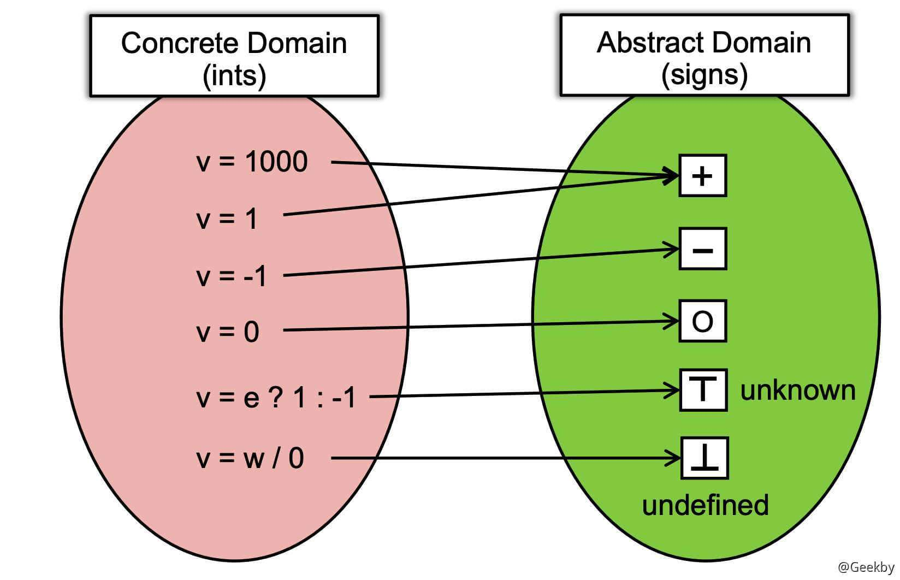

#### [](#142-%E8%BF%91%E4%BC%BCover-approximation)1.4.2 近似：Over-approximation

##### [](#1421-%E8%BD%AC%E7%A7%BB%E5%87%BD%E6%95%B0transfer-function)1.4.2.1 转移函数：Transfer function

在静态分析中，近似的核心是定义转移函数（transfer function）。

-   transfer function 是针对程序中的每一个语句，在抽象值上定义转换规则。
-   transfer function 的规则是根据分析的具体问题与程序语义来定义的。

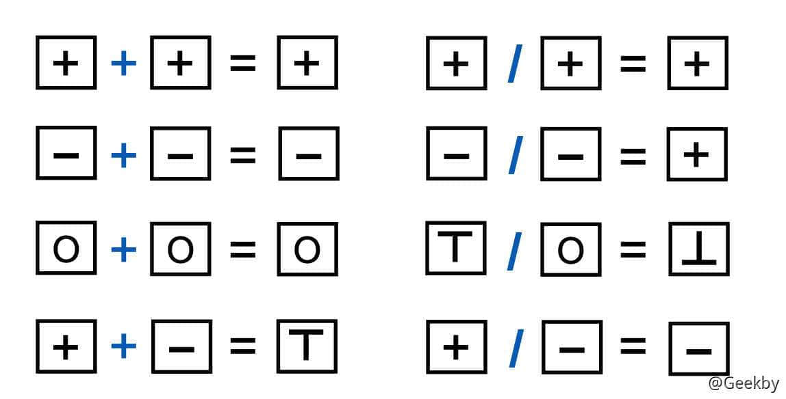

如上图所示：这是针对符号分析定义的部分的转换函数，前五个和第八个一目了然，不做解释。第六个因为除数是 0，故结果是 undefined。第七个是由于我们定义的转换函数是抽象的，进行运算的目标也是抽象出来的，因此相加结果是 unknown 的。举个例子，即使我正数是 1000，负数是 -1，经过抽象后再经过转换函数处理，得到的结果仍是 unknown，这也是 sound 的一种体现。

根据上述的转换函数，可以对程序语句进行分析，最终得到的结果如下。


##### [](#1422-%E6%8E%A7%E5%88%B6%E6%B5%81control-flow)1.4.2.2 控制流：Control Flow

实际上，在程序分析的过程中，近似的过程中还要考虑程序的控制流。

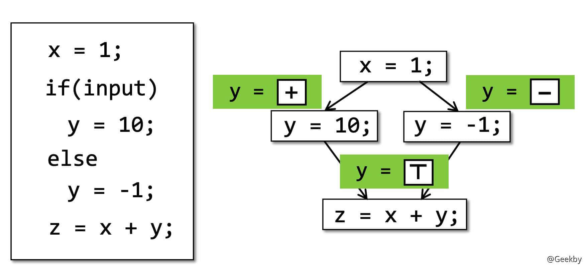

右图是左图的运算流展示，在不同情况下 y 会有值，而根据 sound 原则，在最后一步的 y 值只能是 unknown。

在程序分析中，不可能与枚举所有的路径，因此 `flow merging` （控制流的汇聚）作为一种近似，在静态分析中十分常用。

## [](#2-%E4%B8%AD%E9%97%B4%E8%A1%A8%E7%A4%BAintermediate-representation)2 中间表示：Intermediate Representation

### [](#21-%E7%BC%96%E8%AF%91%E5%99%A8%E4%B8%8E%E9%9D%99%E6%80%81%E5%88%86%E6%9E%90%E5%99%A8)2.1 编译器与静态分析器

首先介绍一下编译器与静态分析器的关系：

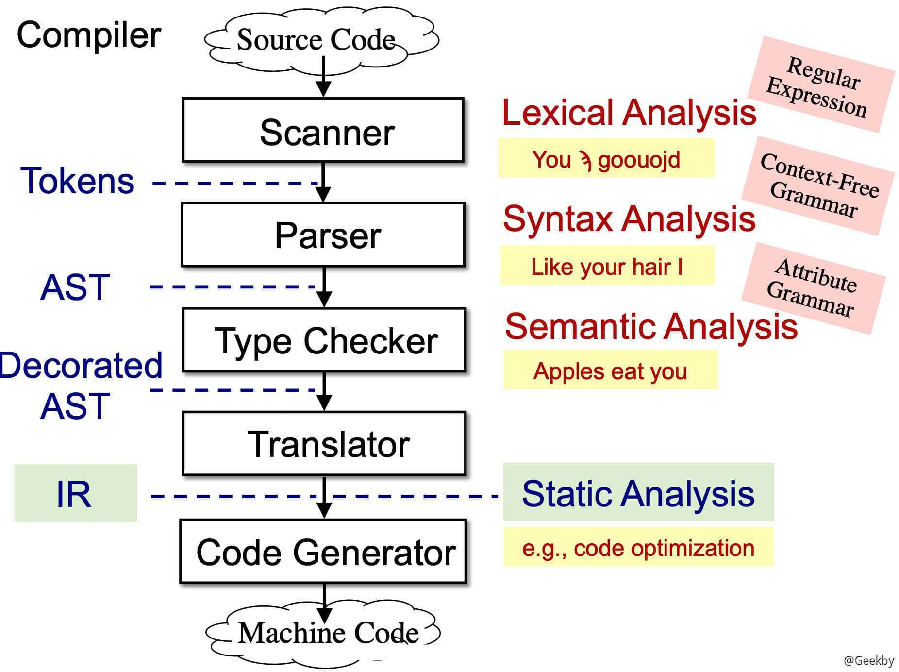

编译器主要目的是为了将程序员写的 Source Code 转换为机器可以理解的 Machine Code，并在转换过程中及时报错。下面以英语的语法规则为例。

第一步，通过扫描器 (Scanner) 对输入进行扫描，根据正则表达式 (Regular Expression) 进行词法分析 (Lexical Analysis)，主要是分析输入的每个字母及单词是否为合法字母及单词，接着将通过检测的内容转换为 Tokens 传入下一步。

第二步，通过解析器 (Parser) 对 Tokens 进行扫描，根据上下文无关语法 (Context-Free Grammar) 进行语法分析 (Syntax Analysis)，主要分析几个单词的组合是否符合语法结构规则，接着将通过检测的内容以抽象语法树 (AST) 的形式传入下一步。其中使用上下文无关语法进行分析是为了加快分析效率。

第三步，通过类型检查 (Type Checker)，根据属性语法 (Attribute Grammar) 进行语义分析 (Semantic Analysis)，理想的目的是为了识别像 apples eat me 这种语法结构正确但是语义错误的情况，但是实际编译器只能识别类如“不可进行 int 除以 string”之类的类型错误，故该步称为类型检测。生成进一步处理后的 AST 传入下一步。

第四步，为了进行静态分析优化，要将 Decorated AST 转换为中间表示 (IR)，一般转换为三地址码，再进行静态分析。最后通过代码生成器将优化后的代码生成机器码传给机器。

### [](#22-ir)2.2 IR

#### [](#221-ast-vs-ir)2.2.1 AST vs. IR

以一个循环为例来阐述 AST 与 IR 的区别。AST 是一个语法树的形式，是一个高层级的形式，更加接近程序的源代码，语言相关的，适合做快速的类型检测，但是**缺少了控制流信息**。

IR 即为中间表示，图中以三地址码表示，是一个低层级的形式，接近机器编码，语言无关的，结构紧凑，**包含了控制流信息**，因此更加适合用来做静态分析。


-   AST
    -   high-level and closed to grammar structure
    -   usually language dependent
    -   suitable for fast type checking
    -   lack of control flow information
-   IR
    -   low-level and closed to machine code
    -   usually language independent
    -   compact and uniform
    -   contains control flow information
    -   usually considered as the basis for static analysis
-   所以 IR 更适合静态分析
-   IR 没有固定的定义，常用三地址码

### [](#23-%E4%B8%89%E5%9C%B0%E5%9D%80%E7%A0%81)2.3 三地址码

三地址码没有形式化的定义，通常来说，三地址码就是最多有三个地址 (address) 的表达形式，并且由于这个性质，每个三地址码最多只会有一个运算符。

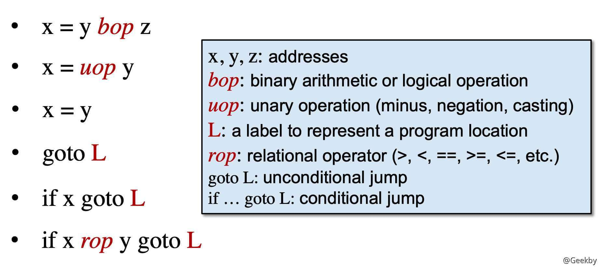

在 Java 中，可以利用 [soot](https://github.com/Sable/soot) 工具来生成三地址码，在 soot 中，被称之为 Jimple。下面以一个 do-while 循环为例，来分析其三地址码。

|     |     |     |
| --- | --- | --- |
| ```plain<br> 1<br> 2<br> 3<br> 4<br> 5<br> 6<br> 7<br> 8<br> 9<br>10<br>``` | ```java<br>package nju.sa.example;<br>public class DoWhileLoop3AC {<br>  public static void main(String[] args) {<br>    int[] arr = new int[10];<br>  	int i = 0;<br>  	do {<br>    	i = i + 1;<br>  	} while (arr[i] < 10);<br>  }<br>}<br>``` |

转换后的三地址码形式为：


再以 Method Call 为例，介绍下面向对象环境下的三地址码。

|     |     |     |
| --- | --- | --- |
| ```plain<br> 1<br> 2<br> 3<br> 4<br> 5<br> 6<br> 7<br> 8<br> 9<br>10<br>``` | ```java<br>package nju.sa.example;<br>public class MethodCall3AC {<br>  String foo(String para1, String para2) {<br>    return para1 + " " + para2;<br>  }<br>  public static void main(String[] args) {<br>    MethodCall3AC mc = new MethodCall3AC();<br>    String result = mc.foo("hello", "world");<br>  }<br>}<br>``` |


-   Java 中的 invoke 指令对应的方法调用情况：
    -   invokespecial: call constructor, call superclass methods, call private methods
    -   invokevirtual: instance method call
    -   invokeinterface: cannot optimization, checking interface implementation
    -   invokestatic: call static methods

### [](#24-%E6%8E%A7%E5%88%B6%E6%B5%81%E5%88%86%E6%9E%90)2.4 控制流分析

控制流分析（Control Flow Analysis）通常指的是构建控制流图（Control Flow Graph, CFG），并以 CFG 作为基础结构进行静态分析的过程。

#### [](#241-%E6%8E%A7%E5%88%B6%E6%B5%81%E5%9B%BE)2.4.1 控制流图

-   通常采用控制流图进行控制流分析的表示
-   控制流图可以用来表示控制流的结构
-   控制流图的节点可以是单个的三地址码，不过通常是 Basic Block(BB)，如下所示。


#### [](#242-basic-block)2.4.2 Basic Block

Basic Block 是具有**以下属性**的、最大长度的三地址码组成的块单元：

-   只能从块的第一条指令进入。
-   只能从块的最后一条指令离开。

如何构建基本块：

-   P 的第一条指令就是一个基本块的 leader
-   跳转的目标指令是一个基本块的 leader
-   跳转指令的后一条指令，也是一个基本块的 leader
-   一个基本块就是一个基本块的 leader 及其后续直到下一个基本块的 leader 前的所有指令。

#### [](#243-%E8%BE%B9%E7%9A%84%E7%94%9F%E6%88%90)2.4.3 边的生成

除了基本块，CFG 中还会有块到块的边。块 A 和块 B 之间有一条边，当且仅当：

-   A 的末尾有一条指向了 B 开头的跳转指令。
-   A 的末尾紧接着 B 的开头，且 A 的末尾不是一条无条件跳转指令。


注意到每个基本块和开头指令的标号唯一对应，因此很自然地，需要将跳转指令的目标改为基本块的标号而非指令标号：


有了这些定义，我们就可以了解一些概念：

-   若 A -> B，则我们说 A 是 B 的前驱（predecessor），B 是 A 的后继（successor）
-   除了构建好的基本块，我们还会额外添加两个结点，「入口（Entry）」和「出口（Exit）」
    -   这两个结点不对应任何 IR
    -   入口有一条边指向 IR 中的第一条指令
    -   如果一个基本块的最后一条指令会让程序离开这段 IR，那么这个基本块就会有一条边指向出口。

这样就完成了一个控制流图的构建。

## [](#3-%E6%95%B0%E6%8D%AE%E6%B5%81%E5%88%86%E6%9E%90)3 数据流分析

### [](#31-%E7%9B%B8%E5%85%B3%E6%A6%82%E5%BF%B5)3.1 相关概念

-   近似方案 1：忽略掉程序的条件判断，认为所有的分析都有可能到达
    -   程序可以看成是\*\*状态（数据）**和**状态之间的转移（控制）\*\*两部分，因为状态转移的条件都被忽略了，核心分析的部分是状态数据在转移过程中的变化，所以叫做数据流分析。
-   近似方案 2：不在路径末尾做合并，在控制流汇合的所有位置提前做合并

数据流分析要保证 Safe-approximation，即：

-   may analysis: over-approximation
-   must analysis: under-approximation

总之，不同的数据流分析有不同的数据抽象方法（应用不同），有不同的 Safe-approximation 策略，有不同的转移函数与控制流汇聚方式。

#### [](#311-%E8%BE%93%E5%85%A5%E8%BE%93%E5%87%BA%E7%8A%B6%E6%80%81)3.1.1 输入输出状态

-   每一条 IR 的执行，都会使状态从**输入状态**变成新的**输出状态**
-   输入/输出状态与语句前/后的 **program point** 相关联。


在数据流分析中，我们会把每一个 `program point` 关联一个数据流值，代表在该点中可观察到的抽象的程序状态。数据流分析的目的是为所有语句的输入输出找到一组，基于控制流和转换函数的，安全的近似约束的解决方案。

#### [](#312-%E8%BD%AC%E7%A7%BB%E5%87%BD%E6%95%B0)3.1.2 转移函数

分析数据流有前向和后向两种：

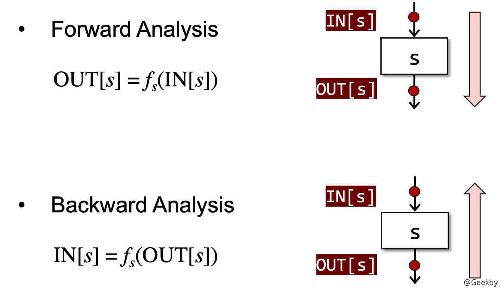

#### [](#312-%E6%8E%A7%E5%88%B6%E6%B5%81%E7%BA%A6%E6%9D%9F)3.1.2 控制流约束

每条语句 s 都会使程序状态发生改变。B 的输出自然是其输入在经过多次转换后得到的状态。而 B 的输入要根据数据流分析的需求，对其前驱应用合适的 meet operator 进行处理。后向分析时亦然。


### [](#32-%E5%BA%94%E7%94%A8)3.2 应用

#### [](#321-%E5%88%B0%E8%BE%BE%E5%AE%9A%E5%80%BC%E5%88%86%E6%9E%90reaching-definitions-analysis)3.2.1 到达定值分析：Reaching Definitions Analysis

##### [](#%E5%9F%BA%E6%9C%AC%E6%A6%82%E5%BF%B5)基本概念

假定 x 有定值 d (**definition**)，如果存在一个路径，从紧随 d 的点到达某点 p，并且此路径上面没有 x 的其他定值点，则称 x 的定值 d 到达 (**reaching**) p。

如果在这条路径上有对 x 的其它定值，我们说变量 x 的这个定值 d 被杀死 (**killed**) 了

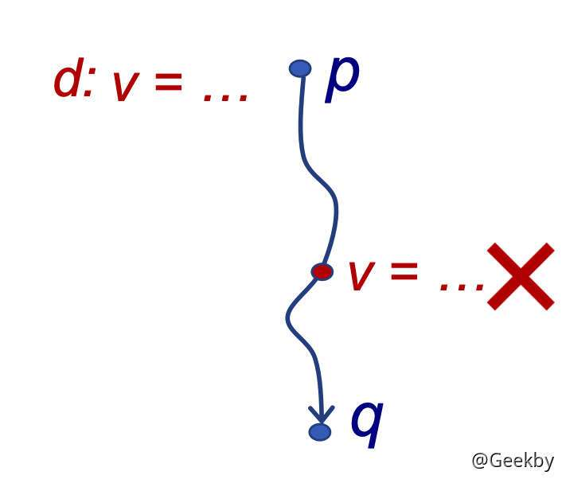

到达定值可以用来分析未定义的变量。例如，我们在程序入口为各变量引入一个 dummy 定值。当程序出口的某变量定值依然为 dummy，则我们可以认为该变量未被定义。

对于一条赋值语句 `D: v = x op y`，该语句生成了 v 的一个定值 D，并杀死程序中其它对变量 v 定义的定值。

##### [](#%E7%90%86%E8%A7%A3%E5%88%B0%E8%BE%BE%E5%AE%9A%E5%80%BC%E5%88%86%E6%9E%90)理解到达定值分析

数据流值：

-   程序中所有变量的定值。
-   可以用一个 `bit vector` 来定义，有多少个赋值语句，就有多少个位。

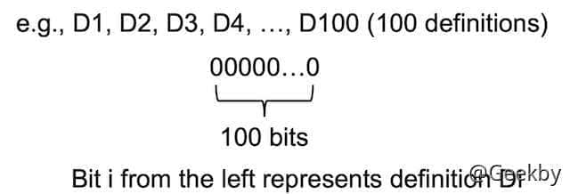

D 即 Definition，可以表示为：`D：v = x op y`

一个 D 可以视为一行三地址码，做了两件事：

-   生成了一个定义 D
-   在保持其他传入程序不受影响的同时，kill 了程序中其它对变量 v 的定义

转移方程与控制流：


其中 U 表示 union，结合前文使用 bit 字节表示的 D，可以知道，IN\[B\] 的输入等于 OUT\[P1\] 并 OUT\[P2\]，意味着只要存在一条路径可以 reach，那么就算作可以 reach。


##### [](#%E8%BE%BE%E5%AE%9A%E5%80%BC%E5%88%86%E6%9E%90%E7%9A%84%E7%AE%97%E6%B3%95%E8%A1%A8%E7%A4%BA)达定值分析的算法表示

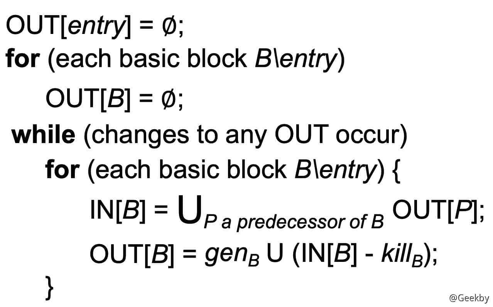

这是一个经典的迭代算法：

-   首先让所有 BB 和入口的 OUT 为空。因为你不知道 BB 中有哪些定值被生成。
-   当任意 OUT 发生变化，则分析出的定值可能需要继续往下流动，所需要修改各 BB 的 IN 和 OUT。
-   先处理 IN，然后再根据转移完成更新 OUT。
-   在 `gen U (IN - kill)` 中，kill 与 gen 相关的 bit 不会因为 IN 的改变而发生改变，而其它 bit 又是通过对前驱 OUT 取并得到的，因此其它 bit 不会发生 0 -> 1 的情况。所以，OUT 是不断增长的，而且有上界，因此算法最后必然会停止。
-   因为 OUT 没有变化，不会导致任何的 IN 发生变化，因此 OUT 不变可以作为终止条件。我们称之为程序到达了不动点（Fixed Point）

> 该算法为什么会终止？OUT\[S\] never shrinks 且状态是有限的（到达不动点）

#### [](#322-%E6%B4%BB%E8%B7%83%E5%8F%98%E9%87%8F%E5%88%86%E6%9E%90live-variables-analysis)3.2.2 活跃变量分析：Live Variables Analysis

##### [](#%E5%9F%BA%E6%9C%AC%E6%A6%82%E5%BF%B5-1)基本概念

> 给定程序中的某条语句 s 和变量 v，如果在 s 执行前保存在 v 中的值在后续执行中还会被读取，就称之为活跃变量。

-   变量 x 在程序点 p 上的值是否会在某条从 p 出发的路径中使用
-   变量 x 在 p 上活跃，当且仅存在一条从 p 开始的路径，该路径的末端使用了 x，且路径上没有对 x 进行覆盖。
-   隐藏了这样一个含义：在被使用前，v 没有被重新定义过，即没有被 kill 过。

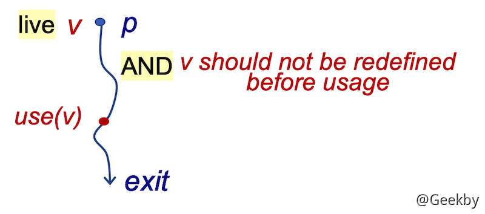

这个算法可以用于寄存器分配，当一个变量不会再被使用，那么此变量就可以从寄存器中腾空，用于新值的存储。

##### [](#%E6%B4%BB%E8%B7%83%E5%8F%98%E9%87%8F%E4%B8%AD%E5%88%86%E6%9E%90)活跃变量中分析

数据流值

-   程序中的所有变量
    
-   依然可以用 bit vector 来表示，每个 bit 代表一个变量
    

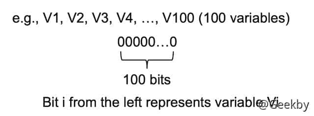

转移方程和控制流处理


不同于 Reaching Definitions 的前向传播分析，Live Variables Analysis 使用反向传播进行分析效果更好。如果从后往前搜索，只要在某程序点处找到一个变量 v 的使用，就证明在此之前任意可达此点的、定义了 v 的程序点处，v 都是 live 的；而如果使用前向传播的算法，每到一个程序点都要正向搜索一遍后方的路径才能确认变量在此处是否 live，虽然也能进行分析，但是效率较低。

-   一个基本块内，若 v = exp, 则 def v。若 exp = exp op v，那么 use v。一个变量要么是 use，要么是 def，根据 def 和 use 的先后顺序来决定。
-   考虑基本块 B 及其后继 S。若 S 中，变量 v 被使用，那么我们就把 v 放到 S 的 IN 中，交给 B 来分析。
-   因此对于活跃变量分析，其控制流处理是 OUT\[B\] = IN\[S\]。
-   在一个块中，若变量 v 被使用，那么我们需要添加到我们的 IN 里。而如果 v 被定义，那么在其之上的语句中，v 都是一个非活跃变量，因为没有语句再需要使用它。
-   因此对于转移方程，IN 是从 OUT 中删去重新定值的变量，然后并上使用过的变量。需要注意，如果同一个块中，变量 v 的 def 先于 use，那么实际上效果和没有 use 是一样的。

##### [](#%E7%AE%97%E6%B3%95%E8%A1%A8%E7%A4%BA)算法表示

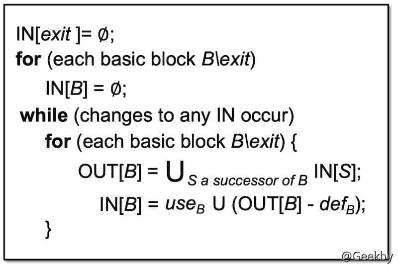

#### [](#323-%E5%8F%AF%E7%94%A8%E8%A1%A8%E8%BE%BE%E5%BC%8F%E5%88%86%E6%9E%90available-expression-analysis)3.2.3 可用表达式分析：Available Expression Analysis

##### [](#%E5%9F%BA%E6%9C%AC%E6%A6%82%E5%BF%B5-2)基本概念

x + y 在 p 点可用的条件：从流图入口结点到达 p 的每条路径都对 x + y 求了值，且在最后一次求值之后再没有对 x 或 y 赋值。

可用表达式可以用于全局公共子表达式的计算。也就是说，如果一个表达式上次计算的值到这次仍然可用，我们就能直接利用其中值，而不用进行再次的计算。

##### [](#%E5%8F%AF%E7%94%A8%E8%A1%A8%E8%BE%BE%E5%BC%8F%E5%88%86%E6%9E%90%E5%88%86%E6%9E%90)可用表达式分析分析

数据流值

-   程序中的所有表达式
-   bit vector 中，一个 bit 就是一个表达式

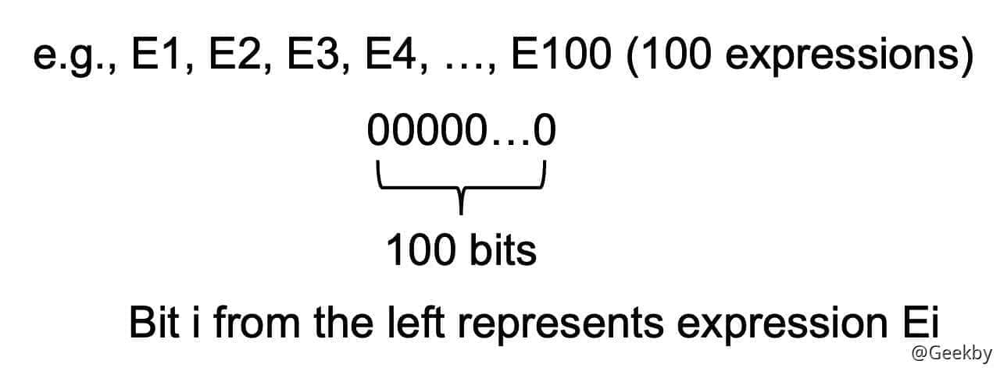

转换函数与控制流处理


-   B，表达式都应该已经计算，才能将其视为可用表达式，因此这是一个 `must analysis`。
-   注意到图中，两条不同的路径可能会导致表达式的结果最终不一致。但是我们只关心它的值能不能够再被重复利用，因此可以认为表达式可用。
-   `v = x op y`，则 `gen x op y`。当 `x = a op b`，则任何包含 x 的表达式都被 kill 掉。若 gen 和 kill 同时存在，那么以最后一个操作为准。
-   转移方程很好理解，和到达定值差不多。但是，由于我们是 must analysis，因此控制流处理是取交集，而非到达定值那样取并集。

##### [](#%E7%AE%97%E6%B3%95%E8%A1%A8%E7%A4%BA-1)算法表示


-   注意此时的初始化：一开始确实无任何表达式可用，因此 OUT\[entry\] 被初始化为空集是自然的。但是，其它基本块的 OUT 被初始化为全集，这是因为当 CFG 存在环时，一个空的初始化值，会让取交集阶段直接把第一次迭代的 IN 设置成 0，无法进行正确的判定了。
-   如果一个表达式从来都不可用，那么 OUT\[entry\] 的全 0 值会通过交操作将其置为 0，因此不用担心初始化为全 1 会否导致算法不正确。

#### [](#324-%E5%B8%B8%E9%87%8F%E4%BC%A0%E6%92%ADconstant-propagation)3.2.4 常量传播：Constant Propagation

##### [](#%E5%9F%BA%E6%9C%AC%E6%A6%82%E5%BF%B5-3)基本概念

在**程序点 p **处给定一个**变量 x**，判断 x 在程序点 p 处是否**一定**指向一个常量。

这是一个类似 must 分析，因为必须所有到点 p 的 path 都是这个常量才行；但有和传统的不大一样。在 CFG 中每个节点的输出包括一个对 (x, v)，其中 x 是变量而 v 是在该节点后 x 指向的具体值。

##### [](#%E5%B8%B8%E9%87%8F%E4%BC%A0%E6%92%AD%E5%88%86%E6%9E%90)常量传播分析

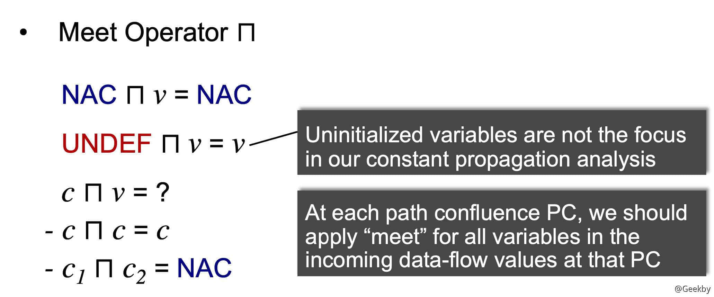

转换函数：

`OUT[s] = gen U (IN[s] - {(x, _)})`

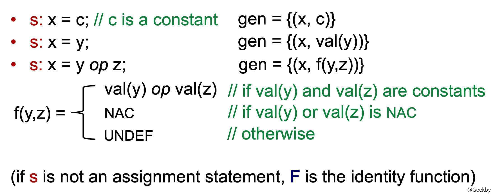

### [](#34-work-list-%E7%AE%97%E6%B3%95)3.4 Work list 算法

最后再提一下 Worklist 算法，这是对之前数据流分析迭代算法一种完全的改进，不影响精度的情况下，有更高的效率。


不同于普通迭代算法，一个 OUT 变了所有的都要跑一遍，worklist 的效率高很多，因为 gen 和 kill 是不会变的，OUT 变化只取决于 IN 的变化，因此先把所有节点放进去，然后每个变化的 OUT 都把后继放进去，来回的跑直到结束。

### [](#35-%E6%80%BB%E7%BB%93)3.5 总结

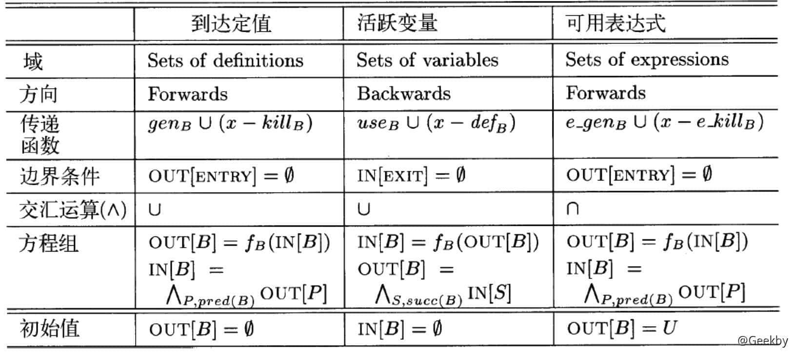

## [](#%E5%8F%82%E8%80%83)参考

-   [南京大学《软件分析》Yue Li and Tian Tan](https://www.bilibili.com/video/BV1b7411K7P4)
-   [北京大学《软件分析技术》Xiong Yingfei](https://liveclass.org.cn/cloudCourse/#/courseDetail/8mI06L2eRqk8GcsW)
-   [pascal-group.bitbucket.io](https://pascal-group.bitbucket.io/teaching.html)
-   [https://fancypei.github.io/SA/](https://fancypei.github.io/SA/)
-   [https://blog.csdn.net/zhang971105/article/details/109074766](https://blog.csdn.net/zhang971105/article/details/109074766)
-   [https://spa-book.pblo.gq/ch1/2intermediaterepresentation](https://spa-book.pblo.gq/ch1/2intermediaterepresentation)
